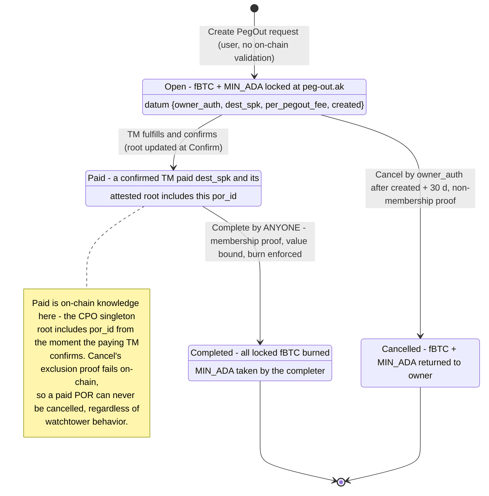

# Peg-Out Termination via the Attested Completed-Peg-Outs Root

Date: 2026-07-22, rev 5.1 (2026-08-05) — the FROST-signed TM transaction
commits the updated CPO trie root itself; Confirm copies it (O(1), no
on-chain MPF); the DA hint lives in the `Unconfirmed` datum; SPOs run on
self-hosted infrastructure only. Supersedes rev 3 (verified MPF inserts at
Confirm) and the rev 4 addendum (permissionless sweep, no trie — rejected:
cancel-safety would rest on third-party sweep liveness, and an owner can
profitably collude with watchtowers to withhold sweeps and split the
"cancelled" refund). The file name keeps its original working title.
Status: Approved (2026-08-05); implementation in progress.
Supersedes on-chain: the pinned-treasury-outpoint peg-out completion/cancel
scheme (technical_documentation.md §Complete peg-out [CPO-1..10], §Cancel
PegOut request [CXL-1..6], and the `legit_TM_and_peg_out_produced` /
`not_produced` verifier delegation in `peg-out.ak`).

## Problem

The pre-redesign peg-out termination pinned the TM-chain tip outpoint in each
PegOutRequest (POR) datum; Complete/Cancel proved that *the* Bitcoin tx
spending that pinned outpoint does / does not pay the destination, via two
delegated verifier scripts. Verified defects: (1) both verifiers were dummy
hashes — Complete and Cancel unsatisfiable as deployed; (2) stale-pin
double-claim resting on off-chain builder discipline; (3) duplicate
`(dest, amount)` requests deadlocked; (4) poor liveness (every missed TM
window forced cancel-and-repin).

Rev 3 fixed all four with a completed-peg-outs MPF trie folded on-chain at TM
Confirm, but each insert costs ~43M CPU / ~142K memory (measured), memory-
capping a TM at ~110 peg-outs on a near-empty trie — the mandatory confirm
path carried all the cost.

## Design (rev 5)

### Core idea

Heimdall maintains the **completed-peg-outs trie** off-chain: an MPF mapping
`por_id → dest_scriptPubKey ‖ amount_le8` for every peg-out ever paid by a
confirmed TM. Each TM Bitcoin transaction commits the **post-TM root** in a
single OP_RETURN output, covered by the FROST signature. TM Confirm copies
that root into the on-chain CPO singleton — no proofs, no fold, O(1)
regardless of batch size. Peg-out Complete proves membership (value-bound)
against the singleton; Cancel proves non-membership after a timeout.

The paid-set is on-chain the instant a TM confirms, so a paid POR is
uncancellable from that moment — no sweep-liveness assumption, no collusion
surface. Completion is permissionless cleanup: anyone may complete a paid POR
(burn its fBTC) and keep the MIN_ADA as reward. The trust added over rev 3 —
root integrity — is a strict subset of the custody trust the FROST quorum
already holds (they sign the payments themselves; see §Trust model).

### PegOutRequest state machine

### Infrastructure assumptions (normative)

- Every SPO runs its own Cardano node. SPOs MUST NOT depend on centralized
  query services (e.g. hosted Blockfrost) for consensus-relevant decisions:
  TM building, co-sign root verification, and trie reconstruction read only
  self-hosted infrastructure.
- Baseline PRODUCTION SPO stack: Cardano node + **Dolos** in front
  (Blockfrost-compatible current-state API + tx submission) + **Kupo**
  matching the bridge script addresses from the deployment slot with spent
  AND unspent results and datum resolution — Kupo serves the reconstruction
  path. Heimdall's provider client MUST stay within the endpoint subset this
  stack serves (verify against the deployed Dolos/Kupo versions).
- **Kupo is OPTIONAL** (rev 5.2): reconstruction MUST also work through a
  plain Blockfrost-compatible API alone (address tx history + per-tx
  UTxOs/datums), selected automatically when no Kupo endpoint is configured
  — for test environments, demos, and non-SPO tooling. The self-hosting
  requirement above applies to production SPO consensus decisions, not to
  the code's capabilities.
- SPOs do NOT run Bitcoin nodes. Nothing in the peg-out termination flow
  requires Bitcoin-side queries: committed roots and DA hints live entirely
  in Cardano data. Bitcoin nodes remain a watchtower requirement (deposit
  detection, relay).
- Steady state needs NO history queries at all (current UTxOs + submission);
  the indexing requirement (Kupo) exists only for reconstruction/recovery.
- Non-SPO users (e.g. building a Cancel exclusion proof) MAY use any
  provider — every proof is verified on-chain, so data sources need no
  trust.
- Genesis edge: before the first Confirmed record exists there is no
  Cardano-side source for the treasury UTXO's VALUE. Config #11 names the
  anchor OUTPOINT, not its amount. From the first Confirm onward the tip's
  treasury output amount is the compliant current-state source, so the gap
  closes after one movement.

  *Implementation status.* The "SPOs do NOT run Bitcoin nodes" property holds
  for the peg-out / CPO flow, but NOT for genesis bootstrap. heimdall still
  prices the anchor with bitcoind `gettxout` and hard-requires
  `bitcoin.rpc_url` to do it (`blockfrost_chain.rs`, the `confirmed.is_empty()`
  branch of `query_treasury`); no operator-supplied value key exists. So
  bitcoind RPC is required until the first TM confirms. Making the value
  operator-supplied needs a new config key or an amount field on Config #11 —
  not designed yet.

### Identifiers and encodings

- **POR id** (32 bytes): `utils.hash_output_ref` of the POR UTxO's own
  outpoint, i.e. `sha2_256(serialise_data(OutputReference))`. Computable
  on-chain at spend time; replicated off-chain (same scheme as PIR NFT asset
  names).
- **Trie**: MPF, key = POR id, value = `dest_scriptPubKey ++ amount_le8`
  (8-byte little-endian satoshi amount of the paying output, net of the
  pinned per-pegout fee). Maintained off-chain by heimdall; the on-chain
  artifact is only the root.
- **Root commitment output**: an OP_RETURN output with scriptPubKey
  `OP_RETURN OP_PUSHBYTES_37 ("CPOR1" ++ new_root)` (39 script bytes,
  prefix `6a2543504f5231`, root = script bytes [7, 39)). EXACTLY ONE such
  output MUST be present in every TM, in any position (heimdall emits it
  last). A TM fulfilling zero peg-outs commits the unchanged root.
  - `"CPOR1"` = CPO Root v1 — reuses the protocol's canonical `CPO`
    abbreviation, with a version character for future format bumps. Not a
    `"BFR"`-prefixed tag: watchtowers detect peg-in deposits by
    scanning for `"BFR"`-prefixed OP_RETURNs; a TM pays the treasury address
    in output 0.
  - 37-byte payload — under every datacarrier standardness limit; constant
    size regardless of batch size (rev 3's per-peg-out markers cost
    ~46 vB each; they are GONE).
- **TM output layout**: `[0]` = treasury change, `[1..m]` = peg-out payments
  (sorted by scriptPubKey bytes), `[m+1]` = the root commitment. Payment
  outputs are EXACTLY the requested destination scriptPubKeys — no id
  embedding in payment scripts (a prefixed spk is a different address,
  non-standard, and for witness programs anyone-can-spend).
- **DA hint (datum, not metadata)**: the `Unconfirmed` TM datum gains an
  APPENDED field `fulfilled_por_outpoints: List<ByteArray>` — the Cardano
  outpoints of the fulfilled PORs, 36 bytes each (`txid (Cardano tx hash,
  32 B) ++ output index (4-byte LE)`, the protocol's standard outpoint
  encoding). Properties:
  - UNVERIFIED on-chain: the mint and confirm validators ignore it; the
    FROST-signed root is the sole integrity anchor. A hostile permissionless
    poster can garble it — reconstruction then falls back to
    search-and-check (below).
  - Chosen over tx metadata so the entire DA story is served by
    address-scoped UTxO indexing (Kupo); Kupo does not index metadata.
  - The `Confirmed` datum does NOT carry it: the spent `Unconfirmed`
    output's inline datum remains in history forever, which is where
    reconstruction reads it. `Confirmed` stays 8 fields — `peg_in.ak`,
    `treasury.ak::FederationReset`, and heimdall's Confirmed parser are
    untouched.
  - Cost: +36 B/peg-out of datum (min-ADA on the Unconfirmed record,
    reclaimed at GC).

### On-chain: Scalus `TreasuryMovementValidator` (binocular)

Datum shape change (the ONE consensus-visible shape change of rev 5):
`Unconfirmed` gains the appended 6th field `fulfilledPorOutpoints:
List[ByteString]`. The mint branch decodes it positionally and ignores it
(no validation — hint only). `Confirmed` and `PegOutEntry` are unchanged.
Mirrors to update in lock-step: `treasury-movement.ak` (full-arity
Unconfirmed mirror), heimdall's publish/datum builders, binocular's
`create-tmtx`.

The Confirm branch, in place of rev 3's marker walk + MPF fold:

1. Locate the Config UTxO among reference inputs (config NFT) and read
   field 3 — the CPO trie NFT policy id.
2. Require the CPO singleton (NFT = (field-3 policy, `"CPO"`)) to be SPENT,
   with a continuing output carrying the NFT at the same address.
3. Scan the parsed outputs for root commitments (spk size 39, prefix
   `6a2543504f5231`); require EXACTLY ONE; extract `new_root` = spk[7, 39).
4. Require the continuing CPO output's datum root == `new_root`.

`TmConfirmRedeemer` keeps its 4-field shape (no step list). Mint linkage, GC,
and containment checks are unchanged. The TM script hash changes (vs the
deployed and the rev-3 build) → the peg-in `tm_nft_policy_id` parameter value
changes; migration still unexecuted, fold in.

### On-chain: Aiken

- **`completed-peg-outs-merkle-tree.ak`**: UNCHANGED from the implemented
  rewrite — params `(tm_nft_policy_id, one_shot_input_ref)`, one-shot
  bootstrap mint (zero root, `"CPO"`), spend gated on the TM
  Unconfirmed→Confirmed transition via raw constr-tag checks (tag checks
  are arity-blind, so the Unconfirmed field append does not touch it). The
  datum root is now the attested root rather than a folded one; the
  validator neither knows nor cares.
- **`peg-out.ak`**: one semantic change from the implemented rewrite —
  `CompletePegOut` drops the `owner_auth` check. Complete requires ONLY:
  membership `mpf.has(root, por_id, dest_spk ++ le8(locked − fee), proof)`
  against the CPO reference input, and the exact burn of all locked fBTC.
  Anyone may complete; the MIN_ADA (and any junk tokens in the POR) go to
  the completer — the cleanup incentive. `Cancel` is unchanged: `owner_auth`
  + validity entirely after `created + 30 d` + `mpf.miss` + no bridged-token
  mint. Rationale: completion only burns (never moves) fBTC and only against
  a value-bound attested payment, so authorization adds nothing;
  permissionless completion prevents POR-state bloat.
- **`treasury-movement.ak`** (types mirror): `Unconfirmed` gains the
  appended `fulfilled_por_outpoints: List<ByteArray>` field (full-arity
  mirror discipline).
- Config shape, field 3 name/getter, `"CPO"` constant: all unchanged; the
  migration swaps VALUES only (fields 3/4/5, field 11 anchor).

### Off-chain: heimdall

- **Local trie state**: heimdall persists the CPO trie (its build is
  deterministic: the insertion SET fully determines the MPF root). On each
  TM build: select fulfillable PORs (freshness filter below), insert
  `(id, dest ‖ le8(net))` per selected POR, emit the new root in the
  commitment output, and put the selected POR outpoints into the
  `Unconfirmed` datum's hint field at publish.
- **Co-signer verification (mandatory)**: every FROST participant recomputes
  the expected root from ITS OWN trie + the proposed TM's payment set before
  signing. Deterministic selection rules make honest nodes agree; a leader
  proposing a wrong root fails quorum. This is what keeps root integrity
  inside the existing quorum-honesty envelope. Reads self-hosted data only
  (§Infrastructure assumptions).
- **Reconstruction (cold start / recovery / new SPO)** — served by EITHER
  backend behind one interface: Kupo matches on the TM address and the
  peg-out address (spent + unspent, with datums), OR the Blockfrost-
  compatible history endpoints (address transactions + per-tx UTxOs +
  datums) when Kupo is not configured. No Bitcoin node either way:
  1. Collect ALL Confirmed datums ever created at the TM address (spent and
     unspent — GC'd records remain readable as spent matches). Their
     `btcTxid`s form the confirmed set; chain-order them by the treasury
     linkage (each record's input-0 outpoint == predecessor's
     `btcTxid ‖ 00000000`, from the Config anchor).
     - An output at the TM address or the peg-out address with NO datum at
       all MUST be skipped. Every genuine record at either address carries
       an inline datum, so a bare payment provably is not one. An output
       whose datum EXISTS but cannot be resolved MUST be a hard error at
       the TM address, naming the output. It may be an unread Confirmed
       record, and dropping it would silently omit a movement.
  2. For each confirmed TM, find its `Unconfirmed` datum(s) at the TM
     address (match by recomputed txid of `signedBtcTx`; duplicates
     dedupe by txid). Extract the committed root from the raw bytes and the
     hint outpoints from the datum field.
  3. Resolve each hint outpoint via Kupo to the POR's datum + value →
     entry `(sha256(cbor(outpoint)), dest ‖ le8(locked − fee))`; insert.
  4. After each TM, the running root MUST equal that TM's committed root —
     a mismatch pinpoints the offending TM.
  5. Fallback when a hint is missing/garbled (permissionless posters):
     match that TM's payment outputs `(spk, amount)` against PORs open at
     that time and search assignments until the committed root matches —
     the root converts reconstruction from trust into search-and-check.
- **Fulfillment freshness filter** (unchanged from rev 3): fulfill only when
  `created <= now` and `created + cancel_timeout − now >= margin` (default
  7 days). Bounds the signed-but-unconfirmed race; backdated `created` stays
  harmless.
- **No batch cap needed**: Confirm is O(1); the only ceiling is Bitcoin tx
  size.

### Off-chain: binocular

- `ConfirmTmtxCommand`: extract the committed root from the signed TM bytes
  (same rule as on-chain), spend the CPO singleton, recreate it with the
  root — no proof generation. The trie bootstrap command and the
  config-swap flags (`--completed-peg-outs-policy`,
  `--peg-out-withdraw-hash`, optional field 11) survive from the rev-3
  implementation unchanged.
- `create-tmtx` (test scaffold) and any datum builders: 6-field Unconfirmed.
- **POR sweeper (rev 5.2, in scope)**: the watchtower CHAINS completion after
  confirmation. After a successful `confirm-tmtx`, it takes the confirmed
  TM's fulfilled POR set (the datum hint, verified against the attested
  root via its local trie mirror), and for each POR builds and submits a
  Complete transaction: spend the POR, `CompletePegOut{membership_proof}`
  via the peg-out withdraw, reference the Config and the CPO singleton,
  burn the locked fBTC; the watchtower keeps the MIN_ADA (the cleanup
  incentive realized). One POR per transaction (`peg-out.ak` requires
  exactly one own-credential input); the trie is a reference input, so
  completion transactions are independent — no contention, submit in
  parallel. The watchtower maintains a persistent local trie mirror
  (updated at each confirm from the hint + committed root; cold start via
  the reconstruction path above on binocular's provider). This subsumes the
  previously-parked `PegOutCompleteCommand` rewrite.
- Remaining follow-up (out of scope): `PegOutRequestCommand` refresh
  (4-field datum) if still stale after the sweeper work.

### Trust model (what rev 5 adds, and what it does not)

- Already irreducible (all revisions): the FROST quorum custodies the
  treasury — it can steal every satoshi; payment correctness and the
  peg-out↔payment mapping are quorum attestations; the freshness margin is
  quorum discipline.
- Added by rev 5: **root integrity is attested, not verified on-chain.**
  Failure analysis:
  - Omitted/wrong id (quorum bug): that POR cannot complete; if omitted it
    becomes cancellable after timeout → double-claim, protocol loss — the
    same class and cost as a mispayment bug.
  - Garbage root (quorum bug): completes AND cancels stall (both proofs
    fail) until a later TM commits a corrected root — self-healing, since
    honest nodes recompute from their own trie; meanwhile funds are stuck,
    not lost. Silent on-chain; co-signer verification is the guard.
  - Values are attested too: a quorum that pays wrong but inserts "right"
    burns the user's fBTC on Complete (rev 3 derived values from the raw
    outputs on-chain). Same actors, same accepted class.
- NOT assumed (unlike rev 4): third-party sweep liveness. Cancel-safety is
  on-chain from the moment of Confirm; withholding completion gains nobody
  anything.
- GC is fully decoupled from peg-outs: Complete/Cancel reference only the
  CPO singleton, and reconstruction reads spent-output history (permanent),
  so burning old Confirmed records breaks nothing.

### Migration (fold into the still-unexecuted preprod migration)

Unchanged in structure from rev 3: build new TM script → new peg-in hash
(parameter) → peg_out hash → trie script (parameterized by the new TM hash);
one-shot mint the CPO singleton (zero root — correct: the chain starts with
no fulfilled peg-outs under the new scheme); one config Update swapping
fields 3 (trie policy), 4 (peg-in), 5 (peg-out), with field 11 anchor
handling as planned. Ordering is load-bearing: the singleton must exist and
field 3 must point at it before the first Confirm under the new TM script.
Old CPO instance: abandoned as before. Old PORs: STRANDED, not merely
abandoned — the deployed Cancel delegates to a verifier that is a bare
`fail`, the deployed PegOutDatum has no `created` field, and no shipped
command builds the old-shape Complete. The migration MUST verify the old
peg-out address holds no UTxO before the switch; see the runbook, step 4b.

### Documentation updates (per the traceability rules)

- New §Infrastructure assumptions (or fold into §External inputs of a
  bridge instance): the normative SPO self-hosting block above.
- §Completed-peg-outs trie / UTxO map: root is quorum-attested, written at
  TM Confirm by copy; Complete/Cancel reference the singleton.
- §Post signed TM: the `Unconfirmed` datum table gains
  `fulfilled_por_outpoints` (hint, unverified); TM structure: the root
  commitment output, no markers.
- §Complete peg-out: [CPO-1], [CPO-2], [CPO-4]–[CPO-8] withdrawn; [CPO-3]
  (owner_auth) ALSO withdrawn (completion is permissionless — record the
  rationale); keep [CPO-9] (exact burn), [CPO-10] (MIN_ADA disposition
  changes: to the completer); add fresh IDs for the reference-input
  authentication and the value-bound membership check.
- §Cancel PegOut request: [CXL-1]–[CXL-4] withdrawn; keep [CXL-5]/[CXL-6];
  fresh IDs for timeout, non-membership, no-mint.
- §Create PegOut request: 4-field datum, `created`, freshness note; drop the
  pinned-outpoint footguns.
- §Confirm TM tx: the root-commitment checks ([CTM-*] fresh IDs).
- Config table row 3 semantics; fields 7/8 vestigial; stale Config #15
  implementation-status note corrected in passing.

### Testing

- Scalus: confirm suites — happy path with root change; zero-peg-out
  (unchanged root, commitment still required); missing commitment; two
  commitments; wrong prefix; wrong-length spk; continuing root ≠ committed
  root; missing trie spend; forged trie NFT; trie address changed; 6-field
  Unconfirmed round-trip through mint and confirm (hint ignored).
- Aiken peg-out: complete by a third party succeeds (no owner auth);
  complete value binding / wrong id / partial burn negatives unchanged;
  cancel suite unchanged (incl. non-owner cancel fails). Mirror pin:
  6-field Unconfirmed in `treasury-movement.ak`.
- heimdall: root determinism (set-order independence); commitment output
  golden bytes; hint encode/decode round-trip; reconstruction happy path +
  per-TM root verification + fallback matcher on a garbled hint; freshness
  boundaries; por_id golden vector shared with Aiken.
