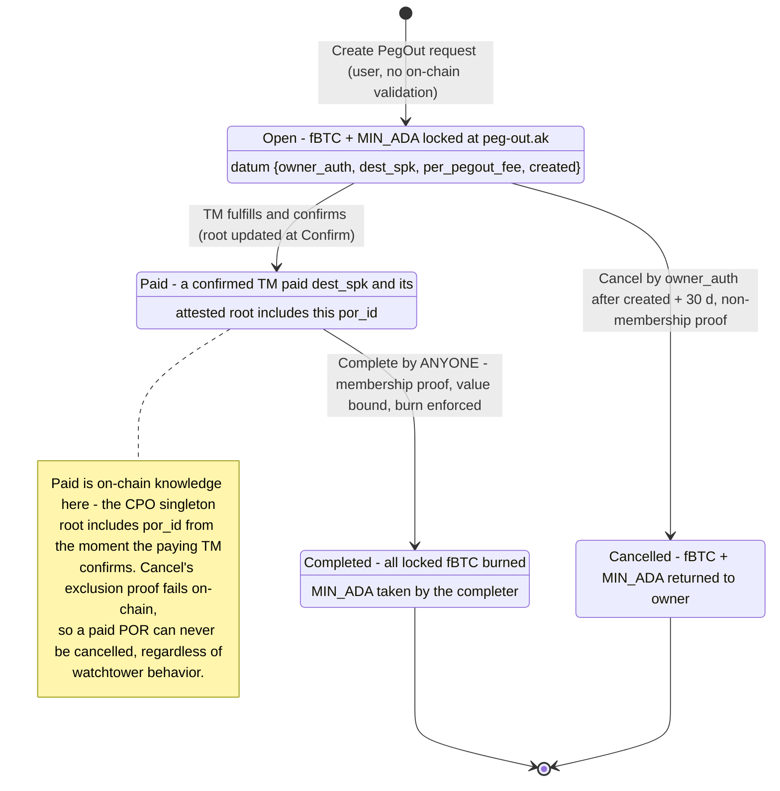

# Peg-Out Termination via the Attested Completed-Peg-Outs Root

Date: 2026-07-22, rev 5 (2026-08-05) — the FROST-signed TM transaction commits
the updated CPO trie root itself; Confirm copies it (O(1), no on-chain MPF).
Supersedes rev 3 (verified MPF inserts at Confirm) and the rev 4 addendum
(permissionless sweep, no trie). The file name keeps its original working
title.
Status: Approved (design); implementation in progress.
Supersedes on-chain: the pinned-treasury-outpoint peg-out completion/cancel
scheme (technical_documentation.md §Complete peg-out [CPO-1..10], §Cancel
PegOut request [CXL-1..6], and the `legit_TM_and_peg_out_produced` /
`not_produced` verifier delegation in `peg-out.ak`).

## Problem

The pre-redesign peg-out termination pinned the TM-chain tip outpoint in each
PegOutRequest (POR) datum; Complete/Cancel proved that *the* Bitcoin tx
spending that pinned outpoint does / does not pay the destination, via two
delegated verifier scripts. Verified defects: (1) both verifiers were dummy
hashes — Complete and Cancel unsatisfiable as deployed; (2) stale-pin
double-claim resting on off-chain builder discipline; (3) duplicate
`(dest, amount)` requests deadlocked; (4) poor liveness (every missed TM
window forced cancel-and-repin).

Rev 3 fixed all four with a completed-peg-outs MPF trie folded on-chain at TM
Confirm, but each insert costs ~43M CPU / ~142K memory (measured), memory-
capping a TM at ~110 peg-outs on a near-empty trie — the mandatory confirm
path carried all the cost. Rev 4 (permissionless sweep, no trie) removed the
cost but made Cancel-safety depend on third-party sweep liveness — rejected:
an owner can profitably collude with watchtowers to withhold sweeps and split
the "cancelled" refund.

## Design (rev 5)

### Core idea

Heimdall maintains the **completed-peg-outs trie** off-chain: an MPF mapping
`por_id → dest_scriptPubKey ‖ amount_le8` for every peg-out ever paid by a
confirmed TM. Each TM Bitcoin transaction commits the **post-TM root** in a
single OP_RETURN output, covered by the FROST signature. TM Confirm copies
that root into the on-chain CPO singleton — no proofs, no fold, O(1)
regardless of batch size. Peg-out Complete proves membership (value-bound)
against the singleton; Cancel proves non-membership after a timeout.

The paid-set is on-chain the instant a TM confirms, so a paid POR is
uncancellable from that moment — no sweep-liveness assumption, no collusion
surface. Completion is permissionless cleanup: anyone may complete a paid POR
(burn its fBTC) and keep the MIN_ADA as reward. The trust added over rev 3 —
root integrity — is a strict subset of the custody trust the FROST quorum
already holds (they sign the payments themselves; see §Trust model).

### PegOutRequest state machine

### Identifiers and encodings

- **POR id** (32 bytes): `utils.hash_output_ref` of the POR UTxO's own
  outpoint, i.e. `sha2_256(serialise_data(OutputReference))`. Computable
  on-chain at spend time; replicated off-chain (same scheme as PIR NFT asset
  names).
- **Trie**: MPF, key = POR id, value = `dest_scriptPubKey ++ amount_le8`
  (8-byte little-endian satoshi amount of the paying output, net of the
  pinned per-pegout fee). Maintained off-chain by heimdall; the on-chain
  artifact is only the root.
- **Root commitment output**: an OP_RETURN output with scriptPubKey
  `OP_RETURN OP_PUSHBYTES_36 ("POR1" ++ new_root)` (38 script bytes,
  prefix `6a24504f5231`, root = script bytes [6, 38)). EXACTLY ONE such
  output MUST be present in every TM, in any position (heimdall emits it
  last). A TM fulfilling zero peg-outs commits the unchanged root.
  - `"POR1"`, not a `"BFR"` tag: watchtowers detect peg-in deposits by
    scanning for `"BFR"`-prefixed OP_RETURNs; a TM pays the treasury address
    in output 0.
  - 36-byte payload — under every datacarrier standardness limit; constant
    size regardless of batch size (rev 3's per-peg-out markers cost
    ~46 vB each; they are GONE).
- **TM output layout**: `[0]` = treasury change, `[1..m]` = peg-out payments
  (sorted by scriptPubKey bytes), `[m+1]` = the root commitment. Payment
  outputs are EXACTLY the requested destination scriptPubKeys — no id
  embedding in payment scripts (a prefixed spk is a different address,
  non-standard, and for witness programs anyone-can-spend).
- **Metadata hint (DA)**: heimdall's Post-signed-TM Cardano tx carries
  metadata label **4343378** (0x424652, "BFR"): a list of the fulfilled POR
  outpoints, each `[txid (32-byte bytestring), vout (uint)]`. Outpoints, not
  ids: ids are not invertible; an outpoint resolves to the POR's datum and
  value in one indexer lookup, and `por_id = sha256(cbor(outpoint))` is
  computed locally. The hint is UNVERIFIED — the signed root is the sole
  integrity anchor; a wrong or missing hint only degrades reconstruction to
  the search path (below).

### On-chain: Scalus `TreasuryMovementValidator` (binocular)

`TmDatum`, `PegOutEntry`, mint, and GC paths are unchanged (N7/N10b shapes;
`fulfilledPegOuts` remains the inert parsed output list). The Confirm branch,
in place of rev 3's marker walk + MPF fold:

1. Locate the Config UTxO among reference inputs (config NFT) and read
   field 3 — the CPO trie NFT policy id.
2. Require the CPO singleton (NFT = (field-3 policy, `"CPO"`)) to be SPENT,
   with a continuing output carrying the NFT at the same address.
3. Scan the parsed outputs for root commitments (spk size 38, prefix
   `6a24504f5231`); require EXACTLY ONE; extract `new_root` = spk[6, 32).
4. Require the continuing CPO output's datum root == `new_root`.

`TmConfirmRedeemer` reverts to its 4-field shape (no step list). The TM
script hash changes (vs the deployed and the rev-3 build) → the peg-in
`tm_nft_policy_id` parameter value changes; migration still unexecuted, fold
in.

### On-chain: Aiken

- **`completed-peg-outs-merkle-tree.ak`**: UNCHANGED from the implemented
  rewrite — params `(tm_nft_policy_id, one_shot_input_ref)`, one-shot
  bootstrap mint (zero root, `"CPO"`), spend gated on the TM
  Unconfirmed→Confirmed transition via raw constr-tag checks. The datum root
  is now the attested root rather than a folded one; the validator neither
  knows nor cares.
- **`peg-out.ak`**: one semantic change from the implemented rewrite —
  `CompletePegOut` drops the `owner_auth` check. Complete requires ONLY:
  membership `mpf.has(root, por_id, dest_spk ++ le8(locked − fee), proof)`
  against the CPO reference input, and the exact burn of all locked fBTC.
  Anyone may complete; the MIN_ADA (and any junk tokens in the POR) go to
  the completer — the cleanup incentive. `Cancel` is unchanged: `owner_auth`
  + validity entirely after `created + 30 d` + `mpf.miss` + no bridged-token
  mint. Rationale: completion only burns (never moves) fBTC and only against
  a value-bound attested payment, so authorization adds nothing; permission-
  less completion prevents POR-state bloat without the rev-4 safety role.
- Config shape, field 3 name/getter, `"CPO"` constant: all unchanged; the
  migration swaps VALUES only (fields 3/4/5, field 11 anchor).

### Off-chain: heimdall

- **Local trie state**: heimdall persists the CPO trie (its build is
  deterministic: the insertion SET fully determines the MPF root). On each
  TM build: select fulfillable PORs (freshness filter below), insert
  `(id, dest ‖ le8(net))` per selected POR, emit the new root in the
  commitment output.
- **Co-signer verification (mandatory)**: every FROST participant recomputes
  the expected root from ITS OWN trie + the proposed TM's payment set before
  signing. Deterministic selection rules make honest nodes agree; a leader
  proposing a wrong root fails quorum. This is what keeps root integrity
  inside the existing quorum-honesty envelope.
- **Reconstruction (cold start / recovery / new SPO)** — via the Blockfrost
  API heimdall already requires; NO additional indexer:
  1. Walk the Confirmed TM chain from the Config anchor (existing
     `walk_chain`).
  2. Per record: confirm-tx inputs → the post tx (which created the
     Unconfirmed UTxO) → its metadata (label 4343378) → POR outpoints →
     POR datum + value (historical UTxOs via the tx endpoints) → entries.
  3. Rebuild incrementally; after each TM, the running root MUST equal that
     TM's committed root (extracted from `signedBtcTx` in the post tx's
     inline datum). A mismatch pinpoints the offending TM.
  4. Fallback when a hint is missing/garbage (permissionless posters may
     omit it): match that TM's payment outputs `(spk, amount)` against PORs
     open at that time, and search assignments until the committed root
     matches — the root converts reconstruction from trust into
     search-and-check.
- **Fulfillment freshness filter** (unchanged from rev 3): fulfill only when
  `created <= now` and `created + cancel_timeout − now >= margin` (default
  7 days). Bounds the signed-but-unconfirmed race; backdated `created` stays
  harmless.
- **No batch cap needed**: Confirm is O(1); the only ceiling is Bitcoin tx
  size.

### Off-chain: binocular

- `ConfirmTmtxCommand`: extract the committed root from the signed TM bytes
  (same rule as on-chain), spend the CPO singleton, recreate it with the
  root — no proof generation. The trie bootstrap command
  (`bootstrap-completed-peg-outs`) and the config-swap flags
  (`--completed-peg-outs-policy`, `--peg-out-withdraw-hash`, optional
  field 11) survive from the rev-3 implementation unchanged.
- Follow-ups (explicitly out of scope of this design's implementation plan,
  tracked separately): rewriting the stale `PegOutCompleteCommand` /
  `PegOutRequestCommand` against the new `peg-out.ak` (needs a trie mirror +
  proof builder — the reconstruction algorithm above, or heimdall-served
  trie data), and an optional completer bot.

### Trust model (what rev 5 adds, and what it does not)

- Already irreducible (all revisions): the FROST quorum custodies the
  treasury — it can steal every satoshi; payment correctness and the
  peg-out↔payment mapping are quorum attestations; the freshness margin is
  quorum discipline.
- Added by rev 5: **root integrity is attested, not verified on-chain.**
  Failure analysis:
  - Omitted/wrong id (quorum bug): that POR cannot complete; if omitted it
    becomes cancellable after timeout → double-claim, protocol loss — the
    same class and cost as a mispayment bug.
  - Garbage root (quorum bug): completes AND cancels stall (both proofs
    fail) until a later TM commits a corrected root — self-healing, since
    honest nodes recompute from their own trie; meanwhile funds are stuck,
    not lost. Silent on-chain; co-signer verification is the guard.
  - Values are attested too: a quorum that pays wrong but inserts "right"
    burns the user's fBTC on Complete (rev 3 derived values from the raw
    outputs on-chain). Same actors, same accepted class.
- NOT assumed (unlike rev 4): third-party sweep liveness. Cancel-safety is
  on-chain from the moment of Confirm; withholding completion gains nobody
  anything.
- GC is fully decoupled from peg-outs: Complete/Cancel reference only the
  CPO singleton, and reconstruction reads permanent tx history, so burning
  old Confirmed records breaks nothing.

### Migration (fold into the still-unexecuted preprod migration)

Unchanged in structure from rev 3: build new TM script → new peg-in hash
(parameter) → peg_out hash → trie script (parameterized by the new TM hash);
one-shot mint the CPO singleton (zero root — correct: the chain starts with
no fulfilled peg-outs under the new scheme); one config Update swapping
fields 3 (trie policy), 4 (peg-in), 5 (peg-out), with field 11 anchor
handling as planned. Ordering is load-bearing: the singleton must exist and
field 3 must point at it before the first Confirm under the new TM script.
Old CPO instance and old PORs: abandoned as before.

### Documentation updates (per the traceability rules)

- §Completed-peg-outs trie / UTxO map: root is quorum-attested, written at
  TM Confirm by copy; Complete/Cancel reference the singleton.
- §Complete peg-out: [CPO-1], [CPO-2], [CPO-4]–[CPO-8] withdrawn; [CPO-3]
  (owner_auth) ALSO withdrawn (completion is permissionless — record the
  rationale); keep [CPO-9] (exact burn), [CPO-10] (MIN_ADA disposition
  changes: to the completer); add fresh IDs for the reference-input
  authentication and the value-bound membership check.
- §Cancel PegOut request: [CXL-1]–[CXL-4] withdrawn; keep [CXL-5]/[CXL-6];
  fresh IDs for timeout, non-membership, no-mint.
- §Create PegOut request: 4-field datum, `created`, freshness note; drop the
  pinned-outpoint footguns.
- §Confirm TM tx: the root-commitment checks ([CTM-*] fresh IDs); TM
  structure: commitment output, no markers; metadata label 4343378
  documented under the Post signed TM entry.
- Config table row 3 semantics; fields 7/8 vestigial; stale Config #15
  implementation-status note corrected in passing.

### Testing

- Scalus: confirm suites — happy path with root change; zero-peg-out
  (unchanged root, commitment still required); missing commitment; two
  commitments; wrong prefix; wrong-length spk; continuing root ≠ committed
  root; missing trie spend; forged trie NFT; trie address changed.
- Aiken peg-out: complete by a third party succeeds (no owner auth);
  complete value binding / wrong id / partial burn negatives unchanged;
  cancel suite unchanged (incl. non-owner cancel fails).
- heimdall: root determinism (set-order independence); commitment output
  golden bytes; metadata encode/decode round-trip; reconstruction happy
  path + per-TM root verification + fallback matcher on a missing hint;
  freshness boundaries; por_id golden vector shared with Aiken.
