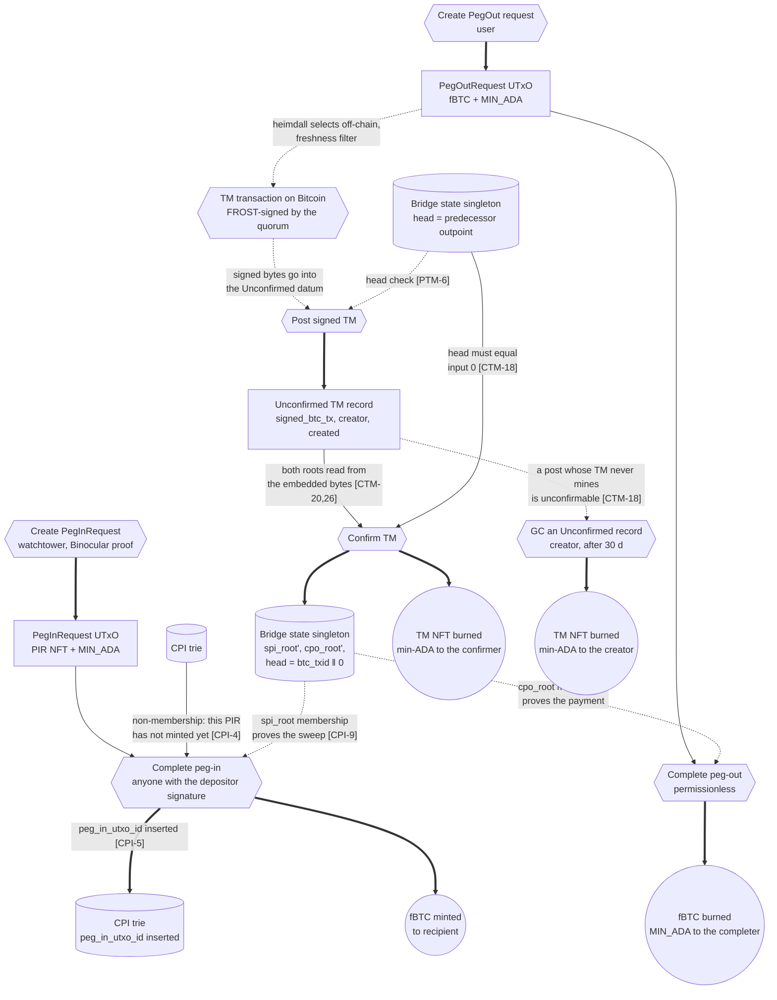
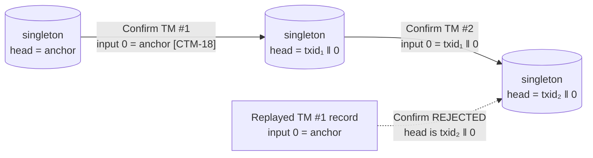
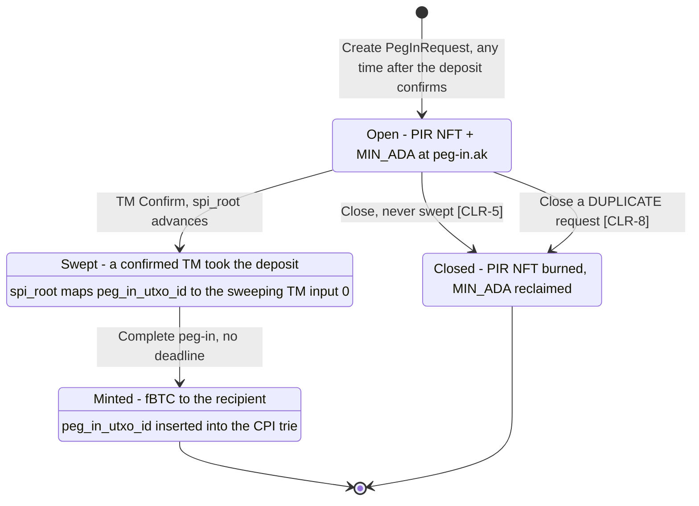

# Bridge State Singleton: TM Chain Head and Two Attested Roots

Date: 2026-08-06, rev 5.4. Status: proposed, pending approval.

This revision extends the attested completed-peg-outs root design
(`2026-07-22-peg-out-fulfilled-trie-design.md`, rev 5.1 and 5.3). It makes four
changes:

1. It adds a chain-head pointer to the bridge state singleton.
2. It adds a second attested root, for swept deposits.
3. It moves every remaining `Confirmed` TM record reader off that record, and
   then stops producing the record.
4. It defers the leader reward and removes its code from the on-chain layer.

**This design assumes a FRESH DEPLOYMENT.** Nothing on preprod is preserved. The
freedom that buys is used deliberately: the Config datum is rebuilt and the
bridge state NFT gets its own asset name. Trie names are unchanged, because the
team already uses them.

> **Implementation status.** Nothing here is implemented. Every check ID marked
> new or withdrawn describes the target state, not the code. §Consumers that
> move lists each reader that changes. §Off-chain: binocular, §Off-chain:
> heimdall and §Off-chain: frontend list the code sites.

## Definitions and Abbreviations

Each term has one spelling and one meaning throughout.

| Term | Meaning |
|---|---|
| **TM** | Treasury Movement. The Bitcoin transaction that moves the treasury, and the Cardano record that tracks it. |
| **singleton** | The bridge state UTxO. It carries both roots, the chain head and the treasury amount. |
| **head** | `treasury_utxo_id`, the Bitcoin outpoint the next TM spends as its input 0. [CTM-18] enforces it. |
| **SPI trie** | MPF recording every deposit a confirmed TM took into the treasury. Root = `spi_root`. |
| **CPO trie** | MPF recording every peg-out a confirmed TM paid. Root = `cpo_root`. |
| **CPI trie** | Completed peg-ins. MPF recording every deposit that has already issued fBTC. Its datum is one `root` field. |
| **PIR** | PegInRequest. The Cardano UTxO a watchtower creates from a Bitcoin deposit. |
| **POR** | PegOutRequest. The Cardano UTxO a user creates to withdraw. |
| **quorum** | The FROST signing threshold of the registered SPO roster. |
| **commitment output** | The TM's single `OP_RETURN` output carrying both roots. See §Root commitment output. |
| **PARKED** | Specified but MUST NOT be implemented in this revision. Distinct from WITHDRAWN, which is permanent. |

> **Two abbreviations, two meanings each. Read carefully.** `CPO` and `CPI` name
> both a trie and a transaction's check family: [CPO-*] is Complete peg-out and
> [CPI-*] is Complete peg-in, while "CPO trie" and "CPI trie" are storage. Rev
> 5.1 established that and the team uses it, so this revision keeps it. `SPI`
> has no such collision: there is no Complete-swept-peg-in transaction.
>
> The one place the collision is dangerous is [CPO-13], a Complete peg-out check
> naming the `cpo_root` field. Both senses appear in one sentence there.

The bridge state NFT asset name is `"BSS"`, not the rev-5.1 `"CPO"`. That name
is not part of the shared vocabulary and it would be actively wrong here: the
singleton holds two roots, the chain head, the treasury value and the federation
sweep txid, so it is not the completed-peg-outs trie under a new datum.

## Problem

Two defects share one mechanism.

**Defect 1: root rollback.** TM Confirm copies the attested root
unconditionally. Posting a TM is permissionless. The mint anchor is never
consumed: `Chain(i)` reads the predecessor `Confirmed` record as a reference
input, and `Genesis(i)` reads a static Config field. Both stay valid forever. So
anyone may re-post an old TM and re-confirm it. That writes an old root back
into the singleton. Complete then fails for every peg-out paid since. Cancel
succeeds for a peg-out already paid in BTC. That is a double claim, and it costs
one Cardano transaction.

**Defect 2: a depositor stranded by garbage collection.** Complete peg-in reads
`btc_txid` and `swept_peg_in_utxo_ids` from a live `Confirmed` record ([CPI-1],
[CPI-2], [CPI-3]). Peg-in completion has no deadline. The record's creator may
burn it 30 days after posting. A depositor who mints late loses the claim, with
the BTC already in the treasury.

The only recovery from defect 2 is the replay that causes defect 1: walk the
chain forward from the anchor and re-create each `Confirmed` record. Closing the
replay closes the recovery. Peg-in completion must therefore stop depending on a
record that can disappear.

## Design

One singleton UTxO holds the bridge state that TM Confirm writes. Every Confirm
spends the singleton and recreates it. Nothing else may ever spend it.

The CPI trie stays a separate UTxO, because a different actor writes
it. See §The two deposit tries.

The NFT `(Config bridge_state_policy, "BSS")` identifies the singleton.

### No script is parameterized by the bridge state policy

- [PAR-1] Every reader MUST take `bridge_state_policy` from the config reference
  input at runtime.

A compile-time parameter would defeat §Recovery: replacing the singleton, which
turns on that Config field being a live swap point.

The TM validator has to read it at runtime anyway: the singleton is
parameterized by the TM script hash, so a compile-time link back would be a
parameterization cycle. `peg-in.ak`, `peg-out.ak` and `treasury.ak` follow the
same rule, and none of them takes `tm_nft_policy_id`.

### Config datum

Eight fields. `update_auth` comes first, because it is the field that governs
every other one.

| Index | Field | Notes |
|---|---|---|
| 0 | `update_auth` | `Option<AuthorizationMethod>`. `None` freezes the Config. |
| 1 | `bridged_token_policy` | fBTC policy id |
| 2 | `completed_peg_ins_policy` | CPI trie NFT policy |
| 3 | `bridge_state_policy` | singleton NFT policy |
| 4 | `tm_script_hash` | TM validator hash, which is also the TM NFT policy id |
| 5 | `peg_in_script_hash` | |
| 6 | `peg_out_script_hash` | |
| 7 | `params` | nested record: fee rate, per-peg-out fee, minimum peg-out, schedule |

- [CFG-2] `tm_script_hash` has NO on-chain reader. It is published so that
  off-chain readers can locate the TM address without a hard-coded constant.

> **Why publish a hash nothing on-chain reads.** Peg-out payout discovery has to
> find `Unconfirmed` TM records, and reconstruction has to walk them, but no
> Config field let a reader derive the TM address. Every off-chain consumer
> therefore pinned it as a build-time constant, which is exactly the coupling
> [PAR-1] removes elsewhere. The frontend is the case that made this visible: it
> carried a hard-coded `TM_NFT_POLICY_ID`, and a redeployment silently invalidates
> it.
>
> Publishing it does NOT make the TM validator swappable. The bridge state
> singleton is compile-parameterized by the TM script hash, so changing field 4
> alone would leave the singleton gated on the old validator. A TM change is a
> redeployment of both, and [CFG-2] exists to spare readers a constant, not to
> create a swap point.

Rev 5.1's fields for the bridged-token asset name, the two `legit_TM`
verifiers, the peg-in close verifier, the initial treasury outpoint and the
leader reward are all GONE.

> **The Config datum can only ever GROW.** `config.ak`'s NFT policy is its own
> script hash, and its Update branch pins `config_output.address ==
> own_input.output.address`, so the UTxO can never move. Changing `ConfigDatum`'s
> type therefore means a new `config.ak`, a new policy, a new NFT, and a full
> bridge redeploy, because every contract is parameterized by that NFT.
>
> Appending stays free forever: readers use positional `safe_list_at`, and the
> Update branch never inspects the datum. So this is the last moment to remove or
> reorder anything, and the reason to do it now.

- [CFG-1] The bridged-token asset name MUST be the constant `"fSAT"`, declared
  in `lib/bifrost/constants.ak`.

> **Why the asset name is a constant and not a field.** It never varies within an
> instance, and it never varies between instances either: one token is one
> satoshi, so the name is a property of the protocol rather than of a deployment.
> Rev 5.1 carried it as governance data, which meant every reader spent a Config
> read on a value that could not change, and gave governance the power to orphan
> circulating supply by editing a string. The trie and singleton asset names
> (`"BSS"` and the rest) are already constants for the same reason.

> **Why the two `legit_TM` verifier fields go.** They were vestigial in rev 5.1,
> and the deployed instance carried dummy hashes for them.

> **Why the peg-in close verifier field goes for good.** It existed to delegate
> the two close proofs to a script that could ship later, because [CLR-3] needed
> Bitcoin witness parsing with multi-leaf disambiguation. The SPI trie removes
> that need entirely: see §Close PegInRequest. Both close reasons are now MPF
> proofs inside `peg-in.ak`, so no verifier script is ever wired and the field is
> not appended later either. On the deployed instance the field holds 28 zero
> bytes, so nothing is lost by never shipping it.

> **Why the initial treasury outpoint goes.** [BSS-4] takes the anchor from the
> bootstrap redeemer, so no on-chain reader needs it.

> **Why the operational parameters are nested.** Rev 5.1 appended them as five
> top-level fields, which is what created the positional-append contract that
> then forbade removing anything. One nested record can be replaced wholesale by
> governance without renumbering its neighbours.

*Implementation status* (2026-08-07). The seven-field table and [CFG-1] are
implemented in `onchain/lib/bifrost/types/config.ak`. Every reader is migrated:
`config.ak`, `bridged-token.ak`, `completed-peg-ins-merkle-tree.ak`, `peg-in.ak`
and `peg-out.ak`.

Decisions taken during implementation:

- **`min_stake` leaves the datum, although the table does not name it.** The
  table is exhaustive, and `min_stake` had no on-chain reader:
  it gated heimdall's R2 registration off-chain only. The rejected alternative
  was to keep it as an eighth field, which would have contradicted the table and
  re-created the append-only pressure §Config datum removes.
- **The params getters read positionally through the nested record.**
  `get_fee_rate_sat_per_vb` and its neighbours unwrap Config field 6 with a
  private helper, then index inside it. The rejected alternative was one
  `get_params` that casts to `ConfigParams`. A full cast pins the nested record's
  arity, so appending a parameter would break every reader, which is the exact
  property the nesting exists to avoid. `get_schedule` keeps its full cast, and
  stays off-chain/test-only for the same reason.
- **The test fixtures build the Config datum as raw `Data`, not as a
  `ConfigDatum` record.** `config.ak`'s spend handler takes the datum raw, and
  every reader uses positional getters, so raw fixtures mirror what a deployed
  reader sees and survive a later shape change. The rejected alternative was
  typed record fixtures, which pass even when the wire layout drifts from the
  getter indexes. `config_getters_match_datum_fields` is the one deliberate
  exception: it builds a real record precisely so a reorder of the record
  definition against the getter indexes fails it.

### BridgeState, the singleton datum

```aiken
pub type BridgeState {
  //Swept peg-ins. Attested by the TM's commitment output, first root.
  spi_root: ByteArray,
  //Completed peg-outs. Attested by the TM's commitment output, second root.
  cpo_root: ByteArray,
  //The current treasury UTxO on Bitcoin: btc_txid ++ 00000000. The next TM
  //must spend it as its input 0, which [CTM-18] enforces.
  treasury_utxo_id: ByteArray,
  //Its satoshi amount.
  treasury_amount: Int,
}
```

| Index | Field | Bytes | Written at Confirm from |
|---|---|---|---|
| 0 | `spi_root` | 32 | the commitment output, first root |
| 1 | `cpo_root` | 32 | the commitment output, second root |
| 2 | `treasury_utxo_id` | 36 | `btc_txid ‖ 00000000` |
| 3 | `treasury_amount` | int | satoshi amount of the TM's output 0 |

The indices are serialization facts, because the datum is a Plutus `Constr` and
field order is consensus-visible. No validator uses them.

- [LIB-1] Every reader MUST decode the singleton datum as `BridgeState` and
  access its fields BY NAME.
- [LIB-2] No reader MAY use `utils.get_mpf_from_output` on the singleton. That
  helper stays for the CPI trie's one-field datum.
- [LIB-3] A new field MUST be appended, never inserted.

> **Why named access, and not an index parameter.** An earlier draft kept
> `utils.get_mpf_from_output` and gave it an index argument. That is one
> character away from the bug it fixes. Rev 5.1's helper reads field 0 blindly,
> with no tag check and no arity check, and both the CPI trie datum and this
> datum are passed to it. Against `BridgeState` a bare field-0 read returns
> `spi_root` where the caller wanted `cpo_root`.
>
> The failure is silent and asymmetric. A wrong root makes `mpf.has` fail
> harmlessly, but it makes `mpf.miss` SUCCEED, which cancels a paid
> PegOutRequest. That is the rollback outcome this revision exists to prevent,
> reachable through a one-line oversight.
>
> A typed decode removes the class rather than guarding it. `expect state:
> BridgeState = datum` checks the constructor and destructures, so
> `state.cpo_root` cannot silently become another field, and a future insert
> breaks the build instead of a validator.

> **A new cross-language mirror, and why it is cheap.** `BridgeState` is written
> by the Scalus TM validator and read by three Aiken validators, so this revision
> retires the `TmDatum` mirror and introduces this one. That is a fair trade, not
> a wash. `TmDatum` had two variants, an arity that had grown twice, and a
> boolean pinned at Constr index 3 so that an Aiken prefix read would land on it.
> `BridgeState` is four flat primitives, one constructor, and append-only by
> [LIB-3].
> The two definitions still MUST move in lockstep.

### The two deposit tries

**SPI trie**, swept peg-ins. Key = `peg_in_utxo_id`, 36 bytes. Value = the
sweeping TM's input-0 outpoint, 36 bytes. The quorum writes it and attests it in
the TM. It proves a deposit reached the treasury.

**CPI trie**, completed peg-ins. Key = `peg_in_utxo_id`. Value = the same. The
depositor writes it at completion. It prevents a second mint for one deposit.

The two answer different questions. "Was it swept" is about custody and only the
quorum can answer it. "Was it already minted" is about replay and only the
completion itself can record it. Neither substitutes for the other.

> **Why the head outpoint, and not the sweeping TM's own txid.** The value MUST
> be known before the transaction is serialized. `spi_root` rides in that same
> transaction's commitment output, and a txid hashes every output. A value of
> `btc_txid` would therefore require `txid = H(… spi_root …)` and
> `spi_root = MPF(… value = txid …)` at once.
>
> That fixed point needs a hash preimage, so no TM could ever be built. The
> input-0 outpoint is fixed before the build. A Bitcoin outpoint is spent once,
> so the value is unique per TM, and it identifies the sweeping TM just as well.
>
> The CPO trie never had this problem. Its values are
> `dest_spk ‖ amount`, and the builder knows both.

### Root commitment output

The commitment output's scriptPubKey is
`OP_RETURN OP_PUSHBYTES_69 ("BTMR1" ‖ spi_root ‖ cpo_root)`.

- Total 71 script bytes, of which 69 are payload. That is inside every
  datacarrier standardness limit.
- Prefix `6a4542544d5231`, 7 bytes.
- `spi_root` is script bytes [7, 39).
- `cpo_root` is script bytes [39, 71).

[CTM-26] requires exactly one such output in every TM. [BTC-1] extends the
requirement to any transaction that spends the treasury outpoint.

> **The tag.** `"BTMR1"` means Bifrost TM Roots, version 1. It is deliberately
> not `"BFR"`-prefixed. Watchtowers detect peg-in deposits by scanning for that
> prefix, and a TM pays the treasury address, so a `"BFR"` tag here could be
> misread as a deposit. `bitcoin.ak::get_op_return_xonly` rejects it twice over:
> it requires a 35-byte push (`0x23`) where this output has 69 (`0x45`), and
> `BTM` differs from `BFR` at the second byte.

## Confirm TM tx

**Purpose**: advance the singleton to the state that holds after a
Binocular-confirmed TM, and retire the TM record.

**Who**: anyone. Confirm is permissionless.

**Trigger**: the posted TM is Binocular-confirmed on Bitcoin.

**Structure**

| Role | Contents |
|---|---|
| Input | the `Unconfirmed` TM record, carrying the TM NFT |
| Input | the singleton, carrying `(bridge_state_policy, "BSS")` |
| Reference input | the Binocular oracle UTxO |
| Reference input | the Config UTxO |
| Output | the singleton, both roots and the head advanced |
| Output | none at the TM script address |
| Mint | the TM NFT, quantity −1 |

**Checks enforced on-chain**: [CTM-17] through [CTM-30], plus [BSS-1] and
[BSS-2] on the singleton's own validator.

**Checks delegated off-chain**: root correctness. The quorum attests both roots
inside the FROST signature. See §Trust model change.

## Diagram 1: Cardano UTxOs and their interactions

Boxes are UTxOs. Hexagons are transactions. Solid arrows **spend**, thick
arrows **create**, dotted arrows **reference** without consuming.



Read the three request paths off the diagram.

- A watchtower creates a PIR from the Bitcoin deposit alone. The PIR never
  enters the TM transaction, and it may be created before or after the sweep.
  Completion spends it and mints the fBTC to the recipient.
- heimdall reads a POR off-chain when it builds the TM. Completion spends the
  POR, burns its fBTC, and gives its MIN_ADA to whoever completes.
- The post creates a TM record and the Confirm consumes it. No `Confirmed`
  record exists. Only a post that never confirms survives, and its creator
  garbage collects it after 30 days.

On the Bitcoin side, the TM's inputs are the whole story of the swept peg-ins
trie: every input except input 0 is a swept deposit. Its outputs are the whole
story of the CPO trie. Both roots ride inside the FROST signature.

## Diagram 2: the chain head, and why replay dies



A Bitcoin outpoint is spent once. The head therefore moves forward only, and
each TM confirms at most once. Both attested roots inherit that property.
Duplicate `Confirmed` records for one txid also stop existing.

## Diagram 3: PegInRequest lifecycle



Both Close transitions are reachable without a verifier script. See §Close
PegInRequest.

## Checks

[CTM-*], [CPI-*], [PTM-*] and [UY-*] continue the numbering of
`technical_documentation.md`. Every other prefix is introduced here.

### Bitcoin-side rules

- [BTC-1] Every transaction that spends the treasury outpoint MUST carry a
  conforming commitment output.
- [BTC-2] Every transaction that spends the treasury outpoint MUST pay the new
  treasury at output 0.
- [BTC-3] The federation MUST build an emergency CSV sweep to satisfy [BTC-1]
  and [BTC-2].

> **Why [BTC-1].** A treasury sweep with no conforming commitment output can
> never be confirmed on Cardano, and the head then freezes.

> **Why [BTC-2], and why it fails worse than [BTC-1].** [CTM-19] writes the head
> as `btc_txid ‖ 00000000` and [CTM-21] reads output 0's satoshi amount. Both
> assume the treasury sits at output 0, and neither can check it: the TM
> validator sees the raw transaction but not the treasury's scriptPubKey.
>
> So a sweep that carries a valid commitment output while paying the treasury
> elsewhere does not fail closed. It CONFIRMS, and writes a head pointing at a
> peg-out payment plus an amount that belongs to the wrong output. The chain is
> then dead and the singleton records a lie, where a [BTC-1] violation merely
> freezes the head with the singleton still truthful.
>
> On-chain enforcement is not available cheaply. An equality check against a
> stored treasury scriptPubKey would reject the very TM that moves funds after an
> Update-Y key rotation, because that TM's output 0 pays the NEW address. Getting
> that right needs the treasury state as a reference input at every Confirm, for
> a rule the quorum controls anyway.
>
> The real guard is the same one that protects root correctness: every honest SPO
> rebuilds the TM byte-for-byte before signing, so a transaction with the
> treasury at the wrong index fails quorum. [BTC-3] names the federation because
> a CSV sweep is the likely way a non-protocol tool spends the treasury, and it
> is the one path that does not go through that rebuild.
>
> §Recovery: replacing the singleton covers the case where these are violated
> anyway.

### Post signed TM

- [PTM-5] WITHDRAWN. The `Genesis` and `Chain` redeemer split is retired.
- [PTM-6] `TreasuryMovementValidator` MUST verify input 0 of `signed_btc_tx`
  equals the singleton reference input's `treasury_utxo_id`.
- [PTM-7] `TreasuryMovementValidator` MUST authenticate that reference input by
  the singleton NFT.

> **Why keep a mint-time head check.** [CTM-18] already makes the design safe.
> [PTM-6] is kept so that a TM chaining from a stale head cannot be posted at
> all. That is what stops dead records from accumulating.

### Confirm TM

- [CTM-18] `TreasuryMovementValidator` MUST verify input 0 of `signed_btc_tx`
  equals the spent singleton's `treasury_utxo_id`.
- [CTM-19] `TreasuryMovementValidator` MUST verify the continuing singleton's
  `treasury_utxo_id` equals `btc_txid ‖ 00000000`.
- [CTM-20] `TreasuryMovementValidator` MUST verify the continuing singleton's
  `spi_root` equals bytes [7, 39) of the commitment output.
- [CTM-21] `TreasuryMovementValidator` MUST verify the continuing singleton's
  `treasury_amount` equals the satoshi amount of the TM's output 0.
- [CTM-24] `TreasuryMovementValidator` MUST verify the Confirm spend burns the
  TM NFT, that is `mint == -1` under the TM policy.
- [CTM-25] `TreasuryMovementValidator` MUST verify the Confirm spend produces no
  output at the TM script address.
- [CTM-26] `TreasuryMovementValidator` MUST verify the TM carries exactly one
  output whose scriptPubKey is 71 bytes with prefix `6a4542544d5231`.
- [CTM-27] `TreasuryMovementValidator` MUST rebuild the expected singleton datum
  in full and compare the whole `OutputDatum`.
- [CTM-28] `TreasuryMovementValidator` MUST authenticate the spent singleton by
  the NFT `(bridge_state_policy, "BSS")`, read from the config reference input.
- [CTM-29] `TreasuryMovementValidator` MUST verify the continuing singleton
  output carries that NFT at the same address as the spent one.
- [CTM-30] `TreasuryMovementValidator` MUST verify the continuing singleton's
  `cpo_root` equals bytes [39, 71) of the commitment output.
- [CTM-17] SURVIVES UNCHANGED on the Confirm path. Exactly one input at the TM
  script address.
- [CTM-6] to [CTM-8] REVISED. Garbage collection applies to `Unconfirmed`
  records only. The rules are unchanged in substance: creator signature, NFT
  burn, validity entirely after `created + GcGraceMs`, one TM input.

> **Why [CTM-17] must survive, and why [CTM-25] does not replace it.** An earlier
> draft argued that two Confirm spends in one transaction are self-contradictory,
> because each demands the head advance to its own `btc_txid`. That is false when
> both records hold the same `signed_btc_tx`, which permissionless posting makes
> trivial to arrange.
>
> Both then demand the same head. [CTM-24] sees a transaction-wide mint of −1 and
> passes for both. The mint policy rejects a −2 burn, so only one NFT is
> destroyed. [CTM-25] is satisfied, because neither NFT went to the TM address.
> Ledger value conservation sends the second NFT to an attacker output.
>
> From there the attacker can park it at the TM address with a fabricated
> `Unconfirmed` datum, bypassing the mint checks entirely. [CTM-17] is the
> one-line fix.

> **Why [CTM-27] pins the whole datum.** On-chain `FromData` is an erased retag
> with no tag check and no arity check. Field-wise reads would also accept
> `Constr 5 [root, junk, …]` at the singleton address. Confirming is
> permissionless, so that shape is attacker-chosen, and every off-chain parser
> would inherit it.

### Singleton validator

- [BSS-1] The singleton validator MUST verify that one input sits at the TM
  script address and carries the TM NFT.
- [BSS-2] The singleton validator MUST verify that input's redeemer is `Confirm`.
- [BSS-3] NEVER ISSUED. It would have added a governance `Reanchor` spend on the
  singleton. See §Recovery: replacing the singleton for why one recovery path is
  enough.
- [BSS-4] The bootstrap mint MUST spend `one_shot_input_ref`.
- [BSS-5] The bootstrap mint MUST mint exactly one token, asset name `"BSS"`, to
  the singleton's own script address.
- [BSS-6] The singleton validator MUST NOT gate its spend on a `Confirmed`
  output tag.
- [BSS-7] The singleton validator MUST NOT gate its spend on the TM NFT burn
  alone.

> **Why [BSS-6] and [BSS-7].** The rev-5.1 gate was a tag-0 TM input plus a tag-1
> TM output. No tag-1 output is ever produced now, so that gate is
> unsatisfiable. Falling back to "the TM NFT is burned" is wrong, because the
> rev-5.3 garbage collection of an `Unconfirmed` record also burns the NFT. A
> garbage-collection transaction could then spend the singleton and rewrite both
> roots. The redeemer is the only discriminator that separates the two.
> `completed-peg-ins-merkle-tree.ak` already reads another script's redeemer this
> way.

> **Why the bootstrap datum is not pinned.** The same mint path serves the first
> deployment and the §Recovery replacement. A first deployment wants zero roots
> and the deployment anchor. A replacement wants the current roots and the live
> tip. On-chain the two are indistinguishable, so pinning either shape would
> block the other.
>
> The datum is therefore operator-supplied and observer-verified. The honest
> roots are a deterministic function of chain history, so a wrong one is
> detectable. Being attested rather than folded, it is overwritten by the next
> honest Confirm.
>
> `treasury_amount` is in the same position. Nothing on Cardano knows the anchor's
> satoshi amount. A wrong value is self-limiting, because the first TM built from
> it produces a transaction the quorum cannot make balance.

*Implementation status* (2026-08-07). [BSS-1], [BSS-2], [BSS-4] to [BSS-7] are
implemented in `onchain/validators/bitcoin/bridge-state.ak`. `BridgeState` is in
`onchain/lib/bifrost/types/bridge-state.ak`.
`onchain/validators/bitcoin/completed-peg-outs-merkle-tree.ak` is deleted: the
singleton replaces the rev-5.1 CPO trie UTxO. `completed_peg_outs_root_asset_name`
is gone from `constants.ak` too, now that [CPO-13] removed its last reader.

Decisions taken during implementation:

- **Four datum fields, not five.** The implementation followed the normative
  Aiken block and field table over a stale prose line that said "five flat
  primitives", left over from removing `FederationReset`. The prose is now
  corrected. The rejected alternative was a fifth `federation_sweep_txid` field,
  which no check in this document reads.
- **[BSS-2] reads the redeemer tag, not a decoded type.** The validator calls
  `builtin.un_constr_data` and compares the tag against a named constant. The
  rejected alternative was to import the Scalus `TmSpendRedeemer` shape as an
  Aiken type. That would add a second datum mirror to keep in lockstep, which
  §Deleting the Aiken TM datum mirror removes.
- **[BSS-5] pins the payment credential only.** The output check accepts any
  stake credential on the singleton's own address. The rejected alternative was
  the full-address pin `stake_credential: None` used by the deleted CPO trie
  mint. [BSS-5] says "own script address", and a staked singleton address is not
  a security difference: the NFT plus the payment credential already fix where
  the token lands.
- **[BSS-1] fails hard on two TM inputs.** The filter result is destructured with
  `expect [tm_input]`. The rejected alternative, returning `False` on a count
  mismatch, hides the two-input case behind the same failure as a wrong redeemer.

### Complete peg-in

- [CPI-1] WITHDRAWN. No `Confirmed` record is referenced.
- [CPI-2] WITHDRAWN. [CPI-9] replaces it.
- [CPI-3] REVISED. The BIP-322 message drops `btc_txid`. It becomes
  `sha2_256(mint_tag ‖ peg_in_utxo_id ‖ recipient)`.
- [CPI-6] SURVIVES UNCHANGED. Total fBTC minted equals `peg_in_amount`.
- [CPI-7] WITHDRAWN, not replaced. No reward is paid at the mint. See §Leader
  reward: DEFERRED.
- [CPI-9] `peg-in.ak` MUST verify
  `mpf.has(spi_root, peg_in_utxo_id, sweeping_tm_input_0, proof)` against the
  singleton reference input.
- [CPI-10] `peg-in.ak` MUST authenticate that reference input by the NFT
  `(bridge_state_policy, "BSS")`.
- [CPI-11] PARKED. It would pay `leader_reward` in fBTC to the proven
  `leader_credential`.
- [CPI-12] PARKED. It would require the recipient output to hold
  `peg_in_amount − leader_reward` fBTC.

> **Why [CPI-3] drops `btc_txid`.** No reader can supply it any more. The trie
> value is the head outpoint, and no on-chain reader can derive the sweeping
> txid from it.
>
> Nothing is lost. `btc_txid` bound the message to the confirmed TM, and [CPI-9]
> now proves the sweep directly. Non-replayability was never its job. That comes
> from `peg_in_utxo_id`, which is unique per deposit, and from `recipient`, which
> is bound into the fBTC output.
>
> One behaviour changes. The depositor MAY now sign before the sweep, because the
> message no longer names a transaction that does not exist yet. Completion is
> already permissionless for anyone holding the signature, so a depositor can
> hand it to a completer and go offline.

### Close PegInRequest

A PegInRequest that can never complete keeps its MIN_ADA locked and its NFT
unburnable. Two reasons make a request permanently dead, and the SPI trie turns
both into MPF proofs. No verifier script is involved.

`PegInDatum` gains one field for this.

- [CLR-5] `peg-in.ak` MUST verify the transaction's validity range lies entirely
  after `created + peg_in_close_timeout_ms`.
- [CLR-6] `peg-in.ak` MUST verify `mpf.miss(spi_root, peg_in_utxo_id, proof)`
  against the singleton reference input.
- [CLR-7] `peg-in.ak` MUST append `created` to `PegInDatum`, pinned to the mint
  transaction's validity upper bound.
- [CLR-8] `peg-in.ak` MUST accept, as an alternative to [CLR-5] and [CLR-6],
  `mpf.has(the CPI trie root, peg_in_utxo_id, …)` against the CPI trie.
- [CLR-9] `peg-in.ak` MUST verify the close is authorized by the datum's
  `owner_auth`.
- [CLR-10] `peg-in.ak` MUST verify the PIR NFT is burned.
- [CLR-11] `peg-in.ak` MUST verify the transaction mints and burns no fBTC.
- [CLR-3] WITHDRAWN. [CLR-5] and [CLR-6] replace it.
- [CLR-4] WITHDRAWN. [CLR-8] replaces it.

`peg_in_close_timeout_ms` is a `peg-in.ak` constant of 2_592_000_000, thirty
days, mirroring `peg_out_cancel_timeout_ms`.

> **What each branch proves.** [CLR-6] is the never-swept case: if the deposit
> was never taken into the treasury, no fBTC can ever be owed for it. That
> includes the depositor who took their BTC back through the Taproot refund leaf,
> because a refunded deposit is by definition unswept. [CLR-8] is the duplicate
> case: the deposit WAS swept and already minted, so a second request for it is
> dead. The two are mutually exclusive, which is why [CLR-8] is an alternative
> rather than an addition.

> **Why this removes the verifier script.** Rev 5.1 delegated the close to a
> separate script because [CLR-3] had to parse a Bitcoin witness and disambiguate
> which Taproot leaf was revealed. Under [CLR-6] the question is not "did the
> depositor refund" but "was this deposit ever swept", which the SPI trie answers
> directly. Bitcoin parsing disappears, and with it the script, its Config field,
> and the F1-F6 close milestone's on-chain work.

> **The non-membership carries the safety. The timeout only prevents churn.**
> [CLR-6] alone is nearly sufficient: a swept deposit is in the trie and cannot
> be closed. The gap it leaves is the window between a sweep confirming on
> Bitcoin and its TM confirming on Cardano, during which the deposit is swept but
> not yet in `spi_root`.
>
> That window is not dangerous, because closing a PIR is NOT destructive.
> Creating one is permissionless and needs only the deposit proof, so a request
> closed in that window can simply be re-created and completed. [CLR-5] exists to
> make the churn rare, not to make the rule safe.

> **Why the timeout does not match the Bitcoin one, and must not try.** The
> deposit's refund leaf uses `refund_timeout`, a per-instance constant measured
> in Bitcoin BLOCKS relative to the deposit's own confirmation, constrained only
> by `> federation_csv_blocks`. The doc's 4320 blocks is an example, not a
> protocol value. [CLR-5] measures POSIX milliseconds from PIR creation on
> Cardano, which is a different clock with a different anchor, and a PIR may be
> created long after its deposit. Making the two agree is impossible and
> unnecessary: [CLR-6] is what establishes deadness.

> **Implementation status.** `PegInDatum` also still carries
> `source_chain_treasury_utxo_id`, a pinned treasury outpoint from the scheme
> rev 5.1 superseded. A fresh deployment should drop it in the same change.

### Complete peg-out and Cancel peg-out

- [CPO-13] `peg-out.ak` MUST read `BridgeState.cpo_root`, per [LIB-1].

Every other rule is unchanged: value-bound membership at Complete,
non-membership and timeout at Cancel.

*Implementation status* (2026-08-07). [CPO-13] is implemented in
`onchain/validators/bitcoin/peg-out.ak`. The withdraw prelude authenticates the
reference input with the `(bridge_state_policy, "BSS")` NFT, decodes it as
`BridgeState`, and builds the trie from `state.cpo_root` by name.

Decisions taken during implementation:

- **The redeemer field keeps the name `completed_peg_outs_ref_input_index`.** It
  now indexes the singleton reference input. The rejected alternative was to
  rename it, which changes no serialized shape but does churn every off-chain
  builder for a comment-sized gain.
- **The peg-out tests give the singleton a decoy `spi_root`.** The decoy trie
  contains the same POR id under a wrong value, so a [LIB-2]-style blind field-0
  read fails `has` and `miss` alike. The rejected alternative was an empty
  `spi_root`, against which a blind read still passes Complete and, worse, still
  passes Cancel.
- **`peg-in.ak`'s Cancel branch becomes a hard `False`, not a removed branch.**
  Its Config field disappears here, but the branch belongs to the clr-close-pir
  task. The deployed field held a dummy hash with no reward account, so Cancel
  was already unsatisfiable and `False` preserves behaviour exactly. The rejected
  alternative was to implement the SPI-trie close in this task, which would have
  merged two reviews into one.

### Update-Y, federation branch

- [UY-5] REVISED. `treasury.ak` MUST accept an Update-Y authorized by a BIP340
  signature under the spent datum's `y_federation`, in place of [UY-3]'s
  signature under `current_spos_frost_key`.
- [UY-6] WITHDRAWN. The federation MAY name any key.
- [UY-7], [UY-8] WITHDRAWN with the `FederationReset` branch. No sweep evidence
  and no freshness anchor are required.
- [UY-9], [UY-10] NEVER ISSUED. An earlier draft used them to relocate that
  evidence into the singleton instead of removing it.
- Every other Update-Y rule is unchanged. The branch differs only in whose
  signature authorizes it.

> **Why [UY-6] is not worth keeping.** It restricted the federation to setting
> `y_federation` itself. That is trivially bypassed in two transactions: set
> `current_spos_frost_key` to `y_federation`, then sign the next rotation as the
> current key and name anything. The restriction buys one transaction of delay,
> not a bound.

> **Why there is no timeout.** A timeout would make this a dead-man switch rather
> than a standing authority, but it needs an anchor that tracks whether the
> roster can still sign. `last_rotation` does not: a live roster whose DKG merely
> fails stops rotating and becomes indistinguishable from a dead one, so two idle
> epochs would let the federation demote a roster that is signing batches
> perfectly well. Fixing that needs either a mandatory no-op rotation from the
> roster or a liveness field on the singleton, and both belong to the key
> lifecycle design rather than to this revision. See §Federation co-authority for
> what the absence of a timeout actually grants.

## Off-chain rules

- [SPI-1] heimdall MUST insert every input of a confirmed TM into the
  SPI trie, except input 0.
- [SPI-2] Every FROST participant MUST recompute `spi_root` from its own trie
  and the proposed TM's inputs before signing.
- [SPI-3] heimdall MUST give every entry a TM adds that TM's own input-0
  outpoint as its value. One TM's entries therefore all share one value.
- [SPI-4] heimdall and binocular MUST serve a swept peg-ins membership proof to
  any caller.
- [SPI-5] PARKED with [CPI-11]. It would require heimdall to set every entry's
  `leader_credential` from the leader election, and a participant whose own
  election result disagrees to refuse to sign.

> **Why [SPI-1].** Rev 5.1 left the treasury input in `swept_peg_in_utxo_ids`. It
> was inert only because `deposit_binding_ok` reads vout 1 and demands a `BFR`
> `OP_RETURN` there, which a TM never has. That is a property of the output
> layout, not a rule. Excluding input 0 removes the dependency on it.

> **Why [SPI-2].** The swept set is a pure function of the signed transaction,
> with no selection freedom. Any observer can recompute it from Bitcoin data
> alone, so the attestation is deterministically auditable.

> **Why [SPI-4].** A depositor cannot build a membership proof without the whole
> trie, and the trie is reconstructible only from full chain history. The
> depositor-facing path is the frontend, which builds transactions client-side
> and has no such capability today. See §Off-chain: frontend.

## Trust model change

Rev 5.1 derived `swept_peg_in_utxo_ids` on-chain from oracle-proven bytes, so
[CPI-2] was verified rather than attested. Under this design the sweep evidence
becomes a quorum attestation. A quorum that inserts an entry for a deposit it
never swept mints unbacked fBTC.

That sits inside the custody envelope the quorum already holds, because it can
move the BTC directly. The difference is visibility. Moving BTC is visible on
Bitcoin. A forged entry is visible only to an observer reconstructing the trie.
[SPI-1] and [SPI-2] are what keep the forgery detectable, so they are normative
rather than advisory.

## Leader reward: DEFERRED

**Status: deferred, 2026-08-06.** All leader-reward code leaves the on-chain
layer until the flow is fully specified.

- The swept peg-ins value is the head outpoint alone, 36 bytes. It carries no
  credential.
- [CPI-7] is WITHDRAWN, not replaced. No reward is paid at the mint.
- [CPI-11], [CPI-12] and [SPI-5] are PARKED. Implementers MUST NOT build them.
- `epoch` and `leader_reward` leave the TM datum, and the Config has no reward
  field.

> **Why deferred rather than shipped.** Four questions are open: per-mint or
> per-TM, dust deposits below the reward, peg-out-only TMs that generate no mint,
> and whether the amount is enforced against Config. That last one becomes
> load-bearing under [CTM-18], because duplicate `Confirmed` records are no
> longer possible and a depositor cannot escape to a cheaper record. Shipping a
> reward whose amount a permissionless poster chooses would hand that poster a
> toll on every depositor the TM swept. Carrying no field costs nothing.
> Carrying a half-enforced fee costs users.

The recommended shape for its return, and the four open questions in full, are
in `internal-docs/bitfrost/proposals/2026-07-21-n9-leader-reward-attribution.md`
and its rev-5.4 addendum. In summary: adopt option (b), pay the elected leader
through a credential the FROST signature covers, and carry that credential in
the swept peg-ins value rather than a second `OP_RETURN`. Reintroduction widens
the value from 36 to 64 bytes, which is a root-format change and therefore cheap
only while the trie is young.

## No Confirmed record

Nothing on-chain reads a `Confirmed` TM record, so this design does not produce
one. Confirm spends the `Unconfirmed` record, burns the TM NFT per [CTM-24],
updates the singleton, and produces no output at the TM address per [CTM-25].

What that removes, beyond the rows in §Consumers that move:

- The `Confirmed` variant of `TmDatum`, which becomes a single-constructor
  record, and the Aiken mirror `lib/bifrost/types/treasury-movement.ak` with the
  cross-language field-order discipline it forced.
- One min-ADA per TM. The confirmer takes the `Unconfirmed` record's min-ADA,
  which is a built-in incentive to confirm, replacing a 30-day reclaim round
  trip.

What stays:

- **The `Unconfirmed` record.** It is the relay carrier. Watchtowers read
  `signed_btc_tx` from it to broadcast to Bitcoin, because SPOs do not run
  Bitcoin nodes. As a spent output it is also the permanent history source for
  trie reconstruction.
- **Its garbage-collection path**, for a post whose Bitcoin transaction never
  mines. Under [CTM-18] such a post is permanently unconfirmable, so garbage
  collection is the only way its min-ADA comes back.

## Consumers that move

| Consumer | Read in rev 5.1 | Reads now |
|---|---|---|
| Complete peg-in [CPI-2], [CPI-3] | `Confirmed` record | singleton `spi_root` |
| Leader reward [CPI-7] | `Confirmed` record's poster and pinned amount | nothing, WITHDRAWN and deferred |
| `treasury.ak::FederationReset` [UY-7], [UY-8] | `Confirmed` record | nothing, the branch is REMOVED and [UY-5] replaces it |
| Post signed TM [PTM-5] | predecessor `Confirmed` record | singleton head |
| Treasury reconstruction | tip record's parsed `outputs[0]` | singleton `treasury_amount` |
| Leader election entropy | tip `btc_txid` | singleton head |
| heimdall payable set | `Confirmed.fulfilled_peg_outs` | its own CPO trie |
| heimdall chain ordering | walk of `Confirmed` datums | walk of the singleton's spend history |
| heimdall `consumed` view | `Confirmed.swept_peg_in_utxo_ids` | its own SPI trie |
| binocular `CpoReconstruction` | `parseConfirmed` and `chainOrder` | the same singleton walk |
| binocular `PorSweeper.recover` | that reconstruction | the same walk, or it halts and pages |
| binocular `PegInCompleteCommand` | `Confirmed` record | singleton and the [CPI-9] proof |
| frontend `claim.ts` completion | `Confirmed` record by hard-coded TM policy | singleton and the [CPI-9] proof |
| frontend `claim.ts` payout discovery | `Confirmed.fulfilled_peg_outs` | singleton `cpo_root` |
| Complete peg-out, Cancel | singleton root | unchanged, but see [CPO-13] |

`FederationReset` is removed rather than relocated. [UY-5] covers the case it
existed for, without evidence. See §Federation co-authority.

## Recovery: replacing the singleton

Withdrawing [PTM-5] retires the `Genesis` redeemer. The head can then only
advance through Confirm, and [CTM-26] requires a conforming commitment output.

**If any Bitcoin transaction spends the treasury outpoint without a conforming
commitment output, the head freezes permanently.** No Confirm can fire. [PTM-6]
then blocks every future post, so neither root ever moves again.
Swept-but-unminted depositors lose their claims.

Three routes in: a quorum builder bug, quorum theft, or a federation CSV sweep
built with non-protocol tooling. The third is the likely one, and [BTC-1] to
[BTC-3] exist to prevent it.

A [BTC-2] violation reaches the same place by a worse road. It confirms rather
than failing closed, so the singleton records a head and an amount taken from
the wrong output before the chain dies. Replacement is still the recovery, and
the operator MUST bootstrap the successor from the true tip rather than from the
dead singleton's fields.

The recovery is a Config Update swapping `bridge_state_policy` to a fresh
singleton. No dedicated repair spend exists.

1. Compile a new singleton against the same TM script hash with a different
   `one_shot_input_ref`. That gives a different policy id.
2. Bootstrap it with the current roots and the live tip as its head.
3. Config Update `bridge_state_policy`. The TM validator picks it up at the next
   Confirm.

The old singleton is abandoned in place.

This also covers a case a repair spend could not: a singleton that is
unspendable, through a validator bug or a datum shape nothing can consume. A
spend-based repair is itself a spend, so it cannot fix that.

> **Why no `Reanchor` spend.** An earlier draft added one, bounded to the head
> and forbidden from touching the roots. The argument for bounding it was that a
> full replacement lets `update_auth` rewrite the paid and swept sets.
> `update_auth` can do that either way, because nothing stops it pointing the
> field at any singleton it likes. The bounded spend would have added a second
> authorization path without removing the first. One recovery mechanism, not two.

**Why a doctored replacement does not survive.** The honest roots are a
deterministic function of chain history, so any observer recomputes them:
`spi_root` is the union of confirmed TM inputs minus each input 0 per [SPI-1],
readable from the spent `Unconfirmed` datums, and `cpo_root` follows the
attested chain of committed roots. [SPI-2] makes every FROST participant
recompute before signing, so a divergence surfaces at the next signing round.
The roots are attested rather than folded, so the next honest Confirm overwrites
a doctored root automatically.

Residual exposure is one TM cadence, during which fBTC could be minted against a
fabricated entry. That exposure is real, bounded, loud, and self-correcting.
Treat a `bridge_state_policy` swap with the same scrutiny as replacing the
instance.

## Off-chain: binocular

- [OB-1] `ConfirmTmtxCommand` and `TreasuryMovementTx.buildAndSubmitConfirm`
  MUST stop building a `Confirmed` output.
- [OB-8] The same two MUST burn the TM NFT, spend and recreate the singleton,
  and take the record's min-ADA.
- [OB-2] `CpoReconstruction` MUST walk the singleton's spend history in place of
  `parseConfirmed` and `chainOrder`.
- [OB-9] `CpoReconstruction` MUST read raw transactions from the spent
  `Unconfirmed` datums.
- [OB-3] `PorSweeper.recover` MUST move to the same walk, in the same change. It
  halts and pages the operator when reconstruction fails.
- [OB-4] `PorSweeper.onChainRoot`, `BridgeSweepSetup` and `BridgeBootstrap` MUST
  decode `BridgeState` and read `cpo_root` by name. All three read a one-field
  datum in rev 5.1.

> **Implementation status.** Their pre-migration failure modes differ and were
> not all verified. heimdall's `parse_cpo_trie_datum` provably tolerates trailing
> fields, so it would read only the first root. The Scalus off-chain casts may
> either reject on arity or read field 0. The second is the dangerous one: field
> 0 is `spi_root`, and `PorSweeper.onChainRoot` feeds the sweeper's mirror
> comparison. Each site MUST be checked rather than assumed, because a halt is
> an outage and a silent wrong root is a wrong proof.
- [OB-5] `PegInCompleteCommand` and `PegInCompleteTx` MUST locate the singleton
  in place of a `Confirmed` record.
- [OB-10] The same two MUST build the [CPI-9] membership proof.
- [OB-11] The same two MUST sign the revised [CPI-3] message.
- [OB-6] The bootstrap command MUST write the singleton datum of §Deployment.
- [OB-7] The bootstrap command MUST accept the treasury value as an operator
  input.

## Off-chain: heimdall

- [OH-1] heimdall MUST rebuild the `consumed` view in `blockfrost_chain.rs` from
  its own SPI trie, or from raw transactions in spent `Unconfirmed`
  datums.
- [OH-2] heimdall MUST move the payable set from `Confirmed.fulfilled_peg_outs`
  to its own CPO trie.
- [OH-3] heimdall MUST change `CPO_COMMITMENT_EXTRA_VBYTES` from 5 to 37, for
  the 71-byte script.
- [OH-4] heimdall MUST update `parse_cpo_trie_datum` to read both roots and the
  head.

> **Why [OH-1] is load-bearing.** The `consumed` view feeds the peg-in auto-skip,
> dead-TM diagnosis, and the `viable_in_flight_spends` check that unblocks the
> batch gate. It is not diagnostic output.

> **Why [OH-3] matters.** A stale constant underpays every TM's miner fee and
> sticks the transaction. Unsticking it then needs the §Stuck-TM recovery loop of
> the authoritative specification.

## Off-chain: frontend

`ft-bifrost-frontend` builds peg-in completion client-side and was outside every
earlier blast-radius analysis.

- [OF-1] `claim.ts` MUST build the revised [CPI-3] message. It builds the rev-5.1
  message today, so every signature it collects would otherwise fail silently in
  the user's wallet.
- [OF-2] `claim.ts` MUST reference the singleton in place of the `Confirmed`
  record, and MUST stop reading a hard-coded TM NFT policy.
- [OF-3] `claim.ts` MUST obtain a [CPI-9] membership proof. [SPI-4] names the
  servers; the frontend has no reconstruction capability of its own.
- [OF-4] Peg-out payout discovery MUST move from `Confirmed.fulfilled_peg_outs`
  to `cpo_root`.
- [OF-5] The pollers in `useClaimFbtc.ts` and `useTreasuryStatusCheck.ts` MUST
  stop waiting for a record that is never produced.
- [OF-6] `SCRIPT_REFS` MUST be republished. A fresh deployment invalidates every
  pinned CIP-33 reference UTxO.
- [OF-7] The Config parser MUST follow §Config datum. It parses rev 5.1's layout
  positionally.

> **Implementation status.** One latent frontend bug is worth fixing in the same
> pass: `claim.ts` reads the completed peg-ins root by taking the first 32-byte
> bytestring it finds in the datum, which mis-reads any datum that ever gains a
> field.

## Deleting the Aiken TM datum mirror

`lib/bifrost/types/treasury-movement.ak` mirrors the Scalus `TmDatum`. Its two
importers, `treasury.ak` for the removed `FederationReset` and `peg-in.ak` for
`CompletePegIn`, both lose their reason to read it: `FederationReset` is removed
and [CPI-9] replaces [CPI-2]. With no `Confirmed` record there is
nothing left to mirror.

- [MIR-1] An implementer MUST NOT delete the file before both importers move.

> **Why this is worth doing.** The mirror is what forces the cross-language
> discipline: `spent_via_federation_leaf` pinned at Constr index 3 so the Aiken
> prefix read lands on it, full-arity mirroring of the `Unconfirmed` variant, and
> every datum change made in lockstep across Aiken and Scalus. With no mirror the
> Scalus `TmDatum` evolves by plain appends again. One cross-language datum
> remains, `BridgeState`, and §BridgeState, the singleton datum explains why it
> is a far cheaper one to keep in step.

## Contracts to fix before first deployment

`treasury.ak` and `spos-registry` are not deployed. Once they are, they cannot
be replaced without abandoning their state, so their defects have to be fixed
first.

- [PRE-1] `treasury.ak` MUST NOT take `tm_nft_policy_id`. With
  `FederationReset` removed it reads nothing the bridge owns, so its only
  parameter is `registry_policy_id`.
- [PRE-2] The `treasury.ak` bootstrap MUST accept an operator-supplied
  `bifrost_identity_root` instead of hard-coding the empty MPF root.
- [PRE-3] `spos-registry` MUST be reviewed for the same one-way properties.

> **Why these cannot wait.** `treasury.ak` pins its own value and address on
> every spend branch and derives its NFT policy from its own hash, so the state
> UTxO can never move. A replacement bootstrapped with the empty identity root
> would force every registered SPO to re-register. And with `tm_nft_policy_id` as
> a compile parameter, any later change to the TM validator's hash breaks
> `FederationReset` permanently. Every other contract in this design is
> replaceable through a Config field. These two are not.

## Federation co-authority

[UY-5] makes the federation a **standing co-authority** over the treasury key,
not an emergency fallback. It may rotate `current_spos_frost_key` at any moment,
to any value, without proving anything about the roster.

That is the whole dead-roster recovery: if the roster dies, the federation
rotates and the bridge continues. No sweep evidence, no freshness anchor, no
timeout, no field on the singleton.

**What it grants that the federation did not already have.** The federation can
already sweep any treasury UTxO once it has aged past `federation_csv_blocks`,
so it can already take every satoshi, slowly and visibly on Bitcoin. [UY-5] adds
speed and quiet: a rotation is instant, and afterwards new deposits derive to the
federation's address while depositors see nothing unusual.

- [FED-1] Operators MUST NOT run this revision on a network holding value the
  federation charter does not already cover.
- [FED-2] The key lifecycle MUST be designed before mainnet, and MUST replace
  this standing authority with a timeout-gated one.
- [FED-3] The federation charter MUST state that the federation can rotate the
  treasury key unilaterally and immediately.

> **Why accept it here.** The alternative was proving the roster dead through a
> Bitcoin CSV sweep recorded at TM Confirm, which cost a datum field on the
> singleton, two Confirm checks, a witness-shape computation on every TM, and a
> `tm_nft_policy_id` parameter permanently coupling `treasury.ak` to the TM
> validator's hash. All of that for an event that happens at most once per dead
> roster, using deadness evidence that was a proxy for the thing that matters:
> whether the roster can still produce a threshold signature.
>
> [UY-5] costs one check and reads `y_federation` from `treasury.ak`'s own datum,
> so `treasury.ak` keeps its single `registry_policy_id` parameter and stays
> uncoupled from everything else in this design.

## Cost

- Complete peg-in gets cheaper. One MPF membership proof replaces a `list.has`
  over up to 100 outpoints, plus a large datum read.
- Confirm adds one 36-byte comparison and two 32-byte slices.
- Bitcoin cost rises by 32 bytes per TM, which is 32 vB rather than 8. An
  `OP_RETURN` output is non-witness data at 4 weight units per byte, so it takes
  no witness discount. [OH-3] moves heimdall's fee constant to match.
- One singleton replaces rev 5.1's trie UTxO. No new UTxO, and no new min-ADA.
- No `Confirmed` record means one fewer UTxO per TM, and its min-ADA goes to the
  confirmer instead of sitting locked for 30 days. A chain doing 4 TMs a day
  never creates roughly 1460 records a year.

## Operational note

Every TM Confirm spends the singleton, which invalidates any in-flight
transaction referencing it. This affects peg-out completion and peg-in
completion alike.

- [OPS-1] Both sweepers MUST treat a consumed reference input as a normal retry,
  not a fault.

## Deployment

- [DEP-1] The singleton MUST exist, and `bridge_state_policy` MUST point at it,
  before the first post. [PTM-6] reads the head at mint time.
- [DEP-2] The operator MUST verify the anchor outpoint and its satoshi amount
  against Bitcoin before the bootstrap.

Bootstrap datum. [BSS-4] and [BSS-5] pin the one-shot and the NFT, not these
values:

| Field | Value |
|---|---|
| `spi_root` | 32 zero bytes |
| `cpo_root` | 32 zero bytes |
| `treasury_utxo_id` | the anchor outpoint |
| `treasury_amount` | the anchor's satoshi amount |

Every field is operator-supplied. Observers verify the roots by reconstruction,
per §Recovery: replacing the singleton.

## Withdrawn from the catalog

`technical_documentation.md` still carries these.

- [WDR-1] The author of the catalog update MUST mark every ID below as withdrawn
  in `technical_documentation.md` when this revision lands.

| ID | Reason |
|---|---|
| [CPI-1], [CPI-2] | no `Confirmed` record is referenced; [CPI-9] proves the sweep |
| [CLR-3] | [CLR-5] and [CLR-6] prove deadness from the SPI trie instead |
| [CLR-4] | [CLR-8] proves the duplicate from the CPI trie instead |
| [CPI-7] | the leader reward is deferred |
| [PTM-5] | the `Genesis` and `Chain` redeemer split is retired |
| [CTM-4], [CTM-5] | they described a `Confirmed` datum a continuing output had to match |
| [CTM-12] | it pinned the rev-5.1 `CPOR1` layout; [CTM-26] replaces it |
| [CTM-13] | it pinned the trie datum by equality; [CTM-27] restates it wider |
| [CTM-15] | it rejected a `Confirm` redeemer on a `Confirmed` record, now moot |
[CXL-*] and [CPO-1] to [CPO-12] are UNCHANGED by this revision and MUST NOT be
withdrawn. They are named here only so a reader checking coverage does not have
to wonder.

[CTM-1] to [CTM-3], covering txid recomputation, oracle membership and merkle
inclusion, survive unchanged.
