# Bifrost documentation

## Architecture overview

Bifrost is an optimistic bridge. It uses the high decentralization of Cardano stake pools to secure peg-ins and peg-outs between Cardano and other UTxO blockchains such as Bitcoin, Dogecoin, and Litecoin.
These blockchains have limited scripting capabilities, so several bridging alternatives have been proposed in recent years. The best-known are: FROST signatures by a small set of external nodes (Stacks); BitVM optimistic behaviour with a 1-of-n honesty assumption and limited availability (Cardinal, Citrea); and watchtower multisignature behaviour (Rosen Bridge).

Bifrost takes inspiration from all these solutions. The difference: Cardano itself is the core component that guarantees the security and uncensorability of the user’s actions.

This also makes it easier to connect Cardano, a UTxO blockchain with smart contracts, to other smart-contract blockchains and Layer 2s. Cardano becomes the central component of a safe bridging process.


The Cardano SPOs collectively become the responsible custodians of bridged assets on the original blockchain. For example, SPOs keep and manage the locked BTC on the Bitcoin side, while its bridged version fBTC circulates freely on Cardano.

| Bridge                        | Stacks Frost bridge            | BitVM2                                                  | Rosen Bridge                                            | Bifrost                                                 |
| ----------------------------- | ------------------------------ | ------------------------------------------------------- | ------------------------------------------------------- | ------------------------------------------------------- |
| Security assumption           | Trust in small set of L2 nodes | At least 1 actor must honestly forget its private key   | Trust in a set of nodes from a low marketcap blockchain | Weighted-majority of Cardano SPOs must behave honestly  |
| Peg-in & Peg-out Availability | L2 nodes must be collaborative | Pre-chosen fixed set of operators must be collaborative | Majority of guards must be collaborative                | Weighted-majority of Cardano SPOs must be collaborative |
| Peg-in & Peg-out Granularity  | Any amount                     | Fixed static amounts                                    | Any amount                                              | Any amount                                              |
| Speed in good case            | Minutes                        | Minutes                                                 | Minutes                                                 | 1 Week                                                  |
| Speed in pessimistic case     | Minutes                        | Weeks                                                   | Minutes                                                 | Weeks                                                   |
| Costs                         | Low                            | Medium                                                  | Low                                                     | Medium                                                  |

Bifrost is built for security and availability, not speed or low costs.
Bifrost operations may take one or more Cardano epochs (an epoch is currently 5 days), because coordination and heavy operations must run in the correct order.
The peg-ins and peg-outs also have to compensate for the work of all actors involved in Bifrost.
Therefore Bifrost should be used to move big amounts of liquidity in and out of Cardano, not for intra-day retail or small-business operations.
Once big amounts of liquidity have been bridged to Cardano, smaller and frequent transfers can safely use services like FluidToken FluidSwaps. That cuts costs and execution time without sacrificing security.

SPO participation guarantees the security of Bifrost: a strong and reliable bridge needs most of the top SPOs by delegation to participate in the protocol.

<!-- (e), ratified 2026-07-15: this document is the normative source of truth; scope defined. -->
## Scope and normativity

**Normativity.** This document is the normative specification of the Bifrost protocol. Where an
implementation and this document disagree, **this document wins**, and the divergence is a
tracked contract/implementation change request (the *implementation status* notes throughout
record the currently known divergences).

**In scope** — the consensus and interoperability surface: everything two independent
implementations must agree on to interoperate, and everything a user needs to verify the
protocol's trust claims. Concretely: on-chain validator checks, datum and redeemer layouts,
Bitcoin transaction shapes and address derivation, canonical byte layouts and signing messages,
the deterministic construction and skip rules, the protocol schedule, and the flows.

**Out of scope — with named owners**: participant internals. Every out-of-scope statement in
this document MUST point to the document that owns the topic **by reference, not by name alone**,
so that a reader can actually reach it. The SPO program's implementation (heimdall [8]), the
watchtower and oracle internals (the Binocular whitepaper [1]), and the federation's internal
signing procedure (the federation's operational documentation — **not yet published**, which is a
gap in this rule rather than an exemption from it). Each must satisfy the interfaces defined here.

Work this document defers rather than answers is owned by *Final optimizations* [9].

**Per-instance data.** Parameter values, deployed policy ids and script hashes, the genesis
treasury outpoint, and the **federation charter** are not protocol content — but every instance
MUST publish them. The federation charter's minimum contents: the number of federation entities,
the internal signing threshold, the custody/accountability claims for the key behind
$Y_{federation}$, and the statement [FED-3] requires — that the federation can rotate the
treasury key unilaterally and immediately (see §Federation and *Update-Y*).

## Definitions and Abbreviations

This section collects the acronyms, protocol terms, on-chain validators, mathematical symbols, and named lifecycle labels used throughout the rest of the document. Sub-sections are alphabetized for quick lookup; cross-references point to the body sections where each concept is fully specified.

### Acronyms

* **ADA**: Cardano's native token.
* **BIP**: Bitcoin Improvement Proposal (BIP141, BIP340 [3], BIP341 [4] are referenced).
* **BIP-322**: Bitcoin's generic signed-message standard; the "simple" variant reconstructs a virtual Taproot key-path spend over the message — used for depositor completion authorization because any standard wallet can produce it.
* **BTC**: Bitcoin.
* **CSV**: `OP_CHECKSEQUENCEVERIFY` (Bitcoin relative-timelock opcode).
* **DKG**: Distributed Key Generation.
* **ECDH**: Elliptic Curve Diffie–Hellman.
* **fBTC**: Bridged Bitcoin — the Cardano-native token representing locked BTC. Asset name `"fBTC"` under the bridged-token policy (Config #0–1); **1 token = 1 satoshi** (all protocol amounts are integer satoshis; display decimals are off-chain wallet metadata). Each source chain gets its own policy — i.e., its own bridge instance.
* **FROST**: Flexible Round-Optimized Schnorr Threshold Signatures (RFC 9591 [2]).
* **HASH160**: RIPEMD160(SHA256(·)).
* **Poseidon**: ZK-friendly algebraic hash, used for payload self-commitments and the Round-2 share KDF (cheap inside ZK circuits, never computed on-chain).
* **L2**: Layer 2.
* **MIN_ADA / min_utxo**: Minimum ADA required to keep a UTxO alive.
* **MPF**: Merkle Patricia Forestry — the on-chain trie structure (library: `aiken-lang/merkle-patricia-forestry`).
* **NFT**: Non-Fungible Token.
* **P2PKH**: Pay-to-Public-Key-Hash.
* **PoK**: Proof of Knowledge.
* **PoW**: Proof-of-Work.
* **RBF**: Replace-By-Fee.
* **SHA256**: Secure Hash Algorithm, 256-bit.
* **SPO**: Stake Pool Operator.
* **TM / TMTx**: Treasury Movement (Transaction).
* **UTxO**: Unspent Transaction Output.
* **ZK**: Zero-Knowledge.

### Protocol terms

* **Attempt counter**: 0-based retry index for a `(epoch, threshold-mode)` DKG instance or a `(epoch, txid, mode)` signing instance.
* **AuthorizationMethod (`owner_auth`)**: the on-chain authority type used by PegInDatum/PegOutDatum. Variants (implemented `bifrost/types/general.ak`): `CardanoSignature{hash}` — the tx must be signed by that payment key; `CardanoSpendScript{hash}` / `CardanoWithdrawScript{hash}` / `CardanoMintScript{hash}` — the tx must execute that script for the matching purpose; `CardanoTokenOwnership{policy_id, asset_name}` — an input must hold that token. Satisfying `owner_auth` means meeting the variant's condition in the authorizing transaction.
* **Banning (exponential timeout)**: temporary exclusion of an SPO from the active roster, with each successive ban doubling the exclusion duration (see §SPO Registration).
* **Bifrost identity key (`bifrost_id_pk` / `bifrost_id_sk`)**: long-term Secp256k1 keypair used for all Bifrost protocol operations after registration.
* **Bifrost identity root (`bifrost_identity_root`)**: MPF root in `treasury.ak` over active `bifrost_id_pk -> pool_id` bindings.
* **Bifrost Membership Token**: singleton NFT minted per `pool_id` under `spos-registry.ak` as the on-chain badge of Bifrost participation.
* **Bifrost URL (`bifrost_url`)**: HTTP endpoint where an SPO publishes DKG and signing payloads.
* **Binocular Oracle**: on-chain Cardano contract that stores validated Bitcoin block headers and serves inclusion proofs (see [1]). Implemented as a Scalus contract in the binocular sub-project (`BitcoinValidator.scala`).
* **Bridge state singleton**: NFT-authenticated singleton UTxO at `bridge-state.ak` (NFT = Config field 3 `bridge_state_policy`, asset `"BSS"`) holding the `BridgeState` datum: `spi_root`, `cpo_root`, the TM-chain **head** and the treasury amount. Spent and recreated at every *Confirm TM tx*; nothing else may spend it (see §Bridge state singleton).
* **Canonical byte layout**: deterministic serialization of a payload's fields used as the message under signature for the `sign-the-hash` scheme.
* **Cold key (`cold_vkey` / `cold_skey`)**: a pool's long-term Ed25519 keypair, used only for registration and revocation.
* **Completed peg-ins trie**: NFT-authenticated singleton UTxO holding an MPF root recording every minted peg-in to prevent double minting (kept outside `treasury.ak` for contention isolation — permissionless mints must not serialize against SPO state updates).
* **Completed peg-outs trie (CPO trie)**: MPF mapping every paid POR's **POR id** to `dest_scriptPubKey ‖ amount_le8`. Its on-chain root is `cpo_root` in the **bridge state singleton** (below). The root is **quorum-attested**, not folded on-chain: each Treasury Movement commits the post-TM root in its **BTMR1 commitment** (below), and *Confirm TM tx* copies that root into the singleton — O(1) regardless of batch size. *Complete peg-out* and *Cancel PegOut request* only **reference** the singleton (a membership or non-membership proof); neither spends it.
* **BTMR1 commitment**: the `OP_RETURN` output every Treasury Movement carries exactly once — `OP_RETURN OP_PUSHBYTES_69 ("BTMR1" ‖ spi_root ‖ cpo_root)`, 71 script bytes, prefix `6a4542544d5231` — committing both attested roots that hold after this TM. `"BTMR1"` = **B**ifrost **TM** **R**oots, format version **1**. `spi_root` is script bytes [7, 39); `cpo_root` is script bytes [39, 71). A TM that sweeps no peg-in and pays no peg-out still carries one, re-committing the unchanged roots (see *Post signed TM* and *Confirm TM tx*). It replaces the rev-5.1 39-byte `CPOR1` commitment, which carried only the CPO root. The tag is deliberately not `"BFR"`-prefixed: watchtowers detect deposits by that prefix, and a TM pays the treasury address, so a `"BFR"` tag here could be misread as a deposit.
* **Config UTxO**: NFT-authenticated, **immutable and never-spent** UTxO at `config.ak` holding the instance's wiring (cross-referenced script hashes and token identities); read as a reference input by the other validators (see §Config UTxO).
* **Operational parameters**: the tunable protocol values (fee rate, per-peg-out fee floor, minimum peg-out, schedule), nested in the Config datum's `params` field (#7); changed by an authorized Config Update and read by **no on-chain validator** — every consumer reads them off-chain at a snapshot slot (see §Operational parameters).
* **Confirmed (Binocular)**: a Bitcoin block that has 100+ confirmations and has cleared the 200-minute challenge window (see [1]).
* **Current roster**: the on-chain SPO set currently controlling the treasury and authorized to sign the next TM.
* **Depositor**: user who locks BTC on Bitcoin to mint fBTC on Cardano.
* **Eligible roster**: `registration_list \ active_ban_list` for the relevant protocol time.
* **Epoch boundary**: Cardano epoch transition; the moment registration snapshots, stake distribution snapshots, and roster handoffs occur.
* **Equivocation**: two distinct signed DKG payloads from the same SPO under the same `namespace_hash`.
* **FaultProof token**: singleton NFT minted by an authorized fault verifier policy after a direct fault is established. Its token name is `blake2b_256(pool_id || evidence_hash)`, and `spo-bans.ak` consumes it to apply a ban.
* **Federation / $Y_{federation}$**: pre-defined fallback signing entity used for emergency Treasury Movement signing.
* **Group public key ($Y$, $Y_{51}$)**: FROST aggregate public key produced by the DKG.
* **Head (TM chain)**: `BridgeState.treasury_utxo_id` — the Bitcoin outpoint the next TM must spend as its input 0 ([PTM-6], [CTM-18]).
* **Inclusion proof**: cryptographic proof that an item is in a Merkle structure (e.g. a tx in a block, a block in the confirmed chain).
* **Membership / Non-membership proof**: cryptographic proof that a key is present (or absent) in an MPF trie (completed-peg-ins trie, completed-peg-outs trie, identity map).
* **Internal key (Taproot)**: key used as the BIP341 [4] Taproot internal key ($Y_{51}$ for both Treasury and peg-in trees in Bifrost).
* **Invalid payload (fault)**: payload whose contents fail cryptographic verification; provable on-chain via Halo2 ZK.
* **Key path / Script path**: the two BIP341 [4] Taproot spending paths.
* **Leader (TM submission)**: SPO selected (with timeout cascade) to post the signed TM to Cardano (see §Cardano submission and leader reward).
* **Live subset**: SPOs that published valid Round 1 payloads before the Round 1 deadline of an attempt.
* **Mode (`51` / federation)**: active threshold path used for the current TM signing attempt.
* **Protocol namespace**: the canonical domain/version, round tag, epoch, threshold label or mode, attempt, and sender pool identity that scope a signed payload to one protocol round.
* **New roster**: roster derived from registrations at the upcoming epoch boundary; takes control after treasury handoff.
* **PegInRequest**: UTxO at `peg-in.ak` carrying the raw Bitcoin peg-in transaction and an NFT, marking a confirmed deposit available for SPOs to sweep.
* **PegOut request (POR)**: UTxO at `peg-out.ak` locking fBTC plus MIN_ADA with a Bitcoin destination address in the datum.
* **POR id**: 32 bytes, `utils.hash_output_ref` of the PegOut request UTxO's **own outpoint** — `sha2_256(serialise_data(OutputReference))`. Computable on-chain at spend time (no datum field needed) and replicated off-chain the same way; the key the completed-peg-outs trie maps to `dest_scriptPubKey ‖ amount_le8`.
* **`pool_id`**: `blake2b_224(cold_vkey)`; the canonical Cardano stake pool identifier.
* **Pull model**: communication model where SPOs poll each other's `bifrost_url` endpoints rather than push.
* **Registration linked-list**: on-chain ordered list keyed by `pool_id` of all currently registered Bifrost SPOs.
* **Roster handoff**: end-of-epoch transfer of treasury control from the old to the new roster, finalized by the last TM of the epoch.
* **Round 0 / Round 1 / Round 2**: DKG and FROST signing rounds (init / commitments / shares-or-partials).
* **Schnorr signature (BIP340 [3])**: 64-byte secp256k1 Schnorr signature scheme used throughout the protocol.
* **Sighash (BIP341 [4])**: per-input message digest signed under SIGHASH_ALL Taproot rules.
* **Sign-the-hash**: authentication scheme where the SPO signs `SHA256(canonical_bytes)`, enabling both off-chain and on-chain signature verification.
* **Signing cascade**: sequential signing attempt order: 51% → federation.
* **Signing share ($s_i$)**: SPO's long-lived FROST private share.
* **Stability window**: Cardano `3k/f` window; a peg enters a batch snapshot only after it is past this window.
* **Swept peg-ins trie (SPI trie)**: MPF recording every deposit a confirmed TM took into the treasury — key `peg_in_utxo_id`, value the sweeping TM's input-0 outpoint (see §The two deposit tries). Its on-chain root is `spi_root` in the bridge state singleton. *Complete peg-in* proves membership against it ([CPI-9]).
* **Tagged hash**: `SHA256(SHA256(tag) ‖ SHA256(tag) ‖ msg)`, per BIP340 [3] / BIP341 [4].
* **Taproot tree / Merkle root**: script tree structure committing alternative spending paths for a Taproot output.
* **Timeout cascade (leader)**: slot-indexed schedule under which subsequent SPOs become eligible to submit a TM.
* **Treasury**: Bitcoin Taproot UTxO holding all consolidated bridged BTC.
* **TM chain**: the sequence of Bitcoin TMs, each spending its predecessor's output 0. The current treasury outpoint is the bridge state singleton's `treasury_utxo_id` — the **head** — advanced at every *Confirm TM tx*. There is no chain of Confirmed records (see *Post signed TM*).
* **Treasury Movement (TM) Transaction**: Bitcoin transaction sweeping confirmed PegInRequests, fulfilling PegOuts, and moving the treasury to the next-epoch Treasury address.
* **Treasury state UTxO**: the NFT-authenticated reference UTxO at `treasury.ak` storing the current treasury group key and the Bifrost identity root (the completed-peg-ins trie and the bridge state live in their own singletons — see *Completed peg-ins trie* / *Bridge state singleton*).
* **Tweak / Tweaked key**: `Y + tagged_hash("TapTweak", Y ‖ merkle_root) · G`, per BIP341 [4].
* **Verification share ($Y_i = s_i · G$)**: public counterpart of an SPO's FROST signing share.
* **Watchtower**: permissionless actor that relays Bitcoin headers to Binocular, posts PegInRequests, broadcasts signed TMs to Bitcoin, and serves swept-peg-ins and deposit-inclusion proofs ([SPI-4], [OB-12]).
* **Withdrawer**: user who burns fBTC on Cardano to receive BTC on Bitcoin.

### On-chain validators

Source code for the Aiken validators listed here is published in the Bifrost on-chain repository [5]. The Treasury Movement validator and the Binocular Oracle are Scalus contracts maintained in the binocular sub-project (`TreasuryMovementValidator.scala` and `BitcoinValidator.scala` under `offchain/bitcoin-watchtower/binocular`).

| Validator              | Role                                                                                                                                              |
| ------------------------------------------------------------ | ----------------------------------------------------------------------------------------- |
| `spos-registry.ak`     | Pool-scoped registration linked-list.                                                                                                             |
| `spo-bans.ak`          | Pool-scoped temporary and permanent ban linked-list; consumes authorized `FaultProof` tokens to apply bans.                                       |
| `fault-verifier-round1.ak`, `fault-verifier-round2.ak`, `fault-verifier-equivocation.ak` | Specialized policies that authorize DKG Round 1 faults, DKG Round 2 faults, and DKG equivocation faults. |
| `peg-in.ak`            | Holds PegInRequest UTxOs created from confirmed Bitcoin deposits.                                                                                 |
| `peg-out.ak`           | Holds PegOut UTxOs from withdrawers; consumed once the TM is confirmed on Bitcoin.                                                                |
| `bridge-state.ak`      | NFT-authenticated bridge state singleton holding both attested roots (`spi_root`, `cpo_root`), the TM-chain head, and the treasury amount; spent and recreated ONLY at TM Confirm — never at peg-in or peg-out completion. Replaces the rev-5.1 `completed-peg-outs-merkle-tree.ak`. |
| `treasury.ak`          | Stores the Treasury state UTxO: the current treasury group keys ($Y_{51}$, $Y_{federation}$) and the Bifrost identity root.                       |
| `completed-peg-ins-merkle-tree.ak` | NFT-authenticated singleton holding the MPF root of completed peg-ins (keyed by `peg_in_utxo_id`); spent and recreated on every fBTC mint. |
| `TreasuryMovementValidator` | Stores SPO-signed Bitcoin TM transactions for watchtower relay; its Confirm branch advances the bridge state singleton ([CTM-*]). Scalus contract in binocular (`TreasuryMovementValidator.scala`), not in the Aiken tree. |
| `bridged-token.ak`     | fBTC mint/burn policy; verifies TM-confirmed peg-in sweeps and Schnorr-signed depositor claims.                                                   |
| `config.ak`            | Singleton Config NFT + Config UTxO: instance wiring (script hashes, token identities, nested tunables), read by all other validators as a reference input; supports authorized Update and Retire (see *Config UTxO governance*). |

<!-- G35: the complete token inventory. -->
### Token inventory

| Token | Policy | Asset name | Minted / burned by | Purpose |
|---|---|---|---|---|
| Config NFT | `config.ak` (one-shot) | mint parameter (deployed: `BIFCFG`) | bootstrap / Retire | instance identity + wiring |
| Treasury state NFT | treasury bootstrap policy (K1; the one-shot outpoint is a policy parameter) | `"BFRTRY"` ([CFG-4]) | K1 / Retire | SPO-state singleton |
| Registration-list root | `spos-registry.ak` | `reg-root` | bootstrap / never | registration list anchor |
| Bifrost Membership Token | `spos-registry.ak` | `pool_id` | register / deregister | one per registered pool |
| Ban-list root | `spo-bans.ak` | `ban-root` | bootstrap / never | ban list anchor |
| Ban node token | `spo-bans.ak` | `ban/ ‖ pool_id` | first ban / never | one per banned pool |
| `FaultProof` | authorized fault-verifier policies | `blake2b_256(pool_id ‖ evidence_hash)` | fault proof / ban application | evidence-bound fault record |
| PegInRequest NFT | `peg-in.ak` | hash of the mint's consumed `input_ref` — unique per request | create / complete-or-close | request identity |
| Completed-peg-ins NFT | cpi tree policy (one-shot) | mint parameter | bootstrap / never | cpi MPF root singleton |
| Bridge state NFT | `bridge-state.ak` (one-shot) | `"BSS"` ([BSS-5]) | bootstrap / never | bridge state singleton identity |
| TM NFT | TM record policy | `""` (empty — fungible across posts, see [CTM-17]) | post / burned at Confirm ([CTM-24]) or by the creator's GC after the grace period (see *Confirm TM tx*) | Unconfirmed record identity |
| fBTC | `bridged-token.ak` | `"fSAT"` — the [CFG-1] constant in `lib/bifrost/constants.ak`, not a Config field | complete peg-in / complete peg-out | the bridged asset — 1 token = 1 satoshi |

No peg-out token exists — creating a peg-out request mints nothing (see *Create PegOut request*).

### Config UTxO governance

The Config UTxO is a singleton NFT at `config.ak` carrying the `ConfigDatum`
that every other validator reads via a reference input. Because `bridged-token.ak`
is parameterized only by the config NFT identity and reads the current
protocol script hashes from the datum at run time, updating the `ConfigDatum`
swaps out protocol validators while the fBTC policyId stays stable, so
existing fBTC remains in circulation across upgrades. The fBTC minting policy
itself is a pure delegator: it only requires the peg-in withdraw script
(field 5) to run for a mint, and the peg-out withdraw script (field 6) for a
burn, so ALL mint/burn rules are swappable via a config update while
the policy id stays fixed.

Readers access the datum through positional getters
(`lib/bifrost/types/config.ak`) rather than casting it to `ConfigDatum`: a
typed cast enforces the exact field count and every field's type at run time,
which would freeze the datum shape forever for immutable readers like the
fBTC policy. With getters, only the accessed fields are validated, so new
fields can be appended to `ConfigDatum` without redeploying existing readers.
Existing field positions and types are consequently a frozen contract:
evolve the datum by appending only.

The first `ConfigDatum` field, `update_auth: Option<AuthorizationMethod>`
(#0), names the authority allowed to change the config:

- `Some(auth)`: the authority (a signature, spend script, withdraw script,
  mint script, or NFT ownership, per `authorizer.ak`) can spend the config
  UTxO with one of two redeemers:
  - **Update**: exactly one continuing output at the config script carries
    the NFT (and no other own-policy token) with a new inline datum. The
    continuing output must keep the exact full address (stake credential
    included) and the exact non-ADA value of the spent config UTxO, so the
    config UTxO can never drift to another address or accumulate junk tokens.
    The datum content itself is entirely unconstrained: the authority is the
    root of trust and may change any field, including the bridged-token
    identity, `update_auth` itself, and even the datum's shape (readers use
    positional getters, so fields can be appended without redeploying them).
    Rotating `update_auth` is the progressive-decentralization path: dev key
    on testnets, SPO governance withdraw script at mainnet launch, optionally
    `None` to renounce. The authority carries the full consequences: a datum
    whose field 0 no longer parses as `Option<AuthorizationMethod>` freezes
    the config permanently, a self-referential `update_auth` makes it
    permissionlessly spendable, and a datum current readers cannot parse
    halts the bridge until a later Update fixes it. Sophisticated per-field
    rules belong in the swappable governance script named by `update_auth`.
    At genesis only, the mint handler requires the datum to parse as
    `ConfigDatum`.
  - **Retire**: the tx burns exactly the config NFT (mint of −1 under the
    config policy); no continuing output is required and the min-ADA is
    released. **Warning**: with the config NFT gone, the fBTC minting policy
    can never validate again; no further fBTC can be minted *or burned*.
    Retire is a true end-of-life action for a deployment.
- `None`: the config is permanently frozen; the UTxO is unspendable.

`peg_in_script_hash` (field 5) and `peg_out_script_hash` (field 6) name the
withdraw scripts carrying the fBTC mint and burn rules. The immutable fBTC
policy checks only that the right one runs in the minting tx (plus the
single-asset-name guard under the [CFG-1] constant and the
`config[1] == policy_id` anchor), so every code path of those scripts must
fully constrain the fBTC mint value: an action that ignores `self.mint`
would let any tx invoking it change the supply freely. Upgrading mint logic
= deploy a new withdraw script, register its stake credential, and one
authorized config Update of field 5 or 6; the fBTC policy id and circulating
fBTC are untouched.

The mint policy has two paths: bootstrap (+1, one-shot mint gated on spending
a fixed `OutputReference`, requiring the genesis output to carry a parseable
`ConfigDatum`) and burn (−1, unauthorized in the mint handler itself because
burning necessarily spends the config UTxO, which enforces the Retire
authorization in the spend handler).

The governance sophistication expected on mainnet (SPO thresholds, per-field
rules, timelocks with peg-out exit windows) lives in the swappable
`update_auth` target, not in `config.ak`, which stays minimal and immutable.

### Mathematical notation

| Symbol                                 | Meaning                                                           |
| -------------------------------------- | ----------------------------------------------------------------- |
| $Y_{51}$                               | FROST group public key at the 51% threshold                       |
| $Y_{federation}$                       | Federation emergency public key                                   |
| $s_i$                                  | Participant $i$'s long-lived FROST signing share                  |
| $Y_i = s_i · G$                        | Participant $i$'s verification share                              |
| $f_i(x)$                               | Round 1 secret polynomial of degree $t-1$                         |
| $φ_{ij} = a_{ij} · G$                  | Public commitments to $f_i$'s coefficients                        |
| $σ_i$                                  | Schnorr proof of knowledge of $a_{i0}$                            |
| $(d_{ij}, e_{ij})$, $(D_{ij}, E_{ij})$ | Per-input FROST nonces and their commitments                      |
| $z_{i,j}$                              | Partial signature of participant $i$ for input $j$                |
| $R_j$, $σ_j = (R_j, z_j)$              | Group commitment and aggregated per-input signature               |
| $t$                                    | FROST threshold (fixed for a given `(epoch, mode)` DKG)           |
| $G$                                    | secp256k1 generator point                                         |
| $Q_{treasury}$, $Q$                    | Tweaked Taproot output keys for the Treasury and peg-in addresses |

### Lifecycle labels

**Rollout phases** (see §Rollout Phases):

| Label                           | Meaning                                                                                                             |
| ------------------------------- | ------------------------------------------------------------------------------------------------------------------- |
| Phase 1 — Federation Launch     | Bridge runs with $Y_{federation}$ as the only signer; SPOs begin registering.                                       |
| Phase 2 — 51% SPO Participation | Once enough SPOs have completed DKG, $Y_{51}$ becomes the main-line key; federation is emergency-only.             |

**Per-epoch timeline phases** (see §Flow of Bitcoin over epochs, ceremonies):

| Label                  | Meaning                                                                                                    |
| ---------------------- | ---------------------------------------------------------------------------------------------------------- |
| Registry Snapshot      | Epoch-boundary snapshot of the registration linked-list.                                                    |
| Stake Distribution     | Epoch-boundary snapshot of delegated stake from the previous epoch.                                         |
| Batch snapshot         | Freezing of pending PegInRequest and PegOut UTxOs at the batch's stability cutoff for inclusion in the TM.  |
| Update-Y               | Publication of the new roster's $Y_{51}$ to `treasury.ak`.                                                  |
| Build TM               | Deterministic construction of the unsigned Treasury Movement transaction by all SPOs.                       |
| Signing cascade        | Threshold-failover signing sequence (51% → federation).                                                     |
| TM submission deadline | Latest slot at which the signed TM may be posted to `TreasuryMovementValidator`.                                 |
| Treasury handoff       | Final TM of the epoch moving consolidated funds to the new roster's Taproot address.                        |

**Spending paths** (see §Spending paths and Treasury Movement variants):

| Label                     | Meaning                                                                                                  |
| ------------------------- | -------------------------------------------------------------------------------------------------------- |
| 51% quorum (main line)    | All inputs spent via the $Y_{51}$ key path — the cheapest spending path.                                            |
| Federation (emergency)    | All inputs spent via the $Y_{federation}$ script leaf with CSV timelock.                                 |
| Depositor refund          | After ~30 days (4320 blocks), the depositor reclaims a peg-in UTxO via the depositor refund script leaf.            |

## Components


Bifrost setup is made by the following components:

* **Cardano**: the destination blockchain where bridged assets can safely participate in DeFi activities.
* **Source blockchain**: the original blockchain that contains assets to bridge to Cardano, like Bitcoin, Dogecoin and Litecoin.
* **Depositors**: users that lock their assets on the source blockchain to mint them on Cardano.
* **Withdrawers**: users that burn their bridged assets on Cardano to unlock them on the proper source blockchain.
* **Cardano Stake Pool Operators (SPOs)**: Cardano nodes that have delegated stake by Cardano users and that participate in Cardano consensus, guaranteeing its security.
* **Multisig treasury**: a script address on the source blockchain that holds all the bridged assets. A multisignature that only SPOs together can use protects it. Each SPO has a weight equal to its delegation. A threshold of SPO signatures must be reached to spend or move the treasury.
* **Watchtowers**: an open and always dynamic set of actors who have visibility on both Cardano and the source blockchain. They compete to post the most truthful chain of source-blockchain blocks to the Binocular Oracle on Cardano. They also detect peg-in transactions on the source blockchain and post them as PegInRequest UTxOs on Cardano, and they relay SPO-signed Treasury Movement transactions from Cardano to the source blockchain. Anyone can become a watchtower at any moment.

Bifrost logic is fully encapsulated in the following solutions:

* **SPOs program**: this code must run along with the usual SPO stack. It gives SPOs the ability to coordinate to sign Bitcoin transactions and the ability to see and interact with the needed Cardano smart contracts.
* **Watchtower program**: watchtowers run this software on top of source blockchain and Cardano nodes. It posts source blockchain block headers to the Binocular Oracle, detects peg-in transactions and posts PegInRequest UTxOs on Cardano, and relays SPO-signed Treasury Movement transactions to the source blockchain.
* Cardano smart contracts:
  * **config.ak**: mints the one-shot Config NFT and holds the Config UTxO — the spine of the instance, recording every cross-referenced script hash, token identity, and the nested operational tunables (see §Config UTxO). All other validators locate their peers by reading it as a reference input; it is spent only through the `update_auth` governance path (see §Config UTxO governance). No on-chain validator reads a current tunable — see §Operational parameters.
  * **spos-registry.ak**: SPOs that participate in Bifrost need to register here for the next upcoming epoch. The registry maintains the pool-scoped registration linked-list on-chain. Registration entries are keyed by `pool_id = blake2b_224(cold_vkey)` and store the authorized `bifrost_id_pk` and `bifrost_url` used by the off-chain SPO protocol.
  * **spo-bans.ak**: maintains the pool-scoped ban linked-list on-chain. It consumes verified direct-fault tokens from an allow-list of fault verifier policies and applies time-based ban updates.
  * **fault-verifier-round1.ak / fault-verifier-round2.ak / fault-verifier-equivocation.ak**: specialized verifier policies for DKG Round 1 invalid payloads, DKG Round 2 invalid payloads, and DKG equivocation. Other scripts, including `spo-bans.ak`, consume the resulting tokens instead of re-verifying the raw evidence.
  * **Binocular**: The watchtowers (anyone) post the best chain of blocks here, other watchtowers eventually challenge it by posting a better version and the winner gets rewarded by the end of the availability window.
  * **peg-in.ak**: watchtowers (or anyone) create PegInRequest UTxOs here by minting a PegInRequest NFT and providing a Binocular inclusion proof of the Bitcoin deposit transaction. The datum contains the raw Bitcoin peg-in transaction bytes. SPOs do not have direct access to Bitcoin chain state, so PegInRequest UTxOs serve as their trusted source of Bitcoin deposit data for constructing Treasury Movement transactions.
  * **peg-out.ak**: a withdrawer who wants to unlock the bridged assets on the source blockchain locks them at this smart contract. The datum contains the source blockchain destination address where assets should be sent and this request's pinned protocol fee and creation time. SPOs read these UTxOs (subject to the fulfillment freshness filter) to include peg-out payments in the Treasury Movement transaction.
  * **treasury.ak**: stores the Treasury state UTxO. It carries the current Treasury FROST group public key (for the 51% mode after DKG completes) and an MPF root for active Bifrost identity bindings `bifrost_id_pk -> pool_id`. The federation fallback key $Y_{federation}$ moved to the Config datum in rev 5.5 ([CFG-6]). Depositors and validators read the current Treasury keys to derive valid spend/mint paths. Registration and revocation transactions update the Bifrost-identity trie root to preserve global uniqueness of active Bifrost keys. The completed-peg-ins and completed-peg-outs tries live in **separate** NFT-authenticated singletons (see below). For the first epoch, protocol bootstrap sets the initial Treasury public keys and trie roots.

    > **Why separate singletons.** Contention isolation: fBTC mints and peg-out completions are frequent and permissionless. Co-locating their tries with the SPO state would serialize every mint against registrations, key rotations, and TM confirmations.
  * **TreasuryMovementValidator**: signed source blockchain Treasury Movement transactions are posted here (permissionlessly — see *Post signed TM*). The `Unconfirmed` datum contains the serialized signed transaction; the swept peg-in and fulfilled peg-out sets are **implicit in the transaction bytes** and are parsed out at the Confirm step. Ordering comes from the TM chain itself (each TM spends its predecessor's treasury output on Bitcoin), so the datum carries no sequence fields. Watchtowers monitor this contract and relay the signed transactions to the source blockchain.
  * **bridged-token.ak**: mints and burns bridged assets (e.g. fBTC).
    **Mint (peg-in completion)**: the depositor spends the PegInRequest UTxO and references the bridge state singleton. The policy verifies membership of the deposit in the swept-peg-ins trie ([CPI-9]), checks the depositor's **BIP-322** signature under the beacon's `Q_auth`, and checks non-membership in the completed-peg-ins trie. It mints the exact deposit amount to the Cardano address the depositor chose and inserts the peg-in into the trie. Full checks: *Complete peg-in* ([CPI-3]…[CPI-10]).
    **Burn (peg-out completion)**: permissionless — anyone spends the PegOut UTxO with a value-bound membership proof that the completed-peg-outs trie (its root written only at TM Confirm, into the bridge state singleton) already maps this request's POR id to the destination and net amount it locked. Full checks: *Complete peg-out* ([CPO-9]…[CPO-13]; [CPO-1]…[CPO-8] withdrawn — see that section).

## Components relationships


Watchtowers, who run the watchtower program, challenge each other to be the first to post the best chain of valid source-blockchain blocks in the Binocular Oracle smart contract. The winner for each chain earns ADA, proportionally to each valid block posted. Oracle reward funding and amounts are defined by Binocular [1], which is normative for oracle economics.

Depositors, who want to peg-in, send their source blockchain assets to a unique Taproot address with an OP_RETURN metadata marker identifying the transaction as a Bifrost peg-in. They then create PegInRequest UTxOs on Cardano (peg-in.ak) by minting an NFT and providing an inclusion proof. The PegInRequest UTxO creation could be potentially delegated to automated services but fundamentally the depositors have full control of this process.

Withdrawers, who want to peg-out, lock their bridged assets (e.g. fBTC) at peg-out.ak, specifying their source blockchain destination address in the datum.

SPOs register in spos-registry.ak to join the next epoch. They are identified on-chain by their cold-key-derived `pool_id` and authorize a separate Bifrost Secp256k1 identity key for DKG and signing communication. Registration itself is **stake-blind**: a validator cannot read the stake distribution. Each SPO's candidate enumeration applies the `min_stake` filter (Config's operational parameters) off-chain, so an under-staked registrant never enters a candidate set. It becomes eligible automatically once its stake grows, with no re-registration.

At the end of each epoch, the registered SPOs (that normally also include the old group) verify each other's delegated stake to ensure honesty and participate in a DKG ceremony to generate their new shared multisignature address.

The old SPOs group then constructs a Treasury Movement transaction on the source blockchain. All quorum levels target the same **full** peg-in/peg-out batch and treasury move:

* Spends the current treasury UTxO, sending remaining funds to the new SPOs Treasury address.
* Collects (spends) all confirmed peg-in UTxOs, consolidating them into the treasury.
* Sends the correct amounts from the treasury to the source blockchain addresses that have correctly requested a peg-out.

The signing cascade tries the SPO threshold first, then falls back to the federation:

1. **51% quorum ($Y_{51}$, main line)**: SPOs sign via the $Y_{51}$ key path — the cheapest spending path. This is the primary operating mode.
2. **Federation ($Y_{federation}$, emergency)**: if the 51% mode does not yield a usable signature within its bounded setup and signing phases, the federation signs via the $Y_{federation}$ script leaf with timelock.

> **Why a single 51% threshold.** An earlier design had a 67% tier above the 51% one (two DKGs
> per epoch, an extra script leaf in every tree). It was removed because a cascade's safety
> equals its **weakest available path**: an adversary holding 51% of stake can always make the
> higher tier "fail to sign" (withholding participation is indistinguishable from ordinary
> liveness failure and unpunishable) and then spend via the 51% path — so the effective theft
> threshold was 51% with or without the higher tier. Moreover, 51% of delegated stake is already
> the host chain's trust floor: all bridge authority (registry, bans, Config, Treasury state)
> lives on Cardano, whose consensus assumes an honest stake majority — no signing threshold can
> make the bridge safer than the L1 it reads its state from. The 67% tier bought no security and
> cost two DKG ceremonies per epoch, larger control blocks, and a slower emergency path.

If the resulting transaction would be too large, SPOs MAY split it into multiple transactions.

In the 51% mode, the SPOs sign this transaction using FROST group signing and post the serialized signed transaction to Cardano (TreasuryMovementValidator). In the federation mode, the federation signs via the $Y_{federation}$ script path with timelock and the resulting signed transaction is posted to Cardano the same way. Watchtowers monitor TreasuryMovementValidator, pick up the signed transaction, and broadcast it to the source blockchain network.

Once the Treasury Movement transaction is confirmed on the source blockchain, the bridging operations can be completed on Cardano:

* For peg-ins: the depositor spends the PegInRequest UTxO and references the bridge state singleton. The depositor provides a membership proof that the swept-peg-ins trie records the deposit ([CPI-9]), a non-membership proof against the completed-peg-ins trie, and a **BIP-322** signature under the beacon's `Q_auth`, proving ownership. This mints the corresponding fBTC to a Cardano address of the depositor's choice and inserts the peg-in into the completed-peg-ins trie. Full checks: *Complete peg-in* ([CPI-3]…[CPI-10]).
* For peg-outs: anyone spends the PegOut UTxO, supplying a value-bound MPF membership proof that the completed-peg-outs trie — its root written only at TM Confirm, from the FROST-attested BTMR1 commitment — already maps this request's POR id to its destination and net amount. The validator burns the locked fBTC and, having no on-chain constraint on the rest, lets the completer collect the min_utxo ADA. Full checks: *Complete peg-out* ([CPO-9]…[CPO-13]).

Peg-out completion is **permissionless** — it carries no `owner_auth` check at all — but the withdrawer needs no completion to be paid: the BTC payout happens when the TM confirms on Bitcoin; completion only burns the fBTC, and whoever performs it collects the MIN_ADA as a cleanup reward. Peg-in completion requires the depositor's action (signature), which gives the depositor full control over the Cardano destination address.

### Cardano and Bitcoin transaction flow

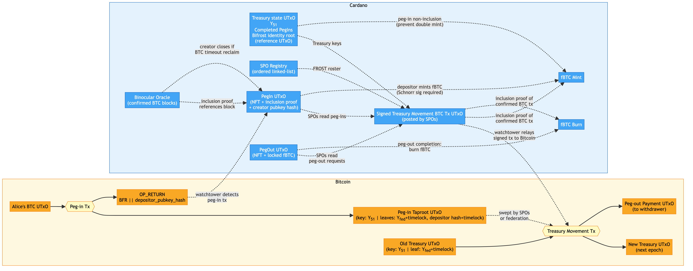

## Protocol UTxOs and script dependency graphs

This section maps every protocol UTxO – the datum it carries and the token that
authenticates it – and the two layers of dependency that tie the validators together:

1. **Build-time parameterization**: values baked into a script before hashing – one-shot
   outpoints and other scripts' hashes / policy ids. These fix the script's hash forever.
2. **Run-time wiring**: what a validator reads (reference inputs), requires to be present
   (withdraw-script delegation), or consumes (tokens, singleton spends) while validating.

The diagrams reflect the **implemented** validators in `onchain/validators/bitcoin/`. Where the
design-normative sections of this document extend them (the extended `ConfigDatum` layout in
§Config UTxO, the operational tunables in §Operational parameters), the delta is
noted in prose but not drawn.

### Singleton state UTxOs

Four NFT-authenticated singletons hold the global protocol state. Each is identified by a
one-shot NFT (see *Token inventory*); a reader trusts a datum only if the UTxO's value carries
the expected NFT.

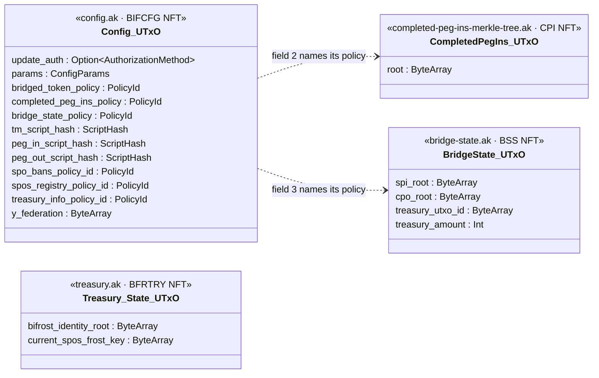
```mermaid
classDiagram
    direction LR

    class Config_UTxO {
        <<config.ak · BIFCFG NFT>>
        update_auth : Option~AuthorizationMethod~
        params : ConfigParams
        bridged_token_policy : PolicyId
        completed_peg_ins_policy : PolicyId
        bridge_state_policy : PolicyId
        tm_script_hash : ScriptHash
        peg_in_script_hash : ScriptHash
        peg_out_script_hash : ScriptHash
        spo_bans_policy_id : PolicyId
        spos_registry_policy_id : PolicyId
        treasury_info_policy_id : PolicyId
        y_federation : ByteArray
    }

    class Treasury_State_UTxO {
        <<treasury.ak · BFRTRY NFT>>
        bifrost_identity_root : ByteArray
        current_spos_frost_key : ByteArray
    }

    class CompletedPegIns_UTxO {
        <<completed-peg-ins-merkle-tree.ak · CPI NFT>>
        root : ByteArray
    }

    class BridgeState_UTxO {
        <<bridge-state.ak · BSS NFT>>
        spi_root : ByteArray
        cpo_root : ByteArray
        treasury_utxo_id : ByteArray
        treasury_amount : Int
    }

    Config_UTxO ..> CompletedPegIns_UTxO : field 2 names its policy
    Config_UTxO ..> BridgeState_UTxO : field 3 names its policy
```

* **Config UTxO** – the instance wiring, read by nearly every other script as a reference
  input. Created once by consuming the parameterized outpoint `(tx0, index0)`; spendable only
  through the `update_auth` authority (Update / Retire, see §Config UTxO governance). The datum layout —
  wiring plus the nested operational tunables — is specified in §Config UTxO.
* **Treasury state UTxO** – the SPO-side state: the active FROST group key and the MPF root of
  active Bifrost identity bindings (`bifrost_id_pk → pool_id`). The federation fallback key and
  CSV timeout are Config fields ([CFG-6]). The one-shot outpoint is a parameter of the Treasury
  NFT policy, making the mint one-shot per bridge; the asset name is the `"BFRTRY"` constant. Spending it requires a registry mint/burn in the same
  transaction, so it only ever changes together with a registration or deregistration.
* **Completed-peg-ins UTxO** – MPF root of completed peg-ins, keyed by `peg_in_utxo_id`. Spent
  and recreated on every fBTC mint (double-mint prevention).
* **Bridge state UTxO** – both attested roots (`spi_root`, `cpo_root`), the TM-chain **head**
  and the treasury amount. Both roots are **quorum-attested**: each Treasury Movement commits
  them in its BTMR1 `OP_RETURN` output, and *Confirm TM tx* copies them here (spend + recreate,
  no on-chain fold). *Complete peg-in*, *Complete peg-out* and *Cancel PegOut request* only
  reference this UTxO — nothing but Confirm spends it (see §Bridge state singleton).

The tunable **operational parameters** (§Operational parameters) are *not* a further singleton:
since 2026-07-17 they are Config datum fields, read by no on-chain validator.

### Linked-list UTxOs: SPO registry and ban list

Both lists use the `aiken_design_patterns` on-chain ordered linked list: a root element plus
one node per key, each element being a separate UTxO at the list's script address,
authenticated by a token of the list's own policy whose asset name is the element's key.

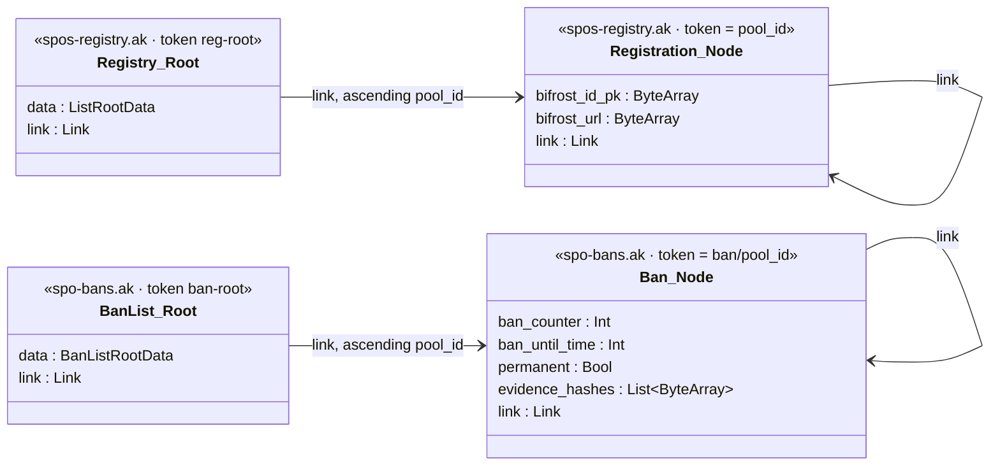
```mermaid
classDiagram
    direction LR

    class Registry_Root {
        <<spos-registry.ak · token reg-root>>
        data : ListRootData
        link : Link
    }
    class Registration_Node {
        <<spos-registry.ak · token = pool_id>>
        bifrost_id_pk : ByteArray
        bifrost_url : ByteArray
        link : Link
    }
    Registry_Root --> Registration_Node : link, ascending pool_id
    Registration_Node --> Registration_Node : link

    class BanList_Root {
        <<spo-bans.ak · token ban-root>>
        data : BanListRootData
        link : Link
    }
    class Ban_Node {
        <<spo-bans.ak · token = ban/pool_id>>
        ban_counter : Int
        ban_until_time : Int
        permanent : Bool
        evidence_hashes : List~ByteArray~
        link : Link
    }
    BanList_Root --> Ban_Node : link, ascending pool_id
    Ban_Node --> Ban_Node : link
```

* **Registry**: bootstrap mints the `reg-root` token by consuming the parameterized bootstrap
  outpoint. `Register` inserts a node (Ed25519 cold-key signature + Bifrost-identity signature)
  and, in the same transaction, spends the Treasury state UTxO to add the identity binding to
  `bifrost_identity_root` (with an MPF absence proof). `Deregister` is the mirror image.
  Spending any list element requires a mint/burn of the list's own policy, so all list surgery
  is validated by the mint handler.
* **Ban list**: bootstrap likewise consumes a parameterized outpoint. Minting a ban node or
  spending any element delegates to the `ApplyBan` withdraw handler, which consumes a
  `FaultProof` token from an allow-listed verifier policy and reads the accused pool's
  registration node as a reference input.

### Request and record UTxOs

These UTxOs are created per event rather than as singletons.

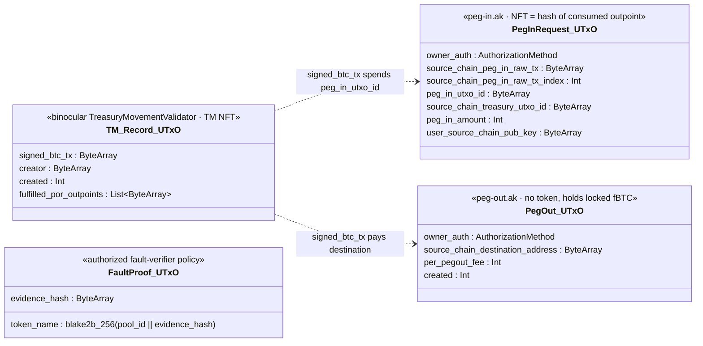
```mermaid
classDiagram
    direction LR

    class PegInRequest_UTxO {
        <<peg-in.ak · NFT = hash of consumed outpoint>>
        owner_auth : AuthorizationMethod
        source_chain_peg_in_raw_tx : ByteArray
        source_chain_peg_in_raw_tx_index : Int
        peg_in_utxo_id : ByteArray
        source_chain_treasury_utxo_id : ByteArray
        peg_in_amount : Int
        user_source_chain_pub_key : ByteArray
    }

    class PegOut_UTxO {
        <<peg-out.ak · no token, holds locked fBTC>>
        owner_auth : AuthorizationMethod
        source_chain_destination_address : ByteArray
        per_pegout_fee : Int
        created : Int
    }

    class TM_Record_UTxO {
        <<binocular TreasuryMovementValidator · TM NFT>>
        signed_btc_tx : ByteArray
        creator : ByteArray
        created : Int
        fulfilled_por_outpoints : List~ByteArray~
    }

    class FaultProof_UTxO {
        <<authorized fault-verifier policy>>
        token_name : blake2b_256(pool_id || evidence_hash)
        evidence_hash : ByteArray
    }

    TM_Record_UTxO ..> PegInRequest_UTxO : signed_btc_tx spends peg_in_utxo_id
    TM_Record_UTxO ..> PegOut_UTxO : signed_btc_tx pays destination
```

The TM record datum (rev 5.4) has a SINGLE constructor —
`UnconfirmedTm { signed_btc_tx, creator, created, fulfilled_por_outpoints }`. No `Confirmed`
variant exists: Confirm burns the TM NFT and produces no TM-address output (see *Confirm TM tx*).
Field notes:

- `creator` — the poster's payment key hash. It authorizes the post-grace **garbage collection**
  of a record whose Bitcoin transaction never mines (burn the TM NFT, reclaim min-ADA — see
  *Garbage collection (grace-period reclaim)*).
- `created` — POSIX ms, pinned by the TM mint policy to equal the posting tx's validity upper
  bound, so it is a guaranteed upper bound on real posting time (the GC grace period can start late
  but never early).
- `fulfilled_por_outpoints` — `List<ByteArray>`, the Cardano outpoints (`tx_hash(32) ‖ vout(4, LE)`,
  36 bytes each) of the PegOut requests this TM fulfills. This is a **data-availability hint, not a
  proof**: neither the mint nor the Confirm branch reads a byte of it — the FROST-signed BTMR1
  commitment inside `signed_btc_tx` is the sole integrity anchor for the completed-peg-outs trie. A
  hostile permissionless poster can garble or omit it; that only degrades trie **reconstruction**
  (cold start, recovery, a new SPO) from a direct outpoint lookup to a search-and-check against the
  committed root. The spent record's inline datum remains in Cardano history forever, which is
  where reconstruction reads it (see §Bridge state singleton).

`epoch` and `leader_reward` left the datum: the leader reward is DEFERRED (see *Cardano
submission and leader reward*). There is deliberately **no `tm_sequence` datum field**:
`tm_sequence` is an off-chain per-epoch signing-namespace counter (§Cardano submission and leader
reward); ordering comes from the TM chain itself — each TM spends its predecessor's output 0 on
Bitcoin.

* **PegInRequest** – created permissionlessly with a Binocular inclusion proof of the Bitcoin
  deposit; the mint consumes an arbitrary input whose outpoint hash becomes the NFT asset name
  (uniqueness). Spent on completion (fBTC mint) or closed via `owner_auth`.
* **PegOut request** – created without any script run: the withdrawer pays fBTC to the
  `peg-out.ak` address with the datum above. Spent on completion (fBTC burn) or cancel.
* **TM record** – the Treasury Movement relay UTxO. The canonical validator is binocular's
  Scalus `TreasuryMovementValidator`; its script hash is the TM NFT policy. Posted as
  `UnconfirmedTm` (raw signed Bitcoin transaction); binocular's `confirm-tmtx` spends it once
  oracle-proven, burning the TM NFT and advancing the bridge state singleton — the confirmer
  takes the record's min-ADA. A record whose Bitcoin transaction never mines is reclaimable by
  its `creator` 30 days after `created`: the GC spend burns the TM NFT and returns the min-ADA.
  See *Garbage collection (grace-period reclaim)*.
* **FaultProof** – evidence-bound fault record; the token is consumed when the ban list applies
  the ban.

### Build-time parameterization and one-shot UTxOs

Every arrow below is a compile-time parameter: the source value is baked into the target script
before hashing. Stadium-shaped nodes are one-shot UTxOs – outpoints that must be consumed by
the bootstrap mint, making each NFT unmintable a second time.

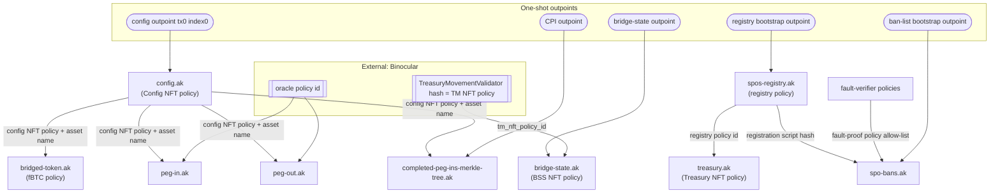
```mermaid
flowchart TD
    subgraph oneshot["One-shot outpoints"]
        cfg0([config outpoint tx0 index0])
        cpi0([CPI outpoint])
        bss0([bridge-state outpoint])
        reg0([registry bootstrap outpoint])
        ban0([ban-list bootstrap outpoint])
    end

    subgraph binocular["External: Binocular"]
        oracle[[oracle policy id]]
        tmv[[TreasuryMovementValidator hash = TM NFT policy]]
    end

    config["config.ak<br/>(Config NFT policy)"]
    fbtc["bridged-token.ak<br/>(fBTC policy)"]
    pegin["peg-in.ak"]
    pegout["peg-out.ak"]
    cpi["completed-peg-ins-merkle-tree.ak"]
    bss["bridge-state.ak<br/>(BSS NFT policy)"]
    reg["spos-registry.ak<br/>(registry policy)"]
    tinfo["treasury.ak<br/>(Treasury NFT policy)"]
    bans["spo-bans.ak"]
    fv["fault-verifier policies"]

    cfg0 --> config
    config -->|config NFT policy + asset name| fbtc
    config -->|config NFT policy + asset name| pegin
    config -->|config NFT policy + asset name| pegout
    config -->|config NFT policy + asset name| cpi
    cpi0 --> cpi
    bss0 --> bss
    tmv -->|tm_nft_policy_id| bss
    oracle --> pegin
    oracle --> pegout
    reg0 --> reg
    reg -->|registry policy id| tinfo
    reg -->|registration script hash| bans
    fv -->|fault-proof policy allow-list| bans
    ban0 --> bans
```

Notes:

* **Deployment order** follows the arrows: Binocular first, then `config.ak` (its hash depends
  only on its own outpoint), then everything parameterized by the config NFT policy; on the SPO
  side `spos-registry.ak` before `treasury.ak` and `spo-bans.ak`.
* **The config ↔ fBTC circularity is resolved at datum level.** `bridged-token.ak` is
  *parameterized* by the config NFT identity, while the Config *datum* field 0 names the fBTC
  policy. Parameterization fixes hashes in dependency order (config hash → fBTC hash); the
  datum is only data, written at mint time after both hashes are known. The same holds for
  every script-hash field in `ConfigDatum` – that is what lets the wiring reference scripts
  that are themselves parameterized by the config NFT.
* **Run-time one-shots.** Not every uniqueness anchor is a compile-time parameter: the Treasury
  NFT (asset name = hash of the outpoint consumed at mint), each PegInRequest NFT (asset name =
  hash of a consumed outpoint), and each FaultProof mint take their consumed outpoint from the
  redeemer instead. Same mechanism, chosen per mint rather than per script.
* `spo-bans.ak` is additionally parameterized by ban policy constants
  (`base_ban_duration_ms`, `max_faults_before_permanent`, `max_validity_window_ms`).
* The TM validator and the Binocular Oracle are not part of this repository's Aiken tree: they
  are Scalus contracts in binocular (`TreasuryMovementValidator.scala`, `BitcoinValidator.scala`),
  deployed independently; only their hashes enter the graph above.
* **No script is parameterized by the bridge state policy** ([PAR-1]): every reader takes
  `bridge_state_policy` from the config reference input at runtime. A compile-time parameter
  would defeat §Recovery: replacing the singleton, which turns on that Config field being a live
  swap point. `bridge-state.ak` itself takes the TM script hash — the reverse direction — so
  there is no parameterization cycle.

### Run-time dependency graph: peg side

Solid arrows are reference-input reads; thick arrows spend/recreate a singleton; dashed arrows
are withdraw-script delegation ("this script must run in the same transaction"). Hexagons are
withdraw handlers, cylinders are UTxOs.

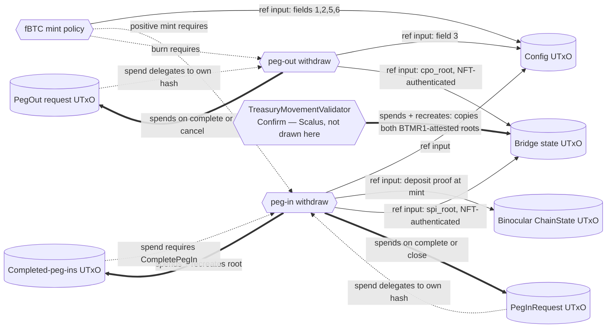
```mermaid
flowchart LR
    ConfigU[(Config UTxO)]
    OracleU[(Binocular ChainState UTxO)]
    BSSU[(Bridge state UTxO)]
    CPIU[(Completed-peg-ins UTxO)]
    PIR[(PegInRequest UTxO)]
    POR[(PegOut request UTxO)]

    fbtc{{fBTC mint policy}}
    piw{{peg-in withdraw}}
    pow{{peg-out withdraw}}
    tmv{{TreasuryMovementValidator<br/>Confirm — Scalus, not drawn here}}

    fbtc -->|ref input: fields 1,2,5,6| ConfigU
    fbtc -.->|positive mint requires| piw
    fbtc -.->|burn requires| pow

    piw -->|ref input| ConfigU
    piw -->|ref input: deposit proof at mint| OracleU
    piw -->|ref input: spi_root, NFT-authenticated| BSSU
    piw ==>|spends + recreates root| CPIU
    piw ==>|spends on complete or close| PIR

    pow -->|ref input: field 3| ConfigU
    pow -->|ref input: cpo_root, NFT-authenticated| BSSU
    pow ==>|spends on complete or cancel| POR
    tmv ==>|spends + recreates: copies both BTMR1-attested roots| BSSU

    PIR -.->|spend delegates to own hash| piw
    POR -.->|spend delegates to own hash| pow
    CPIU -.->|spend requires CompletePegIn| piw
```

Reading the graph: the fBTC policy is a pure presence delegator – it anchors itself via the
Config (`config[1] == own policy id`, the [CFG-1] constant asset name) and requires the peg-in
withdraw script for mints, the peg-out withdraw script for burns. The peg-in withdraw handler
references the bridge state singleton, proves membership of the deposit in the swept-peg-ins
trie ([CPI-9]), spends the request UTxO, and rolls the completed-peg-ins MPF root forward. The
peg-out withdraw handler is simpler: `CompletePegOut` and `Cancel` only **reference** the same
singleton (a value-bound membership or a non-membership proof against `cpo_root`, [CPO-13]) —
the singleton itself is written only by the TM Confirm transition (`tmv`, the Scalus
`TreasuryMovementValidator`, out of scope for this Aiken-only diagram; see *Confirm TM tx*),
which spends and recreates it by copying the roots the FROST quorum attested in that TM's BTMR1
commitment. `peg-in.ak`, `peg-out.ak` and the completed-peg-ins tree singleton are thin
forwarders: they only check that the authoritative withdraw script runs in the same transaction
(`completed-peg-ins-merkle-tree.ak` additionally pins the withdraw redeemer's action to the
completing variant); `bridge-state.ak` instead gates its own spend on the presence of a TM-NFT
input whose spend redeemer is `Confirm` ([BSS-1], [BSS-2]), not on a peg-out withdrawal.

### Run-time dependency graph: SPO and governance side

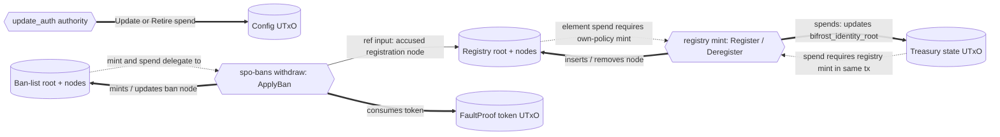
```mermaid
flowchart LR
    RegRoot[(Registry root + nodes)]
    TreasU[(Treasury state UTxO)]
    BanRoot[(Ban-list root + nodes)]
    FaultU[(FaultProof token UTxO)]
    ConfigU[(Config UTxO)]

    regmint{{registry mint: Register / Deregister}}
    banw{{spo-bans withdraw: ApplyBan}}
    auth{{update_auth authority}}

    regmint ==>|inserts / removes node| RegRoot
    regmint ==>|spends: updates bifrost_identity_root| TreasU
    RegRoot -.->|element spend requires own-policy mint| regmint
    TreasU -.->|spend requires registry mint in same tx| regmint

    banw ==>|consumes token| FaultU
    banw -->|ref input: accused registration node| RegRoot
    banw ==>|mints / updates ban node| BanRoot
    BanRoot -.->|mint and spend delegate to| banw

    auth ==>|Update or Retire spend| ConfigU
```

Registration and Treasury state form one atomic unit: a `Register`/`Deregister` mint must spend
the Treasury state UTxO and update its identity-binding root with an MPF proof, and conversely
the Treasury state UTxO can only be spent when a registry mint/burn is present. Ban application
is driven entirely by the `ApplyBan` withdraw handler: both the ban-node mint and any ban-list
element spend just check that it runs; it consumes exactly one `FaultProof` token from an
allow-listed verifier policy and derives the ban update (counter, duration, permanence) from
the accused pool's existing ban node, if any. The Config UTxO sits outside the day-to-day flow:
its only run-time dependency is on whatever authority `update_auth` names (a signature, script
presence, or token ownership via `authorizer.ak`), as detailed in §Config UTxO governance.

<!-- G2: new section — the Config UTxO was previously mentioned once and never specified. The
     wiring fields document the implemented config.ak ConfigDatum; the parameters section and the
     governance spend branch have since landed: the deployed config.ak has a real spend handler
     and carries the fee/schedule fields. -->
## Config UTxO

The **Config UTxO** is the spine of a bridge instance: a single NFT-authenticated UTxO at
`config.ak` whose datum records every cross-referenced script hash and token identity — the
instance's **wiring**. Every validator that needs another contract's identity reads this UTxO as
a **reference input** — each script is parameterized only by `(config_nft_policy_id,
config_nft_asset_name)` and locates everything else through the datum.

The Config UTxO is spent only through the `update_auth` governance path (§Config UTxO
governance); outside it the datum is stable. The tunables (next section), though they now live
in this datum, are read **off-chain at a snapshot slot** and by no on-chain validator.

> **Why stability is load-bearing.** A Cardano transaction referencing a UTxO is invalidated the
> moment that UTxO is spent, so each Config Update knocks out the in-flight Config-referencing
> transactions (completions, cancels, TM posts…) built against it — tolerable at governance
> cadence. That is precisely why the tunables are read off-chain, by no on-chain validator.

**The Config NFT.** Minted exactly once by `config.ak`'s one-shot mint branch, parameterized by
`(tx0, index0, config_asset_name)`: the mint transaction must consume the outpoint `(tx0,
index0)`, mint exactly one token named `config_asset_name`, and pay it to the `config.ak` script
address carrying the initial `ConfigDatum`. Because the config NFT policy id is baked into every
downstream script (including the fBTC policy), **the Config NFT is the identity of the bridge
instance**: a different Config UTxO implies a different fBTC policy — a new, non-fungible
instance.

**ConfigDatum (rev 5.4).** This table tracks the implemented `lib/bifrost/types/config.ak`
field-for-field; the constructor order is normative, because readers index it positionally.
Fifteen fields. `update_auth` comes first, because it is the field that governs every other one.
Fields #1–6 are instance *wiring* — token identities and script hashes. Fields #7–13 are
**federation identity**: the ban policy, its schedule, the SPO registry, and the Treasury state
NFT — discovery fields in the sense of *The Config as the discovery root*. Field #14 nests the
operational tunables: unlike the wiring they are expected to change, and **no Aiken validator
reads a current value from them**.

`params` is at index 1, and that is normative ([CFG-5]). Rev 5.4 put it last and told the reader
to append after it. That instruction invites the one edit that shifts every index: insert before
`params` to keep it last. At index 1 there is no "last" property left to preserve, so the append
rule needs no exception to protect.

Placement of a new field follows [CFG-6]: an identity or a key is a top-level field; a tunable
number lives inside `params`.

| # | Field | Type | Description |
|---|-------|------|-------------|
| 0 | `update_auth` | Option\<AuthorizationMethod\> | governance — the authority allowed to Update/Retire the Config; `None` = permanently frozen (see *Config UTxO governance*) |
| 1 | `params` | ConfigParams (nested record) | every value with no on-chain reader — see the table below |
| 2 | `bridged_token_policy` | PolicyId | fBTC policy id. The asset name is NOT a field — see [CFG-1] |
| 3 | `completed_peg_ins_policy` | PolicyId | completed-peg-ins trie singleton (NFT asset `"CPI"`) |
| 4 | `bridge_state_policy` | PolicyId | bridge state singleton (NFT asset `"BSS"`) — the live swap point of §Recovery: replacing the singleton |
| 5 | `tm_script_hash` | ByteArray (script hash) | the TM validator hash, which is also the TM NFT policy id — see [CFG-2] |
| 6 | `peg_in_script_hash` | ByteArray (script hash) | peg-in spend logic (withdraw-script pattern) |
| 7 | `peg_out_script_hash` | ByteArray (script hash) | peg-out spend logic (withdraw-script pattern) |
| 8 | `spo_bans_policy_id` | PolicyId | the DEPLOYED `spo-bans.ak` policy id; the ban script address follows from it |
| 9 | `spos_registry_policy_id` | PolicyId | the DEPLOYED `spos-registry.ak` policy id; the registry address follows from it. Read on-chain by `treasury.ak` — see [PRE-4] |
| 10 | `treasury_info_policy_id` | PolicyId | the DEPLOYED Treasury state NFT policy id — see [CFG-3] |
| 11 | `y_federation` | ByteArray (32 B x-only) | the federation fallback key, the script-leaf key of both Taproot trees. Read on-chain by `treasury.ak`'s Update-Y branch — see [UY-5] |

`ConfigParams`, at index 1:

| # | Field | Type | Description |
|---|-------|------|-------------|
| 0 | `schedule` | ScheduleParams (nested record) | the epoch/TM schedule — see §TM batches and the protocol schedule |
| 1 | `fee_rate_sat_per_vb` | Int | exact miner fee rate for deterministic TM construction |
| 2 | `per_pegout_fee` | Int | floor for the per-peg-out protocol fee, in satoshi |
| 3 | `min_peg_out_fbtc` | Int | minimum bridged-token amount a PegOut may lock, in satoshi |
| 4 | `base_ban_duration_ms` | Int | ban schedule — the base duration the ApplyBan builder computes a ban's end time from |
| 5 | `max_faults_before_permanent` | Int | ban schedule — fault count past which a ban stops expiring |
| 6 | `max_validity_window_ms` | Int | ban schedule — the bound on an ApplyBan transaction's validity interval |
| 7 | `federation_csv_blocks` | Int | the CSV timeout baked into the federation Taproot leaves |
| 8 | `pegin_refund_timeout_blocks` | Int | the CSV timeout of the peg-in tree's depositor refund leaf ([CFG-9]) |

- [CFG-1] The bridged-token asset name MUST be the constant `"fSAT"`, declared in
  `lib/bifrost/constants.ak`.
- [CFG-9] `pegin_refund_timeout_blocks` is PUBLISHED rather than configured per operator,
  because it is one of the four inputs to a peg-in deposit address and every SPO must
  reconstruct that address byte for byte. Left local, two SPOs on different values freeze
  different peg-in sets from the same PegInRequest, build different Treasury Movements and
  never reach a signing threshold — with nothing in any log naming the cause. It sits beside
  `federation_csv_blocks` because the two do the same job, and every deriver MUST check
  `pegin_refund_timeout_blocks > federation_csv_blocks` rather than assume it.
- [CFG-2] `tm_script_hash` has NO on-chain reader. It is published so that off-chain readers can
  locate the TM address without a hard-coded constant.
- [CFG-3] Fields #5, #8 and #10, and every field of `params`, have NO on-chain reader. They are
  published so that an SPO configures none of them by hand. *(Revised in rev 5.5: fields #9 and
  #11 gained on-chain readers and left this list.)*
- [CFG-4] *(New, rev 5.5)* `treasury_info_asset_name` is WITHDRAWN as a Config field. The
  Treasury state NFT asset name MUST be the constant `"BFRTRY"`, declared in
  `lib/bifrost/constants.ak`.
- [CFG-5] *(New, rev 5.5)* A new Config field MUST be appended at the tail. A field MUST NOT be
  inserted. `params` MUST stay at index 1.
- [CFG-6] *(New, rev 5.5)* An identity or a key MUST be a top-level field. A tunable number MUST
  live inside `params`.
- [CFG-7] *(New, rev 5.5)* The Config NFT asset name MUST be the constant `"BIFCFG"`, declared in
  `lib/bifrost/constants.ak`. No validator MAY take it as a compile parameter.
- [CFG-8] *(New, rev 5.5, from review)* `config.ak`'s `Retire` MUST verify that the transaction
  also burns exactly one Treasury state NFT, under the policy at Config #10. [TSY-19] already
  requires the Config NFT burn, so the two retirements are mutually required.

> **Why the two burns must be one transaction ([CFG-8]).** The Config NFT can be burned once.
> After that [TSY-19] can never be satisfied again — its check is on a supply that is now zero —
> and `RegistryUpdate` and `UpdateY` cannot read a Config UTxO that no longer exists. The
> Treasury state UTxO would be unspendable forever with its min-ADA inside. Requiring both burns
> together makes that ordering unreachable rather than merely undocumented. The cost is that an
> instance whose Treasury state NFT was never minted cannot Retire its Config; that is a
> bootstrap that never completed.

> **Why the Config NFT asset name is a constant ([CFG-7]).** Five validators took it as a
> parameter: `config.ak`, `peg-in.ak`, `peg-out.ak`, `bridged-token.ak` and
> `completed-peg-ins-merkle-tree.ak`. Rev 5.5 makes `treasury.ak` read the Config too, and a
> constant in one script beside a parameter in five has no safe failure mode. A deployment that
> passes any other name leaves `treasury.ak` searching for a token that does not exist, so every
> one of its branches fails — including `Retire`, whose Config-burn check names the same value —
> and the Treasury state UTxO can never be spent again. The name never separated two instances
> anyway: the Config policy id is `config.ak` hashed with its own one-shot outpoint.

> **Why `params` holds the unread values ([CFG-6]).** The split is mechanical, so no editor has
> to relitigate it. `y_federation` is a key and sits top level; `federation_csv_blocks` is a
> block count and sits in `params`, even though an off-chain reader deriving a Taproot address
> needs both. Promoting a field out of `params` later is a datum shape change, and therefore a
> new instance.

> **Why the federation identities are published and not derived ([CFG-3]).** Every value that
> locates a bridge's ban list or its SPO registry is an *input* to the policy id it identifies,
> not an output of it. No node can derive the address it would read them from. Worse, one wrong
> input yields a well-formed address holding nothing rather than an error. The eligible DKG
> roster is the registry minus active bans, so either half being wrong silently splits the roster
> with nothing in any node's log. Carrying the finished ids in the datum every reader already
> authenticates removes that class of misconfiguration.
>
> `treasury_info_policy_id` is published for discovery only. Rev 5.5 made it a pure function of
> the Config identity and a one-shot outpoint, so it is no longer derivable from the registry at
> all, and the pin that matters is a compile parameter of `spo_registry` ([REG-6]) rather than
> this field.

> **Why the asset name is a constant and not a field ([CFG-1]).** It never varies within an
> instance, and it never varies between instances either: one token is one satoshi, so the name
> is a property of the protocol rather than of a deployment. Rev 5.1 carried it as governance
> data, which meant every reader spent a Config read on a value that could not change, and gave
> governance the power to orphan circulating supply by editing a string. The trie and singleton
> asset names (`"CPI"`, `"BSS"`) are already constants for the same reason.

> **Why publish a hash nothing on-chain reads ([CFG-2]).** Peg-out payout discovery has to find
> `UnconfirmedTm` records, and reconstruction has to walk them, but no Config field let a reader
> derive the TM address. Every off-chain consumer therefore pinned it as a build-time constant.
> The frontend is the case that made this visible: it carried a hard-coded `TM_NFT_POLICY_ID`,
> and a redeployment silently invalidates it. Publishing it does NOT make the TM validator
> swappable: the bridge state singleton is compile-parameterized by the TM script hash, so
> changing field 4 alone would leave the singleton gated on the old validator. A TM change is a
> redeployment of both.

Rev 5.1's fields for the bridged-token asset name, the two `legit_TM` verifiers, the peg-in
close verifier, `min_stake`, the initial treasury outpoint (`initial_btc_treasury_utxo`) and the
leader reward are all GONE:

- The two `legit_TM` verifier fields were vestigial in rev 5.1; the deployed instance carried
  dummy hashes for them.
- The peg-in close verifier existed to delegate the two close proofs to a script that could ship
  later. The SPI trie removes that need: both close reasons are now MPF proofs inside
  `peg-in.ak` (see *Close PegInRequest*), so no verifier script is ever wired.
- `min_stake` had no on-chain reader; heimdall re-sources it from local configuration.
- The initial treasury outpoint is gone because [BSS-4]/the bootstrap take the anchor from the
  operator-supplied singleton datum, so no on-chain reader needs it.
- The leader reward is DEFERRED (see *Cardano submission and leader reward*).

> **Why the operational parameters are nested.** Rev 5.1 appended them as five top-level fields,
> which is what created the positional-append contract that then forbade removing anything. One
> nested record can be replaced wholesale by governance without renumbering its neighbours.

> **The Config datum can only ever GROW.** `config.ak`'s NFT policy is its own script hash, and
> its Update branch pins `config_output.address == own_input.output.address`, so the UTxO can
> never move. Changing `ConfigDatum`'s type therefore means a new `config.ak`, a new policy, a
> new NFT, and a full bridge redeploy, because every contract is parameterized by that NFT.
> Appending stays free forever: readers use positional access, and the Update branch never
> inspects the datum. Rev 5.4 was the last moment to remove or reorder anything, and the reason
> it did so.

**Reading the Config (how a value is retrieved).** The Config UTxO carries the config NFT and an
**inline datum**. The NFT is the authenticity mark: anyone can send a UTxO with an arbitrary datum
to the `config.ak` address, but exactly one UTxO in existence holds the NFT (one-shot mint) — a
reader trusts a datum only if the UTxO's value contains the NFT.

* **On-chain**: a transaction lists the Config UTxO as a **reference input** — read without being
  spent, so there is no contention and any number of transactions can read it in the same block.
  The consuming validator is parameterized by `(config_nft_policy_id, config_nft_asset_name)`; it
  locates the reference input whose value holds exactly that NFT (typically via an index passed in
  the redeemer) and decodes the inline datum **positionally** — a Plutus datum is a `Constr`, so
  field *n* in the table above is element *n*. Example: `peg-out.ak` reads field 1 (the bridged
  token policy, for burn amount bookkeeping) and field 3 (`bridge_state_policy`, to authenticate
  its singleton reference input — see *Complete peg-out*).
* **Off-chain**: query the ledger for the UTxO holding the asset `(config_nft_policy_id,
  config_nft_asset_name)` (any chain indexer resolves an NFT to its UTxO), read its inline datum,
  decode `ConfigDatum`. Since the Config is never spent, the read is stable forever.

> **Implementation status** (2026-08-11). The fifteen-field table, [CFG-1], [CFG-2] and [CFG-3]
> are implemented in `onchain/lib/bifrost/types/config.ak`, with every reader migrated
> (`config.ak`, `bridged-token.ak`, `completed-peg-ins-merkle-tree.ak`, `peg-in.ak`,
> `peg-out.ak`); per [CFG-2] and [CFG-3] the getters for fields 4 and 7–13 exist but no validator
> calls them. binocular's Scalus `ConfigDatum` and heimdall's `config_params.rs` decode the same
> fifteen fields by name. The datum is not closed: the discovery fields still missing per *The
> Config as the discovery root* would append after #14. `config.ak` carries a real `spend`
> handler: the Config is not immutable, it is governed — see *Config UTxO governance*.

<!-- G2 (revised 2026-07-15): the updatable values moved out of the Config into their own
     singleton after the interleaving analysis — (i) spending a referenced UTxO invalidates every
     in-flight referencing tx; (ii) an on-chain-read mutable fee races historical payments (the
     per_pegout_fee update could brick completion AND open a cancel double-pay). Fix: Config
     fully immutable; per_pegout_fee pinned per PegOutDatum; the four tunables below read by no
     on-chain validator. -->
## Operational parameters

The **operational parameters** are an instance's tunable protocol values. Their defining property:
**no on-chain validator ever reads a current value**. Every value is an off-chain consensus
anchor, a pinned-copy source, or a floor enforced by the deterministic skip rule.

**No separate singleton (decision, 2026-07-17).** The tunables are **Config data**, not a second
NFT-authenticated UTxO: with `update_auth` governance in place, a params singleton's update policy
coincided with the Config's, buying complexity without benefit. There is no params NFT and no
params wiring identity; an *Update operational parameters* is an authorized **Config Update** (see
the Transaction catalog). Since rev 5.4 the tunables are one **nested record**, Config field #14
`params`, so governance replaces them wholesale without renumbering their neighbours.

Two costs are accepted rather than hidden: parameter updates now **do** invalidate in-flight
transactions that reference the Config (tolerable at governance cadence, unlike a fee-market
cadence), and renouncing `update_auth` freezes the tunables along with the wiring. Both are the
documented **decoupling trigger**: should tunable cadence (stuck-TM fee bumping) or authority
(roster vs. root of trust) diverge from Config governance, the tunables move back to a separate
group-signed singleton — the previous revision of this section, unchanged in the git history.

**The tunables — the fields of Config #7 `params`:**

| params # | Field | Type | Description |
|---|-------|------|-------------|
| 0 | `fee_rate_sat_per_vb` | Int (sat/vB) | the **exact** Bitcoin miner fee rate for deterministic TM construction (`miner fee = vsize × rate`); read off-chain by every SPO's TM builder; the roster tracks the fee market by group-signing updates (see the signing-model note and *Stuck-TM recovery*) |
| 1 | `per_pegout_fee` | Int (satoshi) | the **floor** for the per-peg-out protocol fee. The *effective* fee of each peg-out is pinned in its own `PegOutDatum` at lock time; the TM builder skips any peg-out whose datum fee is below this floor at the batch snapshot slot |
| 2 | `min_peg_out_fbtc` | Int (satoshi) | minimum fBTC a PegOut request may lock (> `per_pegout_fee` + 330-sat dust); a client-side check at request creation and the TM builder's skip threshold |
| 3 | `schedule` (ScheduleParams) | Int (slots) | the epoch/TM schedule — deadlines, batch grid, recovery window (normative table in *TM batches and the protocol schedule*); **effect from the next epoch boundary**, never mid-epoch |

Two rev-5.1 tunables are no longer Config data:

- `min_stake` left the datum. It never had an on-chain reader; each SPO's candidate enumeration
  applies it off-chain, and heimdall sources it from its local configuration
  (`cardano.min_stake_lovelace`).
- `leader_reward` left the datum with the whole leader-reward flow: DEFERRED (see *Cardano
  submission and leader reward*).

> **Implementation status (TM builder skips for `per_pegout_fee` and `min_peg_out_fbtc`).**
> Neither skip is implemented. `heimdall`'s `build_tm` selection filter drops a peg-out for a
> non-standard destination, a duplicate POR id, a `created` outside the freshness window, an
> entry already in the completed-peg-outs trie, and a net amount below the 330-satoshi dust
> threshold. It does not compare the datum fee against `params.per_pegout_fee`, and it does not
> compare the locked amount against `params.min_peg_out_fbtc`.
>
> *Why not yet.* Both are consensus skip rules, so both operands MUST come from the Config UTxO
> read at the batch snapshot slot. heimdall now parses the full nested `params` record
> (`config_params.rs`), but its `TreasuryUtxo.per_pegout_fee` is still sourced from the node's
> local `heimdall.toml`. Filtering on a node-local value would make the TM bytes depend on
> per-node configuration, which is exactly what the determinism rule below forbids, and would
> break FROST signing on any config skew. Implementing these skips means switching the filter's
> operands to the snapshot-slot Config read.
>
> *Consequence until then.* A peg-out whose datum fee is under the floor, or whose locked amount is
> under `min_peg_out_fbtc`, is still paid. Both are enforced only client-side at request creation,
> so an attacker who writes a `PegOutDatum` directly can under-pay the protocol fee. It cannot
> steal: `peg-out.ak` binds the trie value to the datum's own fee, so the payment and the
> completion still agree.


**Update (governed).** The tunables change through an authorized **Config Update** (see the
Transaction catalog): the Config NFT returns to `config.ak` with the new datum, authorized by
`update_auth` (Config #0). Parameter *sanity* — `min_peg_out_fbtc > per_pegout_fee + 330`
(Bitcoin P2TR dust), non-negative values, and the schedule invariants of the constrained rows in
*TM batches and the protocol schedule* — is the governance authority's to enforce; it is no
longer a separate validator's on-chain check.

**Determinism rule (parameter reads).** Off-chain consumers — deterministic TM construction above
all — read the params state **as of the relevant TM batch's snapshot slot**, so every SPO uses
identical values even if an update lands mid-epoch: an update takes effect from the next batch,
never retroactively.

> **Why no on-chain validator reads a current tunable.** Two interleaving hazards force this.
> (i) A transaction referencing a UTxO dies when that UTxO is spent — which is why tunables are
> read off-chain at a snapshot slot rather than by validators at verification time. A Config
> Update does invalidate in-flight Config-referencing transactions; that is the cost accepted
> above, bounded by governance cadence. (ii) Worse, a *mutable value read at verification time about an event priced
> at construction time* is a race: had *Complete peg-out*'s membership proof compared a TM's
> historical BTC payment against the *current* `per_pegout_fee` instead of the request's own pinned
> value, a fee raise after payment would brick the completion (`paid ≠ amount − new_fee`) **and**
> satisfy Cancel's non-membership proof — letting the withdrawer collect the BTC *and* reclaim the
> fBTC. Pinning the fee in the `PegOutDatum` (what the completed-peg-outs trie entry and Complete's
> proof actually compare against) eliminates the class; the params copy is only the skip-rule
> floor.

> **Implementation status.** The tunables are deployed, nested as Config #7 `params`.
> `PegOutDatum` carries the pinned `per_pegout_fee` field (see *Create PegOut request*);
> *Complete peg-out*'s membership proof is value-bound against **this** per-request field, never
> against a current Config value.

<!-- G16: new section — the Treasury state UTxO previously had no datum spec, and the document
     named two objects ("Treasury state UTxO" / "Treasury Info UTxO") that were never reconciled;
     the latter is now the TM chain (G15). The implemented datum's deltas are in the
     implementation-status note (contract change request). -->
## Treasury state UTxO

The **Treasury state UTxO** is the NFT-authenticated singleton at `treasury.ak` holding the
bridge's SPO-side state: the active identity bindings and the treasury keys. It is deliberately
**cold** — only infrequent, SPO-driven transactions touch it (registration, revocation, key
rotation). Everything high-frequency lives elsewhere: the completed-peg-ins/-outs trees are their
own singletons (contention isolation — see §Components), and the treasury *pointer* is not state
at all (it is the bridge state singleton's head — see §Bridge state singleton).

**The Treasury state NFT.** Minted exactly once by the protocol bootstrap (K1). The one-shot
outpoint is a **validator parameter** of `treasury_info`, so it is baked into the policy id and
the token is mintable once by construction rather than by convention. The asset name is the
constant `"BFRTRY"` ([CFG-4]). The identity — the policy id — is a **validator parameter** of
`spo_registry` ([REG-6]), which is how a reader locates the UTxO. Each update spends and
re-produces the UTxO, carrying the NFT forward.

> **Why the one-shot outpoint moved into the policy id (rev 5.5).** Before it, the mint was
> one-shot *per outpoint*, not per bridge: anyone could consume an outpoint they owned and mint a
> distinct Treasury state NFT whose datum they chose. The tokens were never fungible — the asset
> name was `sha256(serialiseData(consumed_outpoint))`, and an outpoint is consumable once — so
> the defect was impersonation, not fungibility. Rival Treasury state UTxOs could exist, and only
> an asset-name pin told the real one apart. No validator applied that pin ([REG-6]).

**TreasuryDatum** (normative). [TSY-1]: exactly two fields, decoded as a type and read by name per
[LIB-1].

| # | Field | Type | Description |
|---|---|---|---|
| 0 | `bifrost_identity_root` | ByteArray (32 B MPF root) | active `bifrost_id_pk → pool_id` bindings — global uniqueness of Bifrost identities (see §SPO Registration 3.3) |
| 1 | `current_spos_frost_key` | ByteArray (32 B x-only) | the current treasury group key: $Y_{51}$ after the first successful DKG; **$Y_{federation}$ from K1 until then** — which is what makes Phase 1 operation and the governance continuum (Config updates, Update-Y) work unchanged |

Rev 5.5 removed three fields. `last_reset_tm_txid` was inert once its only writer, the
`FederationReset` branch, was withdrawn ([UY-7], [UY-8]). `y_federation` and
`federation_csv_blocks` were instance configuration rather than state — nothing here ever rotated
them — and they are Config fields now ([CFG-6]).

Address derivation therefore reads **two** UTxOs, not one: `current_spos_frost_key` from here, and
`y_federation` plus `federation_csv_blocks` from the Config UTxO (see *Taproot address
construction*).

**Field-permission matrix** — each spend branch must preserve every field it does not own:

| Transaction | May change | Must preserve |
|---|---|---|
| K1 bootstrap (one-shot mint) | creates both | — |
| Register SPO | `bifrost_identity_root` (insert) | #1 |
| Deregister / voluntary revoke | `bifrost_identity_root` (remove) | #1 |
| Update-Y (key rotation — see the Transaction catalog) | `current_spos_frost_key` | #0 |
| Update-Y, federation branch ([UY-5] revised — see *Update-Y*) | `current_spos_frost_key` (to ANY key, authorized by a BIP340 signature under the Config's `y_federation`) | #0 |
| Retire | burns the NFT; no continuing output | — |

Federation-key rotation is no longer a row here. `y_federation` and `federation_csv_blocks` live
in the Config datum, so an ordinary Config `Update` rotates them. That is the rotation this matrix
promised in rev 5.4 and no branch implemented.

* **[FED-4]** *(New, rev 5.5)* Before a federation-key rotation takes effect, the roster MUST
  sweep or refund every in-flight peg-in against the old addresses. The rule is unchanged; only
  its writer is.

**Reading the Treasury state.** As with the Config UTxO: on-chain readers take it as a reference
input and verify the NFT; off-chain readers resolve the NFT to its UTxO and decode the inline
datum. Registration and key-rotation transactions **spend** it (their updates must be atomic with
the state they change).

**`treasury_info` parameters.**

- **[PRE-1]** *(Revised, rev 5.5)* `treasury.ak` MUST NOT take `tm_nft_policy_id`. It MUST NOT
  take `registry_policy_id` either.
- **[PRE-2]** *(New, rev 5.5)* The deployer MAY seed any `bifrost_identity_root` at K1, including
  a non-empty one, so a replacement deployment can carry a registered roster forward. The rule
  pinning `mpf.root(mpf.empty)` at bootstrap is WITHDRAWN.
- **[PRE-3]** *(New, rev 5.5)* `treasury.ak` MUST take the Config NFT policy id as a parameter,
  together with its own one-shot outpoint.
- **[PRE-4]** *(New, rev 5.5)* `treasury.ak` MUST read `spos_registry_policy_id` from the Config
  datum, not from a parameter.

> **Why the registry policy is read and not baked in ([PRE-4]).** A `registry_policy_id`
> parameter makes the treasury policy a function of the registry policy. `spo_registry` can then
> never take `treasury_policy_id` as a parameter, because the dependency is a cycle — and that is
> precisely why the registry could not pin the UTxO it updates ([REG-6]). Reading the value from
> Config turns the cycle into a chain: Config identity → treasury → registry.

**Checks on `treasury.ak`** *(all new in rev 5.5)*.

- **[TSY-1]** `TreasuryDatum` MUST have exactly two fields, decoded as a type and read by name.
- **[TSY-2]** `treasury.ak` MUST locate the Config reference input by the redeemer's
  `config_ref_input_index`. It MUST NOT scan `reference_inputs` for the Config NFT.
- **[TSY-3]** The mint MUST verify that the transaction spends the parameterized one-shot outpoint.
- **[TSY-4]** The mint MUST verify that exactly one token is minted under its own policy, named
  `"BFRTRY"`.
- **[TSY-5]** The mint MUST verify that exactly one output sits at its own script credential, and
  that this output has no stake credential.
- **[TSY-6]** The mint MUST verify that this output holds the Treasury state NFT and no other
  non-ADA asset.
- **[TSY-7]** The mint MUST verify that this output's inline datum decodes as `TreasuryDatum`.
- **[TSY-8]** The mint MUST verify that both datum fields are 32 bytes long. It MUST NOT constrain
  their values ([PRE-2]).
- **[TSY-9]** The burn MUST verify that exactly one `"BFRTRY"` token is burned under its own policy.
- **[TSY-10]** The mint handler MUST NOT check authorization on the burn.
- **[TSY-11]** Every spend branch MUST verify that its own input holds exactly one Treasury state NFT.
- **[TSY-12]** `RegistryUpdate` and `UpdateY` MUST read the Config datum from a reference input
  authenticated by the parameterized Config NFT.
- **[TSY-13]** `RegistryUpdate` MUST verify that the summed mint quantity under
  `spos_registry_policy_id` is not zero.
- **[TSY-14]** `RegistryUpdate` and `UpdateY` MUST verify that exactly one output sits at the own
  script credential, and that its address and its whole value equal the spent input's.
- **[TSY-23]** *(New, rev 5.5, from review)* `RegistryUpdate` MUST verify that the transaction
  mints no token named `"reg-root"` under `spos_registry_policy_id`.
- **[TSY-24]** *(New, rev 5.5, from review)* `RegistryUpdate` MUST verify that the continuing
  `bifrost_identity_root` is 32 bytes.

> **Why [TSY-13] is not enough on its own.** `spos-registry.ak`'s `Bootstrap` branch mints the
> registration root and validates NO treasury transition — it never calls
> `treasury_state_transition_ok`. So a single transaction could bootstrap the registry, spend the
> Treasury state UTxO with `RegistryUpdate`, satisfy [TSY-13] on the bootstrap's own mint, and
> write any `bifrost_identity_root` at all. A `#""` root written that way bricks the instance
> permanently: `mpf.from_root` requires 32 bytes, so every later Register and Deregister aborts,
> and the only branch that could repair the root is the one now aborting. [TSY-23] excludes the
> bootstrap by asset name; [TSY-24] is defence in depth behind it.
- **[TSY-15]** `RegistryUpdate` MUST verify that `current_spos_frost_key` is unchanged.
- **[TSY-16]** `UpdateY` MUST verify that the new `current_spos_frost_key` is 32 bytes long.
- **[TSY-17]** `UpdateY` MUST verify that `bifrost_identity_root` is unchanged.
- **[TSY-18]** `UpdateY` MUST verify a BIP340 signature over the rotation message under the spent
  datum's `current_spos_frost_key`, or under the Config's `y_federation`.
- **[TSY-19]** `Retire` MUST verify that the transaction burns exactly one Config NFT.
- **[TSY-20]** `Retire` MUST verify that the transaction burns exactly one Treasury state NFT.
- **[TSY-21]** `Retire` MUST NOT require a continuing output.
- **[TSY-22]** `Retire` MUST NOT check any signature.

> **Why neither spend redeemer names the value it writes.** The continuing output's datum is the
> only source of truth for the new field, so a redeemer copy could only restate it. For
> `bifrost_identity_root` the redeemer never constrained anything: `spos-registry.ak` owns that
> value through the [REG-5] MPF proof. For `current_spos_frost_key`, reading it from the datum is
> safe because the rotation message commits to it — change the datum's key and the signature no
> longer verifies. Both fields were 32 bytes of witness paid for on every update, and one more
> pair of values that had to agree.

> **Why the Config burn alone authorizes `Retire` ([TSY-22]).** The Config NFT only ever sits at
> the `config.ak` address. Burning it requires spending the Config UTxO, which runs `config.ak`'s
> own `Retire` branch under `update_auth`. Governance authorization is therefore inherited, and
> restating it here would add a second thing to keep in sync. `config.ak`'s mint handler already
> makes this argument for its own burn.

> **Implementation status.** Rev 5.5 is implemented on-chain. `TreasuryDatum` is
> `{bifrost_identity_root, current_spos_frost_key}`; the mint takes no redeemer; `Retire` exists;
> `treasury_info` is parameterized by `(tx0, index0, config_policy_id)`; and `spo_registry` takes
> `treasury_policy_id` ([REG-6]). Rev 5.4 history: N10b removed the vestigial
> `current_treasury_address` / `current_treasury_utxo_id` pointers, N10a added the `UpdateY`
> branch and resolved the writable-yet-pinned contradiction, and [PRE-1] removed the
> `FederationReset` branch. The K1 bootstrap ran on preprod under the rev-5.4 shape (heimdall
> `bootstrap-treasury-info`); the rev-5.5 off-chain builders are NOT yet updated.

<!-- Rev 5.4 (2026-08-06): the bridge state singleton replaces the rev-5.1 CPO trie UTxO and the
     chain of Confirmed TM records. Folded in from
     docs/superpowers/specs/2026-08-06-bridge-state-singleton-design.md. -->
## Bridge state singleton

One singleton UTxO holds the bridge state that TM Confirm writes. Every Confirm spends the
singleton and recreates it. Nothing else may ever spend it. The NFT
`(Config bridge_state_policy, "BSS")` identifies the singleton; its validator is
`onchain/validators/bitcoin/bridge-state.ak`, compile-parameterized by the TM script hash and a
one-shot outpoint.

> **Why it exists (the two rev-5.1 defects).** Both share one mechanism. **Root rollback**: rev
> 5.1's Confirm copied the attested root unconditionally, and its mint anchors (the predecessor
> `Confirmed` record, the static Config anchor field) were never consumed — so anyone could
> re-post an old TM, re-confirm it, and write an old root back into the CPO singleton. Complete
> then failed for every peg-out paid since, and Cancel SUCCEEDED for a peg-out already paid in
> BTC: a double claim for one Cardano transaction. **A depositor stranded by GC**: Complete
> peg-in read a live `Confirmed` record, which its creator could burn after 30 days; a depositor
> who minted late lost the claim with the BTC already in the treasury. The singleton closes
> both: the head is CONSUMED at every Confirm (replay dies structurally), and the swept-peg-ins
> evidence lives in attested state that never expires.

- [PAR-1] Every reader MUST take `bridge_state_policy` from the config reference input at
  runtime. No script is parameterized by the bridge state policy (see the build-time
  parameterization notes).

### BridgeState, the singleton datum

```aiken
pub type BridgeState {
  //Swept peg-ins. Attested by the TM's commitment output, first root.
  spi_root: ByteArray,
  //Completed peg-outs. Attested by the TM's commitment output, second root.
  cpo_root: ByteArray,
  //The current treasury UTxO on Bitcoin: btc_txid ++ 00000000. The next TM
  //must spend it as its input 0, which [CTM-18] enforces.
  treasury_utxo_id: ByteArray,
  //Its satoshi amount.
  treasury_amount: Int,
}
```

| Index | Field | Bytes | Written at Confirm from |
|---|---|---|---|
| 0 | `spi_root` | 32 | the commitment output, first root |
| 1 | `cpo_root` | 32 | the commitment output, second root |
| 2 | `treasury_utxo_id` | 36 | `btc_txid ‖ 00000000` |
| 3 | `treasury_amount` | int | satoshi amount of the TM's output 0 |

The indices are serialization facts, because the datum is a Plutus `Constr` and field order is
consensus-visible. No validator uses them:

- [LIB-1] Every reader MUST decode the singleton datum as `BridgeState` and access its fields BY
  NAME.
- [LIB-2] No reader MAY use `utils.get_mpf_from_output` on the singleton. That helper stays for
  the CPI trie's one-field datum.
- [LIB-3] A new field MUST be appended, never inserted. **Appending is a
  REDEPLOYMENT of every on-chain reader**, not a compatible change: see the
  note below.

> **Why `BridgeState` cannot grow in place, unlike the Config datum.** The
> Aiken readers decode the singleton with `expect state: BridgeState`, which
> checks the constructor tag AND the exact arity. That is deliberate — it is
> what [LIB-1] asks for, and the typed decode is what makes `state.cpo_root`
> impossible to confuse with its neighbour. The cost is that a fifth field
> makes `peg-in.ak` and `peg-out.ak` trap from the first Confirm that writes
> it, and those validators cannot be replaced without abandoning their state.
>
> So the two datums evolve differently, and the difference is a deliberate
> trade rather than an inconsistency:
>
> * **`ConfigDatum` is append-compatible.** Its readers use positional
>   `safe_list_at` getters precisely so governance can append discovery fields
>   without redeploying anything. It is data the bridge is expected to grow.
> * **`BridgeState` is FIXED at four fields.** It is not governance data: it is
>   the state one validator writes and three read, every field is load-bearing,
>   and there is no anticipated fifth. Pinning it buys the strongest possible
>   read for the datum whose misreading causes the rollback this revision
>   exists to prevent.
>
> Adding a field to `BridgeState` therefore means a new `peg-in.ak`, a new
> `peg-out.ak`, a Config Update pointing at both, and §Recovery: replacing the
> singleton for the datum itself. Treat it as a protocol revision, and prefer a
> new singleton over a wider one.
>
> OFF-CHAIN readers are not bound by this. They read positionally with a
> minimum field count, so a longer datum decodes unchanged there — the strict
> arity is an on-chain property, not a wire rule.

> **Why named access.** Rev 5.1's helper reads field 0 blindly, with no tag check and no arity
> check. Against `BridgeState` a bare field-0 read returns `spi_root` where the caller wanted
> `cpo_root`. The failure is silent and asymmetric: a wrong root makes `mpf.has` fail
> harmlessly, but it makes `mpf.miss` SUCCEED, which cancels a paid PegOutRequest — the rollback
> outcome this revision exists to prevent, reachable through a one-line oversight. A typed
> decode removes the class rather than guarding it: `expect state: BridgeState = datum` checks
> the constructor and destructures, so `state.cpo_root` cannot silently become another field,
> and a future insert breaks the build instead of a validator.

> **A cross-language mirror, and why it is cheap.** `BridgeState` is written by the Scalus TM
> validator and read by three Aiken validators, so this revision retires the `TmDatum` mirror
> (`lib/bifrost/types/treasury-movement.ak`) and introduces this one. `TmDatum` had two
> variants, a grown arity, and a boolean pinned at Constr index 3; `BridgeState` is four flat
> primitives and one constructor, with a FIXED arity per [LIB-3]. The two definitions still MUST move in
> lockstep.

### The two deposit tries

**SPI trie**, swept peg-ins. Key = `peg_in_utxo_id`, 36 bytes. Value = the sweeping TM's
input-0 outpoint, 36 bytes. The quorum writes it and attests it in the TM. It proves a deposit
reached the treasury.

**CPI trie**, completed peg-ins. Key = `peg_in_utxo_id`. Value = the same. The depositor writes
it at completion. It prevents a second mint for one deposit.

The two answer different questions. "Was it swept" is about custody and only the quorum can
answer it. "Was it already minted" is about replay and only the completion itself can record it.
Neither substitutes for the other.

> **Why the value is the head outpoint, and not the sweeping TM's own txid.** The value MUST be
> known before the transaction is serialized. `spi_root` rides in that same transaction's
> commitment output, and a txid hashes every output. A value of `btc_txid` would therefore
> require `txid = H(… spi_root …)` and `spi_root = MPF(… value = txid …)` at once. That fixed
> point needs a hash preimage, so no TM could ever be built. The input-0 outpoint is fixed
> before the build, a Bitcoin outpoint is spent once, and it identifies the sweeping TM just as
> well. The CPO trie never had this problem: its values are `dest_spk ‖ amount`, and the builder
> knows both.

**Off-chain rules (swept peg-ins):**

- [SPI-1] heimdall MUST insert every input of a confirmed TM into the SPI trie, except input 0.
- [SPI-2] Every FROST participant MUST recompute `spi_root` from its own trie and the proposed
  TM's inputs before signing.
- [SPI-3] heimdall MUST give every entry a TM adds that TM's own input-0 outpoint as its value.
  One TM's entries therefore all share one value.
- [SPI-4] binocular MUST serve a swept peg-ins membership proof to any caller. heimdall MUST NOT
  be the proof server.
- [SPI-5] PARKED with [CPI-11] (leader reward — see *Cardano submission and leader reward*).
- [SPI-6] binocular MUST derive the swept set by walking the Bitcoin treasury chain BACKWARD
  from the singleton's `treasury_utxo_id`, following input-0 ancestry, and MUST refuse to serve
  anything if the resulting root does not equal the singleton's `spi_root`.
- [SPI-7] binocular MAY take each TM's raw bytes from either the spent `UnconfirmedTm` datums or
  a Bitcoin node, and MUST key them by the txid RECOMPUTED from the bytes rather than by any
  self-declared field.

> **Why [SPI-1].** Rev 5.1 left the treasury input in `swept_peg_in_utxo_ids`. It was inert only
> because `deposit_binding_ok` reads vout 1 and demands a `BFR` `OP_RETURN` there, which a TM
> never has. That is a property of the output layout, not a rule. Excluding input 0 removes the
> dependency on it.

> **Why [SPI-2].** The swept set is a pure function of the signed transaction, with no selection
> freedom. Any observer can recompute it from Bitcoin data alone, so the attestation is
> deterministically auditable.

> **Why [SPI-4] names the watchtower and not the SPO program.** A depositor cannot build a
> membership proof without the whole trie, and the frontend builds transactions client-side with
> no such capability. Watchtowers run Bitcoin nodes and SPOs deliberately do not, so a
> Bitcoin-derived reconstruction sits naturally in one and awkwardly in the other; binocular
> already keeps a trie mirror for the POR sweeper and owns the reconstruction path. heimdall
> builds the trie for a different purpose entirely — [SPI-2]'s recomputation before signing, a
> quorum-internal check — and making the SPO program a user-facing API would conflate the
> signing set with the service layer.

> **Why [SPI-6], and why serving proofs needs no trust.** The treasury is a linear spend chain:
> each TM spends the previous TM's output 0, and the commitment output identifies it as a
> protocol TM. Walking that chain and taking every input except input 0 yields the swept set.
> Bitcoin alone reports what was SWEPT, while `spi_root` only advances at Confirm on Cardano —
> a Bitcoin-only view is a superset whose extra entries would produce proofs that fail until
> their TM confirms. Walking BACKWARD from the head cuts that superset structurally: a TM mined
> but not yet confirmed SPENDS the head, so ancestry from the head can never reach it. The root
> cross-check is then an integrity check on the walk, not the boundary itself. The chain is a
> chain of outpoints, not of bytes, so [SPI-7] lets the bytes come from Cardano: the spent
> `UnconfirmedTm` datums are the permanent history source, and recomputing the txid from the
> bytes is what makes the source interchangeable — serving proofs needs no Bitcoin node. No
> trust is involved either way: every proof is verified on-chain against the attested root, so a
> wrong one simply fails `mpf.has`. Anyone may run this service.

### Root commitment output (BTMR1)

The commitment output's scriptPubKey is
`OP_RETURN OP_PUSHBYTES_69 ("BTMR1" ‖ spi_root ‖ cpo_root)`.

- Total 71 script bytes, of which 69 are payload. That is inside every datacarrier standardness
  limit.
- Prefix `6a4542544d5231`, 7 bytes.
- `spi_root` is script bytes [7, 39).
- `cpo_root` is script bytes [39, 71).

[CTM-26] requires exactly one such output in every TM. [BTC-1] extends the requirement to any
transaction that spends the treasury outpoint:

- [BTC-1] Every transaction that spends the treasury outpoint MUST carry a conforming commitment
  output.
- [BTC-2] Every transaction that spends the treasury outpoint MUST pay the new treasury at
  output 0.
- [BTC-3] The federation MUST build an emergency CSV sweep to satisfy [BTC-1] and [BTC-2].

> **The tag.** `"BTMR1"` means Bifrost TM Roots, version 1. It is deliberately not
> `"BFR"`-prefixed: watchtowers detect peg-in deposits by scanning for that prefix, and a TM
> pays the treasury address, so a `"BFR"` tag here could be misread as a deposit.
> `bitcoin.ak::get_op_return_xonly` rejects it twice over: it requires a 35-byte push (`0x23`)
> where this output has 69 (`0x45`), and `BTM` differs from `BFR` at the second byte.

> **Why [BTC-1].** A treasury sweep with no conforming commitment output can never be confirmed
> on Cardano, and the head then freezes.

> **Why [BTC-2], and why it fails worse than [BTC-1].** [CTM-19] writes the head as
> `btc_txid ‖ 00000000` and [CTM-21] reads output 0's satoshi amount. Both assume the treasury
> sits at output 0, and neither can check it: the TM validator sees the raw transaction but not
> the treasury's scriptPubKey. So a sweep that carries a valid commitment output while paying
> the treasury elsewhere does not fail closed — it CONFIRMS, and writes a head pointing at a
> peg-out payment plus an amount that belongs to the wrong output. The chain is then dead and
> the singleton records a lie, where a [BTC-1] violation merely freezes the head with the
> singleton still truthful. On-chain enforcement is not available cheaply: an equality check
> against a stored treasury scriptPubKey would reject the very TM that moves funds after an
> Update-Y key rotation. The real guard is the same one that protects root correctness: every
> honest SPO rebuilds the TM byte-for-byte before signing, so a transaction with the treasury at
> the wrong index fails quorum. [BTC-3] names the federation because a CSV sweep is the likely
> way a non-protocol tool spends the treasury, and it is the one path that does not go through
> that rebuild. §Recovery: replacing the singleton covers the case where these are violated
> anyway.

### Singleton validator

- [BSS-1] The singleton validator MUST verify that one input sits at the TM script address and
  carries the TM NFT.
- [BSS-2] The singleton validator MUST verify that input's redeemer is `Confirm`.
- [BSS-3] NEVER ISSUED. It would have added a governance `Reanchor` spend on the singleton. See
  §Recovery: replacing the singleton for why one recovery path is enough.
- [BSS-4] The bootstrap mint MUST spend `one_shot_input_ref`.
- [BSS-5] The bootstrap mint MUST mint exactly one token, asset name `"BSS"`, to the singleton's
  own script address.
- [BSS-6] The singleton validator MUST NOT gate its spend on a `Confirmed` output tag.
- [BSS-7] The singleton validator MUST NOT gate its spend on the TM NFT burn alone.

> **Why [BSS-6] and [BSS-7].** The rev-5.1 gate was a tag-0 TM input plus a tag-1 TM output. No
> tag-1 output is ever produced now, so that gate is unsatisfiable. Falling back to "the TM NFT
> is burned" is wrong, because the garbage collection of an `UnconfirmedTm` record also burns
> the NFT — a garbage-collection transaction could then spend the singleton and rewrite both
> roots. The redeemer is the only discriminator that separates the two.
> `completed-peg-ins-merkle-tree.ak` already reads another script's redeemer this way.

*Implementation status* (2026-08-07). [BSS-1], [BSS-2], [BSS-4] to [BSS-7] are implemented in
`onchain/validators/bitcoin/bridge-state.ak`; `BridgeState` is in
`onchain/lib/bifrost/types/bridge-state.ak`. `completed-peg-outs-merkle-tree.ak` is deleted, and
`completed_peg_outs_root_asset_name` is gone from `constants.ak`. [BSS-2] reads the redeemer tag
via `builtin.un_constr_data` against a named constant rather than importing a Scalus type mirror.
[BSS-5] pins the payment credential only (a staked singleton address is not a security
difference). [BSS-1] fails hard on two TM inputs (`expect [tm_input]`).

### Bootstrap and deployment

- [DEP-1] The singleton MUST exist, and `bridge_state_policy` MUST point at it, before the first
  post. [PTM-6] reads the head at mint time.
- [DEP-2] The operator MUST verify the anchor outpoint and its satoshi amount against Bitcoin
  before the bootstrap.

Bootstrap datum ([BSS-4] and [BSS-5] pin the one-shot and the NFT, not these values):

| Field | Value |
|---|---|
| `spi_root` | 32 zero bytes |
| `cpo_root` | 32 zero bytes |
| `treasury_utxo_id` | the anchor outpoint |
| `treasury_amount` | the anchor's satoshi amount |

Every field is operator-supplied. Observers verify the roots by reconstruction.

> **Why the bootstrap datum is not pinned.** The same mint path serves the first deployment and
> the §Recovery replacement. A first deployment wants zero roots and the deployment anchor; a
> replacement wants the current roots and the live tip. On-chain the two are indistinguishable,
> so pinning either shape would block the other. The datum is therefore operator-supplied and
> observer-verified: the honest roots are a deterministic function of chain history, so a wrong
> one is detectable, and being attested rather than folded it is overwritten by the next honest
> Confirm. `treasury_amount` is in the same position — nothing on Cardano knows the anchor's
> satoshi amount, and a wrong value is self-limiting, because the first TM built from it
> produces a transaction the quorum cannot make balance.

### Recovery: replacing the singleton

The head can only advance through Confirm, and [CTM-26] requires a conforming commitment
output. **If any Bitcoin transaction spends the treasury outpoint without a conforming
commitment output, the head freezes permanently.** No Confirm can fire, [PTM-6] then blocks
every future post, and neither root ever moves again. Three routes in: a quorum builder bug,
quorum theft, or a federation CSV sweep built with non-protocol tooling — the third is the
likely one, and [BTC-1] to [BTC-3] exist to prevent it. A [BTC-2] violation reaches the same
place by a worse road: it confirms rather than failing closed, so the operator MUST bootstrap
the successor from the true Bitcoin tip rather than from the dead singleton's fields.

The recovery is a Config Update swapping `bridge_state_policy` to a fresh singleton. No
dedicated repair spend exists.

1. Compile a new singleton against the same TM script hash with a different
   `one_shot_input_ref`. That gives a different policy id.
2. Bootstrap it with the current roots and the live tip as its head.
3. Config Update `bridge_state_policy`. The TM validator picks it up at the next Confirm.

The old singleton is abandoned in place. This also covers a case a repair spend could not: a
singleton that is unspendable, through a validator bug or a datum shape nothing can consume — a
spend-based repair is itself a spend, so it cannot fix that.

> **Why no `Reanchor` spend.** An earlier draft added one, bounded to the head and forbidden
> from touching the roots. The argument for bounding it was that a full replacement lets
> `update_auth` rewrite the paid and swept sets. `update_auth` can do that either way, because
> nothing stops it pointing the field at any singleton it likes. The bounded spend would have
> added a second authorization path without removing the first. One recovery mechanism, not two.

> **Why a doctored replacement does not survive.** The honest roots are a deterministic function
> of chain history, so any observer recomputes them: `spi_root` is the union of confirmed TM
> inputs minus each input 0 per [SPI-1], readable from the spent `UnconfirmedTm` datums, and
> `cpo_root` follows the attested chain of committed roots. [SPI-2] makes every FROST
> participant recompute before signing, so a divergence surfaces at the next signing round. The
> roots are attested rather than folded, so the next honest Confirm overwrites a doctored root
> automatically. Residual exposure is one TM cadence, during which fBTC could be minted against
> a fabricated entry — real, bounded, loud, and self-correcting. Treat a `bridge_state_policy`
> swap with the same scrutiny as replacing the instance.

### Trust model change (rev 5.4)

Rev 5.1 derived `swept_peg_in_utxo_ids` on-chain from oracle-proven bytes, so the sweep evidence
was verified rather than attested. Under rev 5.4 it is a quorum attestation: a quorum that
inserts an entry for a deposit it never swept mints unbacked fBTC. That sits inside the custody
envelope the quorum already holds, because it can move the BTC directly. The difference is
visibility: moving BTC is visible on Bitcoin, while a forged entry is visible only to an
observer reconstructing the trie. [SPI-1] and [SPI-2] are what keep the forgery detectable, so
they are normative rather than advisory.

**Operational note.** Every TM Confirm spends the singleton, which invalidates any in-flight
transaction referencing it — peg-out completion and peg-in completion alike.

### Trust model change (rev 5.5)

Rev 5.5 moved two values from places nothing on-chain could rewrite into the governed Config
datum. Both were found in review and are recorded here rather than fixed, because each is a
consequence of the placement decision rather than a defect in it.

* **The registry pin.** `treasury.ak`'s `RegistryUpdate` gate used to name `registry_policy_id` as
  a compile parameter, baked into the script hash. It now reads Config #9 at run time ([PRE-4]),
  and the same revision removed every constraint `treasury.ak` placed on the new identity root —
  [TSY-15] checks only that the FROST key is unchanged. So the root's whole protection is that
  `spos-registry.ak`'s [REG-5] MPF proof ran, which holds only while Config #9 names the real
  registry. An `update_auth` authority that repoints #9 at a policy it controls can satisfy
  [TSY-13] and write any root.
* **The federation key.** `y_federation` was `TreasuryDatum` field #2, written once at the
  bootstrap mint and carried forward by every spend branch, so no transaction could change it. It
  is Config #11 now, and `config.ak`'s `Update` constrains datum content not at all. One
  `update_auth` signature can therefore install an attacker's key at #11 and then rotate
  `current_spos_frost_key` with an [UY-5] Update-Y signed under it.

Neither widens the trust *boundary*: `update_auth` could already rewrite `bridged_token_policy`
and every script hash a reader resolves, so it could already halt or redirect the bridge. What
changed is the *path length* — both are now reachable with a single governance action, where
before they were unreachable on-chain at any price. Governance remains at the host chain's trust
floor, per §Trust model.

**Two related gaps are open, not closed.** `treasury.ak` never checks that the registry named in
Config #9 is the one compiled against its own policy id, so the pin is one-directional and a
mis-parameterized registry redeploy reopens [REG-6]'s hole. And `y_federation` is passed to
`verify_schnorr_signature` with no length or point-validity check, while an off-curve key makes
the builtin ERROR rather than return `False` — which `or` propagates, so a bad key at #11 or in
the spent datum can make the [UY-5] recovery branch unreachable. Both are tracked for the next
revision.

- [OPS-1] Both sweepers MUST treat a consumed reference input as a normal retry, not a fault.

<!-- G36: drafted from the implemented deployment (binocular deploy-bridge / deploy-script-refs);
     all originally-open placeholders resolved during the 2026-07 gap review. -->
## External inputs of a bridge instance

Everything the protocol enforces on-chain derives from values that enter the system from
outside. This section is the complete inventory of those inputs: what each is, who supplies it,
when it becomes fixed, where it is recorded, and whether it can change afterwards. An instance's
trust assumptions are exactly these rows — nothing else enters the system.

### Fixed at instance creation (deployer-supplied)

| Input | Supplied by | Recorded where | Change path |
|---|---|---|---|
| one-shot outpoint(s) | deployer wallet UTxOs, consumed at the bootstrap mints (config, CPI tree, bridge state, registry/ban roots) | policy ids and NFT names derive from them | never — they are the instance's identity |
| bridged-token asset name | the protocol — the constant `"fSAT"` ([CFG-1]) | `lib/bifrost/constants.ak` | never — one token is one satoshi, a protocol property, not a deployment's |
| governance authority (`update_auth`) | deployer | Config #0 | rotates itself: dev key → SPO governance script → optionally `None` (renounced) |
| `min_stake` | each SPO operator | heimdall local config (`cardano.min_stake_lovelace`) | operator-tunable |
| header-oracle identity (Binocular oracle NFT policy) | the oracle's own bootstrap | **validator parameter** of the peg validators | never — a different oracle is a different instance |
| Treasury state NFT identity | K1 bootstrap (the one-shot outpoint is a parameter of `treasury_info`; name = the `"BFRTRY"` constant) | **validator parameter** of `spo_registry` ([REG-6]) | never — a different treasury state is a different instance |
| Config NFT asset name | the protocol — the constant `"BIFCFG"` ([CFG-7]) | `lib/bifrost/constants.ak` | never — it never separated two instances; the one-shot outpoint does |
| genesis treasury outpoint + amount | deployer, **on Bitcoin**, funded and confirmed, then verified against Bitcoin before the singleton bootstrap ([DEP-2]) | the bridge state singleton's bootstrap datum (`treasury_utxo_id`, `treasury_amount`) | a fresh singleton bootstrap + Config Update of `bridge_state_policy` — §Recovery: replacing the singleton |
| Operational parameters (initial values) | deployer | Config #7 `params` | authorized Config Update (see §Operational parameters) |
| TM authorized-minter key (interim) | deployer | TM-control datum (`TMCTRL`) | interim only — retired by the permissionless TM-posting design (see *Post signed TM*) |
| authorized fault-verifier policies | deployer/governance | the three specialized policies — `fault-verifier-round1.ak`, `fault-verifier-round2.ak`, `fault-verifier-equivocation.ak` (see §9.2) | governance, per the allow-list in `spo-bans.ak` |

### Continuous inputs during operation

| Input | Enters via | Trust anchor |
|---|---|---|
| Bitcoin chain state (headers, tx inclusion) | the Binocular header oracle (`ChainState` reference input) | PoW verification in the oracle validator; watchtower liveness |
| Cardano stake distribution (registration gate, candidate set) | off-chain snapshot reads at protocol-defined slots | the Cardano ledger itself + the determinism rule (§Operational parameters) |
| Bitcoin fee market | roster-group-signed params updates (`fee_rate_sat_per_vb`) | 51% roster honesty; snapshot semantics |
| depositor authorizations | BIP-322 signatures over protocol messages | depositor key possession |
| governance actions | `update_auth`-authorized Config Update / Retire | the authority named in Config #0 (see *Config UTxO governance*) |

Both storage questions that were once open are settled: the genesis treasury outpoint and amount
live in the bridge state singleton's bootstrap datum, and the operational parameters are the
nested Config #7 `params` record rather than a separate singleton.
The values themselves and the moments they become fixed are normative as described above.

### Infrastructure assumptions

Both attested roots — `spi_root` and `cpo_root` (see §Bridge state singleton and *Confirm TM
tx*) — are **quorum attestations**: every FROST co-signer recomputes the expected roots from its
own tries before signing ([SPI-2]), so
root integrity rests on the SAME honest-majority assumption that already custodies the treasury.
That guard only holds if every SPO's recomputation reads self-hosted data. This section is
normative on the infrastructure an SPO MUST run to participate.

* Every SPO MUST run its own Cardano node. SPOs MUST NOT depend on a centralized query service
  (e.g. a hosted Blockfrost instance) for any consensus-relevant decision: TM construction,
  co-signer root verification, and completed-peg-outs trie reconstruction MUST read only
  self-hosted infrastructure.
* The baseline SPO stack is a Cardano node with **Dolos** in front of it (a Blockfrost-compatible
  current-state API plus transaction submission) and **Kupo** matching the bridge script
  addresses from the deployment slot, indexing spent AND unspent outputs with datum resolution.
  Kupo is the RECOMMENDED backend for the reconstruction path (below), and production SPOs SHOULD
  run it. **Kupo is OPTIONAL** (rev 5.2): reconstruction MUST also work through a plain
  Blockfrost-compatible API alone (address transaction history, per-transaction UTxOs, datum
  resolution). An implementation MUST select that path automatically when no Kupo endpoint is
  configured. That path exists for test environments, demos, and non-SPO tooling. It is heavier,
  because it walks the whole address history instead of querying it. The self-hosting requirement
  above still governs every production SPO consensus decision; it does not restrict what the code
  can read. Heimdall's provider client MUST stay within the endpoint subset this stack serves.
  Verify that subset against the deployed Dolos/Kupo versions before every upgrade.
* SPOs do NOT run Bitcoin nodes. Nothing in the peg-out termination flow needs a Bitcoin-side
  query: committed roots and the `fulfilled_por_outpoints` data-availability hint both live
  entirely in Cardano data (the TM's own bytes and its `Unconfirmed` datum). Bitcoin nodes remain
  a **watchtower** requirement only (deposit detection, TM relay) — see *Watchtowers*.
* Steady-state operation needs NO history queries at all — only current UTxOs plus transaction
  submission. The indexing requirement (Kupo) exists solely for reconstruction and recovery (cold
  start, a new SPO joining, disaster recovery).
* Non-SPO users — for example a withdrawer building a Cancel PegOut exclusion proof — MAY use any
  provider they choose. Every proof they submit is verified on-chain, so their data source needs
  no trust.
* **Genesis edge — CLOSED (rev 5.4).** The bridge state singleton's bootstrap datum carries both
  the anchor OUTPOINT and its satoshi AMOUNT, operator-supplied and verified against Bitcoin
  before the bootstrap ([DEP-2], [OB-7]). From bootstrap onward the singleton's
  `treasury_utxo_id` / `treasury_amount` are the current-state source, so no Bitcoin-side query
  exists in the SPO runtime at any point.

  > **Implementation status (Cardano-only treasury resolution).** heimdall reads the head
  > outpoint and amount from the singleton's `BridgeState`, and reconstructs the head's
  > scriptPubKey from the spent `UnconfirmedTm` record whose RECOMPUTED txid equals the head's
  > (the [SPI-7] discipline), falling back to configured keys only for the bootstrap anchor —
  > self-limiting, because a wrong key set yields a TM the quorum cannot sign. bitcoind is never
  > required by the SPO runtime; broadcasting over Bitcoin RPC is a DEV-ONLY flag, default off
  > (heimdall DEC-034/DEC-035).

### The Config as the discovery root

The config NFT pair (`policy id`, asset name) is meant to be the **single identity an off-chain
client needs**: holding it plus the CIP-57 blueprint, a client *derives* every contract identity
and *reads* all runtime wiring from the Config datum, so the bridge can change without redeploying
its clients. That is the normative direction — a component identity MUST be either derivable from
the config root (its contract parameterized by the config NFT pair) or Config-resident. An
identity that requires an out-of-band value breaks the property.

The deployed tree satisfies this only in part:

| Contract | Parameters | Config-rooted? |
|---|---|---|
| `bridged-token.ak` | config NFT pair | **yes** — the pair alone |
| `completed-peg-ins-merkle-tree.ak` | config NFT pair + one-shot outref | partly — the one-shot is out-of-band |
| `bridge-state.ak` | TM script hash + one-shot outref | partly — clients find it through Config field 3 at runtime ([PAR-1]), but the one-shot is out-of-band |
| `peg-in.ak` | oracle policy, config NFT pair, TM NFT policy | partly — oracle and TM policy are out-of-band |
| `peg-out.ak` | config NFT pair | **yes** — rev 5.1 dropped its oracle parameter; completion now proves against the completed-peg-outs trie |
| `treasury.ak` | registry policy, TM NFT policy | no |
| `spos-registry.ak` | bootstrap outref | no |
| `spo-bans.ak` | registry hash, fault policy ids, ban tunables, bootstrap outref | no |
| `fault-verifier-round1/round2/equivocation.ak` | registration script hash | no |

The SPO-side tree and `treasury.ak` are rooted in their own bootstrap outpoints and cross-script
hashes rather than in the Config, so a client must still be told those identities out of band.
Closing the gap by mirroring the enforced parameters into the Config datum was considered and
**dropped** (binocular `38f9e06`): those mirrors existed only to feed an Aiken TM validator's
config-only oracle read, which became moot once the canonical TM contract moved to Scalus. What
replaces them is not a bare mirror: an identity is appended to the datum so that a client can find
it, while enforcement stays where the rule above puts it. The next two subsections state that
requirement and list what is still missing.

**The config NFT policy id is the only value an operator is given (normative).** Everything else an
off-chain component needs MUST be reachable from it, and a value that is not reachable is a defect
in the datum rather than a field to add to that component's configuration file. The bootstrap needs
nothing further: the policy id is also the Config script's own hash, because the mint policy and the
spend script share it, which yields the Config address; the Config NFT is a one-shot, so exactly one
token exists under that policy for the instance's life, and the single UTxO at that address carrying
it is the Config. Its asset name is *read from that UTxO*, never configured. From there a component
reads the datum for the values it needs and derives the remaining script hashes from the blueprints.

Secrets and machine-local settings are out of scope of this rule: signing keys, wallet mnemonics,
node endpoints and their credentials, and polling intervals configure an *operator*, not a bridge.
**Reference-script locations are out of scope for the same reason** — a reference-script UTxO is a
reclaimable convenience, so its outpoint would go stale in the datum the moment someone reclaimed
it, and any transaction may instead embed the script and pay the size. Whether reference scripts
should become instance-level, which would change that answer, is owned by *Final optimizations*
[final-optimizations.md](final-optimizations.md).

<!-- contract-CR: the three discovery fields below are specified but not yet in config.ak. -->
**Not yet reachable (contract-CR).** Three identities an SPO program needs are absent from the
datum today and are still handed to operators out of band: the oracle policy id, the registry's
bootstrap outpoint, and the authorized fault-verifier policies. Each MUST become a
Config-resident discovery field.

Four of the original seven are now resident: the TM NFT policy is field 4 ([CFG-2]), and the ban
list, the SPO registry and the Treasury state NFT are fields 7, 11 and 12–13 ([CFG-3]).

For a trust anchor — the oracle policy, and the TM NFT policy already resident as field 4 — the
Config field is a **copy for discovery only**. Enforcement stays on the validator parameter, per
*Where each identity is fixed* in the creation flow, so the copy adds no governance power over
fund safety. It
is self-verifying rather than trusted: a client derives the reading validator's address from the
copied value plus the blueprint, then checks that the instance's UTxOs are actually at that
address. A copy that disagrees with the deployed instance is detected on first use.

Recording the registry and ban-list identities here also settles whether the SPO tree is
per-instance. The Config names the registry *this* bridge uses. Two instances may record the same
registry policy id and so share one roster and one ban list, or record different ones and keep them
separate. That becomes a deployment choice, and neither option needs a new mechanism.

### Instance lifecycle: retirement and redeploy

A bridge instance is **disposable by design**, and keeping it so is a normative constraint on
every future change. The recovery path for a trust-anchor failure — canonically, a Bitcoin reorg
deeper than the header oracle's maturation window, dropping transactions the oracle had reported
confirmed — is **instance replacement, not in-place repair**:

1. the `update_auth` authority **Retires** the Config. That single transaction burns the Config
   NFT **and** the Treasury state NFT — [CFG-8] and [TSY-19] require each other, so neither can
   be retired alone. Bridged-token mint and burn are permanently frozen afterwards (see *Config
   UTxO governance*);

   > **Why the two burns are one transaction.** Burning the Config NFT alone would strand the
   > Treasury state UTxO forever. [TSY-19] wants a Config-NFT burn that can never happen again
   > once supply is zero, and `RegistryUpdate` and `UpdateY` both need a Config UTxO that no
   > longer exists — so the state UTxO becomes unspendable with its min-ADA inside. Requiring
   > both burns together makes that ordering unreachable rather than merely undocumented.
   > Consequence to know: an instance whose Treasury state NFT was never minted cannot Retire
   > its Config. That is a bootstrap that never completed, and abandoning it costs one min-ADA.
2. a **successor instance** is bootstrapped against the post-reorg chain: fresh oracle state,
   fresh one-shots, fresh genesis treasury outpoint (the creation flow below);
3. the Bitcoin treasury funds move to the successor's treasury address by a group-signed (or,
   if the FROST group is unavailable, federation CSV-leaf) transaction.

To keep replacement possible and cheap, **every dependence on the oracle or on per-instance
identity MUST enter a validator as a parameter or live in the (governed) Config — never be
hard-coded in a script body**. The rows above already follow this rule; a change that breaks it
silently converts "retire and redeploy" into "funds require the federation escape hatch".

In-place repair is deliberately NOT offered for trust-anchor failures: a deep reorg can leave
bridged tokens circulating whose backing peg-ins no longer exist on Bitcoin, and no re-wiring of
a live instance can restore that invariant.

**No holder migration is specified for Bitcoin mainnet (decision, 2026-08-04).** The event that
destroys backing is a reorg deeper than the header oracle's maturation depth — 100 confirmations
by default, roughly 17 hours of Bitcoin. That is a testnet and regtest phenomenon; the deepest
mainnet reorg on record is 53 blocks, in 2010, from the value-overflow bug. Instance replacement
for this reason is therefore not expected on mainnet, and what an unbacked holder would be owed is
deliberately left unspecified rather than answered.

Retirement for any *other* reason — a contract defect, a compromised oracle owner key — is a
different case and not covered by that decision. There the Bitcoin treasury is intact, so the
successor is funded from it and holders are made whole; that is a deployment procedure rather than
a protocol rule, and it is out of scope here.

## Bridge instance creation flow

A **bridge instance** is the complete set of on-chain state that one bridged asset (e.g. fBTC for
Bitcoin) runs on. Creation is a one-time deployment; each state UTxO is authenticated by a
one-shot NFT minted here, and those NFTs identify the instance for its whole life. The deploying
operator performs:

1. **Deploy or locate the Binocular oracle instance.** The oracle policy id is the instance's
   source of Bitcoin truth — every inclusion proof in the protocol verifies against this oracle's
   confirmed-chain root (see [1]).
2. **Choose the one-shot UTxOs.** Pick distinct pure-ADA wallet UTxOs, one per one-shot mint below.
   Every state-NFT policy is parameterized by its one-shot outpoint, which makes each NFT unique
   and every script hash deterministically computable *before* anything is submitted.
   (Reference-script UTxOs must be excluded from this selection — spending one destroys a deployed
   reference script.)
3. **Compute the contract set.** From the validator blueprint, the oracle policy id, and the chosen
   one-shot outpoints, compute all cross-referenced script hashes: the fBTC (`bridged-token`)
   policy, `peg-in` / `peg-out` (+ their withdraw scripts), the completed-peg-ins trie policy,
   the bridge state policy, and the TM policy with its mint gate.
4. **Mint the Config NFT** (`config.ak`), creating the Config UTxO whose datum is the spine of the
   instance: it records every cross-referenced script hash and token identity per the fifteen-field
   table of §Config UTxO (`update_auth`, the fBTC policy, the completed-peg-ins trie policy, the
   bridge state policy, the TM script hash, and the peg-in/peg-out withdraw scripts). The same
   datum carries the initial **operational parameters** nested as field #14 `params` (fee rate,
   per-peg-out fee floor, minimum peg-out, schedule); see §Operational parameters.
   The wiring section must be final at mint time — **the Config NFT is the identity of the
   instance**: a different Config UTxO implies a different fBTC policy, i.e. a *new*,
   non-fungible bridge instance. See §Config UTxO for the datum layout (wiring vs parameters) and
   the governance update path.

**Where each identity is fixed (normative).** A validator cannot compute another contract's hash
while it runs, because it does not hold that contract's code. Every cross-contract identity must
therefore be supplied to it, and the steps above supply identities in three different homes. Which
home an identity gets is a security decision, not a matter of taste:

* An identity a validator relies on to decide **whether funds move** MUST be a **validator
  parameter**. It is applied at step 3, becomes part of the reading validator's own hash, and
  therefore cannot be changed for the life of the instance. The oracle policy id (step 1) and the
  TM NFT policy are the two cases: a different value is a different instance, by construction.
* An identity that only names **which script performs a delegated check** MAY live in the
  **Config datum**, written at step 4 and changeable afterwards by an authorized Update.
  `bridge_state_policy` (Config #3) is the live example: every reader takes it at run time
  ([PAR-1]), which is what makes §Recovery: replacing the singleton possible. `tm_script_hash`
  (Config #4) is how a Scalus contract's identity reaches off-chain readers without a hard-coded
  constant ([CFG-2]).
* A per-instance key or constant that **the reading validator itself owns** MAY live in **that
  validator's own datum**, written once at bootstrap and preserved by every later branch.
  `treasury.ak`'s `bifrost_identity_root` and `current_spos_frost_key` are these: each spend
  branch names the one field it owns and asserts the other is unchanged.

  > **Rev 5.5 moved `y_federation` and `federation_csv_blocks` OUT of this category**, into
  > Config #11 and `params[7]`. The paragraph below argued they were safe in `treasury.ak`'s
  > datum and would not be safe in the Config, and the trade it describes is real — see §Trust
  > model for what widened. They moved anyway, because nothing on-chain could ever *change* them
  > there: the field-permission matrix promised a federation-key rotation that no branch
  > implemented, so the "immutable" placement was immutability by omission rather than by design.
  > In the Config an ordinary Update rotates them deliberately.

The three differ in *who* can change the value. A parameter cannot be changed at all, because it is
part of the hash. A Config field holds whatever the `update_auth` authority last wrote, so putting a
trust anchor there would let governance repoint the bridge's source of Bitcoin truth on a live
instance. A validator's own datum field sits between them: immutability is enforced by the
validator's logic rather than by its hash, which is sound **only** because the validator that
enforces the preservation is the same one that relies on the value. That reasoning is why `y_federation` — the key that authorizes the Update-Y federation branch
([UY-5]) and that can sweep the treasury once the CSV elapses — was placed in the treasury datum
originally. Rev 5.5 accepts the trade and moves it to Config #11, so the `update_auth` authority
can now rewrite it; §Trust model records what that costs. It also keeps the value next to the group key it is
derived with, so a depositor reads one UTxO rather than two, and it lets one compiled `treasury.ak`
serve instances with different federation keys. None of the three may be hard-coded as a constant
in a script body: that makes the compiled artifact instance-specific, so one build could no longer serve
several bridged assets (Config #1), and it breaks the redeploy property recorded under *Instance
lifecycle: retirement and redeploy*.
5. **Mint the completed-peg-ins trie NFT** — its UTxO carries the MPF root, initialized to the
   empty root (32 zero bytes).
6. **Bootstrap the bridge state singleton** — mint the `"BSS"` NFT ([BSS-4], [BSS-5]) with the
   datum of §Bridge state singleton: both roots empty (32 zero bytes), the verified genesis
   treasury outpoint as the head, and its satoshi amount.

   <!-- G40 --><!-- rev 5.1: peg-out's produced verifier no longer needs its own registration — see
        the vestigial note in the catalog entry below. --> **6b — Register the withdraw-zero reward
   accounts.** `peg-in` and `peg-out`. Their hashes have been known since step 3, and peg-in and
   peg-out completion both authorize through the withdraw-zero pattern, which the ledger admits only
   from a registered reward account.
   These registrations **may be carried by the step-4 bootstrap transaction itself**, and are in the
   reference deployer: both hashes are config-derived and therefore fresh for every instance, so
   bundling them can never collide with an earlier deployment. See the catalog entry for the
   certificate, deposit, ordering and idempotency rules. **Historical**: rev 5.1's produced
   verifier required its own registration in earlier deployments. Since rev 5.1 no external
   verifier is invoked at all, and rev 5.4 removed the verifier fields from the Config, so no
   further registration exists (see *Register script reward accounts*).
7. **Bootstrap the SPO-side state** (see §SPO Bootstrap Flow): the Treasury state NFT + UTxO at
   `treasury.ak` (initial keys and an empty `bifrost_identity_root`), the registration-list root
   (`reg-root`), and the ban-list root (`ban-root`).
   The initial TreasuryDatum seeds `current_spos_frost_key` with $Y_{federation}$, so Phase-1
   address derivation, signing (federation as key-path signer), and governance work with no
   special cases (see §Treasury state UTxO and §Rollout Phases); the genesis treasury outpoint
   is created by the deployer before step 4 (see step 10).
8. **Deploy reference scripts (CIP-33)** for the large validators, so user transactions reference
   them instead of carrying the script bytes.
9. **Publish the instance parameters** — the Config NFT policy id + asset name and the fBTC
   policy id — to client software. Wallets, watchtowers, and SPO programs locate all other state
   UTxOs through the Config datum's cross-references.
10. **Open for use.** Registration opens immediately, and deposits are safe from the start:
    peg-in addresses derive from the K1 datum key — $Y_{federation}$ in Phase 1 (see §Rollout
    Phases), with no special cases. The **genesis treasury outpoint** was created by the deployer
    *before* step 4: derive the Phase-1 treasury address (ordinary derivation, internal key = the
    K1 datum key), fund it on Bitcoin with a minimal anchor amount, wait for confirmation, verify
    the outpoint and its satoshi amount against Bitcoin ([DEP-2]), then record both in the bridge
    state singleton's bootstrap datum (§Bridge state singleton). [DEP-1]: the singleton MUST
    exist, and Config field 3 MUST point at it, before the first post — [PTM-6] reads the head at
    mint time. The first TM spends the anchor as Input 0 (see *Post signed TM*).

## User peg-in flow

This section uses Bitcoin as the example.
A user who moves BTC from Bitcoin to Cardano is called a depositor.
These are the steps to execute a correct peg-in:

* Check the status of Bifrost. The peg-in can proceed if the bridge is operational and the current Cardano epoch is not near its end.
* Retrieve the current Treasury key $Y_{51}$ from `treasury.ak` on Cardano (published there after each DKG).
* On Bitcoin, send the BTC to peg-in to a Taproot address derived from $Y_{51}$, the federation fallback script, and the depositor refund leaf (see **Taproot address construction** below). The address has three spending paths: the $Y_{51}$ key path (SPO sweep — main line), a $Y_{federation}$ script leaf (federation emergency sweep after timeout), and the depositor refund leaf (reclaim after ~30 days). The transaction MUST include an OP_RETURN **beacon**: `"BFR" ‖ Q_auth (32 B)` (35 bytes). `Q_auth` is the depositor's Taproot **output** key, and it serves both roles: SPOs reconstruct the refund leaf and the key-path sweep tweak from it, and it is the key that signs the BIP-322 completion. A different wallet's key MAY be named, but that wallet then owns **both** the completion and the refund — authorization is no longer decoupled from funding.
* Wait for watchtowers to detect the Bitcoin transaction, post the corresponding Bitcoin block to the Binocular Oracle, and create a PegInRequest UTxO on Cardano (peg-in.ak) by minting a PegInRequest NFT and providing a transaction inclusion proof.
* Wait for the peg-in to be included in the Treasury Movement transaction at the next epoch boundary. In the normal 51% mode, SPOs sign this transaction with FROST and post it to Cardano (`TreasuryMovementValidator`); in the emergency mode, the federation satisfies the $Y_{federation}$ fallback script path instead. Watchtowers then relay the signed transaction to Bitcoin.
* Once the Treasury Movement transaction is confirmed on Bitcoin (its Confirm advanced the bridge state singleton), the depositor completes the peg-in on Cardano. The depositor spends the PegInRequest UTxO, references the bridge state singleton, and provides a membership proof that the swept-peg-ins trie records the deposit ([CPI-9]), a non-membership proof against the completed-peg-ins trie, and a **BIP-322** signature under the beacon's `Q_auth`. The validator also parses the raw peg-in transaction from the PegInRequest datum to check the deposit data (the only point where the peg-in transaction is parsed on-chain). This mints the correct amount of fBTC to the Cardano address the depositor chooses and inserts the peg-in into the completed-peg-ins trie. Full checks: *Complete peg-in* ([CPI-3]…[CPI-10]).
* If the peg-in was not included in the Treasury Movement transaction (e.g., it arrived too late in the epoch), it rolls over to the next epoch. If the Treasury key has rotated and the peg-in can no longer be swept, the depositor reclaims their BTC via the depositor refund leaf (~30 days) and can retry with the new Treasury address.
* **PegInRequest closure**: the creator can close a PegInRequest UTxO (burn the NFT, reclaim the min_utxo ADA) under two conditions, both proven by MPF proofs — no Bitcoin parsing, and no verifier script:
  * **Never swept**: a **non-membership proof** shows the deposit is absent from the bridge state singleton's swept-peg-ins trie, and the 30-day grace period since the request's `created` has passed. A deposit that was never taken into the treasury can never owe fBTC — including one the depositor reclaimed through the Taproot refund leaf. Closure therefore cannot grief a depositor whose funds were legitimately swept.
  * **Duplicate PegInRequest**: a **trie membership proof** shows the peg-in is already in the completed-peg-ins trie. fBTC was already minted via another PegInRequest for the same deposit, so this one is redundant. No timeout applies.

  Full checks: *Close PegInRequest* ([CLR-5]…[CLR-11]).

### End-to-end peg-in sequence

The diagram below shows the full peg-in lifecycle across the depositor, the Bitcoin network, the watchtower program, the Cardano contracts, and the SPO program. Each numbered phase corresponds to a step in the flow above; the per-transaction details are specified in the **Transaction catalog**.

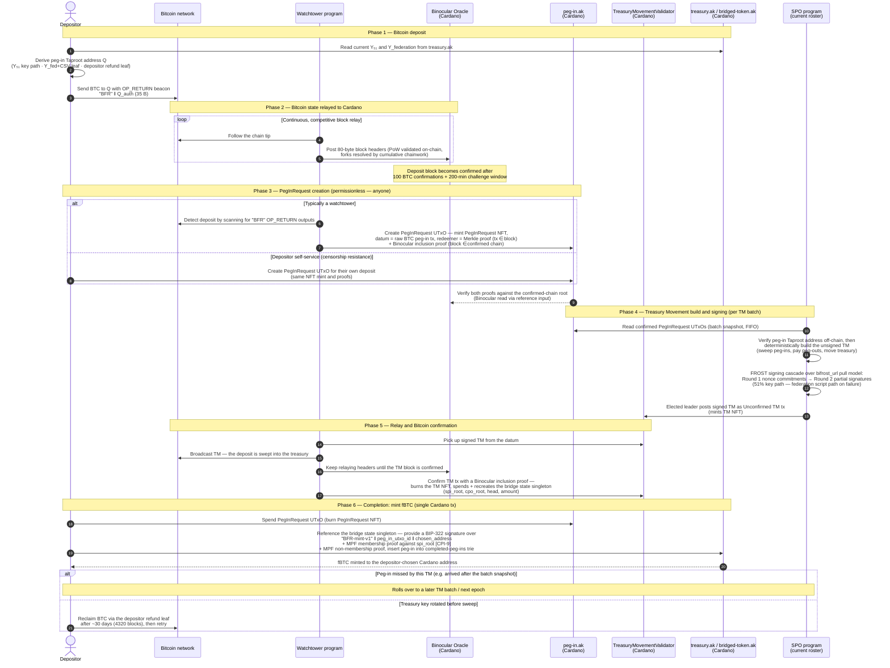
```mermaid
sequenceDiagram
    autonumber
    actor Dep as Depositor
    participant BTC as Bitcoin network
    participant WT as Watchtower program
    participant Bin as Binocular Oracle<br/>(Cardano)
    participant PIN as peg-in.ak<br/>(Cardano)
    participant TMC as TreasuryMovementValidator<br/>(Cardano)
    participant TRE as treasury.ak / bridged-token.ak<br/>(Cardano)
    participant SPO as SPO program<br/>(current roster)

    Note over Dep,TRE: Phase 1 — Bitcoin deposit
    Dep->>TRE: Read current Y₅₁ and Y_federation from treasury.ak
    Dep->>Dep: Derive peg-in Taproot address Q<br/>(Y₅₁ key path · Y_fed+CSV leaf · depositor refund leaf)
    Dep->>BTC: Send BTC to Q with OP_RETURN beacon<br/>"BFR" ‖ Q_auth (35 B)

    Note over BTC,Bin: Phase 2 — Bitcoin state relayed to Cardano
    loop Continuous, competitive block relay
        WT->>BTC: Follow the chain tip
        WT->>Bin: Post 80-byte block headers (PoW validated on-chain,<br/>forks resolved by cumulative chainwork)
    end
    Note over Bin: Deposit block becomes confirmed after<br/>100 BTC confirmations + 200-min challenge window

    Note over Dep,PIN: Phase 3 — PegInRequest creation (permissionless — anyone)
    alt Typically a watchtower
        WT->>BTC: Detect deposit by scanning for "BFR" OP_RETURN outputs
        WT->>PIN: Create PegInRequest UTxO — mint PegInRequest NFT,<br/>datum = raw BTC peg-in tx, redeemer = Merkle proof (tx ∈ block)<br/>+ Binocular inclusion proof (block ∈ confirmed chain)
    else Depositor self-service (censorship resistance)
        Dep->>PIN: Create PegInRequest UTxO for their own deposit<br/>(same NFT mint and proofs)
    end
    PIN-->>Bin: Verify both proofs against the confirmed-chain root<br/>(Binocular read via reference input)

    Note over PIN,SPO: Phase 4 — Treasury Movement build and signing (per TM batch)
    SPO->>PIN: Read confirmed PegInRequest UTxOs (batch snapshot, FIFO)
    SPO->>SPO: Verify peg-in Taproot address off-chain, then<br/>deterministically build the unsigned TM<br/>(sweep peg-ins, pay peg-outs, move treasury)
    SPO->>SPO: FROST signing cascade over bifrost_url pull model:<br/>Round 1 nonce commitments → Round 2 partial signatures<br/>(51% key path — federation script path on failure)
    SPO->>TMC: Elected leader posts signed TM as Unconfirmed TM tx<br/>(mints TM NFT)

    Note over BTC,TMC: Phase 5 — Relay and Bitcoin confirmation
    WT->>TMC: Pick up signed TM from the datum
    WT->>BTC: Broadcast TM — the deposit is swept into the treasury
    WT->>Bin: Keep relaying headers until the TM block is confirmed
    WT->>TMC: Confirm TM tx with a Binocular inclusion proof —<br/>burns the TM NFT, spends + recreates the bridge state singleton<br/>(spi_root, cpo_root, head, amount)

    Note over Dep,TRE: Phase 6 — Completion: mint fBTC (single Cardano tx)
    Dep->>PIN: Spend PegInRequest UTxO (burn PegInRequest NFT)
    Dep->>TRE: Reference the bridge state singleton — provide a BIP-322 signature over<br/>"BFR-mint-v1" ‖ peg_in_utxo_id ‖ chosen_address<br/>+ MPF membership proof against spi_root [CPI-9]<br/>+ MPF non-membership proof, insert peg-in into completed-peg-ins trie
    TRE-->>Dep: fBTC minted to the depositor-chosen Cardano address

    alt Peg-in missed by this TM (e.g. arrived after the batch snapshot)
        Note over Dep,SPO: Rolls over to a later TM batch / next epoch
    else Treasury key rotated before sweep
        Dep->>BTC: Reclaim BTC via the depositor refund leaf<br/>after ~30 days (4320 blocks), then retry
    end
```

### Taproot address construction

The Treasury address and peg-in addresses use different Taproot trees following BIP341 [4]. Both use $Y_{51}$ as the key-path internal key, making the 51% FROST threshold the main-line operating mode. The federation appears as a timelock-gated fallback script leaf in both trees.

#### Keys

- $Y_{51}$ is the FROST group public key produced by DKG with a threshold ensuring any signing subset controls more than 51% of delegated stake. It is stored in `treasury.ak`.
- $Y_{federation}$ is a known protocol parameter — a public key controlled by a federation of trusted entities, used only as a last-resort spending path (interface, charter, and CSV analysis: see §Federation).

#### Treasury Taproot tree

The Treasury address (holding consolidated funds) uses $Y_{51}$ as the key-path internal key, with a single emergency fallback script leaf:

| Path        | Key              | Condition     | Use case                              |
| ----------- | ---------------- | ------------- | ------------------------------------- |
| Key path    | $Y_{51}$         | Immediate     | Normal operation (main line): full TM |
| Script leaf | $Y_{federation}$ | After timeout | Emergency fallback: full TM           |

Script leaf (federation rescue):
```
<federation_csv_blocks> OP_CHECKSEQUENCEVERIFY OP_DROP <Y_federation> OP_CHECKSIG
```

Merkle tree (single leaf):
```
     root
       |
  Y_federation
```

Treasury output key: `Q_treasury = lift_x(Y_51) + tagged_hash("TapTweak", Y_51 || merkle_root) · G`

This address changes each epoch after DKG, since $Y_{51}$ is regenerated.

SPOs spend the treasury via the $Y_{51}$ key path — a single 64-byte Schnorr signature with no script reveal, the cheapest spending path. In emergency (federation), the $Y_{federation}$ script path with timelock is used.

#### Peg-in Taproot tree

The peg-in address uses $Y_{51}$ as the key-path internal key (for SPO sweep — main line), with a federation emergency sweep leaf and a depositor refund leaf:

| Path          | Key              | Condition                    | Use case                   |
| ------------- | ---------------- | ---------------------------- | -------------------------- |
| Key path | $Y_{51}$ | Immediate | SPO sweep (main line) |
| Script leaf 1 | $Y_{federation}$ | After timeout | Federation emergency sweep |
| Script leaf 2 | Depositor | After ~30 days (4320 blocks) | Depositor self-refund |

Script leaf 1 (federation emergency sweep):
```
<federation_csv_blocks> OP_CHECKSEQUENCEVERIFY OP_DROP <Y_federation> OP_CHECKSIG
```

Script leaf 2 (depositor refund — same shape as the federation leaf):
```
<refund_timeout> OP_CHECKSEQUENCEVERIFY OP_DROP <Q_auth> OP_CHECKSIG
```
The leaf commits the depositor's Taproot **output** key, the same key the beacon carries.
A wallet therefore spends this leaf with its **default** signer, that key being the one it
signs with; no untweaked-signing interface is required.

`Q_auth` is the depositor's 32-byte Taproot output key, taken from the beacon. `refund_timeout` is `params.pegin_refund_timeout_blocks`, PUBLISHED in the Config UTxO ([CFG-9]) — constraint: `> federation_csv_blocks`, so the federation can sweep before the refund opens; example 4320 blocks ≈ 30 days.

Merkle tree (2 leaves):
```
      root
     /    \
  Y_fed   depositor_refund
```

The peg-in output key $Q$ is:

`Q = lift_x(Y_51) + tagged_hash("TapTweak", Y_51 || merkle_root) · G`

Where:

- $Y_{51}$ is the internal key (51% FROST group x-only public key, from `treasury.ak`).
- `lift_x(·)` is the BIP340 lift, yielding the **even-Y** point with the given x-coordinate. See *Parity normalization* below — it is consensus-critical on the signing side.
- The script tree contains two leaves (federation sweep and depositor refund), so merkle_root is the hash of both leaf hashes.
- `leaf_hash = tagged_hash("TapLeaf", 0xc0 || compact_size(script_len) || script)`
- `tagged_hash(tag, msg) = SHA256(SHA256(tag) || SHA256(tag) || msg)`
- $G$ is the secp256k1 generator point.

The resulting Bitcoin address is `bc1p<bech32m(Q)>`.

**To reconstruct $Q$**, all components are available: $Y_{51}$ and $Y_{federation}$ from `treasury.ak`, and the depositor's output key `Q_auth` from the beacon (propagated via the PegInRequest datum). Both scripts are fully determined by these parameters — no secret information is needed.

#### Parity normalization (BIP340/341)

<!-- G38: parity handling was unspecified. Reconstructing an x-only internal key is lift_x, which
     is even-Y by definition, so both the group secret and the tweaked secret may need negating.
     A literal reading of the tweak formulas without these rules is invalid for ~75% of keys. -->

$Y_{51}$ and $Y_{federation}$ are stored **x-only** (32 bytes — see *Treasury state UTxO*), so every reconstruction of the internal key is `lift_x(Y_51)`, which is an **even-Y** point by definition. Two normalizations follow. Both are **consensus-critical**: every signer must apply them identically, or the FROST shares do not aggregate to a valid signature.

1. **Internal-key parity.** Let `P = lift_x(Y_51)`. The DKG group point `Y` satisfies `x(Y) = Y_51`, but its Y-coordinate may be odd — in which case `Y = -P`. The group secret is then normalized `y_51' = n - y_51`, so that `y_51' · G = P`; otherwise `y_51' = y_51`. Applied to a FROST key package, this is a negation of the shares.
2. **Output-key parity.** With `t = tagged_hash("TapTweak", Y_51 || merkle_root)` and `d = y_51' + t (mod n)`, the output key is `Q = P + t·G`. BIP340 signing under `d` requires `d` negated when `y(Q)` is odd — BIP340 *Default Signing* [3], applied to the aggregate.

`n` is the secp256k1 group order. Both rules apply identically to $Q_{treasury}$, to every peg-in input, and to the federation key path where used. They are what make the tweak formulas above and the signing rule below well-defined for *any* DKG output rather than only for even-Y group keys.

> **Implementation note** (non-normative). A BIP341-aware FROST implementation performs both normalizations internally — e.g. `frost-secp256k1-tr` — in which case an implementer gets this for free, and only code re-deriving the *pre-tweak* point must track the parity bit. An implementation built on a plain (non-taproot) FROST, or a hand-rolled aggregator, must apply them explicitly. Omitting either yields signatures that fail verification for ~75% of group keys; and because *Deterministic TM construction* (model A′) requires byte-identical reconstruction, a signer that normalizes differently does not fail loudly — it silently fails to converge with the rest of the roster.

#### Spending paths and Treasury Movement variants

Both quorum levels construct **full** Treasury Movement transactions (sweeping peg-in UTxOs, fulfilling peg-outs, and moving the treasury). The signing cascade tries the SPO threshold first, then falls back to the federation:

**Key path on Treasury, key path on peg-in inputs (51% quorum — main line):**

SPOs collect all confirmed PegInRequest and PegOut UTxOs from Cardano and construct a full Treasury Movement transaction. They spend both the treasury UTxO and the peg-in UTxOs via key path ($Y_{51}$) — a single 64-byte FROST Schnorr signature per input. To sign peg-in inputs, SPOs compute the tweaked private key: `d = y_51' + tagged_hash("TapTweak", Y_51 || merkle_root) (mod n)`, where $y_{51}$ is the FROST group private key (held as shares) and `y_51'` is $y_{51}$ **parity-normalized** — with `d` itself negated when the resulting output key has odd Y (see *Parity normalization* above; both rules are consensus-critical). Computing the merkle_root requires the depositor's Taproot output key `Q_auth` (for the refund leaf) and $Y_{federation}$ (for the federation leaf) — `Q_auth` comes from the beacon in the raw peg-in transaction held by the PegInRequest datum, $Y_{federation}$ from `treasury.ak`. This is the cheapest spending path.

**Script path on Treasury, script path on peg-in inputs (federation — emergency):**

If the 51% mode does not yield a usable threshold signature within its bounded setup and signing phases, the federation signs a Treasury Movement transaction for the same peg-in/peg-out batch and treasury move, using the witness structure required by the $Y_{federation}$ script leaf with CSV timelock on all relevant inputs.

**Script path on peg-in only (depositor refund):**

After ~30 days (4320 blocks), the depositor reveals the depositor refund script and control block to reclaim their BTC. This protects depositors if the bridge fails to process their peg-in (e.g., Treasury key rotated before sweep).

#### Taproot address verification

Plutus V3 does not expose secp256k1 point arithmetic builtins (only `verifySchnorrSecp256k1Signature` and `verifyEcdsaSecp256k1Signature`), so `peg-in.ak` **cannot** reconstruct $Q$ from $Y_{51}$, $Y_{federation}$, and the depositor's script on-chain.

Instead, each SPO verifies Taproot address correctness **off-chain**. Before including a peg-in in the Treasury Movement transaction, each SPO independently reconstructs the expected peg-in Taproot address from $Y_{51}$, $Y_{federation}$, and the depositor's output key `Q_auth` (read from the beacon in the PegInRequest datum). The SPO then verifies it matches the Bitcoin transaction output. An SPO MUST skip a PegInRequest whose Taproot address does not reconstruct. An SPO MUST NOT sign a Treasury Movement transaction that spends UTxOs the roster cannot actually spend.

> **Why this is safe.**
>
> - **No fund risk**: if a PegInRequest references an incorrectly constructed Taproot address, SPOs skip it. The depositor reclaims via the refund leaf.
> - **No theft risk**: fBTC is only minted after the Treasury Movement transaction (which sweeps the peg-in) is confirmed on Bitcoin. A fake PegInRequest that SPOs skip never leads to fBTC minting.
> - **Griefing cost**: creating a fake PegInRequest costs the attacker the NFT minting fee and min_utxo ADA, with no benefit.

## User peg-out flow

This section uses Bitcoin as the example.
A user who moves BTC from Cardano to Bitcoin is called a withdrawer.
These are the steps to execute a correct peg-out:

* Check the status of Bifrost. The peg-out can proceed if the bridge is operational and the current Cardano epoch is not near its end.
* On Cardano, lock the correct amount of fBTC plus MIN_ADA at the peg-out.ak spend script (a plain payment to the script address — nothing is minted, and nothing more than MIN_ADA and the fBTC — see the no-overfund rule). The datum contains the Bitcoin destination address (`source_chain_destination_address`), this request's pinned protocol fee (`per_pegout_fee`), and its creation time (`created`, POSIX ms, requester-set). Request-building software MUST validate before submitting (see *Create PegOut request* — checks delegated off-chain): an undecodable datum is permanently unrecoverable.
* Wait for the peg-out to pass the SPO **fulfillment freshness filter** and be included in a Treasury Movement transaction. In the normal 51% mode, SPOs sign this transaction with FROST and post it to Cardano (`TreasuryMovementValidator`); in the emergency mode, the federation satisfies the $Y_{federation}$ fallback script path instead. Watchtowers then relay the signed transaction to Bitcoin. At this point, the withdrawer has received BTC at their specified Bitcoin address, and the TM's BTMR1 commitment already names the post-payment completed-peg-outs root.
* Once the Treasury Movement transaction is Binocular-confirmed (100 Bitcoin blocks + 200-minute challenge), *Confirm TM tx* copies that attested root into the completed-peg-outs trie singleton. From that instant the peg-out is on-chain **paid**: anyone (not necessarily the withdrawer) MAY complete it — burning the locked fBTC against a membership proof and keeping the MIN_ADA as a cleanup reward. The withdrawer needs no completion to be paid; completion never touches the BTC side.
* If no confirmed TM ever pays the peg-out, the withdrawer cancels once `created + 30 days` has elapsed: they present a non-membership proof that this request's id is absent from the completed-peg-outs trie (see *Cancel PegOut request*), unlocking their fBTC to try again.

### End-to-end peg-out sequence

The diagram below shows the full peg-out lifecycle across the withdrawer, the Cardano contracts, the SPO program, the watchtower program, and the Bitcoin network. The per-transaction details are specified in the **Transaction catalog**.

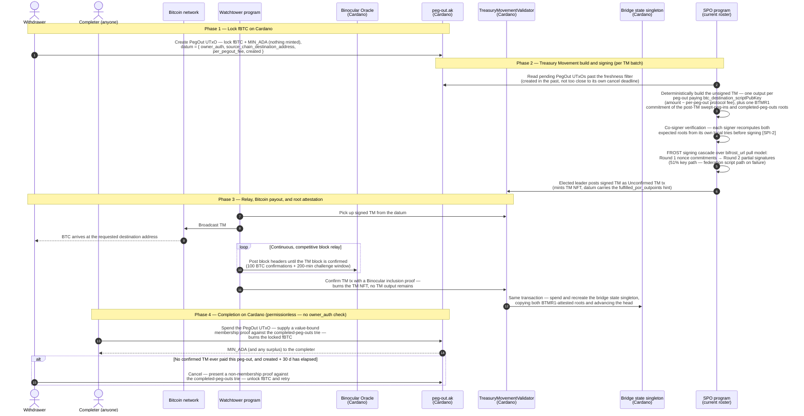
```mermaid
sequenceDiagram
    autonumber
    actor Wdr as Withdrawer
    actor Any as Completer (anyone)
    participant BTC as Bitcoin network
    participant WT as Watchtower program
    participant Bin as Binocular Oracle<br/>(Cardano)
    participant POUT as peg-out.ak<br/>(Cardano)
    participant TMC as TreasuryMovementValidator<br/>(Cardano)
    participant CPO as Bridge state singleton<br/>(Cardano)
    participant SPO as SPO program<br/>(current roster)

    Note over Wdr,POUT: Phase 1 — Lock fBTC on Cardano
    Wdr->>POUT: Create PegOut UTxO — lock fBTC + MIN_ADA (nothing minted),<br/>datum = { owner_auth, source_chain_destination_address,<br/>per_pegout_fee, created }

    Note over POUT,SPO: Phase 2 — Treasury Movement build and signing (per TM batch)
    SPO->>POUT: Read pending PegOut UTxOs past the freshness filter<br/>(created in the past, not too close to its own cancel deadline)
    SPO->>SPO: Deterministically build the unsigned TM — one output per<br/>peg-out paying btc_destination_scriptPubKey<br/>(amount − per-peg-out protocol fee), plus one BTMR1<br/>commitment of the post-TM swept-peg-ins and completed-peg-outs roots
    SPO->>SPO: Co-signer verification — each signer recomputes both<br/>expected roots from its own local tries before signing [SPI-2]
    SPO->>SPO: FROST signing cascade over bifrost_url pull model:<br/>Round 1 nonce commitments → Round 2 partial signatures<br/>(51% key path — federation script path on failure)
    SPO->>TMC: Elected leader posts signed TM as Unconfirmed TM tx<br/>(mints TM NFT, datum carries the fulfilled_por_outpoints hint)

    Note over Wdr,TMC: Phase 3 — Relay, Bitcoin payout, and root attestation
    WT->>TMC: Pick up signed TM from the datum
    WT->>BTC: Broadcast TM
    BTC-->>Wdr: BTC arrives at the requested destination address
    loop Continuous, competitive block relay
        WT->>Bin: Post block headers until the TM block is confirmed<br/>(100 BTC confirmations + 200-min challenge window)
    end
    WT->>TMC: Confirm TM tx with a Binocular inclusion proof —<br/>burns the TM NFT, no TM output remains
    TMC->>CPO: Same transaction — spend and recreate the bridge state singleton,<br/>copying both BTMR1-attested roots and advancing the head

    Note over Any,POUT: Phase 4 — Completion on Cardano (permissionless — no owner_auth check)
    Any->>POUT: Spend the PegOut UTxO — supply a value-bound<br/>membership proof against the completed-peg-outs trie —<br/>burns the locked fBTC
    POUT-->>Any: MIN_ADA (and any surplus) to the completer

    alt No confirmed TM ever paid this peg-out, and created + 30 d has elapsed
        Wdr->>POUT: Cancel — present a non-membership proof against<br/>the completed-peg-outs trie — unlock fBTC and retry
    end
```

## Transaction catalog

This section is the normative reference for every on-chain transaction the protocol uses. Each entry pairs a Mermaid diagram (visual shape) with a structured table (inputs / reference inputs / mint / outputs / redeemers / validity / signers) and the on-chain checks enforced by the relevant validator.

<!-- G34: complete transaction index — every protocol transaction and where it is specified. -->
**Transaction index**

| Transaction | Chain | Specified in |
|---|---|---|
| Peg-in deposit | Bitcoin | this catalog |
| Depositor refund (refund-leaf spend) | Bitcoin | *Spending paths* under §Taproot address construction |
| Treasury Movement | Bitcoin | this catalog + §Deterministic TM construction |
| Create PegInRequest | Cardano | this catalog |
| Close PegInRequest | Cardano | this catalog |
| Create PegOut request | Cardano | this catalog |
| Cancel PegOut request | Cardano | this catalog |
| Complete peg-in / mint fBTC | Cardano | this catalog |
| Complete peg-out / burn fBTC | Cardano | this catalog |
| Post signed TM | Cardano | this catalog |
| Confirm TM tx | Cardano | this catalog |
| Update-Y (incl. the federation branch, [UY-5]) | Cardano | this catalog |
| Update operational parameters | Cardano | this catalog |
| `register_spo` | Cardano | §SPO Registration, section 5 |
| `deregister_spo` | Cardano | §SPO Registration, section 7.1 |
| `apply_first_ban` / `apply_repeated_ban` | Cardano | §SPO Registration, section 7.2 |
| `publish_fault_proof` | Cardano | §Misbehavior Handling, section 9.1 |
| Bootstrap mints (Config, params, cpi/cpo, K1 Treasury state, `reg-root`, `ban-root`) | Cardano | §Bridge instance creation flow; §SPO Bootstrap Flow |
| Register script reward accounts (the withdraw-zero credentials) | Cardano | this catalog |
| Binocular oracle updates | Cardano | Binocular [1] (normative for the oracle) |

### Peg-in deposit (Bitcoin)

**Purpose**: lock BTC at a Bifrost peg-in Taproot address, making it sweepable by the next Treasury Movement. This is a plain Bitcoin transaction — Bitcoin consensus enforces nothing Bifrost-specific; the protocol meaning comes from the output shape and the OP_RETURN marker.

**Who**: the depositor.
**Trigger**: the depositor decides to bridge BTC → fBTC.

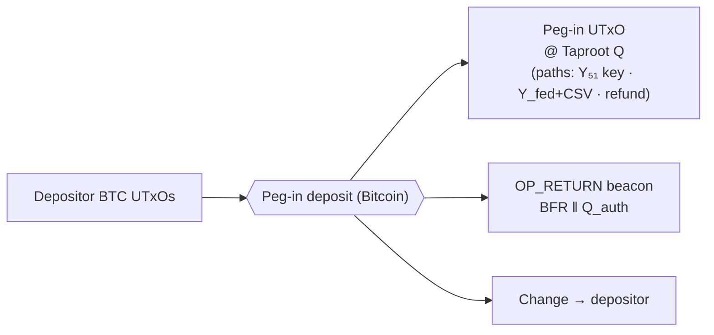
```mermaid
flowchart LR
  dep_in["Depositor BTC UTxOs"] --> tx{{"Peg-in deposit (Bitcoin)"}}
  tx --> pegin["Peg-in UTxO<br/>@ Taproot Q<br/>(paths: Y₅₁ key · Y_fed+CSV · refund)"]
  tx --> opret["OP_RETURN beacon<br/>BFR ‖ Q_auth"]
  tx --> change["Change → depositor"]
```

**Structure**

| Role | Content |
|------|---------|
| **Inputs** | Depositor BTC UTxOs — funds the peg-in amount + BTC fees |
| **Outputs** | Peg-in UTxO at Taproot address $Q$ (holds the BTC to be bridged); OP_RETURN beacon `"BFR" ‖ Q_auth` (35 bytes); optional change → depositor |
| **Signer** | depositor (their Bitcoin keys) |
| **Validity** | standard Bitcoin transaction |
| **Size (est.)** | ~220 vB (1 P2WPKH input + 3 outputs: P2TR peg-in ~43 B, OP_RETURN ~34 B, P2WPKH change ~31 B) |

**Taproot address $Q$** (see **Taproot address construction** for the full derivation)

`Q = lift_x(Y_51) + tagged_hash("TapTweak", Y_51 || merkle_root) · G`

where the script tree has two leaves:

* `Y_federation + CSV` — federation emergency sweep after timeout;
* depositor refund — spendable by the depositor after ~4320 blocks (~30 days).

Key path ($Y_{51}$) is the main line: it is how SPOs sweep this UTxO into the next Treasury Movement.

**Checks enforced on-chain** (Bitcoin consensus): standard tx validity (input signatures, fees, output scripts well-formed). Nothing Bifrost-specific.

**Checks delegated off-chain** (the depositor — no party will save them otherwise)

* The depositor MUST construct $Q$ from the **current** $Y_{51}$ published in `treasury.ak` and $Y_{federation}$. Using a stale $Y_{51}$ makes the peg-in unsweepable — the depositor must then wait out the ~30-day refund.
* The depositor MUST include the OP_RETURN beacon, equal to `BFR ‖ Q_auth` — otherwise watchtowers will not detect the deposit and no PegInRequest will ever be created.
* `Q_auth` MUST be the key whose refund leaf is committed in the address — else the refund path is unspendable.
* `Q_auth` MUST be a key the depositor can BIP-322-sign with — else completion is impossible. Both MUSTs bind the same key, which is the point of the one-key form: they cannot disagree.

> **Implementation status.** The 35-byte form above is implemented: `bitcoin.ak` parses it (`get_op_return_depositor_key`) and `pegin_deposit.py` builds it. Two earlier forms are **refused outright**, not dual-read: the 67-byte dual-key beacon `"BFR" ‖ D ‖ Q_auth`, and the original 35-byte demo beacon, which carried `Q_auth` while the refund leaf held a *different* key `D`, so `D` had to reach the sweeper out of band or be guessed. Accepting any of them alongside this one would keep that guessing path alive for exactly the deposits this form removes. A deposit made under an older form against an instance deployed before this change cannot be swept by the new `peg_in` validator.

> **Decision, 2026-08-12: the beacon returns to ONE key, and that key is $Q_{auth}$.**
> The beacon becomes `"BFR" ‖ Q_auth` (35 bytes), and **the refund leaf holds
> $Q_{auth}$ too** — so the same key authorizes completion and spends the refund
> path, and $D$ disappears from the protocol. The 67-byte form above stands until
> that lands; no production deposit has been made under it.
>
> **This is not the retired 35-byte demo beacon, and the difference is the whole
> point.** That form also carried $Q_{auth}$ alone — but its refund leaf held a
> *different* key $D$, so a sweeper had to receive $D$ out of band or guess it. Here
> the leaf holds the key the beacon carries. Nothing is guessed, nothing is
> recovered, and the ambiguity that form was refused for cannot arise.
>
> **On-chain derivability, stated as fact rather than assumption.** A one-key beacon
> was previously believed to require deriving $Q_{auth} = BIP86(D)$ on-chain, which is
> impossible: Plutus V3 has no secp256k1 point addition or scalar multiplication (the
> same gap that forces off-chain Taproot address verification — see *Taproot address
> verification*). **That reasoning never applies here.** Nothing is derived, because
> the key that is carried is the key that is used, on both paths. On-chain the
> completion check is *unchanged*: `bip322.verify_keypath(user_source_chain_pub_key,
> …)` continues to verify a BIP-322 signature under the depositor's Taproot **output**
> key, exactly as today. Only `bitcoin.ak`'s beacon parsing changes width.
>
> **Why not the raw key $D$**, which this note previously specified: completion under
> $D$ requires the wallet to sign the BIP-322 `to_sign` transaction with an
> **untweaked** signer, since `signMessage(msg, "bip322-simple")` signs under the
> tweaked key. Measured on Unisat 2026-08-12: it produced no such signature through
> its generic `signPsbt` — one PSBT variant returned an internal TypeError, the other
> an approval popup reading *"the psbt or param is invalid"*. The same wallet signed a
> tapleaf `<csv> OP_CSV OP_DROP <Q_auth> OP_CHECKSIG` with its **default** signer, with
> no special flag. `disableTweakSigner` is in any case Unisat-specific and no part of
> BIP-322, so a form depending on it narrows wallet support; this form does not depend
> on it at all.
>
> **What is given up, and it is one thing, deliberately.** **Authorization is no
> longer decoupled from funding.** The paragraph above ("a different wallet's key MAY
> be used") is withdrawn: whoever can spend the refund leaf is whoever can complete the
> peg-in. No requirement asks for a third-party funder, and the alternative costs 32
> bytes on every deposit plus a second parse path.
>
> **What is NOT given up.** Completion still works from any wallet that implements
> BIP-322 message signing for a Taproot address — [CPI-3]'s rule survives intact,
> which is what decided this form over $D$. The one new wallet requirement falls on the
> **refund** path, which needs a wallet that will sign a custom tapleaf (demonstrated on
> Unisat; unmeasured elsewhere). A wallet that cannot loses only the ~30-day refund, not
> the ability to complete — a degradation rather than a lockout. Deployments SHOULD
> publish which wallets they have verified for the refund path.

### Create PegInRequest (Cardano)

**Purpose**: publish on Cardano the claim "a Bitcoin peg-in deposit is confirmed; here is the raw BTC tx and a proof it sits in the confirmed chain", so SPOs can read it when building the next Treasury Movement.

**Who**: anyone — typically a watchtower, or the depositor themselves.
**Trigger**: the block containing the BTC peg-in deposit has passed the Binocular confirmation window (≥100 Bitcoin blocks + 200 min challenge).

A single tx may create **N PegInRequests at once** (batching). The mint redeemer carries a list; the validator checks each entry independently.

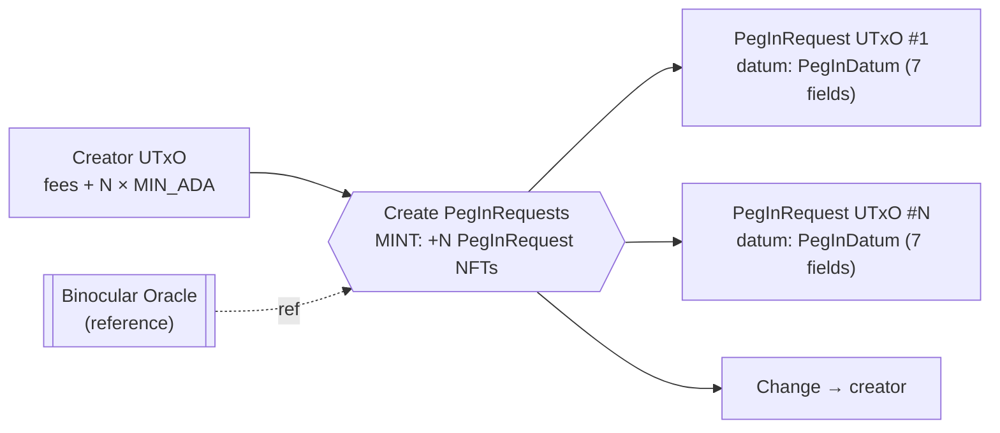
```mermaid
flowchart LR
  creator["Creator UTxO<br/>fees + N × MIN_ADA"] --> tx{{"Create PegInRequests<br/>MINT: +N PegInRequest NFTs"}}
  oracle[["Binocular Oracle<br/>(reference)"]] -. ref .-> tx
  tx --> pir1["PegInRequest UTxO #1<br/>datum: PegInDatum (7 fields)"]
  tx --> pirN["PegInRequest UTxO #N<br/>datum: PegInDatum (7 fields)"]
  tx --> change["Change → creator"]
```

**Structure**

| Role | Content |
|------|---------|
| **Inputs** | Creator UTxO — fees + N × MIN_ADA |
| **Reference inputs** | Binocular Oracle state — supplies the confirmed-chain root |
| **Mint** | +N PegInRequest NFTs (one per request; each with a unique on-chain identity) |
| **Outputs** | N × PegInRequest UTxO — each holds one NFT + MIN_ADA; datum = the 7-field `PegInDatum` below |
| **Witness data (redeemer)** | for each of the N requests: Merkle proof BTC tx ∈ block header; Merkle proof block header ∈ Binocular confirmed-chain root |
| **Validity interval** | unconstrained |
| **Size (est.)** | ~2 KB for N=1; up to ~16 KB for N=10 (batch ceiling). See **Size estimation and batch ceiling** below. |

**Checks enforced on-chain** (`peg-in.ak` mint policy — per minted NFT, independently)

* **[CPR-1]** `peg-in.ak` MUST verify the supplied BTC tx is Merkle-included in the supplied BTC block header.
* **[CPR-2]** `peg-in.ak` MUST verify that block header is included in Binocular's confirmed-chain root.
* **[CPR-3]** **Deposit binding** (`deposit_binding_ok`) — `peg-in.ak` MUST verify all of:
  1. the datum's `peg_in_utxo_id` is an output of the supplied deposit tx;
  2. that output is a P2TR paying exactly `peg_in_amount`;
  3. `user_source_chain_pub_key` matches the key committed in the deposit's beacon output.

  This is what pins the datum's claim fields to the real Bitcoin deposit.
* **[CPR-4]** `peg-in.ak` MUST verify the NFT is minted uniquely and paired with exactly one output carrying the declared datum.

**Checks delegated off-chain** (each SPO, before signing the TM — Plutus V3 cannot do secp256k1 point arithmetic)

* Each SPO MUST verify the BTC output pays a valid Bifrost peg-in Taproot address (reconstructed from $Y_{51}$, $Y_{federation}$, and the depositor's output key `Q_auth` from the beacon).
* Each SPO MUST verify the OP_RETURN beacon equals `BFR ‖ Q_auth`.
* Each SPO MUST verify the claimed peg-in amount matches the BTC output amount.

If any off-chain check fails, the SPO MUST skip this PegInRequest. No fund risk, no theft risk — griefing cost = NFT minting fee + MIN_ADA.

**PegInDatum** <!-- G9: field list matches the implemented bifrost/types/peg-in.ak (constructor
order is normative); the previous 2-field table disagreed with the fields §Complete peg-in reads. -->

| # | Field | Type | Purpose |
|---|-------|------|---------|
| 0 | `owner_auth` | `AuthorizationMethod` | authority that can later `Close` this request ([CLR-9]) |
| 1 | `source_chain_peg_in_raw_tx` | `ByteArray` | raw (witness-stripped) BTC peg-in deposit tx bytes |
| 2 | `source_chain_peg_in_raw_tx_index` | `Int` | the deposit tx's index in its block (for the Merkle proof) |
| 3 | `peg_in_utxo_id` | `ByteArray` (txid ‖ vout LE) | the deposit outpoint on Bitcoin — the UTxO the TM sweeps; key of both deposit tries |
| 4 | `peg_in_amount` | `Int` (satoshi) | the deposit amount — the fBTC quantity minted at completion |
| 5 | `user_source_chain_pub_key` | `ByteArray` (32 B x-only) | the depositor's auth key — the beacon's `Q_auth`, the key the BIP-322 completion signature verifies under |
| 6 | `created` | `Int` (POSIX ms) | mint-time creation time. Starts the *Close PegInRequest* never-swept grace period ([CLR-5]); pinned by the mint handler ([CLR-7]) |

Fields 3–5 are **bound to the real deposit at mint time** by the `deposit_binding_ok` check below —
that binding is what later makes the depositor (not a watchtower) the only party able to claim the
fBTC (see the B1 note under *Complete peg-in*).

> **Implementation status (rev 5.4).** The table above is the deployed
> `bifrost/types/peg-in.ak` constructor order. Two changes from rev 5.1:
>
> * `created` is **appended**, not inserted, so the deposit-binding fields keep their indices and
>   the mint-side reasoning above is unchanged.
> * `source_chain_treasury_utxo_id` is **removed**. It pinned the treasury outpoint that was
>   current at request time, for the rev-5.1 close branch and for SPO address reconstruction. No
>   validator ever read it, [CLR-3] that motivated it is withdrawn, and the SPO derives the key era
>   from the beacon's `D` plus the treasury state. Rejected alternative: keep the field as a
>   reserved slot. That costs ~36 B in every request datum forever to preserve a field nothing
>   reads. This is a fresh deployment, so there is no migration to protect.

> **Why `created` is mint-pinned and `PegOutDatum.created` is not.** The peg-out one is
> requester-set, because the requester only harms themselves by backdating their own cancel
> deadline. Here the request creator and the depositor can be different parties: a watchtower
> creates a PIR, and the depositor holds the fBTC claim. A requester-set `created` would let the
> creator backdate it and close the request immediately, before the depositor could complete it.
> [CLR-7] therefore pins `created` to the mint transaction's validity upper bound, the same
> device the TM record uses ([PTM-4]). The upper bound is the earliest time the chain can prove
> the request did not already exist, so `created` can never be earlier than the truth.

> **Implementation status.** The deployed mint redeemer carries **one** request per transaction
> (`new_peg_in_request`, singular); the batch form (a list of up to ~10, per the size analysis
> below) is the normative target — a contract-CR item.

**Size estimation and batch ceiling**

Per-request payload:

| Part | Where | Size |
|------|-------|------|
| raw BTC peg-in tx | output datum | ~400 B |
| `owner_auth` | output datum | ~48 B |
| BTC block header | mint redeemer | 80 B |
| Binocular inclusion proof (header ∈ confirmed chain) | mint redeemer | ~600 B |
| Bitcoin Merkle proof (tx ∈ block) | mint redeemer | ~320 B |
| NFT (asset name + qty, in mint + output value) | tx body | ~50 B |
| Output overhead (address + value bag wrapper) | tx body | ~60 B |
| **Per-request total** | | **~1.56 KB** |

Fixed per-tx overhead (creator input, oracle reference input, change output, signature, tx header, script integrity hash): **~400 B**.

At ~1.56 KB per request, byte size caps a batch at **~10 requests per tx** before hitting Cardano's 16 KB limit. Execution-unit memory (~14 M) is expected to converge on the same ~10-per-batch ceiling — per-request exec cost is dominated by the MPF + Merkle proof verifications and scales linearly.

Fee comparison (mainnet params: $a = 0.155$ ADA, $b = 4.4 \times 10^{-5}$ ADA/byte; exec: $7.21 \times 10^{-5}$ ADA/step, $5.77 \times 10^{-2}$ ADA/mem):

| Scenario | Byte fee | Exec fee | Total |
|----------|----------|----------|-------|
| 1 request per tx | ~0.24 ADA | ~0.09 ADA | **~0.33 ADA** |
| 10 requests batched | ~0.86 ADA | ~0.72 ADA | **~1.58 ADA** |
| 10 requests, 1 per tx | ~2.40 ADA | ~0.90 ADA | **~3.30 ADA** |

Batching 10 saves ~1.7 ADA (~50%) — meaningful at scale but not load-bearing. Watchtowers MAY batch up to 10 PegInRequests in a single tx.

### Create PegOut request (Cardano)

**Purpose**: lock fBTC on Cardano together with a Bitcoin destination, so the next Treasury Movement can pay out.

**Who**: the withdrawer.
**Trigger**: the withdrawer wants to bridge fBTC → BTC.

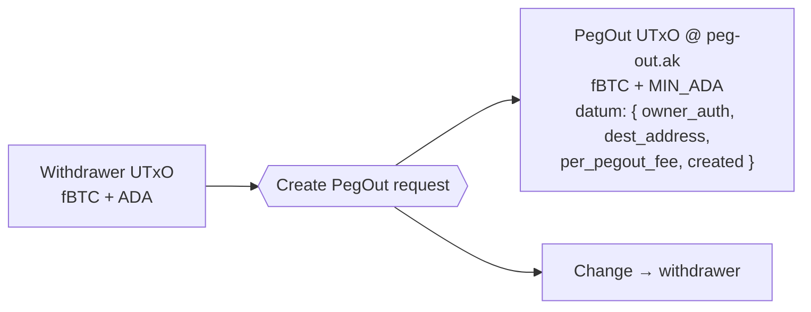
```mermaid
flowchart LR
  wdraw["Withdrawer UTxO<br/>fBTC + ADA"] --> tx{{"Create PegOut request"}}
  tx --> pout["PegOut UTxO @ peg-out.ak<br/>fBTC + MIN_ADA<br/>datum: { owner_auth, dest_address,<br/>per_pegout_fee, created }"]
  tx --> change["Change → withdrawer"]
```

**Structure**

| Role | Content |
|------|---------|
| **Inputs** | Withdrawer UTxO — holds the fBTC to lock + ADA for fees + MIN_ADA |
| **Reference inputs** | — |
| **Mint** | — |
| **Outputs** | PegOut UTxO @ `peg-out.ak` — holds the locked fBTC + MIN_ADA (and nothing more — see the no-overfund rule below); datum = `{ owner_auth, source_chain_destination_address, per_pegout_fee, created }` |
| **Witness data (redeemer)** | — (a plain payment to a script address; the validator runs only on spend) |
| **Validity interval** | unconstrained |
| **Size (est.)** | ~0.5 KB (no script execution; fee ≈ 0.18 ADA) |

<!-- G3: no on-chain creation checks by design; the security load sits on the deterministic skip
     rule (TM construction) and the completion/cancel proofs against the completed-peg-outs trie. -->
**Checks enforced on-chain**

* None at creation — creation is a plain payment to the script address, and Cardano runs no
  validator on *receiving* outputs, so nothing *can* be checked here.

> **Why this is safe.** A bad request can only harm its own creator. The treasury is protected by
> the **deterministic skip rule** at TM construction and by the completion/cancel proofs against
> the completed-peg-outs trie at spend time (see *Complete peg-out*, *Cancel PegOut request*).

**Checks delegated off-chain** (client-side — normative for wallets and request-building tooling)

A request that fails these is skippable at best and unrecoverable at worst, so software building
this transaction MUST validate before submitting:

* locked fBTC ≥ `min_peg_out_fbtc` (read from the Config's operational parameters) — otherwise the TM
  builder skips the request and the withdrawer must cancel;
* datum `per_pegout_fee` equals the current Operational-params value — a lower value gets the
  request skipped (it is below the floor); a higher value needlessly overpays the protocol;
* the datum encodes a well-formed `PegOutDatum` — an undecodable datum is **permanently
  unrecoverable**: even Cancel must decode `owner_auth` to authorize the refund;
* `source_chain_destination_address` is a spendable Bitcoin script (standard template) — a
  malformed script means the TM pays an unspendable output and the BTC is lost; there is no
  on-chain proof possible;
* the transaction MUST NOT lock more than MIN_ADA lovelace, and MUST NOT attach any token besides
  the locked fBTC, to the `peg-out.ak` output — *Complete peg-out* places no on-chain constraint on
  a PegOut UTxO's non-fBTC content, so the completer keeps ALL of it (see *Complete peg-out*); any
  overfunding is an unrecoverable gift to a stranger, not a refundable mistake.

**PegOutDatum** <!-- G28: field list matches the implemented bifrost/types/peg-out.ak (constructor order is normative) -->

| Field | Type | Purpose |
|-------|------|---------|
| `owner_auth` | `AuthorizationMethod` | authority that CANCELS this peg-out to reclaim the fBTC if it is never paid. Completion itself is permissionless and does not check this field — see *Complete peg-out* |
| `source_chain_destination_address` | `ByteArray` | raw BTC output script where a fulfilling TM pays (referred to as `btc_destination_scriptPubKey` elsewhere in this document) |
| `per_pegout_fee` | `Int` (satoshi) | the protocol fee of **this** peg-out, pinned at lock time from the Operational-params floor (Config #13) — a fulfilling TM pays `amount − this fee`, and *Complete peg-out*'s membership proof is value-bound against **this** field (never against a current Config value, which would race historical payments; see §Operational parameters) |
| `created` | `Int` (POSIX ms) | requester-set creation time. Gates *Cancel PegOut request* (`created + peg_out_cancel_timeout_ms`, 30 days) and the SPO **fulfillment freshness filter** at TM construction (see *Deterministic skip rule*) |

The peg-out **amount** is simply the fBTC quantity held in the UTxO's value — no separate datum field needed.

> **Why `created` is requester-set, and why backdating is harmless.** Nothing on-chain verifies
> `created` against the actual submission time — it is exactly as trustworthy as any other
> requester-supplied datum field, which is to say not at all, by design. The SPO TM builder never
> reads `created` as a truth claim about the past; it reads it only as an **input to the
> freshness filter**, applied fresh at every batch: fulfill a request only if `created <= now` AND
> `created + peg_out_cancel_timeout_ms − now >= margin` (a heimdall-configured value, default 7
> days — see *Deterministic skip rule*). A request backdated far enough to defeat that filter
> simply never gets fulfilled and can only be cancelled — refunding the requester's own fBTC to
> themselves. There is no way to turn a fabricated `created` into an advantage over any other
> party.

### Treasury Movement (Bitcoin)

**Purpose**: in a single Bitcoin transaction, sweep every confirmed peg-in into the treasury, pay every pending peg-out, and move the treasury to the next-epoch roster's Taproot address.

**Who**: current roster of SPOs via FROST group signing — or the federation, in emergency.
**Trigger**: end-of-epoch signing cascade.

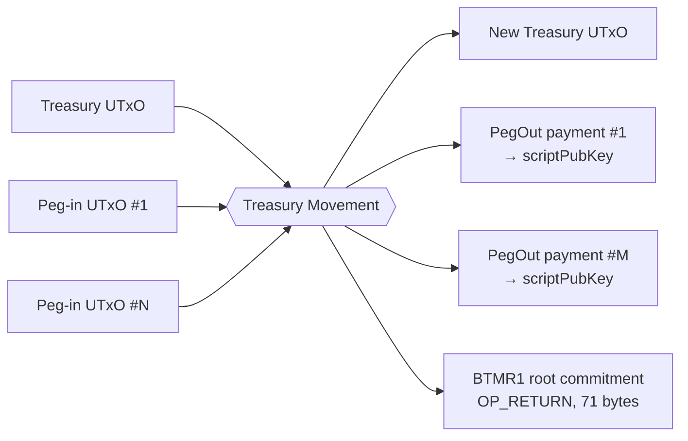
```mermaid
flowchart LR
  tres_in["Treasury UTxO"] --> tx{{"Treasury Movement"}}
  pin1["Peg-in UTxO #1"] --> tx
  pinN["Peg-in UTxO #N"] --> tx
  tx --> tres_out["New Treasury UTxO<br/>"]
  tx --> pay1["PegOut payment #1<br/>→ scriptPubKey"]
  tx --> payM["PegOut payment #M<br/>→ scriptPubKey"]
  tx --> commit["BTMR1 root commitment<br/>OP_RETURN, 71 bytes"]
```

**Structure**

| Role | Content |
|------|---------|
| **Inputs** | Current Treasury BTC UTxO + all confirmed peg-in UTxOs (identified by `peg_in_utxo_id` in each PegInRequest) |
| **Outputs** | `[0]` the **new treasury output** — the treasury's self-payment to the address derived from the current TreasuryDatum key at the batch snapshot slot (after Update-Y this is the new roster's address: the handoff); `[1..m]` one payment output per PegOut, ordered lexicographically by raw `scriptPubKey` bytes, each paying `btc_destination_scriptPubKey` with `amount` minus that peg-out's datum-pinned fee (see *Amounts and fees*); `[m+1]` the **BTMR1 root commitment** — a single `OP_RETURN` output committing the swept-peg-ins and completed-peg-outs MPF roots that hold after this TM (see §Bridge state singleton and *Confirm TM tx*). No per-peg-out marker outputs exist — the roots are committed once, for the whole batch |
| **Witness** | FROST aggregated Schnorr signature(s) per the chosen variant |
| **Validity** | CSV timelock enforced on inputs only in the federation variant |
| **Size (est.)** | *(Revised, rev 5.6)* Per peg-in **input**: 107 B in the 51% key path (41 non-witness + 66 B witness: item count 1 + signature 65), 214 B in the federation path (41 + 173 B witness: item count 1 + signature 65 + revealed leaf ≈41 + control block 66, the deposit tree having two leaves; the treasury's own input is 182 B, its tree having one). Per peg-out **output**: 43 B (value 8 + length 1 + a scriptPubKey of at most 34 B). Fixed structure: 242 B key-path, 317 B federation (treasury input, treasury output, the 71-byte BTMR1 `OP_RETURN`, version/locktime/counts). **The binding limit is not on this transaction** — it is the Cardano `max_tx_size` protocol parameter (16 384 B today) applied to the *Post-TM* transaction that carries this one, where the raw TM is only one of the terms that grow with the batch. The capacity rule lives in *Ordering, capacity, and the split rule*; the earlier "hard cap at ~15 KB raw" and its ~100 + ~100 key-path pair are WITHDRAWN — the cap bounded the wrong quantity, and the pair overshot even that bound. |

**Signing-path variants** (chosen by the signing cascade; see **Spending paths and Treasury Movement variants**)

| Variant | Treasury input via | Peg-in inputs via | Chosen when |
|---------|--------------------|-------------------|-------------|
| **51% main line** | $Y_{51}$ key path | $Y_{51}$ key path | 51% quorum produced a valid aggregate signature |
| **Federation emergency** | $Y_{federation}$ script leaf + CSV | $Y_{federation}$ script leaf + CSV | 51% mode exhausted |

**Checks enforced on-chain** (Bitcoin consensus): standard Taproot verification per the chosen path. Nothing Bifrost-specific.

**Checks delegated off-chain** (SPOs / federation)

* The TM builder MUST include exactly the frozen set of PegInRequests and PegOuts for this batch.
* Every honest SPO MUST build a byte-identical unsigned TM (determinism).
* A signer MUST NOT sign a TM with an input it cannot actually spend.
* Each PegOut payment MUST pay the destination in its datum exactly `amount` minus that peg-out's datum-pinned fee (see *Amounts and fees*).
* The TM MUST carry exactly one BTMR1 root commitment output, and its two roots MUST equal the post-TM swept-peg-ins and completed-peg-outs MPF roots — heimdall inserts `(peg_in_utxo_id, input_0_outpoint)` for every deposit this TM sweeps ([SPI-1], [SPI-3]) and `(por_id, dest_spk ‖ amount_le8)` for every peg-out this TM fulfills into its local tries and commits the resulting roots (a TM that sweeps or fulfills nothing re-commits the unchanged roots). Every co-signer MUST independently recompute both roots from its own tries before signing ([SPI-2]) — this is what keeps root integrity inside the existing FROST-quorum honesty assumption rather than adding a new one (see *Confirm TM tx* and §Bridge state singleton).
* Input 0 of the TM MUST spend the bridge state singleton's `treasury_utxo_id` — the head ([PTM-6] enforces this at post time, [CTM-18] at Confirm).

If the TM is malformed or omits a peg-out, recovery paths on Cardano unwind the state in the next epoch.

### Post signed TM as `Unconfirmed TM tx` (Cardano)

<!-- G15 (Model C, the chain of Confirmed records) superseded 2026-08-06 (rev 5.4): the bridge
     state singleton's head is the treasury pointer; the Genesis/Chain redeemer split is retired
     ([PTM-5] withdrawn). -->
**Purpose**: publish the signed Bitcoin TM transaction on Cardano so watchtowers can relay it to Bitcoin. This creates the TM UTxO in its `UnconfirmedTm` state — the relay carrier. Completion flows never read it: they read the bridge state singleton, which only *Confirm TM tx* advances.

**Who**: anyone holding the fully signed TM — typically the elected leader (per the off-chain cascade, see *Cardano submission and leader reward*), but any SPO or watchtower can post for liveness. **Posting is permissionless**: validity is gated by the head check below, and correctness ultimately by Bitcoin itself.
**Trigger**: the signing cascade produced a valid signed Bitcoin tx.

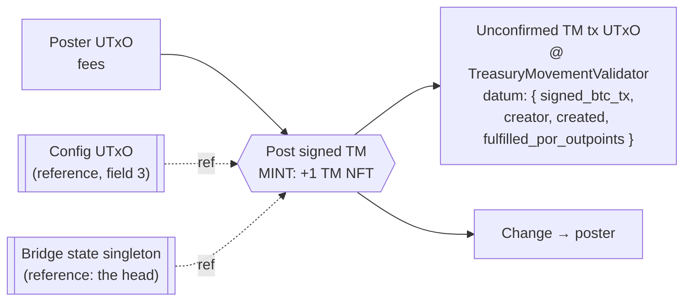
```mermaid
flowchart LR
  poster["Poster UTxO<br/>fees"] --> tx{{"Post signed TM<br/>MINT: +1 TM NFT"}}
  cfg_ref[["Config UTxO<br/>(reference, field 3)"]] -. ref .-> tx
  bss_ref[["Bridge state singleton<br/>(reference: the head)"]] -. ref .-> tx
  tx --> unconf["Unconfirmed TM tx UTxO<br/>@ TreasuryMovementValidator<br/>datum: { signed_btc_tx,<br/>creator, created, fulfilled_por_outpoints }"]
  tx --> change["Change → poster"]
```

**Structure**

| Role | Content |
|------|---------|
| **Inputs** | Poster's UTxO — fees + MIN_ADA |
| **Reference inputs** | Config UTxO — supplies `bridge_state_policy` (field 3), authenticated by the config NFT; the bridge state singleton — supplies the head (`treasury_utxo_id`), located by the redeemer's reference-input index and authenticated by the `"BSS"` NFT ([PTM-7]) |
| **Mint** | +1 TM NFT (empty asset name); minting is permissionless, gated by the head check. Redeemer: `TmMintRedeemer(bridge_state_ref_input_index)` |
| **Outputs** | `Unconfirmed TM tx` UTxO @ `TreasuryMovementValidator`; datum = `UnconfirmedTm { signed_btc_tx, creator, created, fulfilled_por_outpoints }` – `creator` (the poster's payment key hash) may reclaim the record's min-ADA after the GC grace period if the TM never mines; `created` (POSIX ms) starts that timer; `fulfilled_por_outpoints` is the UNVERIFIED data-availability hint (see *Request and record UTxOs*). Ordering comes from the TM chain itself, so no sequence fields |
| **Validity interval** | finite `invalid_hereafter` REQUIRED: the mint enforces `created == validRange.to` (exact equality), so `created` is a guaranteed upper bound on the real posting time and the GC timer cannot be backdated |
| **Required signers** | poster (fee spend) — permissionless |
| **Size (est.)** | *(Revised, rev 5.6)* **`max_tx_size` applied to this transaction is the binding constraint on batch sizing for the whole protocol** — a host protocol parameter read from the chain, 16 384 B today, never a hardcoded constant (see *Ordering, capacity, and the split rule*). **Three** of this transaction's terms grow with the batch, not one. (a) `signed_btc_tx` — the raw TM, but as Plutus `bounded_bytes`, which the ledger encodes in 64-byte chunks: it occupies `raw + 2·⌈raw/64⌉ + 2` bytes, ≈ **3.2 % more** than its raw size. (b) `fulfilled_por_outpoints` — one 36-byte outpoint **per fulfilled peg-out**, ≈ **38 B each** encoded, a per-peg-out Cardano cost comparable to the 43-byte Bitcoin output itself. (c) Everything that does not scale with the batch: mint redeemer and exec units, collateral, change, script-data hash, the poster's vkey witness, and the `TreasuryMovementValidator` script — which rides **inline in the witness set unless it is deployed as a reference script**, so deploying it is the single largest batch-capacity gain available (≈1–3 KB, worth roughly ten peg-in/peg-out pairs). Fee ≈ 0.67 ADA at ~10.5 KB; ≈ 0.9 ADA near the ceiling. |

**Checks enforced on-chain** (the `TreasuryMovementValidator` mint branch)

* **[PTM-1]** `TreasuryMovementValidator` MUST verify exactly +1 of the TM NFT is minted.
* **[PTM-2]** `TreasuryMovementValidator` MUST verify the TM NFT is the ONLY asset name touched under the TM policy in this tx.
* **[PTM-3]** *(Revised, rev 5.4)* `TreasuryMovementValidator` MUST verify the output carrying the TM NFT sits at the TM script address with an inline `UnconfirmedTm { signed_btc_tx, creator, created, fulfilled_por_outpoints }` datum — without this binding the head check would gate nothing. `fulfilled_por_outpoints` is decoded positionally and never validated (see *Request and record UTxOs*).
* **[PTM-4]** `TreasuryMovementValidator` MUST verify `created` equals the tx's validity upper bound exactly (`created == validRange.to`, finite
  bound required) — since the tx cannot be included after that bound, `created` upper-bounds the
  real posting time, so the GC grace period cannot be shortcut by backdating (future-dating only
  delays the poster's own reclaim).
* **[PTM-5]** ~~TM-chain linkage via the `Genesis`/`Chain` redeemer split.~~ — **Withdrawn (rev 5.4)**. The split is retired with the `Confirmed` record and the Config anchor field; [PTM-6] and [PTM-7] replace it.
* **[PTM-6]** `TreasuryMovementValidator` MUST verify input 0 of `signed_btc_tx` equals the singleton reference input's `treasury_utxo_id`.
* **[PTM-7]** `TreasuryMovementValidator` MUST authenticate that reference input by the singleton NFT `(bridge_state_policy, "BSS")`.

> **Why keep a mint-time head check.** [CTM-18] already makes the design safe. [PTM-6] is kept so
> that a TM chaining from a stale head cannot be posted at all. That is what stops dead records
> from accumulating.

**Checks delegated off-chain**

* The signing cascade MUST produce a `signed_btc_tx` that is a well-formed Bitcoin tx with valid signatures sweeping the frozen PegInRequest / PegOut batch. If malformed, it fails to confirm on Bitcoin and Confirm TM tx never fires — a correct resubmission is required. The peg-in and peg-out sets are implicit in `signed_btc_tx` (heimdall and binocular parse them out off-chain).

> **The TM chain — how the treasury pointer works (rev 5.4).** The bridge state singleton's
> `treasury_utxo_id` — the **head** — is the one on-chain register, advanced only at Confirm.
> Every TM spends the head as its input 0 ([PTM-6] at post, [CTM-18] at Confirm). Because a
> Bitcoin outpoint is spendable exactly once, at most one TM spending any given head can ever
> confirm — the chain cannot fork. Re-confirming an old TM is structurally impossible: Confirm
> CONSUMES the singleton, and [CTM-18] compares the TM's input 0 against the CURRENT head, which
> that old TM already spent. This is what closes rev 5.1's replay/rollback defect (see §Bridge
> state singleton). A stale post — one built against a head that has since advanced — cannot
> even be minted ([PTM-6]); a post that lost the race to a competing TM can never confirm and is
> GC'd by its creator after the grace period. SPOs and watchtowers read the current treasury
> outpoint and amount directly from the singleton; the spent `UnconfirmedTm` datums are the
> permanent history source for reconstruction.

**TM-record lifecycle** — a solid arrow **spends** the Cardano UTxO it leaves; a dotted arrow
only **references** it. Per-transaction details: *Post signed TM* (this entry) and *Confirm TM
tx* (next entry).

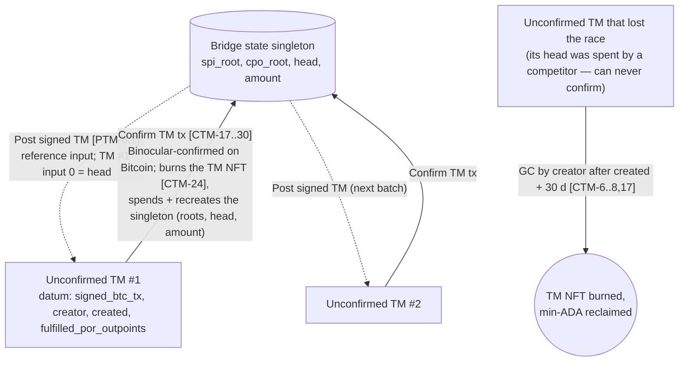
```mermaid
flowchart TD
  bss[("Bridge state singleton<br/>spi_root, cpo_root, head, amount")]
  u1["Unconfirmed TM #1<br/>datum: signed_btc_tx, creator, created, fulfilled_por_outpoints"]
  u2["Unconfirmed TM #2"]
  dead["Unconfirmed TM that lost the race<br/>(its head was spent by a competitor — can never confirm)"]
  gc(("TM NFT burned,<br/>min-ADA reclaimed"))

  bss -. "Post signed TM [PTM-6,7]<br/>reference input; TM #1 input 0 = head" .-> u1
  u1 -- "Confirm TM tx [CTM-17..30]<br/>Binocular-confirmed on Bitcoin; burns the TM NFT [CTM-24],<br/>spends + recreates the singleton (roots, head, amount)" --> bss
  bss -. "Post signed TM (next batch)" .-> u2
  u2 -- "Confirm TM tx" --> bss
  dead -- "GC by creator after created + 30 d [CTM-6..8,17]" --> gc
```

### Confirm TM tx (Cardano)

**Purpose**: once the posted TM is Binocular-confirmed on Bitcoin, advance the bridge state singleton to the state that holds after the TM, and retire the TM record — burn the TM NFT ([CTM-24]) and produce no TM-address output ([CTM-25]). No `Confirmed` record exists (rev 5.4). This is where both attested roots and the head advance; peg-in and peg-out completion never touch Binocular or any TM record — they only prove membership (or non-membership) against the singleton (see *Complete peg-in*, *Complete peg-out*). Confirm does **not** touch `treasury.ak`: key rotation is a separate Update-Y transaction after DKG.

**Who**: anyone — typically a watchtower. Confirm is permissionless; the confirmer takes the record's min-ADA, a built-in incentive to confirm.
**Trigger**: the TM is Binocular-confirmed (≥100 Bitcoin blocks + 200 min challenge).

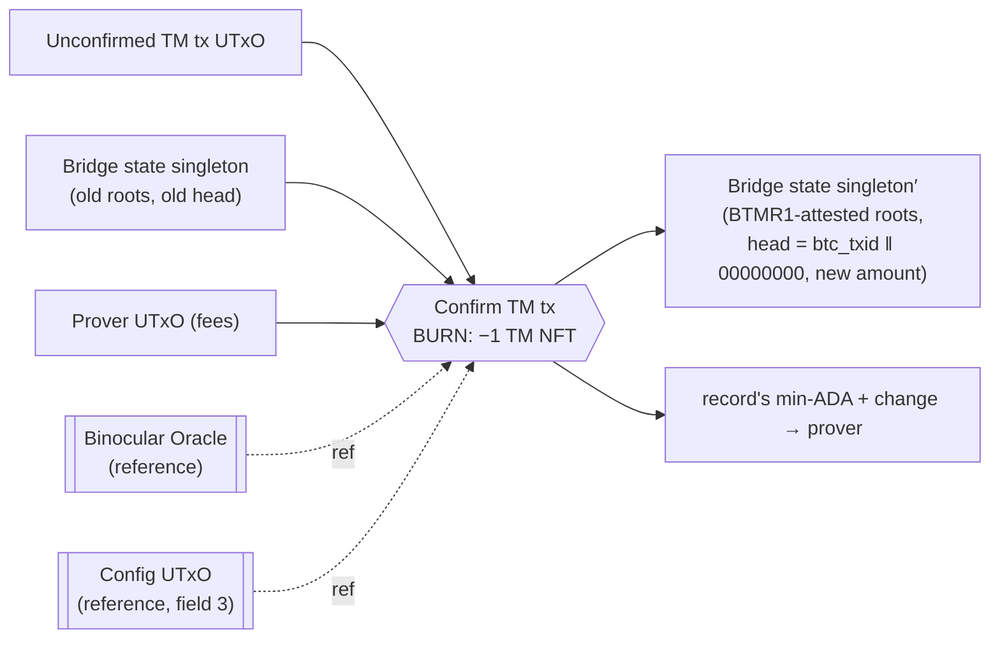
```mermaid
flowchart LR
  unconf["Unconfirmed TM tx UTxO"] --> tx{{"Confirm TM tx<br/>BURN: −1 TM NFT"}}
  bss_in["Bridge state singleton<br/>(old roots, old head)"] --> tx
  prover["Prover UTxO (fees)"] --> tx
  binoc[["Binocular Oracle<br/>(reference)"]] -. ref .-> tx
  cfg_ref[["Config UTxO<br/>(reference, field 3)"]] -. ref .-> tx
  tx --> bss_out["Bridge state singleton′<br/>(BTMR1-attested roots,<br/>head = btc_txid ‖ 00000000, new amount)"]
  tx --> change["record's min-ADA + change → prover"]
```

**Structure**

| Role | Content |
|------|---------|
| **Inputs** | `Unconfirmed TM tx` UTxO, carrying the TM NFT; the bridge state singleton, carrying `(bridge_state_policy, "BSS")`; Prover UTxO (fees) |
| **Reference inputs** | Binocular Oracle — supplies the confirmed-chain root; Config UTxO — supplies `bridge_state_policy` (field 3) |
| **Mint** | the TM NFT, quantity −1 ([CTM-24]) |
| **Outputs** | the bridge state singleton, recreated at its own address: both roots copied from the TM's BTMR1 commitment, `treasury_utxo_id = btc_txid ‖ 00000000`, `treasury_amount` = output 0's satoshi amount. NO output at the TM script address ([CTM-25]) |
| **Witness data (redeemer)** | `TmSpendRedeemer::Confirm(proof)`, where `proof` carries the Merkle proof of `btc_txid` in a BTC block header and the Binocular inclusion proof of that block header (the raw BTC tx itself is read from the consumed `UnconfirmedTm` datum, not duplicated). No trie proof of any kind — the roots are copied, not folded |
| **Validity interval** | unconstrained |
| **Required signers** | prover (fee spend) — permissionless |
| **Size (est.)** | redeemer ~1 KB (two proofs at ~500–600 B each); the singleton datum is ~130 bytes regardless of batch size — no `Confirmed` output datum exists any more. **Primary constraint is exec-unit memory** for parsing the raw BTC tx on-chain, not byte size. |

**Checks enforced on-chain** (the `TreasuryMovementValidator` spend branch, `Confirm`, plus [BSS-1]/[BSS-2] on `bridge-state.ak`)

* **[CTM-14]** *(Revised, rev 5.4)* `TreasuryMovementValidator` MUST decode the spend redeemer as a `TmSpendRedeemer` — `Confirm(proof)` or `Gc`. The redeemer alone selects the branch: the datum has a single constructor.
* **[CTM-15]** ~~Reject a `Confirm` redeemer on a `Confirmed` record.~~ — **Withdrawn (rev 5.4)**. No `Confirmed` record exists.
* **[CTM-17]** `TreasuryMovementValidator` MUST verify the transaction has EXACTLY ONE input at its own script address. This holds on the Confirm path and on the GC path alike.
* **[CTM-1]** `TreasuryMovementValidator` MUST verify `btc_txid == sha256d(strip_witness(UnconfirmedTm.signed_btc_tx))` — the Bitcoin txid is double-SHA256 over the **witness-stripped** serialization; the stored TM is witness-complete, so the validator strips witnesses before hashing (this is what makes the txid match the one committed in Bitcoin block Merkle trees).
* **[CTM-2]** `TreasuryMovementValidator` MUST verify `btc_txid` is Merkle-included in the supplied block header.
* **[CTM-3]** `TreasuryMovementValidator` MUST verify that block header is in Binocular's confirmed-chain root.
* **[CTM-4]** ~~Populate the `Confirmed` datum fields by parsing the TM.~~ — **Withdrawn (rev 5.4)**. No `Confirmed` datum exists; the swept and fulfilled sets live in the two attested tries.
* **[CTM-5]** ~~Carry the TM NFT to the `Confirmed` output.~~ — **Withdrawn (rev 5.4)**. The Confirm spend BURNS the TM NFT ([CTM-24]).

**The singleton update.** In the same transaction, `TreasuryMovementValidator` advances the bridge state singleton — a copy, not an on-chain fold:

* **[CTM-18]** `TreasuryMovementValidator` MUST verify input 0 of `signed_btc_tx` equals the spent singleton's `treasury_utxo_id`.
* **[CTM-19]** `TreasuryMovementValidator` MUST verify the continuing singleton's `treasury_utxo_id` equals `btc_txid ‖ 00000000`.
* **[CTM-20]** `TreasuryMovementValidator` MUST verify the continuing singleton's `spi_root` equals bytes [7, 39) of the commitment output.
* **[CTM-21]** `TreasuryMovementValidator` MUST verify the continuing singleton's `treasury_amount` equals the satoshi amount of the TM's output 0.
* **[CTM-24]** `TreasuryMovementValidator` MUST verify the Confirm spend burns the TM NFT, that is `mint == -1` under the TM policy.
* **[CTM-25]** `TreasuryMovementValidator` MUST verify the Confirm spend produces no output at the TM script address.
* **[CTM-26]** `TreasuryMovementValidator` MUST verify the TM carries exactly one output whose scriptPubKey is 71 bytes with prefix `6a4542544d5231` (the BTMR1 commitment).
* **[CTM-27]** `TreasuryMovementValidator` MUST rebuild the expected singleton datum in full and compare the whole `OutputDatum`.
* **[CTM-28]** `TreasuryMovementValidator` MUST authenticate the spent singleton by the NFT `(bridge_state_policy, "BSS")`, read from the config reference input.
* **[CTM-29]** `TreasuryMovementValidator` MUST verify the continuing singleton output carries that NFT at the same address as the spent one.
* **[CTM-30]** `TreasuryMovementValidator` MUST verify the continuing singleton's `cpo_root` equals bytes [39, 71) of the commitment output.
* **[CTM-9]**, **[CTM-10]**, **[CTM-11]** *(Restated, rev 5.4)*: they located the Config field, required the CPO trie UTxO spent, and pinned the continuing trie output. Their substance continues as [CTM-28] and [CTM-29] against the bridge state singleton.
* **[CTM-12]** ~~Exactly one 39-byte `CPOR1` commitment output.~~ — **Withdrawn (rev 5.4)**. [CTM-26] replaces it with the 71-byte BTMR1 layout.
* **[CTM-13]** ~~Continuing trie datum canonically equal to `CompletedPegOutsMerkleTreeDatum { root }`.~~ — **Withdrawn (rev 5.4)**. [CTM-27] restates it wider, over the whole `BridgeState` datum.

> **Why [CTM-17] must survive, and why [CTM-25] does not replace it.** An earlier draft argued
> that two Confirm spends in one transaction are self-contradictory, because each demands the
> head advance to its own `btc_txid`. That is false when both records hold the same
> `signed_btc_tx`, which permissionless posting makes trivial to arrange. Both then demand the
> same head. [CTM-24] sees a transaction-wide mint of −1 and passes for both. The mint policy
> rejects a −2 burn, so only one NFT is destroyed. [CTM-25] is satisfied, because neither NFT
> went to the TM address. Ledger value conservation sends the second NFT to an attacker output.
> From there the attacker can park it at the TM address with a fabricated `UnconfirmedTm` datum,
> bypassing the mint checks entirely. [CTM-17] is the one-line fix.

> **Why [CTM-27] pins the whole datum.** On-chain `FromData` is an erased retag with no tag
> check and no arity check. Field-wise reads would also accept `Constr 5 [root, junk, …]` at the
> singleton address. Confirming is permissionless, so that shape is attacker-chosen, and every
> off-chain parser would inherit it.

> **Why the roots are attested, not verified (trust model, rev 5.4).** Rev 3 re-derived the CPO
> trie root on-chain from per-peg-out markers scanned out of the raw TM — verified, at a cost of
> ~43M CPU / ~142K memory per insert. Rev 5.1 and rev 5.4 instead copy whatever roots the FROST
> quorum committed in the BTMR1 output: the roots are a **quorum attestation**, exactly like the
> payments themselves. This adds no new trust beyond what the quorum already holds (it can
> already misdirect any payment), but it does add a **failure mode** distinct from a mispayment:
>
> * **Omitted or wrong entry** (quorum bug): that POR can never complete; if omitted, it becomes
>   cancellable after the timeout — a double-claim, the same class and cost as a mispayment bug.
>   On the SPI side, an omitted deposit cannot mint until a later TM re-commits a corrected root.
> * **Garbage root** (quorum bug): membership and non-membership proofs fail for every entry
>   until a later TM commits a corrected root — self-healing, since honest co-signers recompute
>   the roots from their own tries and refuse to sign a wrong one ([SPI-2]); meanwhile funds are
>   stuck, not lost.
> * **Right root, wrong payment** (quorum bug): a quorum that pays the wrong amount but inserts
>   the "right" trie entry burns the user's fBTC on Complete. Same actors, same accepted class of
>   risk as every other quorum-honesty assumption in this protocol.
>
> A forged SPI entry mints unbacked fBTC — inside the custody envelope the quorum already holds,
> but visible only to an observer reconstructing the trie; see §Trust model change under §Bridge
> state singleton.

**Garbage collection (grace-period reclaim).** An `UnconfirmedTm` record whose Bitcoin
transaction will never mine — one that lost the head race to a competing TM, a dead fork, a
superseded fee-bump loser — is spendable by its **creator** with the `Gc` redeemer once its
grace period elapses. Under [PTM-6]/[CTM-18] such a record is permanently unconfirmable, so GC
is the only way its min-ADA comes back:

* **[CTM-6]** *(Revised, rev 5.4: `UnconfirmedTm` records only — no other variant exists)* `TreasuryMovementValidator` MUST verify the GC spend burns the TM NFT — `mint` of exactly `-1` under its own policy.
* **[CTM-7]** `TreasuryMovementValidator` MUST verify the GC spend carries the creator's signature.
* **[CTM-8]** `TreasuryMovementValidator` MUST verify the GC spend's validity interval lies entirely after `created + 30 days`. A validity range that only partly clears the boundary MUST fail.
* **[CTM-16]** — **Moot (rev 5.4)**. It extended GC to `Unconfirmed` records with the same grace period as `Confirmed` ones; with no `Confirmed` variant, that extension is the only case, and its substance is [CTM-6..8] plus [CTM-17].

[CTM-6..8] and [CTM-17] are the whole rule. A GC transaction therefore needs no oracle reference
input, no Config reference input, and no singleton input.

**Why a GC transaction can never touch the singleton.** `bridge-state.ak` requires the TM-NFT
input's spend redeemer to be `Confirm` ([BSS-2]); a `Gc` spend cannot satisfy it. Gating on the
NFT burn alone would not separate the two, which is exactly what [BSS-7] forbids.

`created` cannot be backdated (it must equal the mint tx's validity upper bound), so the grace
period is real.

There is no chain-tip GC hazard (rev 5.4): the head lives in the singleton, not in any TM
record, so no record is ever load-bearing for the next post. Binocular's sweeper GCs this
wallet's own dead `UnconfirmedTm` records on its idle tick (see *The sweeper*).

### Complete peg-in / mint fBTC (Cardano)

**Purpose**: mint fBTC to the depositor's chosen Cardano address. This is the gate where the depositor's identity and non-double-mint are checked.

**Who**: the depositor (proving ownership with a Bitcoin BIP-322 signature).
**Trigger**: the TM that swept this peg-in has been confirmed — the bridge state singleton's `spi_root` records the deposit.

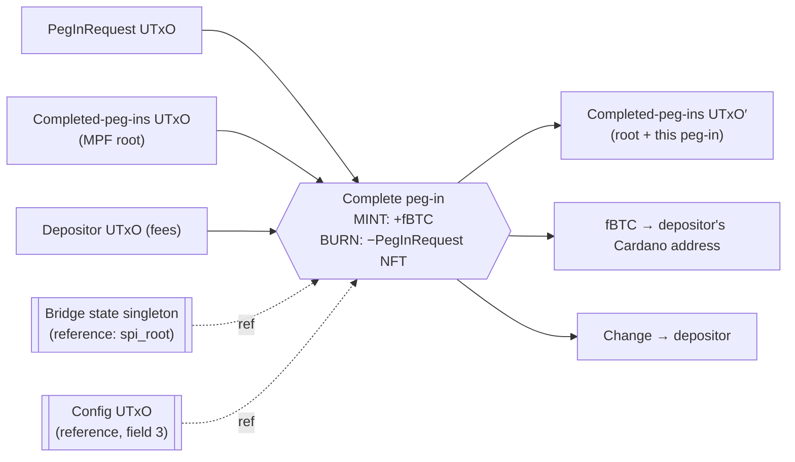
```mermaid
flowchart LR
  pir["PegInRequest UTxO"] --> tx{{"Complete peg-in<br/>MINT: +fBTC<br/>BURN: −PegInRequest NFT"}}
  cpi_in["Completed-peg-ins UTxO<br/>(MPF root)"] --> tx
  dep["Depositor UTxO (fees)"] --> tx
  bss_ref[["Bridge state singleton<br/>(reference: spi_root)"]] -. ref .-> tx
  cfg_ref[["Config UTxO<br/>(reference, field 3)"]] -. ref .-> tx
  tx --> cpi_out["Completed-peg-ins UTxO′<br/>(root + this peg-in)"]
  tx --> fbtc["fBTC → depositor's Cardano address"]
  tx --> change["Change → depositor"]
```

**Structure**

| Role | Content |
|------|---------|
| **Inputs** | PegInRequest UTxO; Completed-peg-ins trie UTxO (MPF root update); Depositor UTxO (fees) |
| **Reference inputs** | the bridge state singleton — supplies `spi_root`, located by the redeemer's `bridge_state_ref_input_index` and authenticated by the `"BSS"` NFT ([CPI-10]); Config UTxO — supplies `bridge_state_policy` (field 3) |
| **Mint** | +`peg_in_amount` fBTC (asset name `"fSAT"`, [CFG-1]); −1 PegInRequest NFT |
| **Outputs** | Updated Completed-peg-ins trie UTxO (new MPF root including this peg-in; same NFT, same address); fBTC → depositor-chosen address; change |
| **Witness data (redeemer)** | depositor's x-only BTC pubkey + BIP-322 signature; `sweeping_tm_input_0` (36 B) + MPF membership proof against `spi_root` ([CPI-9]); non-membership proof of the peg-in against the current CPI root + updated-root proof |
| **Validity interval** | unconstrained |
| **Required signers** | depositor (fee spend) |
| **Size (est.)** | ~3 KB per mint: redeemer ~1.9 KB (BIP-322 sig + pubkey + three MPF proofs at ~600 B each); input datum ~500 B (PegInRequest). Fee ≈ 0.4 ADA. The [CPI-9] membership proof replaced rev 5.1's `list.has` over up to 100 outpoints plus a large `Confirmed`-datum read — completion got cheaper. |

**Checks enforced on-chain** (`bridged-token.ak` mint + `peg-in.ak` spend)

* **[CPI-1]** ~~Verify the referenced `Confirmed TM tx` UTxO carries a legitimate TM NFT.~~ — **Withdrawn (rev 5.4)**. No `Confirmed` TM record is referenced; [CPI-9]/[CPI-10] prove the sweep against the singleton.
* **[CPI-2]** ~~Verify `peg_in_utxo_id` appears in `Confirmed.swept_peg_in_utxo_ids`.~~ — **Withdrawn (rev 5.4)**. Same replacement.
* **[CPI-9]** `peg-in.ak` MUST verify an MPF **membership** proof that the bridge state singleton's `spi_root` maps `datum.peg_in_utxo_id` to the sweeping TM's input-0 outpoint (36 bytes), supplied in the redeemer as `sweeping_tm_input_0`.
* **[CPI-10]** `peg-in.ak` MUST authenticate that reference input by the NFT `(bridge_state_policy, "BSS")`. `bridge_state_policy` is read from the Config reference input at runtime ([PAR-1]), never from a validator parameter.
* **[CPI-3]** *(Revised, rev 5.4: the signed digest drops `btc_txid`)* `peg-in.ak` MUST verify the depositor's **BIP-322** signature over the **per-mint signing message**, under the auth key recorded in the PegInRequest datum (`user_source_chain_pub_key` = the beacon's `Q_auth`). At PegInRequest **mint** time that key — together with `peg_in_utxo_id` and `peg_in_amount` — is bound to the depositor's *actual* deposit (`bitcoin.deposit_binding_ok`). *This is what proves the depositor — not a watchtower — is claiming the fBTC.*

  The signed message is the ASCII text `BFR-mint-v1:<64-hex>`, where the hex is

  ```
  sha2_256("BFR-mint-v1" ‖ peg_in_utxo_id ‖ chosen_cardano_address)
  ```

  signed as a **BIP-322 simple** signature from the Taproot address whose output key is `Q_auth`
  (tag `BIP0322-signed-message`): the validator reconstructs the virtual `to_spend`/`to_sign`
  key-path sighash on-chain and verifies the 64-byte Schnorr signature under `Q_auth`. BIP-322 —
  rather than a raw BIP340 signature over the hash — is what makes completion possible from any
  standard Taproot wallet (`signMessage(text, "bip322-simple")`); raw-key signing interfaces are
  not generally wallet-accessible.

  > **Unaffected by the 2026-08-12 beacon decision, and deliberately so.** The beacon shrinks to
  > `"BFR" ‖ Q_auth` (35 bytes) — see the decision note under *Deposit (Bitcoin)* — but this rule
  > does not move: the auth key is still `Q_auth`, still the Taproot **output** key, still
  > BIP-322-signed, so completion still works from any standard Taproot wallet via
  > `signMessage(text, "bip322-simple")`. Preserving exactly this sentence is why the beacon
  > carries `Q_auth` rather than the raw key `D`; under `D` it would have been false.

  * `"BFR-mint-v1"` — domain-separation tag (BIP340 practice).
  * `peg_in_utxo_id` — binds the signature to **this specific peg-in**. Without it, if a depositor reused the same BTC pubkey across multiple peg-ins in the same TM, publishing the signature to claim one would let an attacker replay it to claim the others.
  * `chosen_cardano_address` — binds the signature to the **destination the depositor chose**. Prevents reorg-based front-running where an attacker replays the signature with their own Cardano address after a short chain reorganisation of the depositor's mint tx.
* **[CPI-4]** `bridged-token.ak` MUST verify the peg-in is **not yet** in the completed-peg-ins trie (MPF non-membership proof).
* **[CPI-5]** `bridged-token.ak` MUST verify the peg-in **is** in the new MPF root in the output (prevents double-mint).
* **[CPI-6]** `bridged-token.ak` MUST verify the fBTC minted equals the amount parsed from the raw BTC peg-in tx, under the [CFG-1] constant asset name.
* **[CPI-7]** ~~Pay the referenced record's pinned `leader_reward` to its `poster`.~~ — **Withdrawn (rev 5.4)**, not replaced. The leader reward is DEFERRED (see *Cardano submission and leader reward*). **[CPI-11]** and **[CPI-12]** are PARKED: implementers MUST NOT build them.
* **[CPI-8]** `peg-in.ak` MUST verify the PegInRequest NFT is burned.

> **Why [CPI-3] may drop `btc_txid`.** No reader can supply it any more — the singleton records
> the sweeping TM's input-0 outpoint, not its txid. Nothing is lost: `btc_txid` bound the message
> to the confirmed TM, and [CPI-9] now proves that binding directly against attested state. The
> replay-resistance the field never provided is still provided by `peg_in_utxo_id` (binds the
> signature to this deposit) and `chosen_cardano_address` (binds it to this destination).

> **Trie value.** Per §The two deposit tries, the CPI trie insert records the **same** value the
> SPI trie holds — the sweeping TM's input-0 outpoint — not `peg_in_utxo_id` echoed as its own
> value.

> **Implementation note — where the TM is verified.**
> `CompletePegIn` does **not** carry the raw TM tx or any Bitcoin Merkle/inclusion proof. The
> TM's txid was recomputed with on-chain witness-stripping and proven oracle-confirmed *earlier*,
> in the **Confirm TM tx** step (binocular `confirm-tmtx`), which wrote `spi_root` into the
> singleton; none of that is repeated at completion. The depositor key / amount / outpoint are
> bound to the real deposit tx at PegInRequest **mint** time (`bitcoin.deposit_binding_ok`). The
> peg-in *deposit* tx (`source_chain_peg_in_raw_tx`) is stored already witness-stripped — its
> witnesses are never inspected.
>
> **Decisions and rejected alternatives.**
>
> * The singleton reference input is located by a redeemer **index**
>   (`bridge_state_ref_input_index`). *Rejected*: scanning `reference_inputs` for the "BSS" NFT. The
>   scan costs O(reference inputs) and would silently pick a different UTxO if one ever matched; a
>   wrong index traps instead.
> * The datum is decoded as `BridgeState` and `spi_root` is read **by field name** ([LIB-1]).
>   *Rejected*: `utils.get_mpf_from_output`, which reads field 0 blindly ([LIB-2]). The test
>   fixture puts a decoy trie in `cpo_root` so a swapped read fails.

### Complete peg-out / burn fBTC (Cardano)

<!-- G28 superseded 2026-08-05 (rev 5.1, attested-root redesign): permissionless completion via a
     value-bound membership proof against the completed-peg-outs trie. The
     legit_treasury_movement_and_peg_out_produced verifier and the raw-TM-against-Binocular scheme
     it documented are WITHDRAWN — see the CPO-* check inventory below. -->
**Purpose**: unlock a PAID PegOut request — burning its locked fBTC (full gross) and paying its
MIN_ADA (plus any overfunded lovelace or stray tokens) to whoever completes it. Completion is
**permissionless cleanup**: it proves nothing about *who* is acting, only that the completed-peg-outs
trie already attests this exact payment.

**Who**: **anyone** — completion carries no authorization check. Whoever pays the transaction fee
keeps the reward.
**Trigger**: the confirmed TM that paid this peg-out has updated `cpo_root` in the bridge state
singleton (at Confirm TM tx) so that this POR's id is present with the value this peg-out expects.

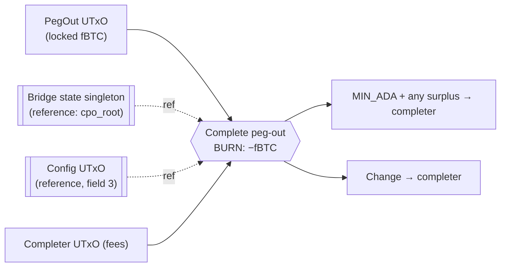
```mermaid
flowchart LR
  pout["PegOut UTxO<br/>(locked fBTC)"] --> tx{{"Complete peg-out<br/>BURN: −fBTC"}}
  bss_ref[["Bridge state singleton<br/>(reference: cpo_root)"]] -. ref .-> tx
  cfg_ref[["Config UTxO<br/>(reference, field 3)"]] -. ref .-> tx
  comp["Completer UTxO (fees)"] --> tx
  tx --> reward["MIN_ADA + any surplus → completer"]
  tx --> change["Change → completer"]
```

**Structure**

| Role | Content |
|------|---------|
| **Inputs** | PegOut UTxO (unlocks fBTC); completer UTxO (fees) |
| **Reference inputs** | the bridge state singleton — supplies the attested `cpo_root`, authenticated by the NFT `(bridge_state_policy, "BSS")` ([CPO-11]); Config UTxO — supplies `bridge_state_policy` (field 3) |
| **Mint** | −fBTC (equal to the full fBTC held by the PegOut UTxO) |
| **Outputs** | the PegOut UTxO's entire non-fBTC content (MIN_ADA, plus any overfunded lovelace or stray tokens) → wherever the completer directs it — no on-chain destination check; change |
| **Witness data (redeemer)** | `por_id` (= `hash_output_ref` of the PegOut UTxO's own outpoint, computed on-chain — no datum field needed); MPF **membership** proof of `por_id ↦ dest_spk ‖ amount_le8` against the completed-peg-outs trie root, where `amount = locked fBTC − datum.per_pegout_fee` |
| **Validity interval** | unconstrained |
| **Required signers** | none — permissionless; only the fee payer signs |
| **Size (est.)** | dominated by the MPF membership proof (a handful of ~40–70 B siblings for a trie with thousands of entries) — no raw TM, no Binocular proof. Materially smaller than the pre-rev-5.1 design. |

**Checks enforced on-chain** (`peg-out.ak` withdraw, `CompletePegOut` action)

* **[CPO-1]** ~~The withdraw script MUST verify the supplied block header is in Binocular's confirmed-chain root.~~ — **Withdrawn (rev 5.1)**. Completion no longer reads Binocular; the completed-peg-outs trie is the sole source of payment truth (see *Confirm TM tx*).
* **[CPO-2]** ~~The withdraw script MUST verify the TM tx is Merkle-included in that block.~~ — **Withdrawn (rev 5.1)**. No raw TM is supplied at completion.
* **[CPO-3]** ~~`peg-out.ak` MUST verify completion is authorized per the PegOut datum's `owner_auth`.~~ — **Withdrawn (rev 5.1)**. See the rationale note below: completion only burns, never moves, fBTC, and only against a value-bound attested payment, so authorization adds nothing.
* **[CPO-4]** ~~The `legit_treasury_movement_and_peg_out_produced` verifier MUST verify, in one forward scan of the raw TM bytes, that the TM **spends** `source_chain_treasury_utxo_id`.~~ — **Withdrawn (rev 5.1)**. The pinned-treasury-outpoint field no longer exists in `PegOutDatum` (see *Create PegOut request*).
* **[CPO-5]** ~~The same verifier MUST verify the TM **produces** an output paying `source_chain_destination_address` exactly `amount − datum.per_pegout_fee` satoshis.~~ — **Withdrawn (rev 5.1)**. Superseded by [CPO-12]'s value-bound membership proof, which checks the identical arithmetic against the trie instead of a raw TM output.
* **[CPO-6]** ~~`peg-out.ak` MUST cross-check the verifier's redeemer fields against the spent PegOut datum, the locked fBTC quantity, `peg_out_utxo_id`, and the supplied raw TM bytes.~~ — **Withdrawn (rev 5.1)**. No separate verifier redeemer exists to cross-check.
* **[CPO-7]** ~~The withdraw script MUST verify `peg_out_utxo_id` is **not yet** in the completed-peg-outs trie (MPF non-membership proof).~~ — **Withdrawn (rev 5.1)**. Completion now proves **membership**, the opposite predicate — see [CPO-12].
* **[CPO-8]** ~~The withdraw script MUST verify `peg_out_utxo_id` **is** inserted into the updated root of the continuing Completed-peg-outs output.~~ — **Withdrawn (rev 5.1)**. Completion no longer spends or writes the trie at all — the trie root advances only at TM Confirm (see *Confirm TM tx*).
* **[CPO-9]** `peg-out.ak` MUST verify the burned fBTC equals the full (gross) fBTC held in the PegOut UTxO. **(Kept, unchanged.)**
* **[CPO-10]** *(Adapted, rev 5.1)* `peg-out.ak` places **no on-chain constraint** on the PegOut UTxO's non-fBTC content at Complete — by Cardano's value-balance rule it flows to whatever output(s) the completer directs. This is the completion incentive: the completer keeps the MIN_ADA **and** any overfunded lovelace or stray tokens a careless requester locked in (see the rationale note below).
* **[CPO-11]** *(Revised, rev 5.4)* `peg-out.ak` MUST verify the bridge state singleton reference input carries the NFT `(bridge_state_policy, "BSS")` — a stale or forged root cannot authenticate a payment, so an unauthenticated reference input MUST trap rather than be trusted.
* **[CPO-12]** `peg-out.ak` MUST verify an MPF **membership** proof that the completed-peg-outs trie root maps `por_id` (this PegOut UTxO's own outpoint hash) to `source_chain_destination_address ‖ le8(locked fBTC − datum.per_pegout_fee)` — value-bound against **this PegOut's own datum-pinned fee**, never a current Config value (see *Create PegOut request → Operational parameters*).
* **[CPO-13]** *(New, rev 5.4)* `peg-out.ak` MUST read `BridgeState.cpo_root`, decoded as `BridgeState` and accessed by field name, per [LIB-1]. A blind field-0 read would return `spi_root` — and against a wrong root `mpf.miss` SUCCEEDS, which is the Cancel double-claim ([LIB-2]).

> **Why permissionless completion is safe.** Completion can only **burn** the requester's
> own locked fBTC — it can never redirect, mint, or move it elsewhere — and it can only do so
> against a **value-bound** proof that the completed-peg-outs trie — its root a quorum
> attestation written into the bridge state singleton exclusively at TM Confirm (see *Confirm TM
> tx*) — already records this exact
> `(por_id, dest_spk, amount)` triple. `owner_auth` therefore adds nothing at Complete: the
> requester has already been paid on Bitcoin by the time anyone can complete, and no one but the
> requester loses fBTC. Making completion permissionless instead turns it into a **cleanup
> incentive** — anyone may complete a paid POR and keep its MIN_ADA — which prevents paid-but-unswept
> PORs from bloating protocol state indefinitely. The flip side: the completer also keeps ANY
> lovelace or tokens beyond MIN_ADA the PegOut UTxO holds, because `owner_auth` is an
> `AuthorizationMethod`, not a payable address, so on-chain code has no destination to route a
> surplus back to. **Client-side rule (normative for request-building tooling):** software creating
> a PegOut request MUST NOT lock more than MIN_ADA, or attach any token beyond the locked fBTC, at
> the `peg-out.ak` address — any surplus is an unrecoverable gift to whoever completes the request
> (see *Create PegOut request*).

<!-- G18 superseded 2026-08-05 (rev 5.1, attested-root redesign): timeout + non-membership proof
     against the completed-peg-outs trie, replacing the Binocular-based
     legit_treasury_movement_and_peg_out_not_produced verifier (WITHDRAWN — see the CXL-* check
     inventory below). -->
### Cancel PegOut request (Cardano)

**Purpose**: return the locked fBTC and MIN_ADA of a peg-out that has run past its fulfillment
window with no confirmed TM ever having paid it.

**Who**: the withdrawer — cancel must satisfy the PegOut datum's `owner_auth`.
**Trigger**: the validity range lies entirely after `created + peg_out_cancel_timeout_ms` (30
days) AND this POR's id is provably absent from the completed-peg-outs trie.

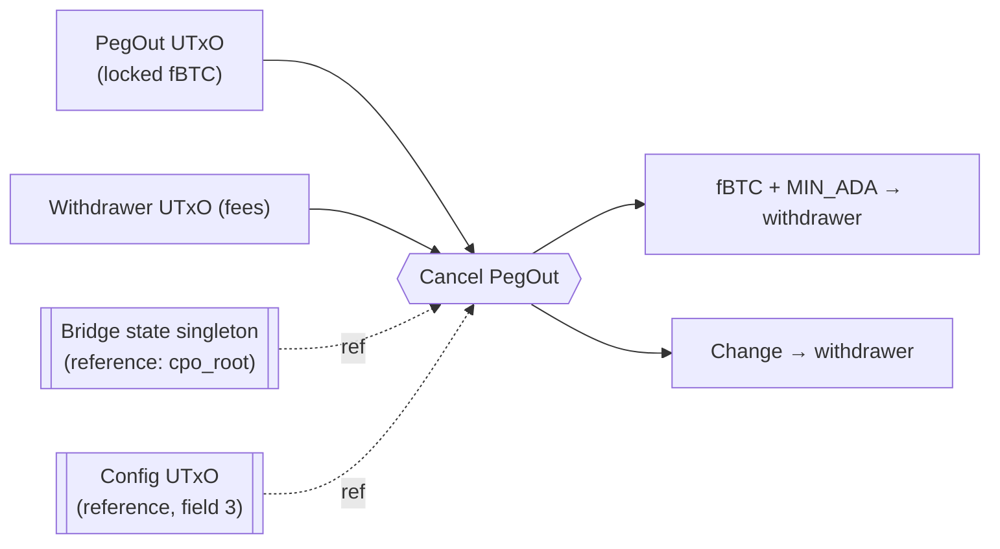
```mermaid
flowchart LR
  pout["PegOut UTxO<br/>(locked fBTC)"] --> tx{{"Cancel PegOut"}}
  wdraw["Withdrawer UTxO (fees)"] --> tx
  bss_ref[["Bridge state singleton<br/>(reference: cpo_root)"]] -. ref .-> tx
  cfg_ref[["Config UTxO<br/>(reference, field 3)"]] -. ref .-> tx
  tx --> refund["fBTC + MIN_ADA → withdrawer"]
  tx --> change["Change → withdrawer"]
```

**Structure**

| Role | Content |
|------|---------|
| **Inputs** | PegOut UTxO; withdrawer UTxO (fees) |
| **Reference inputs** | the bridge state singleton — supplies the attested `cpo_root` ([CXL-8], [CPO-13]); Config UTxO — supplies `bridge_state_policy` (field 3) |
| **Mint** | — (nothing is minted or burned; the fBTC returns to its owner) |
| **Outputs** | locked fBTC + MIN_ADA → withdrawer (per `owner_auth`); change |
| **Witness data (redeemer)** | `por_id` (computed on-chain from the PegOut UTxO's own outpoint); MPF **non-membership** (exclusion) proof of `por_id` against the completed-peg-outs trie root |
| **Validity interval** | entirely after `datum.created + peg_out_cancel_timeout_ms` |
| **Required signers** | per `owner_auth` |

**Checks enforced on-chain** (`peg-out.ak` withdraw, `Cancel` action)

* **[CXL-1]** ~~`peg-out.ak` MUST verify the supplied block header is in Binocular's confirmed-chain root.~~ — **Withdrawn (rev 5.1)**. Cancel no longer reads Binocular.
* **[CXL-2]** ~~`peg-out.ak` MUST verify the supplied tx is Merkle-included in that block.~~ — **Withdrawn (rev 5.1)**. No raw Bitcoin tx is supplied at cancel.
* **[CXL-3]** ~~`peg-out.ak` MUST verify the tx **spends** `source_chain_treasury_utxo_id`.~~ — **Withdrawn (rev 5.1)**. The pinned-treasury-outpoint field no longer exists in `PegOutDatum`.
* **[CXL-4]** ~~The `legit_treasury_movement_and_peg_out_not_produced` verifier MUST verify the tx contains **no output** paying `source_chain_destination_address` the amount `locked fBTC − datum.per_pegout_fee`.~~ — **Withdrawn (rev 5.1)**. Superseded by [CXL-9]'s non-membership proof against the trie.
* **[CXL-5]** `peg-out.ak` MUST verify the cancel is authorized per the PegOut datum's `owner_auth`. **(Kept, unchanged.)**
* **[CXL-6]** `peg-out.ak` MUST verify the locked fBTC is paid to the withdrawer — not burned (no bridged-token mint or burn in this action). **(Kept, unchanged.)**
* **[CXL-7]** `peg-out.ak` MUST verify the transaction's validity range lies ENTIRELY after `datum.created + peg_out_cancel_timeout_ms`, where `peg_out_cancel_timeout_ms = 2_592_000_000` (30 days) is a `peg-out.ak` validator constant. A validity range that only partly clears the boundary MUST still fail — the boundary is exclusive.
* **[CXL-8]** *(Revised, rev 5.4)* `peg-out.ak` MUST verify the bridge state singleton reference input carries the NFT `(bridge_state_policy, "BSS")` — same authentication requirement as [CPO-11].
* **[CXL-9]** `peg-out.ak` MUST verify an MPF **non-membership** (exclusion) proof that `por_id` is absent from the trie root.

> **Why cancel can never race a payout.** The completed-peg-outs root is on-chain the
> instant a TM confirms (written into the bridge state singleton at *Confirm TM tx*, before any
> completion can happen). So a POR
> that a TM has paid is provably a member of the trie from that moment on — [CXL-9]'s
> non-membership proof can never be constructed for it again, at any later time. There is no
> window, and no third-party liveness assumption, in which a paid POR could still be cancelled:
> unlike a design resting on permissionless sweep liveness, withholding a sweep gains an adversary
> nothing here, because cancel-safety is already on-chain the moment the TM confirms.
> [CXL-7]'s 30-day timeout exists only to bound how long an honestly-unfulfilled POR (never
> included in any TM) ties up its fBTC before its owner can reclaim it — the SPO fulfillment
> freshness filter (see *Deterministic skip rule*) stops the TM builder from including a request
> whose cancel window is imminent, so a live roster fulfills or lets expire, never both.

### Close PegInRequest (Cardano)

**Purpose**: burn the PegInRequest NFT and reclaim its MIN_ADA for a request that can never
complete.

**Who**: the request's creator — per the datum's `owner_auth`.
**Trigger**: either **(a)** the deposit was never swept and the grace period has passed, or
**(b)** the fBTC was already minted through another PegInRequest for the same deposit.

**Structure**

| Role | Content |
|------|---------|
| **Inputs** | PegInRequest UTxO; creator UTxO (fees) |
| **Reference inputs** | Config UTxO; branch (a): the bridge state singleton; branch (b): the completed-peg-ins trie UTxO |
| **Mint** | −1 PegInRequest NFT |
| **Outputs** | MIN_ADA → creator; change |
| **Witness data (redeemer)** | `Close { burnt_peg_in_nft_asset_name, proof }`, where `proof` is `NeverSwept` or `Duplicate` |
| **Validity interval** | branch (a): finite `invalid_before` REQUIRED, strictly after `created + peg_in_close_timeout_ms`. Branch (b): unconstrained |
| **Required signers** | per `owner_auth` |

**Checks enforced on-chain** (`peg-in.ak` withdraw, `Close` action)

Branch (a), never swept, needs [CLR-5] **and** [CLR-6]. Branch (b), duplicate, needs [CLR-8]
**alone**. [CLR-9] to [CLR-11] apply to both.

* **[CLR-5]** `peg-in.ak` MUST verify the transaction's validity range lies entirely after
  `created + peg_in_close_timeout_ms`.
* **[CLR-6]** `peg-in.ak` MUST verify `mpf.miss(spi_root, peg_in_utxo_id, proof)` against the
  bridge state singleton reference input, authenticated by the NFT (`bridge_state_policy`, `"BSS"`)
  and decoded as a `BridgeState` **by field name** ([LIB-1]).
* **[CLR-7]** `peg-in.ak` MUST verify, at mint time, that the new `PegInDatum`'s `created` equals
  the mint transaction's validity upper bound exactly, which MUST be finite.
* **[CLR-8]** `peg-in.ak` MUST accept, as an alternative to [CLR-5] and [CLR-6],
  `mpf.has(cpi_root, peg_in_utxo_id, value, proof)` against the completed-peg-ins trie reference
  input, authenticated by the NFT (`completed_peg_ins_policy`, `"CPI"`). `value` is the sweeping
  TM's input-0 outpoint (see *The two deposit tries*), supplied in the redeemer.
* **[CLR-9]** `peg-in.ak` MUST verify the close is authorized by the datum's `owner_auth`.
* **[CLR-10]** `peg-in.ak` MUST verify the PegInRequest NFT is burned — quantity −1 under the
  peg-in policy for the input's asset name.
* **[CLR-11]** `peg-in.ak` MUST verify the transaction mints and burns no fBTC — quantity 0 under
  (`bridged_token_policy`, `"fSAT"`).
* **[CLR-1]**, **[CLR-2]** — renumbered, not withdrawn: [CLR-9] restates [CLR-1] and [CLR-10]
  restates [CLR-2].
* **[CLR-3]** ~~Branch (a) MUST verify a Binocular-confirmed Bitcoin transaction spends
  `peg_in_utxo_id` via the depositor refund leaf.~~ — **Withdrawn (rev 5.4)**. [CLR-5] and [CLR-6]
  replace it.
* **[CLR-4]** ~~Branch (b) MUST verify a trie membership proof against the completed-peg-ins
  trie.~~ — **Withdrawn (rev 5.4)**. [CLR-8] replaces it, with the value binding [CLR-4] lacked.

`peg_in_close_timeout_ms` is a `peg-in.ak` constant of `2_592_000_000` — thirty days, mirroring
`peg_out_cancel_timeout_ms`.

> **Why the non-membership carries the safety and the timeout does not.** [CLR-6] is what makes a
> close unable to grief a depositor: a swept deposit is in `spi_root` and no exclusion proof for it
> can ever be built again. The only gap is the window between a sweep confirming on Bitcoin and its
> TM confirming on Cardano, where the deposit is swept but not yet in `spi_root`. That window is
> not dangerous, because closing a PIR is **not destructive** — creating one is permissionless and
> needs only the deposit proof, so a request closed in that window is simply re-created and
> completed. [CLR-5] exists to make that churn rare, not to make the rule safe.

> **Why [CLR-5]'s clock does not match the Bitcoin refund timeout, and must not try.** The
> deposit's refund leaf uses `refund_timeout`, measured in Bitcoin BLOCKS from the deposit's own
> confirmation. [CLR-5] measures POSIX milliseconds from PIR creation on Cardano, and a PIR may be
> created long after its deposit. The two clocks have different units and different anchors, so
> agreement is impossible. It is also unnecessary: [CLR-6], not the timeout, establishes deadness.

> **Why the duplicate branch has no timeout.** [CLR-8] proves the deposit already minted. Nothing
> that happens later can revive the request, so waiting thirty days would only lock MIN_ADA for no
> gain. This is why [CLR-8] is an *alternative* to [CLR-5]+[CLR-6], not an addition.

> **Implementation status (rev 5.4).** All of [CLR-5] to [CLR-11] are implemented in
> `onchain/validators/bitcoin/peg-in.ak`, and each check cites its ID in a `// spec [CLR-n]`
> comment. Decisions worth recording:
>
> * **The close verifier script is gone**, together with its Config field (rev 5.1's #6) and the
>   F1–F6 close milestone's on-chain work. Rev 5.1 needed a separate script only because [CLR-3]
>   had to parse a Bitcoin witness and disambiguate which Taproot leaf was revealed. Under [CLR-6]
>   the question is not "did the depositor refund" but "was this deposit ever swept", which the SPI
>   trie answers directly. Rejected alternative: keep the verifier for the refund case. It would
>   duplicate, in Bitcoin parsing, a strictly weaker version of what an MPF non-membership proof
>   already proves — a refunded deposit is by definition unswept, so [CLR-6] covers it.
> * **[CLR-8] binds the trie VALUE**, not only the key. Withdrawn [CLR-4] proved membership alone.
>   Binding the value keeps the CPI trie's contract identical on both readers (*Complete peg-in*
>   inserts that value, Close reads it back), so a future divergence in what the trie stores
>   fails loudly here instead of silently accepting.
> * **Both branches locate their reference input by redeemer index**, then authenticate it by NFT.
>   Rejected alternative: scan `reference_inputs` for the NFT. The scan costs O(reference_inputs)
>   and would silently pick a different UTxO if one ever matched, whereas a wrong index traps.
> * The bridge state policy is read from Config at runtime ([PAR-1]), so `peg-in.ak` needs no new
>   validator parameter and no address change when the singleton policy rotates.

<!-- G2 (revised 2026-07-15; superseded 2026-07-17): the tunables were moved out of the Config
     into their own singleton, then merged back in when update_auth governance landed. Updates
     are now authorized Config Updates; the separate params contract is cancelled. -->
### Update operational parameters (Cardano)

**Purpose**: change the tunable protocol values (fee rate, per-peg-out fee floor, minimum
peg-out, schedule). Since the 2026-07-17 merge these are Config data — nested as field #14
`params` since rev 5.4 — so this is an authorized **Config Update** — the same transaction that
rewires the instance — not a separate contract.

**Who**: whoever satisfies `update_auth` (Config #0); `None` means the Config is permanently
frozen and no update is possible.
**Trigger**: parameter drift — the Bitcoin fee market above all (see *Stuck-TM recovery*).

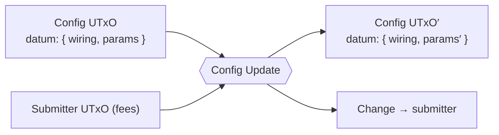
```mermaid
flowchart LR
  cfg["Config UTxO<br/>datum: { wiring, params }"] --> tx{{"Config Update"}}
  sub["Submitter UTxO (fees)"] --> tx
  tx --> cfg2["Config UTxO′<br/>datum: { wiring, params′ }"]
  tx --> change["Change → submitter"]
```

**Structure**

| Role | Content |
|------|---------|
| **Inputs** | Config UTxO; submitter UTxO (fees) |
| **Reference inputs** | whatever the configured `update_auth` method needs to prove authorization |
| **Mint** | — (the Config NFT is carried over) |
| **Outputs** | Config UTxO′ at the byte-identical address — same NFT, new datum |
| **Witness data (redeemer)** | `ConfigSpendRedeemer::Update` |
| **Validity interval** | unconstrained |
| **Required signers** | as `update_auth` requires |

**Checks enforced on-chain** (`config.ak` spend, `Update` redeemer)

* **[UOP-1]** `config.ak` MUST verify the spent datum's `update_auth` (#10) is present — `None` is permanently frozen, hence unspendable — and that the transaction satisfies it.
* **[UOP-2]** `config.ak` MUST verify there is exactly one continuing output at the Config's own script credential, at the byte-identical full address (stake credential included), carrying an inline datum.
* **[UOP-3]** `config.ak` MUST verify the Config NFT continues in that output and is the only token of the Config's own policy, and that the output's non-ADA value is otherwise unchanged — the Config is a reference input of nearly every bridge transaction, so junk assets would bloat all of them.

**Checks delegated off-chain** (the governing authority)

The new datum's shape and values are deliberately **not** validated on chain: any inline datum is
accepted, because datum evolution is an explicit goal and readers use positional getters.

* The authority MUST write a datum that current readers can still parse, and MUST keep #10
  parseable as `Option<AuthorizationMethod>` — anything else halts the bridge or freezes the
  Config until a later Update repairs it.
* The authority MUST enforce parameter sanity: `min_peg_out_fbtc > per_pegout_fee + 330` (Bitcoin
  P2TR dust); all values non-negative; the schedule invariants of the constrained rows in *TM
  batches and the protocol schedule* (e.g. `stability_window` never below the host chain's `3k/f`,
  deadline ordering, `tm_recovery_window` above normal confirmation latency).

Off-chain effect: per the determinism rules, new fee values apply from the **next** TM batch
snapshot and new schedule values from the **next epoch boundary** — never to a batch already
frozen or in signing. Unlike the superseded params-singleton design, this update **does**
invalidate in-flight transactions that reference the Config; the cost is bounded by governance
cadence (see *Operational parameters*).

<!-- G5: new catalog entry — the Update-Y transaction existed only as narrative (epoch phase,
     DKG finalization step 5, "Key publication"). The key-rotation spend branch has since landed
     in treasury.ak (N10a: `UpdateY`, alongside `RegistryUpdate` and `FederationReset`). -->
### Update-Y — rotate the treasury group key (Cardano)

**Purpose**: publish the epoch's DKG result — swap `current_spos_frost_key` in the Treasury state
UTxO from the outgoing roster's key to the incoming roster's $Y_{51}'$ — so depositors and
validators derive the new Treasury and peg-in Taproot addresses from on-chain state.

**Who**: submission is **permissionless** — the group signature carried in the redeemer is the
authorization (see the note below). By convention, the leader selected with
`tm_sequence = "dkg"` submits first (see *Cardano submission and leader reward*).
**Trigger**: the incoming roster's DKG finalized; before the final TM of the epoch (whose change
output pays the address derived from the new key).

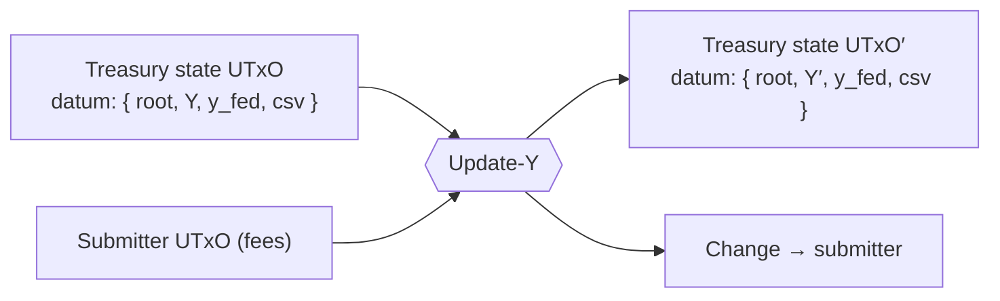
```mermaid
flowchart LR
  tstate["Treasury state UTxO<br/>datum: { root, Y, y_fed, csv }"] --> tx{{"Update-Y"}}
  sub["Submitter UTxO (fees)"] --> tx
  tx --> tstate2["Treasury state UTxO′<br/>datum: { root, Y′, y_fed, csv }"]
  tx --> change["Change → submitter"]
```

**Structure**

| Role | Content |
|------|---------|
| **Inputs** | Treasury state UTxO; submitter UTxO (fees) |
| **Reference inputs** | — (the authorizing key is in the spent datum) |
| **Mint** | — (the Treasury state NFT is carried over) |
| **Outputs** | Treasury state UTxO′ at the same `treasury.ak` address — same NFT, same `bifrost_identity_root`, same federation fields; only `current_spos_frost_key` changes |
| **Witness data (redeemer)** | `new_key` (32 B x-only) + 64-byte BIP340 signature under the **spent datum's** `current_spos_frost_key` |
| **Validity interval** | unconstrained |
| **Required signers** | submitter (fee spend) — permissionless |

**Signed message**

```
sig_msg = sha2_256("bifrost-update-y" ‖ spent_treasury_outpoint (36 B: txid ‖ index LE)
                    ‖ epoch (8 B BE) ‖ new_key (32 B))
```

**Checks enforced on-chain** (`treasury.ak` spend, key-rotation branch)

* **[UY-1]** `treasury.ak` MUST verify the continuing output is at `treasury.ak` and carries the Treasury state NFT.
* **[UY-2]** `treasury.ak` MUST verify the datum transition per the field-permission matrix (§Treasury state UTxO): only
  `current_spos_frost_key` changes; `bifrost_identity_root` and the federation fields are
  byte-identical.
* **[UY-3]** `treasury.ak` MUST verify `verifySchnorrSecp256k1Signature(spent_datum.current_spos_frost_key, sig_msg, signature)` —
  the *outgoing* key authorizes its own succession. In Phase 1 the spent datum holds
  $Y_{federation}$, so the federation signs the first rotation; thereafter each outgoing roster
  hands off to the next.
* **[UY-4]** `treasury.ak` MUST verify `new_key` is 32 bytes (a valid x-only point).

> **Why submission is permissionless.** The transaction is valid because of *what* it carries,
> not *who* submits it: the BIP340 group signature can only exist if the threshold (51% of stake
> — or the federation, in Phase 1) actually agreed, and the signed message pins the new key, the
> epoch, and the spent outpoint — a submitter can neither forge nor alter the payload, only
> deliver it or not. Replay is structurally impossible: the message commits to the very outpoint
> this transaction consumes, so no second transaction can ever reuse the signature. A submitter
> gate would therefore add no security — but it would add a censorship/liveness dependency on the
> gated party, for a transaction the whole bridge waits on (deposit addresses derive from this
> key). Same principle as the TM chain: oracle- or signature-backed payloads need no submitter
> authorization. The leader convention exists only to avoid duplicate fee spending.

<!-- G25 (d), ratified 2026-07-15, superseded 2026-08-06 (rev 5.4): the guarded FederationReset
     branch is removed; [UY-5] revised makes the federation a standing co-authority. -->
**Update-Y, federation branch (rev 5.4).** Ordinary Update-Y requires the *current* key's
signature — so a permanently dead roster would deadlock the datum key forever. The federation
branch breaks the deadlock:

* **[UY-5]** *(Revised again, rev 5.5)* `treasury.ak` MUST accept an Update-Y authorized by a
  BIP340 signature under **`y_federation`**, in place of [UY-3]'s signature under
  `current_spos_frost_key`. Rev 5.5 moves the key: it is read from the Config reference input
  (field #11), not from the spent datum, because `TreasuryDatum` no longer carries it ([CFG-6]).
* **[UY-6]** ~~The reset sets `current_spos_frost_key` only to `y_federation` itself.~~ —
  **Withdrawn (rev 5.4)**. The federation MAY name any key.
* **[UY-7]**, **[UY-8]** ~~The Binocular-confirmed federation-CSV sweep proof and its freshness
  anchor.~~ — **Withdrawn (rev 5.4)** with the `FederationReset` branch. No sweep evidence and no
  freshness anchor are required. The `spent_via_federation_leaf` datum flag and
  `last_reset_tm_txid` machinery they gated are gone with them. Rev 5.5 deletes
  `last_reset_tm_txid` from the datum outright; it was kept for shape stability only until the
  next instance.
* **[UY-9]**, **[UY-10]** — NEVER ISSUED. An earlier draft used them to relocate the sweep
  evidence into the bridge state singleton instead of removing it.
* Every other Update-Y rule is unchanged. The branch differs only in whose signature authorizes
  it.

> **Why [UY-6] is not worth keeping.** It restricted the federation to setting `y_federation`
> itself. That is trivially bypassed in two transactions: set `current_spos_frost_key` to
> `y_federation`, then sign the next rotation as the current key and name anything. The
> restriction buys one transaction of delay, not a bound.

> **Why there is no timeout.** A timeout would make this a dead-man switch rather than a standing
> authority, but it needs an anchor that tracks whether the roster can still sign.
> `last_rotation` does not: a live roster whose DKG merely fails stops rotating and becomes
> indistinguishable from a dead one, so two idle epochs would let the federation demote a roster
> that is signing batches perfectly well. Fixing that needs either a mandatory no-op rotation
> from the roster or a liveness field on the singleton, and both belong to the key lifecycle
> design rather than to this revision.

**Federation co-authority.** [UY-5] makes the federation a **standing co-authority** over the
treasury key, not an emergency fallback. It may rotate `current_spos_frost_key` at any moment, to
any value, without proving anything about the roster. That is the whole dead-roster recovery: if
the roster dies, the federation rotates and the bridge continues. No sweep evidence, no
freshness anchor, no timeout, no field on the singleton.

What it grants that the federation did not already have: the federation can already sweep any
treasury UTxO once it has aged past `federation_csv_blocks`, so it can already take every
satoshi, slowly and visibly on Bitcoin. [UY-5] adds speed and quiet — a rotation is instant, and
afterwards new deposits derive to the federation's address while depositors see nothing unusual.

* **[FED-1]** Operators MUST NOT run this revision on a network holding value the federation
  charter does not already cover.
* **[FED-2]** The key lifecycle MUST be designed before mainnet, and MUST replace this standing
  authority with a timeout-gated one.
* **[FED-3]** The federation charter MUST state that the federation can rotate the treasury key
  unilaterally and immediately.

> **Why accept it here.** The alternative was proving the roster dead through a Bitcoin CSV sweep
> recorded at TM Confirm, which cost a datum field on the singleton, two Confirm checks, a
> witness-shape computation on every TM, and a `tm_nft_policy_id` parameter permanently coupling
> `treasury.ak` to the TM validator's hash. All of that for an event that happens at most once
> per dead roster, using deadness evidence that was a proxy for the thing that matters: whether
> the roster can still produce a threshold signature. [UY-5] costs one check and reads
> `y_federation`, which rev 5.5 moved to the Config datum ([CFG-6]). `treasury.ak` reads it from
> the Config reference input it already needs for [PRE-4], and takes no parameter naming another
> bridge script ([PRE-1]).

> **Implementation status.** The Update-Y **key-rotation branch is implemented on-chain**
> (`treasury.ak`, N10a): `TreasurySpendRedeemer` is a sum type — `RegistryUpdate` (the
> registry-coupled root update, which preserves `current_spos_frost_key`) and `UpdateY
> { new_spos_frost_key, epoch, signature }`, verified against a real BIP340 vector. The
> **off-chain builder is implemented** (heimdall `update-y` CLI + `cardano::update_y`, with the
> signed message locked to the on-chain one by a shared-vector test) and the flow is
> **live-verified on devnet and preprod** under the rev-5.4 shape. Rev 5.4 (2026-08-10): [UY-5]
> revised and [PRE-1] are implemented — the `FederationReset` branch and its redeemer variant are
> removed. Rev 5.5 (2026-08-12): `treasury.ak` takes `(tx0, index0, config_policy_id)`,
> `last_reset_tm_txid` is deleted, `y_federation` is read from Config, and the `UpdateY` redeemer
> is `{ epoch, signature, config_ref_input_index }` — the new key is read from the continuing
> datum, which the rotation message already commits to. The federation branch authorizes by
> `y_federation` signature alone. **The heimdall builders are NOT yet updated for rev 5.5.** If the epoch's DKG fails, no Update-Y is posted: the old key remains and the
> roster carries over (degraded-epoch handling: see the consensus-change flow).

<!-- G40: the withdraw-zero pattern depends on a stake registration that no transaction in this
     document performed. Deployment-time, but consensus-relevant: without it every withdraw-zero
     path is rejected by the ledger before phase 2 runs. -->
### Register script reward accounts (Cardano)

**Purpose**: register the stake credential of each validator that authorizes through the
**withdraw-zero** pattern, making those withdrawals admissible. A zero-amount reward withdrawal is
valid only if the reward account it draws from is registered on chain; until then every transaction
using the pattern is rejected at submission with

    ConwayCertsFailure (WithdrawalsNotInRewardsCERTS
      (fromList [(RewardAccount {raCredential = ScriptHashObj (ScriptHash …)}, Coin 0)]))

**Who**: the deploying operator — the bridge deployer for the peg credentials, the SPO-side bootstrap
operator for `spo_bans`.
**Trigger**: the bootstrap that fixes a withdraw-using validator's parameters, and therefore its
script hash, has been submitted.

**Which credentials.** Per the validator blueprint the handlers carrying `withdraw` are `peg_in`,
`peg_out` and `spo_bans`. Each compiles to a **single** script hash shared by its `spend` / `mint` /
`withdraw` handlers, so the credential to register is the validator's own hash — one certificate per
validator, not one per handler. No separate close-verifier credential exists any more: rev 5.4
removed the verifier Config fields, and both close proofs run inside `peg-in.ak` itself (see
*Close PegInRequest*).

> **Historical.** Rev 5.1 stopped invoking `peg_out`'s completion verifier and cancel verifier
> through any code path — `peg-out.ak`'s `CompletePegOut` and `Cancel` actions prove membership
> or non-membership against the completed-peg-outs trie instead (see *Complete peg-out*, *Cancel
> PegOut request*) — and rev 5.4 removed their Config fields entirely. No verifier reward account
> needs registering; this is context for the pre-rev-5.1 deployment this section originally
> described.

**Structure**

| Role | Content |
|------|---------|
| **Inputs** | operator UTxO (fees + deposits) |
| **Certificates** | one stake registration per credential, over `ScriptHashObj(script_hash)` |
| **Reference inputs** | — |
| **Mint** | — |
| **Outputs** | change |
| **Witness data (redeemer)** | — |
| **Required signers** | the fee payer only |

**Rules**

* **The registered credential executes nothing.** A registration certificate does not run the stake
  script — only *de*registration does — so the transaction carries no redeemer, no script witness and
  no collateral on account of these certificates. This is a requirement rather than an economy:
  `peg_in` fails on any purpose other than `Rewarding`, so a certificate form that executed it would
  be unsatisfiable.
* **Deposit.** Each registration locks the protocol stake-key deposit (`keyDeposit`), refundable only
  by deregistering that credential. Registration is therefore a funded and effectively permanent
  commitment per credential, and belongs in a deliberate deployment step rather than as a side effect
  of another transaction.
* **It cannot be folded into the withdrawing transaction.** Certificates are validated against the
  ledger state *as it stands before the transaction is applied*, so a withdrawal sharing a transaction
  with its own registration still observes an unregistered account. The registration must be in an
  earlier, already-applied transaction.
* **Ordering.** After the bootstrap that fixes the validator's parameters, and before any transaction
  exercising its `withdraw` handler. It may be carried by that bootstrap transaction itself — the
  reference deployer folds the `peg_in` and `peg_out` registrations into the instance bootstrap (see
  §Bridge instance creation flow) — or submitted separately, which is required for any credential
  whose hash is constant across deployments (see there).
* **Idempotency.** Re-registering an already-registered credential is a ledger error
  (`StakeKeyRegisteredDELEG` in Conway; `StakeKeyAlreadyRegisteredDELEG` in earlier eras), rejected in
  phase 1 at no cost beyond the failed submission. A deployer must therefore filter **per credential**
  rather than per transaction, so a partially applied run converges on re-run. Where the chain backend
  cannot distinguish a registered from an unregistered credential, attempting the registration and
  treating that specific rejection as success is a sound substitute.
* Either certificate form is acceptable: the legacy `stake_registration`, whose deposit is taken from
  the protocol parameters, or Conway's `reg_cert`, which states the deposit explicitly.

<!-- The four SPO-side transactions below were implemented (heimdall `register-spo`,
     `fault-proof-mint`, `apply-ban`) and described in §SPO Registration and §9, but had no catalog
     entry: no Structure table and no check inventory, unlike every peg and treasury transaction.
     Added 2026-08-06 from `spos-registry.ak` and `spo-bans.ak`. -->
### Register SPO (Cardano)

**Purpose**: enter an SPO into the pool-scoped registration linked-list for the next epoch, binding
its `pool_id` to the Bifrost identity key it will use for DKG and signing.

**Who**: the SPO, proving control of both keys.
**Trigger**: an operator wants to participate from the next epoch.

**Structure**

| Role | Content |
|------|---------|
| **Inputs** | the registration-list anchor node at `spos-registry.ak`; the Treasury state UTxO (its `bifrost_identity_root` is updated); the SPO's UTxO (fees, deposit) |
| **Reference inputs** | the Config UTxO — `treasury.ak`'s `RegistryUpdate` branch reads `spos_registry_policy_id` from it ([TSY-12], [TSY-13]) and the redeemer names its index. NEW in rev 5.5: before it, `RegistryUpdate` read no Config at all |
| **Mint** | +1 Bifrost Membership Token under `spos-registry.ak`, asset name = `pool_id` |
| **Outputs** | the updated anchor node; the new registration node carrying `RegistrationNodeData { bifrost_id_pk, bifrost_url }`; the Treasury state UTxO with the new identity root |
| **Witness data (redeemer)** | `Register { cold_vkey, cold_sig, bifrost_sig, … , bifrost_identity_absence_proof }` |
| **Validity interval** | unconstrained |
| **Required signers** | the SPO's payment key (fees); the cold and Bifrost keys authorize through signatures in the redeemer, not as required signers |

**Checks enforced on-chain** (`spos-registry.ak` mint, `Register`)

* **[REG-1]** `spos-registry.ak` MUST verify `pool_id == blake2b_224(cold_vkey)`, and that the minted token's asset name and the new node's key are both that `pool_id`.
* **[REG-2]** `spos-registry.ak` MUST verify an Ed25519 signature by `cold_vkey` over the registration message — this is what proves the pool actually asked to join.
* **[REG-3]** `spos-registry.ak` MUST verify a Schnorr signature by the declared `bifrost_id_pk` over `sha2_256(message)` — possession of the Bifrost key, so an operator cannot register a key it does not hold.
* **[REG-4]** `spos-registry.ak` MUST verify the linked-list insertion is well formed: the anchor's data validates, the node key ordering and prefix rules hold, and the anchor's lovelace is unchanged.
* **[REG-5]** `spos-registry.ak` MUST verify, against the Treasury state UTxO's `bifrost_identity_root`, an MPF **absence** proof for `bifrost_id_pk` before insertion, and that the continuing root contains the new `bifrost_id_pk → pool_id` binding. This is what makes Bifrost identities globally unique.
* **[REG-6]** *(New, rev 5.5)* `spos-registry.ak` MUST verify that the treasury input holds exactly one token named `"BFRTRY"` under its `treasury_policy_id` parameter.
* **[REG-7]** *(New, rev 5.5)* `spos-registry.ak` MUST verify that the treasury output holds exactly one such token.
* **[REG-8]** *(New, rev 5.5)* `spos-registry.ak` MUST verify that the treasury output's address equals the treasury input's address.
* **[REG-9]** *(New, rev 5.5)* The Register transaction MUST reference the Config UTxO, because `treasury.ak`'s `RegistryUpdate` branch reads `spos_registry_policy_id` from it.

> **Why the pin exists ([REG-6] to [REG-8]).** The treasury input and output are located by
> redeemer index. Until rev 5.5 nothing authenticated them, so a registrant could add a wallet
> UTxO carrying a `TreasuryDatum`-shaped datum, point both indexes at it and its change output,
> and satisfy [REG-5] against a trie it chose. The registry list then gained a real membership
> token while the real `bifrost_identity_root` never moved — the exact uniqueness property
> [REG-5] exists to enforce. [DRG-4] had the same hole.
>
> The pin is a compile parameter, which it could not have been before: `treasury_info` took
> `registry_policy_id`, so the treasury policy was a function of this one and a parameter here
> would have been self-referential. [PRE-4] broke that cycle.

**Checks delegated off-chain**

* The registrant MUST publish a `bifrost_url` its peers can reach; nothing on-chain can verify it.
* Stake is **not** checked here — registration is stake-blind. The `min_stake` filter (heimdall local configuration, `cardano.min_stake_lovelace`) is applied off-chain at each epoch's candidate enumeration, so an under-staked registrant simply never enters a candidate set.

### Deregister SPO (Cardano)

**Purpose**: remove an SPO from the registration list and release its Bifrost identity binding.

**Who**: the SPO, proving control of its cold key.
**Trigger**: the operator is leaving, or is rotating to a different Bifrost identity key.

**Structure**

| Role | Content |
|------|---------|
| **Inputs** | the SPO's registration node; the registration-list anchor; the Treasury state UTxO |
| **Reference inputs** | the Config UTxO — `treasury.ak`'s `RegistryUpdate` branch reads `spos_registry_policy_id` from it ([TSY-12], [TSY-13]) and the redeemer names its index. NEW in rev 5.5: before it, `RegistryUpdate` read no Config at all |
| **Mint** | −1 Bifrost Membership Token (`pool_id`) |
| **Outputs** | the updated anchor node with the entry unlinked; the Treasury state UTxO with `bifrost_id_pk` removed from the identity root |
| **Witness data (redeemer)** | `Deregister { cold_vkey, cold_sig, … , bifrost_identity_removal_proof }` |
| **Validity interval** | unconstrained |

**Checks enforced on-chain** (`spos-registry.ak` mint, `Deregister`)

* **[DRG-1]** `spos-registry.ak` MUST verify `pool_id == blake2b_224(cold_vkey)` and that exactly −1 of that asset name is burnt.
* **[DRG-2]** `spos-registry.ak` MUST verify an Ed25519 signature by `cold_vkey` over the deregistration message.
* **[DRG-3]** `spos-registry.ak` MUST verify the linked-list removal is well formed and the anchor's lovelace is unchanged.
* **[DRG-4]** `spos-registry.ak` MUST verify an MPF **removal** proof against the Treasury state UTxO's `bifrost_identity_root`, so the freed `bifrost_id_pk` can be registered again later.
* **[DRG-5]** *(New, rev 5.5)* [REG-6], [REG-7] and [REG-8] apply unchanged to `Deregister`.

**Checks delegated off-chain**

* Deregistering mid-epoch does not retract a roster already frozen for that epoch; the operator remains liable for its DKG and signing duties until the next boundary.

### Publish fault proof (Cardano)

**Purpose**: establish a direct SPO fault on-chain and mint the singleton `FaultProof` token that records it.

**Who**: anyone holding the evidence — submission is permissionless, the evidence is the authorization.
**Trigger**: an SPO published an invalid DKG Round 1 or Round 2 payload, or equivocated.

**Structure**

| Role | Content |
|------|---------|
| **Inputs** | a claimant UTxO (fees) |
| **Reference inputs** | the accused pool's registration node at `spos-registry.ak`, located by the redeemer's index — it supplies the authoritative `bifrost_id_pk` |
| **Mint** | +1 `FaultProof` token under the verifier policy for that fault type; asset name = `blake2b_256(pool_id ‖ evidence_hash)` |
| **Outputs** | the token, plus optional metadata for off-chain indexers — not trusted by consensus |
| **Witness data (redeemer)** | `PublishProof { evidence }`, whose shape depends on the fault type |
| **Validity interval** | unconstrained |

**Checks enforced on-chain** (`fault-verifier-round1.ak`, `fault-verifier-round2.ak`, `fault-verifier-equivocation.ak`)

* **[FLT-1]** The verifier MUST read `bifrost_id_pk` from the accused pool's registration reference input, keyed by `accused_pool_id`. Binding the key to the pool this way is what stops a fault being forged with an attacker's own key under a victim's `pool_id`.
* **[FLT-2]** The verifier MUST verify the evidence under that key: for equivocation, a BIP340 signature over **each** of the two payloads; for Round 1 and Round 2, the payload signature plus the Halo2 proof for the invalidity claim.
* **[FLT-3]** For equivocation, the verifier MUST verify the two payloads share a DKG namespace and are not byte-identical — two different statements for the same round is the fault.
* **[FLT-4]** The verifier MUST verify `evidence_hash`. For equivocation it recomputes it from both payloads (see §9.2) and requires equality; for Round 1 it is derived from the payload; for Round 2 it is read from the signed entry.
* **[FLT-5]** The verifier MUST verify exactly one token is minted under its own policy, named `blake2b_256(accused_pool_id ‖ evidence_hash)`, with a 28-byte `pool_id` and a 32-byte `evidence_hash`.

**Checks delegated off-chain**

* Nothing gates *who* submits. A false claim cannot mint, because the evidence is verified on-chain; the only cost of a failed attempt is the claimant's fee.

### Apply ban (Cardano)

**Purpose**: consume a `FaultProof` token and record the ban against the accused pool in the ban linked-list.

**Who**: anyone — the token is the authorization.
**Trigger**: a `FaultProof` token exists for a fault not yet punished.

**Structure**

| Role | Content |
|------|---------|
| **Inputs** | the input holding the `FaultProof` token; the ban-list anchor, and the pool's existing ban node if it has one; a submitter UTxO (fees) |
| **Reference inputs** | — |
| **Mint** | −1 `FaultProof` token (burnt, so it can never be reused); on a first ban, +1 ban node token `ban/ ‖ pool_id` |
| **Outputs** | the updated anchor, and the inserted or updated ban node |
| **Witness data (redeemer)** | the ban withdrawal redeemer carrying `accused_pool_id` and `evidence_hash` |
| **Validity interval** | finite — the ban expiry is computed from the upper bound |
| **Required signers** | submitter (fees) — permissionless |

**Checks enforced on-chain** (`spo-bans.ak` withdraw)

* **[BAN-1]** `spo-bans.ak` MUST verify the consumed `FaultProof` token was minted by a policy in its `fault_proof_policy_ids` allow-list. It never re-verifies the raw evidence and never trusts a metadata datum.
* **[BAN-2]** `spo-bans.ak` MUST verify exactly one token of that policy is burnt, and that its name equals `blake2b_256(accused_pool_id ‖ evidence_hash)` recomputed from the redeemer — which is what binds the ban to the specific fault.
* **[BAN-3]** `spo-bans.ak` MUST verify `evidence_hash` is not already in the node's `evidence_hashes`, so one fault cannot be punished twice.
* **[BAN-4]** `spo-bans.ak` MUST verify the ban node transition: `ban_counter` incremented, `ban_until_time` extended by the schedule for that count, `permanent` set once the count passes the configured maximum, and `evidence_hash` appended.
* **[BAN-5]** `spo-bans.ak` MUST verify the linked-list insert or update is well formed and the anchor's lovelace is unchanged.

**Checks delegated off-chain**

* A banned pool's exclusion from the candidate set is applied at epoch boundaries by the off-chain enumeration reading the ban list; no validator enforces participation.

## Guaranteeing censor-resistant peg-ins and peg-outs

The main axiom: a user of any bridge already fully trusts the source chain (e.g. Bitcoin) and the destination chain (e.g. Cardano). Every additional component outside the user's direct control is an additional trust assumption.

Bifrost is truly trustless only if it adds no new trust assumptions.
As long as the Cardano SPOs and the watchtowers are collaborative, each peg-in or peg-out is permissionless: no actor can decide whether the user is permitted to move assets between the blockchains.

The potential additional trust assumptions in Bifrost are therefore the Cardano SPOs and the watchtowers:

* Even a user who becomes a Cardano SPO is only a small part of the total weight-based set of SPOs. The strong majority of the SPOs are incentivized to behave correctly and on time, as they do in Cardano's block-production consensus.

  > **Why SPO incentives align.** The security of Bifrost directly impacts SPO revenue: more
  > assets moved with Bifrost imply more Cardano transactions, and more demand to execute
  > transactions supports the price of ADA. SPOs want the bridge to work well because their
  > revenue stream depends on it.

* Watchtowers are an "always open" set of nodes. They challenge each other to post on Cardano the best chain of blocks from the source blockchains (e.g. Bitcoin), and they detect and post peg-in requests on Cardano. Watchtowers earn rewards for this job. They could still collude and stop posting blocks or peg-in requests, halting the bridge for an unbounded time. In that case, a user who wants to peg-in or peg-out can spin up their own watchtower, post the source-blockchain blocks starting from the latest confirmed ones, and create their own PegInRequest UTxOs on Cardano. Because every user can become a watchtower at any time, a safe challenge among them posts the correct chain of blocks and resumes Bifrost operations even under collusion.

Completion needs no third party either. The withdrawer needs no completion at all to be paid: the
BTC payout is final once the TM confirms on Bitcoin, and Complete peg-out (burning the locked
fBTC) is a **permissionless cleanup action** open to anyone — it carries no `owner_auth` check
(see *Complete peg-out*), so no third party can withhold it from the withdrawer, and no third
party gains anything by performing it early or late. Peg-in completion is the depositor's own
action: the depositor references the bridge state singleton and signs with their Bitcoin key,
choosing their Cardano destination address at mint time. The membership proof it needs is served
permissionlessly by any watchtower ([SPI-4]), and a determined depositor can reconstruct it from
Cardano data alone. No third party can censor or redirect a depositor's fBTC.

## Rollout Phases

Bifrost supports a phased rollout from federated to fully decentralized operation:

**Phase 1 — Federation Launch**: The bridge launches with the federation as the only signing
entity; SPOs begin registering. The K1 bootstrap seeds the Treasury state's
`current_spos_frost_key` with $Y_{federation}$, so in Phase 1 the federation is the **key-path**
signer — TMs are signed exactly like Phase-2 TMs, cheaply, with no CSV wait; the federation
script leaf (with timelock) exists in the trees but is redundant while the key path is the same
key. Address derivation, batches, and all flows work with no special cases.

**Phase 2 — 51% SPO Participation**: There is **no phase flag anywhere** — the transition *is*
the first **Update-Y**: once enough SPOs have registered and completed a DKG, the federation
(holding the current datum key) signs the rotation to $Y_{51}$. Whether the roster is strong
enough to hand control to is therefore explicitly the federation's accountable judgment, made
once, in public, on-chain. After that signature the roster is the key-path signer and the federation
is the CSV fallback for Bitcoin sweeps — but on Cardano the federation remains a **standing
co-authority** over the treasury key ([UY-5] revised, rev 5.4): it can rotate
`current_spos_frost_key` at any time under its own `y_federation` signature, with no deadness
evidence (see *Update-Y* in the Transaction catalog, and [FED-1] to [FED-3] there). This is the
"main line" operating mode; [FED-2] requires a timeout-gated key lifecycle before mainnet.

<!-- G23, ratified 2026-07-15: interface normative here; trust parameters in the required
     per-instance federation charter; internal ceremony owned by federation ops docs. -->
## Federation

**Interface (normative).** On-chain and on Bitcoin, the federation is exactly one thing: an
x-only public key, $Y_{federation}$, whose signatures verify as plain BIP340. It is set at the K1
bootstrap (Treasury state datum field #2, together with `federation_csv_blocks`, #3) and appears
as the timelock-gated script leaf of both Taproot trees. How the federation produces signatures
internally — a single custodian, MuSig2, FROST among its members — is indistinguishable on-chain
and is owned by the federation's operational documentation (see §Scope and normativity).
Recommended practice: a threshold scheme among independent entities with no single point of
custody.

**Charter (required per-instance data).** The bridge's advertised trust model depends on what
"a federation of trusted entities" means for a given instance, so every instance MUST publish a
federation charter: the number of entities, the internal signing threshold, the
custody/accountability claims, and the [FED-3] statement that the federation can rotate the
treasury key unilaterally and immediately. Without it, the fallback path's trust assumption is
unverifiable.

**CSV timing (the exclusivity window).** The federation leaf requires the spent UTxO to be at
least `federation_csv_blocks` old (see the *CSV* acronym and the leaf scripts under *Taproot
address construction*). Consequences, all deliberate:

* a functioning roster can never be raced by the federation — every TM re-creates the treasury as
  a fresh output, resetting the federation's clock;
* the federation's emergency latency is bounded: it can act on any treasury or peg-in UTxO that
  has sat unmoved for `federation_csv_blocks`;
* a federation-leaf spend is therefore an **unforgeable, Bitcoin-enforced proof that the roster
  failed to act** for that long. (Rev 5.4 no longer requires this as evidence anywhere — the
  Update-Y federation branch needs no deadness proof — but the property still bounds what a
  federation sweep can mean.) A federation CSV sweep MUST satisfy [BTC-1] and [BTC-2]
  ([BTC-3]), or the head freezes (see §Bridge state singleton).

Constraint (spec-owned): `0 < federation_csv_blocks < 4320` — the federation must be able to
sweep a peg-in before the depositor refund leaf opens (~30 days). Example (non-normative):
144 blocks ≈ 1 day.

**Signing in emergencies.** Under exact reconstruction (Model A′) the federation computes the
same frozen batch as everyone else — the federation variant differs only in sequence numbers
(CSV-enabling) and witness structure. Its internal coordination is off-protocol; posting the
signed TM on Cardano is permissionless like any other post. In Phase 1 the federation is the
key-path signer and none of this machinery is exercised (see §Rollout Phases).

## Flow of Bitcoin over epochs, ceremonies

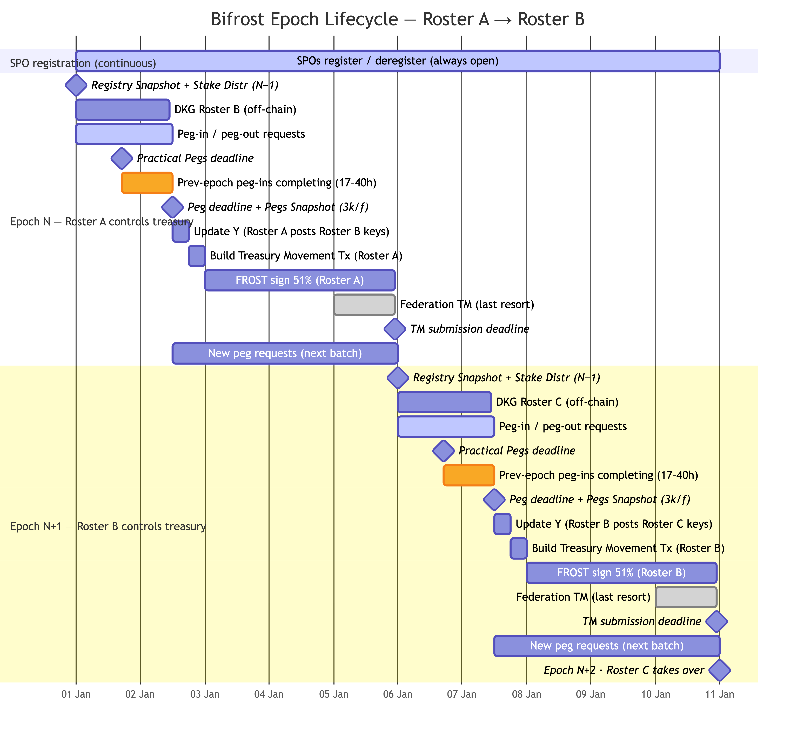

The diagram above shows two consecutive Cardano epochs with roster handoff from Roster A to Roster B. SPO registration and deregistration is continuous — a registry snapshot is taken at each epoch boundary along with the stake distribution from epoch N−1 (which will become N−2 when the new roster operates). Within each epoch the following phases occur:

1. **Registry Snapshot + Stake Distribution** — at the epoch boundary, the candidate set is locked and stake weights are read from the previous epoch's distribution.
2. **Peg-in / peg-out requests open** — users submit bridging requests during the first ~36 hours of the epoch.
3. **DKG** (new roster, off-chain) — the incoming roster runs distributed key generation to produce the group key $Y_{51}$, running concurrently with the request window.
4. **Previous-epoch peg-in completion** — peg-ins from the prior epoch's Treasury Movement complete as Bitcoin confirmations arrive (17–40 hours after epoch start).
5. **Per-batch pegs cutoffs** — there is no single epoch-wide snapshot: each TM batch `B_i` freezes the requests created at least one stability window (3k/f) before it (see *TM batches and the protocol schedule*).
6. **Update-Y** — the current roster publishes the new roster's $Y_{51}$ to `treasury.ak`.
7. **Build Treasury Movement Tx** — the current roster constructs the Bitcoin transaction that sweeps peg-in UTxOs, fulfils peg-out payments, and moves the treasury to the new Taproot address.
8. **Threshold signing cascade** — the current roster attempts 51% threshold signing. The federation path opens immediately once 51% setup/signing has finished unsuccessfully. The first mode to succeed wins.
9. **TM submission deadline** — the last batch opportunity is `final_tm_cutoff`, leaving signing, posting, Bitcoin confirmation, and recovery margin before the boundary (see *TM batches and the protocol schedule*).
10. **New peg requests** — after a batch snapshot, new requests accumulate for the next batch.

### Realistic epoch timeline (happy path)

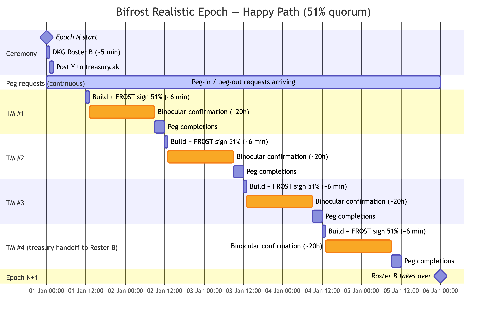

The epoch lifecycle above shows generous time windows for the signing cascade (51% → federation). In the happy path, when 51% quorum is available, the epoch proceeds much faster:

- **DKG**: ~5 minutes (off-chain, SPOs communicate via `bifrost_url` endpoints).
- **FROST 51% signing**: ~1 minute per Treasury Movement transaction.
- **Multiple TM batches**: the roster processes peg requests in multiple batches throughout the epoch, each cycling through build → sign → broadcast → Bitcoin confirmation.

The bottleneck is Bitcoin confirmation: each Treasury Movement requires ~100 Bitcoin blocks (~16.7 hours) for Binocular to promote the containing block to `confirmed` state. With a 5-day Cardano epoch, 4–5 TM batches fit sequentially, each handling its own set of peg-in sweeps and peg-out fulfillments. The final TM of the epoch moves the treasury to the new roster's Taproot address.

<!-- G26/G20: new section — the batch-assignment rules and the protocol schedule. Supersedes the
     single epoch-wide "Pegs Snapshot": each batch has its own stability cutoff. Schedule values
     are formulas/constraints; concrete numbers are non-normative examples. -->
### TM batches and the protocol schedule

**Batch grid.** TM batch opportunities occur on a fixed slot grid:

```
B_i = epoch_start + i × tm_batch_interval        (i = 1, 2, …; B_i ≤ final_tm_cutoff)
```

At each `B_i`, every SPO evaluates the same gate: if the TM-chain tip is Binocular-confirmed and
no TM is currently in flight, the batch is frozen and built; otherwise the opportunity passes
unused (or, if the in-flight TM has exceeded `tm_recovery_window`, the *Stuck-TM recovery*
procedure runs instead). The grid — rather than event-driven triggering ("freeze when the
previous TM confirms") — is deliberate: slot numbers are absolute and rollback-immune, whereas a
Confirm-transaction's inclusion slot can waver during Cardano rollbacks, and any wobble in the
freeze anchor flips boundary items in or out of the batch, breaking byte-determinism.

**Batch membership (deterministic).** Each batch has its own stability cutoff
`C_i = B_i − stability_window`:

* **Peg-ins**: every PegInRequest created at or before `C_i`, whose deposit is
  Binocular-confirmed, not yet swept, and passing SPO off-chain validation. Peg-ins **roll over**
  freely — one not taken by batch `i` is a candidate for batch `i+1`.
* **Peg-outs**: every PegOut UTxO created at or before `C_i`, passing the **fulfillment freshness
  filter** (`created <= now` and `created + peg_out_cancel_timeout_ms − now >= margin`), and
  passing the deterministic skip rule. Unlike peg-ins, an unfulfilled peg-out does **not** roll
  over indefinitely — the freshness filter stops fulfilling it once its own Cancel deadline draws
  near, after which its only path is *Cancel PegOut request*.

Note `C_1 = epoch_start − stability_window + tm_batch_interval` reaches back into the previous
epoch: the first batch naturally includes the prior epoch's unswept leftovers — rollover needs no
special case.

**Ordering, capacity, and the split rule.** *(Revised, rev 5.6. The two per-class counts
`max_pegins_per_tm` and `max_pegouts_per_tm` are WITHDRAWN, and with them the ≈100 + 100 /
≈57 + 57 pairs.)* Within a batch, items are ordered FIFO by the total order
`(creation slot, creating txid, output index)`.

Capacity is **one byte budget on the assembled Post-TM transaction**, not two independent
per-class counts. Two independent counts cannot express a capacity limit: each can be satisfied
while their sum exceeds it, and nothing in such a rule ever looks at the assembly. The withdrawn
key-path pair was exactly that failure — at this document's own per-item weights, 100 peg-ins +
100 peg-outs is 15 242 raw bytes, above the ~15 KB raw ceiling the pair was said to be derived
from. (The largest symmetric key-path pair under that ceiling is 98 + 98 = 14 942 B; the
federation pair 57 + 57 = 14 966 B was derived correctly. The raw-TM ceiling was itself the wrong
quantity to bound — see *Post-TM tx*.)

A byte budget is as deterministic as a count — every SPO computes the same size from the same
published weights — and strictly better, because the two classes have different weights, so any
fixed pair of counts either wastes capacity or exceeds it depending on the mix.

Note *where* those weights are compared, because the two answers differ and only one of them is
the budget's. On the raw Bitcoin transaction a peg-in costs ≈2.5× a peg-out (107 B against 43 B).
On the **Post-TM**, which is what the budget bounds, the peg-out additionally carries its 38-byte
`fulfilled_por_outpoints` entry while the peg-in only picks up chunking — ≈111 B against ≈83 B,
a ratio nearer 4:3. Sizing a batch from the Bitcoin-side ratio therefore overstates how many
peg-outs a movement can absorb, which is the same mistake in a smaller form as bounding the raw
transaction instead of the Post-TM.

```
raw_v(P, Q)   = base_v + w_in_v · P + 43 · Q          the Bitcoin TM, in raw bytes
chunked(n)    = n + 2·⌈n/64⌉ + 2                      Plutus bounded_bytes encoding of it
post_tm(P, Q) = E + chunked(raw_v(P, Q)) + 38 · Q     the Cardano transaction that carries it
```

| Term | 51% key path | Federation CSV path |
|---|---|---|
| `w_in_v` — per peg-in, Bitcoin input | 107 | 214 |
| per peg-out, Bitcoin output | 43 | 43 |
| per peg-out, Post-TM `fulfilled_por_outpoints` entry | 38 | 38 |
| `base_v` — fixed TM structure (counts < 253) | 242 | 317 |
| `E` — Post-TM terms that do not scale with the batch | implementation-measured; see *Post-TM tx* | |

* An SPO MUST fill the batch in FIFO order subject to `post_tm(P, Q) ≤ max_tx_size`, taking
  **peg-outs first and then peg-ins**, and MUST NOT sign a movement whose assembled Post-TM
  exceeds `max_tx_size`.
* **Peg-outs are filled first because they expire.** A peg-out that keeps missing batches
  eventually falls out of the fulfillment freshness filter and its only remaining path is *Cancel
  PegOut request*; a peg-in rolls over indefinitely and pays only latency. Both classes do roll
  over — a peg-out is payable by whichever TM includes it, so missing one batch is not fatal to it
  either — but only one of them has a deadline, and the fill order is what respects it.
* `max_tx_size` is a **host Cardano protocol parameter**, not a constant of this protocol and not
  operator configuration. An implementation MUST read it from the chain and MUST NOT hardcode
  16 384: Conway governance can change it, and a bridge carrying a baked-in value would either
  refuse batches it could have carried or sign ones it cannot post.
* It MUST be read **as of the Cardano epoch containing `B_i`** — not "whatever the node last saw",
  and not a `latest`-style read that can straddle an epoch boundary. Protocol-parameter changes
  take effect only at epoch boundaries, so the epoch's value is a chain fact every SPO derives
  identically, whereas two SPOs reading "latest" either side of a boundary get two budgets and
  therefore two different frozen batches. Batch membership must be a function of the batch (as the
  stability cutoff already is), and this parameter is part of it. Divergence here does not produce
  a bad signature — it produces **no** signature, because the FROST binding factors commit to the
  signing package and the SPOs would be signing different packages.
* An implementation MUST obtain `E` by measuring an assembled Post-TM on the target network and
  SHOULD hold a margin below the budget. `E` is the one term this document cannot fix: it depends
  on whether the `TreasuryMovementValidator` script rides inline or as a reference script, and it
  MUST be re-measured when that deployment changes.
* Overflow of either class waits for the next batch. An SPO MUST NOT split one frozen batch across
  several simultaneous Treasury Movements — the TM chain admits one in-flight movement at a time.

> **Scale.** With the two batch-scaling Post-TM terms included, a symmetric key-path batch is
> ≈75 + 75 at `E` = 1.5 KB, and ≈65 + 65 if the validator script rides inline instead of as a
> reference script — not the ≈100 + 100 this section used to state. The numbers are illustrative;
> the budget is normative.

**Wallet guidance (peg-out creation).** Before locking, request-building software SHOULD set
`created` to the current time rather than backdating it — `created` is requester-set and nothing
verifies it, but it is the freshness filter's input, so a backdated value only shortens the window
in which a TM may fulfil the request (see *Create PegOut request*). It SHOULD also set
`per_pegout_fee` at or above the Operational-params floor and lock at least `min_peg_out_fbtc`;
a request failing either is skipped by every SPO and can only be cancelled.

**The schedule.** All protocol deadlines are slot arithmetic from the epoch boundary `E`. The
normative content is each parameter's **kind and constraint** — concrete values are non-normative
examples for a mainnet-parameter instance:

| Parameter | Kind | Normative definition / constraint | Example |
|---|---|---|---|
| `stability_window` | **derived** | `= 3k/f` of the host Cardano network (see *Cardano stability window*); the governing authority MUST reject smaller values — it is fund-safety-critical, tunable only upward | 129 600 slots (36 h) |
| `dkg_r1_deadline`, `dkg_r2_deadline` | free | E-relative; `0 < r1 < r2 < update_y_deadline` | E + 1 h / E + 2 h |
| `update_y_deadline` | constrained | `> dkg_r2_deadline`; early enough that depositors get the new key before meaningful deposit traffic | E + 3 h |
| `tm_batch_interval` | free | `> sign_r1_window + sign_r2_window +` posting margin | 6 h |
| `sign_r1_window`, `sign_r2_window` | free | per-TM FROST round deadlines, measured from `B_i` | 30 min each |
| `leader_slot_T` | free | cascade hop for posting/submission conventions | 60 slots |
| `tm_recovery_window` | **constrained** | **must exceed the normal Binocular confirmation latency** (~100 BTC blocks + challenge ≈ 17–20 h), or healthy TMs are spuriously "recovered"; recommended ≥ 2× expected latency | 36 h |
| `final_tm_cutoff` | constrained | `≤ epoch_length − (sign windows + posting + tm_recovery_window + handoff margin)` | E + 4 d |

The free and constrained parameters live in the **Config datum** (#16, `schedule`) with a second
effect rule: **schedule parameters take effect from the next epoch boundary** (fee parameters:
from the next batch) — the schedule can never change under a running epoch. The constraints
marked MUST are the governing authority's to enforce: `config.ak` accepts any datum shape by
design (see *Update operational parameters*).

<!-- G37: end-to-end roster-rotation narrative; all placeholders resolved (2026-07 gap review). -->
### Periodic consensus change flow (epoch roster rotation)

The phases above, told once as a single end-to-end flow. Actors: the **current roster** (controls
the treasury), the **candidates** (registered SPOs for the next epoch), **watchtowers** (relay).

1. **Continuous: registration.** SPOs register (and voluntarily deregister) at
   `spos-registry.ak` — a one-time cold-key ceremony per pool (see §SPO Registration). Requests
   land at any time; all effects are snapshot-based (snapshot semantics, §SPO Registration).
2. **Epoch boundary — snapshots.** The candidate set is frozen: the registration linked-list minus
   the active ban list, with the stake distribution read from the previous epoch. The `min_stake`
   filter is applied off-chain at candidate enumeration — registration itself is stake-blind.
3. **Candidate ordering and threshold.** Candidates are ordered lexicographically by
   `bifrost_id_pk` and indexed $1..n$; the threshold $t$ is computed by the bottom-$k$ stake rule
   (§Threshold Calculation) and frozen for the epoch's DKG instance.
4. **DKG (off-chain, incoming roster).** Round 1 (commitments + proofs of knowledge), Round 2
   (encrypted share distribution), finalization — producing $Y_{51}'$ and per-participant shares.
   Non-participation shrinks the qualified subset deterministically; cryptographic faults are
   punishable via the fault-verifier/ban path (§Misbehavior Handling). Deadlines:
   `dkg_r1_deadline` / `dkg_r2_deadline` per the protocol schedule (see *TM batches and the
   protocol schedule*).
5. **Update-Y (on-chain).** The current roster publishes $Y_{51}'$ to `treasury.ak`, authorized by
   a FROST group signature under the *current* group key; the posting SPO is selected by the
   leader rule with `tm_sequence = "dkg"`. From this point depositors derive peg-in addresses from
   $Y_{51}'$. (See *Update-Y* in the Transaction catalog; the `treasury.ak` rotation branch is
   implemented on-chain as of N10a — the off-chain submission builder is pending.)
6. **Final batch.** The last batch opportunity before `final_tm_cutoff` freezes the epoch's final
   TM batch, under the per-batch stability cutoff (see *TM batches and the protocol schedule*).
7. **Final Treasury Movement.** The current roster deterministically builds the final TM: sweeps
   the frozen peg-ins, pays the frozen peg-outs, and pays the new treasury output to the **new**
   roster's Taproot address (derived from $Y_{51}'$ + $Y_{federation}$). The signing cascade runs
   (51% key path, federation script path as fallback); the leader posts the signed TM to
   `TreasuryMovementValidator`; watchtowers relay it to Bitcoin.
8. **Handoff complete.** Once the final TM is Binocular-confirmed, the new roster controls the
   treasury; the old roster's duties end. The next epoch's cycle begins at step 2.
9. **Failure branches (the degraded-epoch state machine).** <!-- G25, ratified 2026-07-15 -->
   - **DKG fails** (qualified subset below $t$): no Update-Y is posted; the old key stays in the
     Treasury state and the **old roster simply carries over** — batches continue under it, and
     the next epoch boundary takes fresh snapshots and retries the DKG. No halt, no special
     state.
   - **Late Update-Y or late final TM**: nothing breaks at the boundary — the output-0 address
     rule is state-derived, so the handoff is simply whichever batch first runs after Update-Y
     lands; the TM chain crosses epochs, and batches resume at the first grid slot after the tip
     confirms (stuck TMs: *Stuck-TM recovery*).
   - **Roster loses signing liveness**: per-batch 51% signing fails at its bounded deadlines;
     deposits and peg-outs keep accumulating (delayed, not lost). Once the treasury tip ages past
     `federation_csv_blocks`, the **federation services the same frozen batches** via the CSV
     leaf (see §Federation) — the bridge limps but liveness is preserved.
   - **Permanent roster death**: the datum key would be locked forever (Update-Y needs the dead
     roster's signature) — recovered by the **Update-Y federation branch** ([UY-5] revised, rev
     5.4): the federation rotates `current_spos_frost_key` under its own `y_federation`
     signature, with no sweep evidence required (see *Update-Y* and the federation co-authority
     note there). The bridge returns to Phase 1 and the roster rebuilds. If the federation also
     swept the treasury via its CSV leaf, its sweep MUST satisfy [BTC-1]/[BTC-2] ([BTC-3]), or
     the head freezes and §Recovery: replacing the singleton applies.

### Cardano stability window and peg finality

**Asymmetry between Bitcoin and Cardano finality.** Bitcoin PoW and Cardano Ouroboros Praos [6] both provide probabilistic finality, but Bifrost treats them asymmetrically. Binocular requires ~100 Bitcoin blocks (~17 h) before promoting a TM to `confirmed`, a depth at which Bitcoin reorgs are negligible for practical purposes. Cardano's common-prefix parameter $k = 2160$ is deliberately shallow (~12 h of expected block time) and reorgs shorter than $k$ are routine. The roster therefore has to be careful about what Cardano state it freezes into a Bitcoin-signed TM: a Cardano rollback *after* TM signing is a normal protocol event, whereas a Bitcoin reorg past Binocular confirmation is not.

**Why PegOuts need finality.** A PegOut lock is a Cardano-native action — fBTC is locked at `peg-out.ak` when the PegOut UTxO is created, and the TM pays treasury BTC to match. If the PegOut UTxO rolls back on Cardano *after* the TM is signed, the fBTC lock disappears from the canonical Cardano chain while the TM on Bitcoin still pays out. The withdrawer keeps their fBTC **and** collects BTC — a net loss to the treasury. Once signed and broadcast, a TM cannot un-pay a PegOut. Every PegOut must therefore be past any possible Cardano reorg before it enters a batch snapshot.

**Why PegInRequests do not.** A PegInRequest is a Cardano-side *registration* of a Bitcoin deposit that already exists on Bitcoin and is already Binocular-confirmed. Three properties make its rollback recoverable:

- **Permissionless creation.** Anyone can create a PegInRequest with a valid Binocular inclusion proof; the proof's validity depends only on Bitcoin state.
- **BTC-side-bound mint authorization.** The depositor's fBTC-mint BIP-322 signature commits to `"BFR-mint-v1" ‖ btc_txid ‖ peg_in_utxo_id ‖ chosen_cardano_address`, so it is bound to the Bitcoin UTxO, not to the specific Cardano PegInRequest NFT. The same signature verifies against any re-created PegInRequest for the same deposit.
- **BTC-side-bound double-mint protection.** The completed-peg-ins trie (its own singleton UTxO) is keyed by `peg_in_utxo_id`, not by the NFT.

If a PegInRequest rolls back after the TM is broadcast, the BTC sweep still succeeds on Bitcoin, and any watchtower (or the depositor) can re-create the PegInRequest; the depositor then claims fBTC with the original Schnorr signature. **Net impact: a delayed fBTC mint, never a fund loss.** Strict pre-snapshot finality is therefore *not required* for PegInRequests — only for PegOuts. In practice the protocol treats both uniformly at the same snapshot boundary for operational simplicity and for SPO determinism under restart/partition scenarios, not for fund-safety reasons.

**The Cardano stability window ($3k/f$).** Under Ouroboros Praos with honest-majority stake, any transaction buried under $k$ blocks is final with probability $1 - e^{-\Omega(k)}$ by the common-prefix property [6]. $k$ blocks arrive on average in $k/f$ slots, and the Chernoff analysis reaches overwhelming probability at $3k/f$ slots. On Cardano mainnet with $k = 2160$, $f = 0.05$ and one-second slots:

$$\tfrac{3k}{f} = \tfrac{3 \cdot 2160}{0.05} = 129{,}600 \text{ slots} = 36 \text{ hours.}$$

**Why $3k/f$ and not "just 2160 blocks".** Block-depth alone gives common-prefix finality only *relative to the chain an observer has already chosen*. An SPO or watchtower that restarts, loses peers, or is briefly partitioned must first re-select the canonical chain, and Cardano's Genesis rule [7] does so by comparing chain density inside a $3k/f$-slot window after the fork point — so $3k/f$ is a structural parameter of chain selection, not a safety margin bolted on top of $k$. It also provides ~3× wallclock headroom for peer-diversity and out-of-band cross-checks against eclipse scenarios, and aligns with the "settled state" notion used inside `cardano-node`.

**Consequence for the protocol.** Every TM batch applies this window individually: batch `B_i` freezes only requests created at or before `C_i = B_i − 3k/f` (see *TM batches and the protocol schedule*). The roster signs each BTC Treasury Movement only against such a post-stability-window set, so no Cardano rollback can retroactively invalidate a PegOut committed on Bitcoin; requests newer than a batch's cutoff simply wait for a later batch. PegInRequests use the same boundary for determinism, even though their rollback is recoverable by re-creation.

## SPO Program

The SPO program performs signature aggregation. Each Cardano SPO in the roster MUST run it alongside the usual SPO stack. The FROST protocol it builds on requires:
1. registration of SPOs to participate in the protocol
2. formation of a roster of Cardano SPOs and distributed key generation (every epoch)
3. group signing.
We describe each in detail.

### SPO Bootstrap Flow

Before the first SPO registration, the protocol bootstrap creates the SPO-related on-chain state in production:

1. The treasury bootstrap policy mints the **Treasury state NFT** and creates the Treasury state UTxO at `treasury.ak`, with the initial treasury parameters and an empty `bifrost_identity_root`.
2. The `spos-registry.ak` minting policy has a one-shot bootstrap branch that consumes a fixed bootstrap nonce UTxO, mints the **registration-list root NFT** (`reg-root`), and creates the empty registration-list root UTxO at `spos-registry.ak`.
3. The `spo-bans.ak` policy has a one-shot bootstrap branch that consumes a fixed bootstrap nonce UTxO, mints the **ban-list root NFT** (`ban-root`), and creates the empty ban-list root UTxO at `spo-bans.ak`.
4. <!-- G40 -->The **`spo-bans` reward account is registered** — a stake registration over `ScriptHashObj(spo_bans_script_hash)`. `ban` authorizes through the withdraw-zero pattern, and Conway admits a withdrawal only from a registered reward account, so without this step `apply_first_ban` / `apply_repeated_ban` are rejected by the ledger before any validator runs. It must follow step 3, because `spo-bans` is parameterized by the ban-list bootstrap outref that step consumes and its hash is not final until then. See *Register script reward accounts* in the transaction catalog for the certificate, the deposit it locks, and why it cannot be folded into the ban transaction itself.

The three authenticated UTxOs of steps 1–3 are the starting point for all later SPO-related transactions (step 4 creates no UTxO — it registers a credential). The runtime protocol never creates replacement roots. Instead:

- `register` consumes the current registration-list anchor element and the Treasury state UTxO, and produces the updated anchor element, the new registration node, and the updated Treasury state UTxO;
- `deregister` consumes the current registration node, its anchor element, and the Treasury state UTxO, and produces the updated anchor element and the updated Treasury state UTxO;
- `ban` inserts or updates a ban node: if the `pool_id` is not yet in the ban list, it consumes the current ban-list anchor element and produces the updated anchor element plus a new ban node; if the `pool_id` already has a ban node, it consumes that ban node and produces the updated ban node with the incremented `ban_counter`, extended `ban_until_time`, and recorded `evidence_hash`.

When the registration or ban list is otherwise empty, its bootstrap-created root UTxO is the anchor for the first insertion.

### SPO Registration

#### 1. Overview

Before participating in Bifrost, each SPO must complete a **one-time registration** that binds their Cardano pool identity to a long-term Bifrost identity key. This registration uses the SPO's cold key exactly once, after which all protocol operations use the Bifrost identity key. This design keeps cold keys offline except for initial registration and revocation.

Concretely, an SPO registers by submitting a Cardano `register_spo` transaction to `spos-registry.ak`. The transaction consumes the current registration-list anchor UTxO and the Treasury state UTxO, mints exactly one Bifrost Membership Token named by `pool_id`, and creates a registration-node UTxO whose value is that membership token plus min ADA and whose datum contains `bifrost_id_pk`, `bifrost_url`, and the ordered linked-list pointers. The redeemer carries `cold_vkey`, `cold_sig`, `bifrost_sig`, `registration_anchor_output_index`, and the non-membership witness proving that `bifrost_id_pk` is not already present in the Treasury state's `bifrost_identity_root`. The SPO program CLI is the intended operator interface for building this transaction; the protocol-level transaction shape is specified in Section 5 below.

<!-- G12, ratified 2026-07-15: requests continuous, effects snapshot-based. -->
**Snapshot semantics (normative).** Registration and revocation transactions may land **at any
time** — no validity-interval restriction. All protocol *effects* are snapshot-based: each epoch
operates on the boundary snapshot of the registration and ban lists (candidate set, roster, peer
URLs, `bifrost_id_pk` bindings, threshold $t$), so a mid-epoch change to the live list takes
effect only at the next boundary. In particular, a current-roster member who deregisters
mid-epoch **remains bound to the epoch's roster duties** — deregistration is not an exit from
in-flight participation (going silent instead is ordinary non-participation, which the protocol
already tolerates). One consequence made explicit: applying a ban requires referencing the
accused's registration node, so fault evidence against a *deregistered* pool waits until — and
applies upon — re-registration (the `FaultProof` token and the ban list are `pool_id`-scoped and
survive the gap).

#### 2. Keys

##### 2.1 SPO Identity (Cardano Layer)

- **`pool_id`**: unique stake pool identifier, derived as `pool_id = blake2b_224(cold_vkey)`.
- **`cold_vkey` / `cold_skey`**: long-term Ed25519 keypair. Used **only** for initial Bifrost registration and revocation. Must be kept on an air-gapped offline machine per Cardano security guidelines.

##### 2.2 Bifrost Identity

- **`bifrost_id_pk` / `bifrost_id_sk`**: long-term Secp256k1 identity keypair for Bifrost protocol operations.
- Self-generated by the SPO.
- Used for roster participation, DKG coordination, and encryption of DKG shares (via ECDH).

##### 2.3 Bifrost URL

- **`bifrost_url`**: endpoint URL where the SPO publishes DKG data and receives protocol messages.

#### 3. On-Chain Objects

##### 3.1 Bifrost Membership Token

- **Minting Policy**: `spos-registry.ak`
- **TokenName**: `pool_id`
- Exactly **one token per SPO** (enforced by minting policy).
- The token serves as the on-chain badge of Bifrost participation.
- The same minting policy also mints the registration-list root NFT during protocol bootstrap.

##### 3.2 Registration Linked-List

All registered SPOs are tracked using an **on-chain ordered linked-list**. Each node in the list represents a registered SPO and is stored as an individual UTxO at the registry script address. The list is ordered by `pool_id`, ensuring uniqueness and enabling efficient insertion and removal.

- **Node Value**: Bifrost Membership Token + the minimum ADA required to hold the token and datum.
- **Element key**: the ordering key is **not stored in the datum** — it is the **asset name of the registry-policy NFT** held in the UTxO. The list root carries the constant asset name `reg-root`; each registration node carries its `pool_id` (`blake2b_224(cold_vkey)`) as the asset name. The key is therefore minted under, and authenticated by, the `spos-registry.ak` policy: immutable across spends, unique, and indexable.
- **Element Datum** (`aiken_design_patterns/linked_list` `Element`):
```text
Element     = Constr(0, [ ElementData, Link ])
ElementData = Constr(0, [ Constr(0, []) ])                             -- Root  (ListRootData, empty)
            | Constr(1, [ Constr(0, [ bifrost_id_pk, bifrost_url ]) ]) -- Node  (RegistrationNodeData)
Link        = Constr(0, [ next_key ])  -- Some: asset name (pool_id) of the next node, ascending
            | Constr(1, [])            -- None: tail
```
where `RegistrationNodeData` is `{ bifrost_id_pk :: ByteArray, bifrost_url :: ByteArray }` — the Bifrost identity key and URL used later by the off-chain DKG and signing protocol.

The registration list is keyed by `pool_id`, not `bifrost_id_pk`: registration, revocation, and banning are all pool-scoped operations, so the compact cold-key-derived identifier `pool_id = blake2b_224(cold_vkey)` is the canonical on-chain key. It is carried as the **NFT asset name** (not a datum field), so it is authenticated by the minting policy and immutable across spends; the authorized `bifrost_id_pk` lives in the node datum because it is the key actually used later by the off-chain protocol.

The ADA locked in the registration node is only the minimum lovelace required by Cardano to hold the membership token and datum. It is not protocol collateral and is fully returned on voluntary revocation.

**Operations:**
- **Insert (ascending)**: A new node is inserted in ascending key order by verifying it sits between its neighbours — the spent **anchor** (the element with the greatest key strictly below the new node, or the root) keeps its data and is relinked to point at the new key, and the new node takes over the anchor's old link. Corresponds to `linked_list.insert_ascending` in the on-chain code.
- **Remove**: A node is removed by relinking its neighbours. Corresponds to `linked_list.remove` in the on-chain code.

**Spending Conditions**: Each registration node UTxO can be spent only by **voluntary revocation** via the cold-key-signed `bifrost-revoke` message — at any time (snapshot semantics, see §1: the removal takes effect at the next boundary snapshot).

Fault-based banning does not spend the registration node. Instead, it updates the separate ban linked-list while the registration node remains in place.

The on-chain linked-list implementation uses the `aiken_design_patterns/linked_list` module [5].

##### 3.3 Bifrost Identity Root In Treasury State

Active Bifrost identity bindings are tracked in the Treasury state UTxO at `treasury.ak`. The Treasury state stores an MPF root over the map:

`bifrost_id_pk -> pool_id`

This root exists solely to enforce that no two active registrations can bind the same Bifrost identity key.

**Semantics:**
- At most one active mapping exists per `bifrost_id_pk`.
- Every active registration node must have a matching trie entry, and every trie entry must point to an active registration.
- Registration inserts a new `bifrost_id_pk -> pool_id` mapping.
- Revocation removes the existing mapping.
- Uniqueness is enforced by non-membership / membership proofs against the Treasury state's `bifrost_identity_root`.

This preserves `pool_id` as the canonical on-chain membership identity while ensuring that active `bifrost_id_pk` values remain globally unique.

##### 3.4 Ban Linked-List

Temporary and permanent bans are tracked in a **separate on-chain ordered linked-list** at `spo-bans.ak`. A ban entry does not replace or burn the Bifrost Membership Token; instead, off-chain roster derivation subtracts the active ban list from the registration list.

- **Node Value**: ban node auth token `ban/ || pool_id` + the minimum ADA required to hold the token and datum.
- **Element key**: as in the registration list (§3.2), the ordering key is **not stored in the datum** — it is the **asset name of the ban-policy NFT** held in the UTxO. The list root carries the asset name `ban-root`; each ban node carries `ban/ || pool_id`. Keys are authenticated by the `spo-bans.ak` policy.
- **Element Datum** (`aiken_design_patterns/linked_list` `Element`):
```text
Element     = Constr(0, [ ElementData, Link ])
ElementData = Constr(0, [ Constr(0, []) ])  -- Root (BanListRootData, empty)
            | Constr(1, [ Constr(0, [ ban_counter, ban_until_time, permanent, evidence_hashes ]) ])  -- Node (BanNodeData)
Link        = Constr(0, [ next_key ])  -- Some: asset name of the next node, ascending
            | Constr(1, [])            -- None: tail
```
where `BanNodeData` is `{ ban_counter :: Int, ban_until_time :: Int (POSIX ms), permanent :: Bool, evidence_hashes :: List<ByteArray> }`.

**Semantics:**
- At most one ban entry exists per `pool_id`.
- A ban is considered **active** at POSIX time `T` iff `permanent == True` or `ban_until_time > T`.
- Expired temporary ban entries may remain on-chain; off-chain roster derivation must ignore them once `permanent == False` and `ban_until_time <= T`.
- `ban_counter` is monotonically increasing for each `pool_id` and determines the exponential timeout duration.
- `evidence_hashes` records the already-punished fault evidence hashes for the pool. `spo-bans.ak` rejects repeated punishment for the same evidence hash.

#### 4. Registration Message and Signatures

Registration must prove both:
- the pool's cold key authorizes the binding; and
- the registrant actually controls `bifrost_id_sk`.

Both the cold key and the Bifrost identity key sign the same message:

```
"bifrost-spo" || pool_id || bifrost_id_pk || bifrost_url
```

Where:
- `"bifrost-spo"` is a 10-byte ASCII domain separator.
- `pool_id` is the 28-byte stake pool identifier derived from `cold_vkey`.
- `bifrost_id_pk` is the 32-byte x-only (BIP340) Secp256k1 public key.
- `bifrost_url` is the variable-length URL encoded as UTF-8 bytes.

The registration transaction therefore carries:
- `cold_sig`: Ed25519 signature by `cold_skey` over the message above.
- `bifrost_sig`: BIP340 Schnorr signature by `bifrost_id_sk` over the same message.

#### 5. Registration Transaction

A **registration tx** performs the following:

1. **Redeemer**: contains `cold_vkey`, `cold_sig`, `bifrost_sig`, `registration_anchor_output_index`, and the MPF non-membership witness needed to prove that `bifrost_id_pk` is currently absent from the Treasury state identity map.
2. **Inputs**:
   - Anchor element UTxO from the registration linked-list (either the root UTxO or an existing registration node, depending on where the new node is inserted).
   - Treasury state UTxO from `treasury.ak`, carrying the current `bifrost_identity_root`.
3. **Mint**: exactly one Bifrost Membership Token with `TokenName = pool_id` under `spos-registry.ak`.
4. **Outputs**:
   - New registration linked-list node UTxO at registry script address with:
     - Bifrost Membership Token + the minimum ADA required to hold the token and datum
     - Datum containing `bifrost_id_pk`, `bifrost_url`, and linked-list pointers (correctly ordered between neighbors)
   - Updated registration anchor node UTxO with its `next` pointer updated to reference the new registration node
   - Updated Treasury state UTxO whose `bifrost_identity_root` commits to the newly inserted mapping `bifrost_id_pk -> pool_id`

**Prototype transaction skeleton**:

```text
Transaction: register_spo

Inputs:
- registration anchor input at `spos-registry.ak`
- treasury state input at `treasury.ak`

Reference Inputs:
- none

Withdrawals:
- none

Mint:
- under `spos-registry.ak`:
  - `pool_id` => +1

Burn:
- none

Outputs:
- continued registration anchor output at `spos-registry.ak`
- new registration node output at `spos-registry.ak`
  value:
  - membership token `pool_id`
  - min ADA
  datum:
  - `bifrost_id_pk`
  - `bifrost_url`
  - linked-list pointers
- continued treasury state output at `treasury.ak`
  datum:
  - same treasury fields
  - updated `bifrost_identity_root`

Required witnesses:
- `cold_sig`
- `bifrost_sig`

Required validity interval:
- unconstrained (snapshot semantics — see §1)
```

#### 6. On-Chain Verification

The minting policy verifies:

1. `pool_id == blake2b_224(cold_vkey)` — proves the cold key owns this pool.
2. `verifyEd25519Signature(cold_vkey, "bifrost-spo" || pool_id || bifrost_id_pk || bifrost_url, cold_sig)` — proves the cold key authorized this Bifrost identity binding.
3. `verifySchnorrSecp256k1Signature(bifrost_id_pk, SHA256("bifrost-spo" || pool_id || bifrost_id_pk || bifrost_url), bifrost_sig)` — proves the registrant actually controls `bifrost_id_sk`.
4. Exactly one token minted with `TokenName = pool_id`.
5. Registration output datum matches the signed message content.
6. **Registration linked-list ordering**: verifies the new registration node is correctly positioned between its neighbors, preventing duplicate `pool_id` registration.
7. **Registration linked-list state transition**: verifies the registration anchor node's `next` pointer is correctly updated to reference the new registration node.
8. **Bifrost identity non-membership**: verifies, against the Treasury state's `bifrost_identity_root`, that no active entry already exists for `bifrost_id_pk`.
9. **Bifrost identity root update**: verifies the updated Treasury state UTxO inserts the mapping `bifrost_id_pk -> pool_id` into the identity trie.

#### 7. Revocation

An SPO's membership can end through voluntary revocation or fault-based banning.

##### 7.1 Voluntary Revocation

The SPO's cold key signs an explicit revocation message:

```
"bifrost-revoke" || pool_id
```

Where:
- `"bifrost-revoke"` is a 14-byte ASCII domain separator.
- `pool_id` is the 28-byte pool identifier.

**Transaction**:
1. **Redeemer**: contains `cold_vkey`, `cold_sig`, `removed_node_input_index`, and `anchor_node_input_index`.
2. **Validity interval**: unconstrained (snapshot semantics — see §1).
3. Spends the registration node and the Treasury state UTxO.
4. Burns the Bifrost Membership Token under `spos-registry.ak` and returns the registration node's ADA to an SPO-controlled output.
5. Removes the registration node from the registration linked-list by updating the anchor node's `next` pointer to skip the removed node.
6. Updates the Treasury state UTxO by removing the matching `bifrost_id_pk -> pool_id` mapping from the identity trie.

**Prototype transaction skeleton**:

```text
Transaction: deregister_spo

Inputs:
- registration node input at `spos-registry.ak`
- registration anchor input at `spos-registry.ak`
- treasury state input at `treasury.ak`

Reference Inputs:
- none

Withdrawals:
- none

Mint:
- none

Burn:
- under `spos-registry.ak`:
  - `pool_id` => -1

Outputs:
- continued registration anchor output at `spos-registry.ak`
- continued treasury state output at `treasury.ak`
  datum:
  - same treasury fields
  - updated `bifrost_identity_root`
- SPO-controlled output returning the deregistered node's ADA

Required witnesses:
- `cold_sig`

Required validity interval:
- unconstrained (snapshot semantics — see §1)
```

**On-chain verification**:
1. `pool_id == blake2b_224(cold_vkey)` — proves the cold key owns this pool.
2. `verifyEd25519Signature(cold_vkey, "bifrost-revoke" || pool_id, cold_sig)` — proves cold key authorized revocation.
3. Exactly one token burned with `TokenName = pool_id`.
4. **Registration linked-list removal**: verifies the anchor node's `next` pointer is correctly updated to skip the removed registration node, maintaining list ordering.
5. **Bifrost identity removal**: verifies, against the Treasury state's `bifrost_identity_root`, that the matching `bifrost_id_pk -> pool_id` mapping existed and is removed in the updated Treasury state UTxO.

After exit, the SPO may re-register with a new Bifrost identity.

##### 7.2 Banning

The protocol supports **temporary and permanent banning** of SPOs who misbehave during DKG or signing rounds. A banned SPO retains their Membership Token and stays in the registration linked-list, but is excluded from participating in roster formation through the separate ban linked-list.

**Exponential timeout**: Each temporary ban doubles the exclusion duration. If the new `ban_counter` is `n`, the new timeout duration is:

`base_ban_duration_ms * 2^(n - 1)`

The timeout is applied from the transaction validity interval's upper POSIX-time bound (`ban_start_time`). The validator requires this interval to be **finite at both ends** — an unbounded validity interval is rejected — and no wider than `max_validity_window_ms`, so `ban_start_time` cannot be pushed to an arbitrary future slot to shorten the effective exclusion. For repeated temporary bans, the new expiry is:

`max(old_ban_until_time, ban_start_time) + duration`

When `ban_counter >= max_faults_before_permanent`, the ban node sets `permanent = True`. A permanent ban has no expiry.

**Active roster derivation**: At POSIX time `T`, the off-chain SPO program computes:

`eligible_roster(T) = registration_list(T) \ active_ban_list(T)`

where `active_ban_list(T)` contains all `pool_id`s whose ban entry satisfies `permanent == True || ban_until_time > T`.

**Fault verification is separated from banning**: fault verifier policies verify raw misbehavior evidence and mint singleton `FaultProof` tokens. The ban validator receives an allow-list containing three distinct policies: the DKG Round 1 fault policy, DKG Round 2 fault policy, and equivocation fault policy.

The consensus-critical token name is:

```
blake2b_256(pool_id || evidence_hash)
```

`evidence_hash` is the unique public input or evidence commitment for the fault. Datum attached to a fault UTxO may be used as metadata for off-chain indexing, but `spo-bans.ak` does not trust it for consensus. Instead, the ban redeemer carries `accused_pool_id` and `evidence_hash`; `spo-bans.ak` recomputes the token name and checks that exactly one authorized fault policy has minted and burned that token.

**Ban transaction format**: the ban transaction is permissionless and:
1. Spends a `FaultProof` token UTxO under one of the authorized fault policies.
2. Carries `accused_pool_id` and `evidence_hash` in the ban withdrawal redeemer.
3. References the accused SPO's registration node to bind the fault to an existing `pool_id`.
4. Spends the appropriate anchor element of the ban linked-list (the root UTxO for the first ban on a branch, otherwise an existing node), plus the existing ban node for this `pool_id` if one already exists.
5. Burns exactly the token `blake2b_256(accused_pool_id || evidence_hash)` under the same authorized fault policy found in the fault input.
6. Inserts or updates the ban node with the incremented `ban_counter`, updated `ban_until_time`, `permanent` flag, and new `evidence_hash`.
7. Rejects a repeated ban if `evidence_hash` is already present in the ban node's `evidence_hashes`.
8. Leaves the Membership Token and registration node untouched while recording the updated ban state in the ban linked-list.

**Prototype transaction skeletons**:

```text
Transaction: apply_first_ban

Inputs:
- fault-proof input carrying the fault-proof token
- ban-list anchor input

Reference Inputs:
- accused registration node at `spos-registry.ak`

Withdrawals:
- coordinating ban withdrawal carrying:
  - `fault_input_index`
  - `registration_ref_input_index`
  - `accused_pool_id`
  - `evidence_hash`
  - `ban_anchor_input_index`
  - `ban_anchor_output_index`
  - `existing_ban_input_index = None`
  - `ban_node_output_index`

Mint:
- under the ban-list policy:
  - `ban/ || pool_id` => +1

Burn:
- under the matching authorized fault policy:
  - `blake2b_256(pool_id || evidence_hash)` => -1

Outputs:
- continued ban anchor output
- new ban node output
  value:
  - `ban/ || pool_id`
  - min ADA
  datum:
  - `ban_counter = 1`
  - `ban_until_time = ban_start_time + base_ban_duration_ms`
  - `permanent = 1 >= max_faults_before_permanent`
  - `evidence_hashes = [evidence_hash]`

Required witnesses:
- normal tx witnesses only

Required validity interval:
- finite POSIX-time interval with width at most `max_validity_window_ms`
```

```text
Transaction: apply_repeated_ban

Inputs:
- fault-proof input carrying the fault-proof token
- existing ban node input for the accused `pool_id`

Reference Inputs:
- accused registration node at `spos-registry.ak`

Withdrawals:
- coordinating ban withdrawal carrying:
  - `fault_input_index`
  - `registration_ref_input_index`
  - `accused_pool_id`
  - `evidence_hash`
  - `ban_anchor_input_index`
  - `ban_anchor_output_index`
  - `existing_ban_input_index = Some(...)`
  - `ban_node_output_index`

Mint:
- none under the ban-list policy

Burn:
- under the matching authorized fault policy:
  - `blake2b_256(pool_id || evidence_hash)` => -1

Outputs:
- continued ban node output
  value:
  - same `ban/ || pool_id` token
  - min ADA
  datum:
  - `ban_counter = old_ban_counter + 1`
  - `ban_until_time = max(old_ban_until_time, ban_start_time) + base_ban_duration_ms * 2^(ban_counter - 1)`
  - `permanent = ban_counter >= max_faults_before_permanent`
  - `evidence_hashes = evidence_hash :: old_evidence_hashes`

Required witnesses:
- normal tx witnesses only

Required validity interval:
- finite POSIX-time interval with width at most `max_validity_window_ms`
```

**Ban expiry**: Once a temporary ban period elapses, the SPO automatically becomes eligible for roster participation again without needing to re-register. A permanent ban never expires.

#### 8. Security Properties

- **Cold key minimization**: The cold key is used only twice—once for registration, once for revocation (if needed). All other protocol operations use `bifrost_id_sk`.
- **Bifrost key proof-of-possession**: Registration proves that the registrant actually controls `bifrost_id_sk`, not just that the pool authorized the public key.
- **Air-gapped signing**: Both registration and revocation messages can be constructed offline and signed on an air-gapped machine.
- **Sybil resistance**: One membership token per `pool_id` enforced by minting policy.
- **Unique active Bifrost identities**: the Treasury state's `bifrost_identity_root` prevents two active registrations from sharing the same `bifrost_id_pk`.
- **Separated fault verification**: authorized fault verifier policies check raw evidence once and mint reusable `FaultProof` tokens; `spo-bans.ak` only applies ban updates.
- **No expiration**: Membership tokens remain valid indefinitely until explicitly revoked.


### Distributed Key Generation (DKG)

#### 1. Overview

The FROST Distributed Key Generation (DKG) process runs **entirely off-chain** using SPOs' `bifrost_url` endpoints. One DKG is run each epoch, producing the group public key $Y_{51}$ with a threshold ensuring any signing subset controls more than 51% of delegated stake. The DKG also produces individual signing shares $s_i$ for each participant. Upon successful completion, the **current roster** constructs and signs a Treasury Movement transaction that moves the treasury to the new Taproot address derived from $Y_{51}$ and $Y_{federation}$ (see **Taproot address construction**), and posts the signed transaction to Cardano at `TreasuryMovementValidator` for watchtowers to relay to the source blockchain. No DKG result is posted on Cardano.

**Prerequisite**: SPOs must complete SPO Registration (see previous section) before participating in DKG.

#### 2. Epoch Binding

Each DKG instance is bound to a Cardano epoch. The candidate set is determined by the on-chain registration and ban linked-lists at the end of the previous epoch, ensuring all SPOs have the same view of registered and temporarily excluded participants.

#### 3. Threshold Calculation

The threshold `t` is computed to guarantee that **any** subset of `t` signers controls stake above the security threshold. Since the worst case is the `t` SPOs with the smallest stakes, we define:

```
t = min { k : combined_stake(bottom k SPOs by stake) > security_threshold }
```

Where:
- `security_threshold` is a protocol parameter (e.g., 51% of total delegated stake among Bifrost SPOs).
- SPOs are ranked by their delegated stake at the epoch boundary.
- `t` is the minimum number of SPOs such that even the weakest `t` SPOs exceed the threshold.

This ensures that **any** subset of `t` signers collectively controls sufficient stake to authorize bridge operations, regardless of which specific SPOs participate in a signing session.

For a fixed `(epoch, threshold-mode)` DKG instance, the resulting threshold `t` is **frozen for all attempts**. Retries may exclude or ban participants, but they do not recompute `t`; the instance simply fails once fewer than `t` eligible participants remain.

#### 4. Candidate Set and Ordering

##### 4.1 Candidate Enumeration

All SPOs with valid Bifrost Membership Tokens that are present in the registration linked-list (boundary snapshot), not present in the active ban linked-list, and whose delegated stake at the snapshot is at least `min_stake` (Config's operational parameters) are candidates for the DKG.

##### 4.2 Canonical Ordering

Candidates are ordered **lexicographically by `bifrost_id_pk`** (32-byte comparison). Each participant is assigned an index $i = 1..n$ based on their position in this ordering.

This is separate from the on-chain registration linked-list ordering. The linked-list is keyed by `pool_id` because membership and bans are pool-scoped; once the active registrations are read from Cardano, the off-chain SPO protocol re-sorts them by the bound `bifrost_id_pk` values to obtain the canonical FROST participant ordering.

##### 4.3 Candidate Information

For each candidate $P_i$, the following information is retrieved:
- `pool_id` — from the registration node UTxO.
- `bifrost_id_pk` — from the registration node UTxO datum.
- `bifrost_url` — from the registration node UTxO datum.
- `delegated_stake` — queried from Cardano ledger state.
- `ban_until_time` and `permanent` — from the ban linked-list, if a matching ban entry exists.

#### 5. Round 0: Initialization

Each SPO $P_i$ performs the following initialization steps:

1. Determine the current epoch.
2. Retrieve the registration and ban linked-list states from the end of the previous epoch.
3. Enumerate all registered SPOs from the registration list and subtract the active ban list.
4. Query delegated stake for each candidate; drop candidates below `min_stake` (Config's operational parameters, boundary snapshot).
5. Compute threshold $t$ as described in Section 3.
6. Order candidates lexicographically by `bifrost_id_pk` and assign indices.
7. Verify own participation (own `pool_id` is in the candidate set).

Ordinary non-participation does not create a new DKG attempt. All honest parties stay in the same `(epoch, threshold, attempt)` namespace and deterministically shrink the qualified subset as the Round 1 and Round 2 deadlines expire. The `attempt` field is therefore reserved for exceptional full reruns after direct cryptographic faults or epoch-level resets; in the normal protocol flow it remains `0`.

#### 6. Round 1: Commitments and Proofs of Knowledge

Each SPO $P_i$ performs the following steps per FROST specification [2]:

1. Construct a random polynomial $f_i(x)$ of degree $t-1$ over the Secp256k1 scalar field.
2. Compute proof of knowledge $σ_i$ of the degree-zero coefficient $a_{i0}$.
3. Compute public commitment $C_i = [φ_{i0}, ..., φ_{i(t-1)}]$ where $φ_{ij} = a_{ij} · G$.

##### 6.1 Round 1 Payload

Each $P_i$ publishes their Round 1 data at:

```
<bifrost_url>/dkg/<epoch>/<threshold>/<attempt>/round1/<pool_id>.json
```

Where `<threshold>` is `51` (one DKG per epoch), and `<attempt>` is the DKG namespace field in the current epoch. In the normal protocol flow it remains `0`.

**Payload structure**:

```json
{
  "commitment": ["<hex, 33 bytes>", ...],
  "sigma_i": "<hex, 64 bytes>",
  "poseidon_commit": "<hex, 32 bytes>",
  "signature": "<hex, 64 bytes>",
  "view": {
    "view_digest": "<hex, 32 bytes>",
    "view_n": <integer>,
    "view_read_time_ms": <integer>
  }
}
```

Where:
- `commitment` is an array of $t$ compressed Secp256k1 points (33 bytes each).
- `sigma_i` is the Schnorr proof of knowledge (challenge || response, 64 bytes).
- `poseidon_commit` is the payload's self-commitment and fault `evidence_hash`:
  `Poseidon(structured_fields)` computed by the publisher over the same fields
  (see *Authentication* — self-committing payloads).
- `signature` is a BIP340 Schnorr signature over `SHA256(canonical_bytes)` using `bifrost_id_sk`.
- `view` is the publisher's **chain-view** for this ceremony: `view_digest` is the
  `blake2b_256` of the candidate set's `pool_id`s in canonical (`bifrost_id_pk`) order,
  `view_n` is the candidate count, and `view_read_time_ms` is the block-time (POSIX ms) of
  the latest block the candidate set was read at. It is **advisory and UNSIGNED** — it is
  NOT covered by `signature`, NOT part of the canonical byte layout below, and NOT part of
  the equivocation comparison (two Round 1 payloads that differ *only* in `view` are the
  same signed payload, never a misbehavior). It is optional and MAY be absent (e.g. a
  no-registry fallback). Its use is defined in Section 6.3.

**Canonical byte layout** (for authentication and on-chain misbehavior proofs):

```
"bifrost-dkg-r1" || epoch (8B BE) || threshold (8B BE, 51) || attempt (8B BE) || pool_id (28B)
  || φ_{i0} (33B) || ... || φ_{i(t-1)} (33B) || σ_i (64B) || poseidon_commit (32B)
```

JSON is for transport; the signature covers `SHA256(canonical_bytes)`;
`poseidon_commit` is the final 32 bytes of the layout and is sliced on-chain as the
Round 1 `evidence_hash`.

##### 6.2 Round 1 Verification

Each $P_i$ fetches every Round 1 payload that was published before the common Round 1 deadline and verifies that $σ_i$ is a valid proof of knowledge for $φ_{l0}$.

If an SPO does not publish Round 1 before the deadline, it simply does not enter the attempt's provisional subset and is not punished for that fact alone.

If a published Round 1 payload is invalid, or if two distinct signed Round 1 payloads for the same sender and namespace are observed, the process proceeds to **Misbehavior Handling** (Section 9).

##### 6.3 Chain-View Publication and Post-Ban Convergence

The candidate set (Section 4) is filtered deterministically by the epoch-boundary time, but the ban linked-list it filters is read at the **current chain tip**. Near a ban — the interval in which an `ApplyBan` transaction has confirmed for some observers but is not yet visible to others — two honest SPOs reading the same epoch can therefore enumerate **different** candidate sets: one that already excludes the banned pool ($n-1$ members) and one that does not ($n$ members). Their Round 1 commitment vectors then have different lengths and different index assignments, so each treats the other as being on a foreign candidate set (Section 6.2), and the ceremony cannot complete until every honest observer has read the chain past the ban's settlement point. This is a **liveness/recovery-time** concern, not a safety one: no wrong key is produced, but completion of the reduced DKG can be delayed by one or more epochs.

To bound this delay, each SPO publishes its chain-view alongside every Round 1 payload (the `view` field, Section 6.1) and applies the following rule on fetch:

1. **Detect.** When $P_i$ fetches $P_l$'s Round 1 payload and `view_digest` differs from $P_i$'s own, the two are on different candidate sets — a genuine cross-view disagreement, distinguished here from a merely corrupt or foreign payload.
2. **Direct.** The disagreement is resolved by whichever node read the chain **earlier**: if $P_i$'s `view_read_time_ms` is older than $P_l$'s, then $P_i$ read the chain before the disagreeing event had settled into its view, so $P_i$ is the node that re-reads. `view_read_time_ms` is a **block-time**, never a local wall clock, so it is comparable across nodes; the epoch is deliberately not used, because the disagreement occurs *within* one epoch.
3. **Reconcile.** The stale node re-derives its candidate set from the chain after a settling delay, so the re-read lands after the event has settled, rather than immediately retrying against the same unsettled tip. The fresher-read node does not wait.

The chain-view is a **hint, never authoritative**. The chain remains the sole source of truth: a published view only ever causes a node to *re-read the chain*, never to adopt a peer's value. A peer that publishes a false view therefore gains nothing — its own payload is still verified against the chain and dropped if inconsistent, exactly as without the field.

**Convergence.** Two honest nodes read one canonical chain; a view difference arises only from reading at different points near an unsettled event. Once that event settles (becomes immutable at sufficient depth), every honest re-read returns the identical view, and because the stale node re-reads after settling, the nodes converge. Permanent divergence would require either the chain never settling (a liveness failure, out of scope) or honest nodes following different canonical chains (a $>50\%$ adversary). Under honest-majority and chain liveness, permanent divergence is therefore impossible.

#### 7. Round 2: Secret Share Distribution

Each SPO $P_i$ computes and distributes secret shares to all other participants.

##### 7.1 Share Computation

For each participant $P_l$ (where $l ≠ i$), compute the secret share $(l, f_i(l))$.

##### 7.2 Share Encryption

For each recipient $P_l$:

1. Generate ephemeral Secp256k1 keypair $(e_i, E_i)$.
2. Compute shared secret: `ss = ECDH(e_i, bifrost_id_pk_l)`.
3. Derive the 32-byte encryption pad `pad` from the shared secret and recipient identity.
4. Encrypt share: `ciphertext = f_i(l) XOR pad` (32 bytes).
5. Publish `pad_commit = blake2b_256(pad)` with the encrypted entry. A Round 2 fault proof reveals
   `pad`; the on-chain verifier checks the hash and XOR opening directly instead of proving the
   encryption relation in-circuit.

The share is a 32-byte Secp256k1 scalar, encrypted with the derived key.

##### 7.3 Round 2 Payload

Each $P_i$ publishes their Round 2 data at:

```
<bifrost_url>/dkg/<epoch>/<threshold>/<attempt>/round2/<pool_id>.json
```

Where `<threshold>` is `51` (one DKG per epoch), and `<attempt>` is the same namespace field as in Round 1.

**Payload structure**:

```json
{
  "shares": [
	    {
	      "recipient_pool_id": "<hex, 28 bytes>",
	      "recipient_frost_identifier": "<integer>",
	      "ephemeral_pk": "<hex, 33 bytes>",
	      "ciphertext": "<hex, 32 bytes>",
	      "pad_commit": "<hex, 32 bytes>",
	      "evidence_hash": "<hex, 32 bytes>"
	    }
	  ],
  "signature": "<hex, 64 bytes>"
}
```

Where:
- `recipient_pool_id` identifies the intended recipient.
- `recipient_frost_identifier` is the recipient's DKG identifier in the epoch roster.
- `ephemeral_pk` is the compressed Secp256k1 ephemeral public key $E_i$.
- `ciphertext` is the XOR-encrypted share.
- `pad_commit` binds the encrypted share to the pad that may be revealed in a Round 2 fault proof.
- `evidence_hash` is the domain-separated public statement commitment used as the `FaultProof` evidence hash for this entry.
- The `shares` array contains one entry per other participant in the current attempt's provisional Round 1 subset.
- `signature` is a BIP340 Schnorr signature over `SHA256(canonical_bytes)` using `bifrost_id_sk`.

**Canonical byte layout** (for authentication and on-chain misbehavior proofs):

```
"bifrost-dkg-r2" || epoch (8B BE) || threshold (8B BE, 51) || attempt (8B BE) || pool_id (28B)
  || [recipient_pool_id (28B) || recipient_frost_identifier || ephemeral_pk (33B)
      || ciphertext (32B) || pad_commit (32B) || evidence_hash (32B)] × m
```

Shares are ordered by `recipient_pool_id` (lexicographic) for determinism. Here `m` is the number of other participants in the current attempt's provisional Round 1 subset. JSON is for transport; the signature covers `SHA256(canonical_bytes)`. Because the full encrypted-share vector is published as one public payload, publishing Round 2 at all makes the sender's whole Round 2 state retrievable by every SPO.

##### 7.4 Round 2 Decryption and Verification

Each recipient $P_l$:

1. Fetch Round 2 payload from each sender $P_i$.
2. Find the entry where `recipient_pool_id == pool_id_l`.
3. Compute shared secret: `ss = ECDH(recipient_bifrost_id_sk, ephemeral_pk)`.
4. Derive pad `pad` from `ss` and `recipient_pool_id`, check `blake2b_256(pad) == pad_commit`,
   and decrypt: `f_i(l) = ciphertext XOR pad`.
5. Verify the share against sender's Round 1 commitment:

   $f_i(l) · G = \sum_{j=0}^{t-1} (l^j · φ_{ij})$

If a sender that was present in the provisional Round 1 subset fails to publish any Round 2 payload by the Round 2 deadline, that sender is removed from the final qualified subset. Honest parties ignore that sender's commitments and shares in the final share sum and public key derivation.

If verification fails for any share from $P_i$, or if two distinct signed Round 2 payloads for the same sender and namespace are observed, the process proceeds to **Misbehavior Handling** (Section 9).

#### 8. Finalization

Upon successful verification of all shares from the final qualified subset $Q$, each $P_i$:

1. Computes their long-lived private signing share by summing the shares received from every sender in the final qualified subset: $s_i = \sum_{l \in Q} f_l(i)$

2. Computes their public verification share: $Y_i = s_i · G$

3. Computes the group public key from the same qualified subset: $Y = \sum_{l \in Q} φ_{l0}$

All participants arrive at the same group public key $Y$. Ordinary non-participation therefore shrinks $Q$ in-place rather than forcing a DKG restart.

The above steps are run once per epoch with threshold $t_{51}$, producing $Y_{51}$.

4. Derives the Bitcoin Treasury Taproot address from $Y_{51}$ together with $Y_{federation}$ (see **Taproot address construction**).

5. The **current roster** publishes the successfully derived group public key on Cardano at `treasury.ak`, authenticated by a FROST group signature from the current roster (the **Update-Y** transaction — see the Transaction catalog). If the DKG did not complete, the SPO threshold mode is unavailable for the epoch and the federation path remains as the emergency fallback. This makes the new Treasury address publicly verifiable on-chain, allowing depositors to look up the correct Treasury key and derive the Treasury and peg-in Taproot addresses.

#### 9. Misbehavior Handling

Fault handling is split by round and evidence type:

- **Round 1 non-publication** is not punishable; the SPO simply does not join that attempt's provisional subset.
- **Round 2 non-publication** is not punishable; the SPO is dropped from the final qualified subset.
- **Round 1 invalidity** and **Round 1 equivocation** are directly punishable.
- **Round 2 invalidity** and **Round 2 equivocation** are directly punishable.

##### 9.1 Fault Verifier Policies And `FaultProof` Tokens

Misbehavior verification is separated from ban-list updates. Production uses separate authorized verifier policies for DKG Round 1 invalid payloads, DKG Round 2 invalid payloads, and DKG equivocation. FROST signing invalid partial-signature proofs are deferred and are not part of this verifier set. When a fault is established, the corresponding policy mints exactly one singleton `FaultProof` token. Datum metadata may be attached by off-chain indexers, but it is not trusted by consensus.

The `FaultProof` token name is:

```
blake2b_256(pool_id || evidence_hash)
```

`evidence_hash` is globally domain-separated by fault type, statement version, and bridge/protocol domain; the fault's `namespace_hash = blake2b_256(phase || epoch || threshold_or_mode || attempt || txid?)`, where `txid` is omitted for DKG namespaces, scopes it to a single protocol round. `spo-bans.ak` does not trust the metadata datum; it authenticates the fault by checking the token name and the fault verifier policy id against its allow-list.

**Prototype transaction skeleton**:

```text
Transaction: publish_fault_proof

Inputs:
- one arbitrary claimant-controlled nonce input

Reference Inputs:
- accused registration node at `spos-registry.ak`

Withdrawals:
- none

Mint:
- under the matching fault verifier policy:
  - `blake2b_256(pool_id || evidence_hash)` => +1

Burn:
- none

Outputs:
- claimant-controlled output containing:
  - fault-proof token
  - min ADA
  - optional metadata datum ignored by consensus

Required witnesses:
- normal tx witnesses only

Required validity interval:
- none
```

##### 9.2 Direct fault proofs

Direct proofs are permissionless and do not require roster consensus.

**Invalid payload proofs** use Halo2 ZK proofs. The sign-the-hash scheme (see **Authentication**) enables this: the accused SPO's signed `message_hash` binds them to specific protocol data, and a ZK circuit proves that data is cryptographically invalid without making Plutus recompute the expensive secp256k1 arithmetic.

**Invalid payload types and what the ZK circuit proves:**

- **DKG Round 1 — invalid proof of knowledge**: the circuit verifies that $σ_i$ is not a valid Schnorr proof for $φ_{i0}$.
- **DKG Round 2 — share inconsistent with commitment**: the circuit verifies that $f_i(l) · G ≠ \sum l^j · φ_{ij}$, i.e., the decrypted share does not match the Round 1 commitment polynomial.
- **FROST signing — invalid partial signature**: deferred; not part of the DKG fault verifier policy set.

<!-- G6, ratified 2026-07-15 (Option B): the proof↔signature binding via payload
     self-commitments. On-chain uses only existing builtins; Poseidon runs in-circuit and in
     peers' fetch-time validation, never on-chain. -->
**Invalid payload proof structure:**

1. The prover submits the accused's **full canonical payload bytes** + the accused's signature
   (64 B) + the Halo2 proof + public inputs.
2. The fault verifier policy recomputes `message_hash = sha2_256(canonical_bytes)` (builtin) and
   verifies `verifySchnorrSecp256k1Signature(bifrost_id_pk, message_hash, signature)` — the
   accused vouched for exactly these bytes.
3. It extracts `evidence_hash` from signed bytes — the final 32 bytes of a Round 1 payload, or the
   selected Round 2 share entry's `evidence_hash` — and requires the Halo2 public inputs to be
   exactly `[evidence_hash, pool_id]`.
4. It verifies the Halo2 proof, whose statement is: *"I know fields `F` with `Poseidon(F) =
   evidence_hash`, and `F` exhibits the claimed invalidity for `pool_id`."*
5. On success, the specialized verifier policy mints a `FaultProof` token for the domain-separated evidence hash.

> **Why this binds (and why framing is impossible).** The signature pins the commitment to the
> accused; the circuit pins the invalidity to the commitment's preimage; Poseidon's collision
> resistance welds the two — whatever fields the prover reasoned about *are* the fields the
> accused committed to, because exhibiting different ones would require a second preimage. To
> frame an honest SPO one would need a valid invalidity proof about their *actual honest
> fields* — which does not exist. The one residual freedom — publishing a commitment that does
> not match the plaintext fields — is neutralized at transport level (fetch-time rule, see
> *Authentication*): such a payload never enters the protocol and its publisher is excluded
> exactly as if silent (non-publication was never bannable anyway). The on-chain verifier never
> computes Poseidon — it only slices bytes and compares 32-byte strings.

For the **Round 2 (invalid share)** circuit, the prover reveals `pad` and `opened_share`.
The policy checks `blake2b_256(pad) == pad_commit` and `opened_share == ciphertext XOR pad`, and
that both `pad` and `opened_share` are canonical 32-byte secp256k1 scalars (strictly less than the
curve order `n`). The circuit then proves `opened_share · G ≠ Σ l^j · φ_{ij}`. The public inputs stay
`[evidence_hash, pool_id]` — each byte-encoded into a circuit scalar in **little-endian** order; the
opened share, recipient identifier, and sender Round 1 commitments are bound through the in-circuit
Poseidon preimage represented by `evidence_hash`.

Because a Round 2 share is only meaningful relative to the accused's Round 1 commitments, the Round 2
verifier additionally consumes the accused's canonical **Round 1** payload and verifies **both** the
Round 1 and Round 2 Bifrost signatures (each over its own canonical payload). This pins the invalid
share to the same accused's committed Round 1 `φ_{ij}`, so a Round 2 fault cannot be asserted against
commitments the accused never signed.

**Size**: the on-chain transaction carries the full canonical payload (up to ~10 KB for a
large-roster Round 2), the signature, the Halo2 proof, and public inputs. Fault proofs are rare,
so the byte cost is acceptable; the verifier cost depends on the configured proof system and
generated verifier.

**Equivocation proofs** are direct and do not use ZK. The prover submits two distinct signed payloads from the same accused SPO for the same namespace. The equivocation verifier policy verifies:

1. both payloads belong to the same DKG protocol namespace;
2. both signatures verify under the accused SPO's `bifrost_id_pk`; and
3. the two canonical payload hashes are different.

Namespace equality is checked by **fixed-offset prefix comparison**: every canonical layout begins `tag ‖ namespace fields ‖ pool_id`, and the tag determines the message type and hence the exact byte range of the namespace fields — the verifier compares those ranges of the two payloads (this is how the implemented equivocation verifier works).

On success, the equivocation verifier policy mints a `FaultProof` token named `blake2b_256(pool_id ‖ evidence_hash)`, where — unlike the Round 1 / Round 2 hashes, which are *sliced* from a single signed payload — the equivocation `evidence_hash` is **computed on-chain** from the two conflicting payloads:

```
evidence_hash = blake2b_256( equivocation_domain ‖ len8(lo) ‖ lo ‖ len8(hi) ‖ hi )
```

where:

- `equivocation_domain = "bifrost-fault-equiv-v1"` — a fixed 22-byte ASCII domain separator that isolates equivocation evidence from every other fault type, statement version, and protocol domain.
- `lo` and `hi` are the two conflicting canonical signed payloads sorted by lexicographic byte comparison so that `lo ≤ hi` (when one is a prefix of the other, the shorter compares smaller). Sorting makes the hash **order-independent**: whichever order the two payloads are submitted in, the preimage — and hence the evidence hash and token name — is identical, so an equivocation cannot be re-punished by swapping payload order.
- `len8(x)` is the byte length of `x` encoded as an **8-byte big-endian** integer. The explicit length prefixes make the concatenation unambiguous — no two distinct payload pairs share a preimage — which a bare `lo ‖ hi` concatenation would not guarantee.

The verifier recomputes this hash from the two submitted payloads and requires the redeemer's `evidence_hash` to equal it, so an off-chain prover must reproduce exactly this construction. `spo-bans.ak` then authenticates the fault by the token name `blake2b_256(pool_id ‖ evidence_hash)` and the verifier policy id, exactly as for the ZK fault types.

##### 9.3 Exclusion Of Non-Participants

Ordinary non-participation is handled by deterministic exclusion, not by any separate publication-challenge mechanism.

For DKG:

1. The Round 1 deadline fixes the provisional subset `L1` of participants that published valid Round 1 payloads.
2. The Round 2 deadline fixes the final qualified subset `Q` of participants in `L1` that also published complete Round 2 payloads.
3. Honest parties compute their long-lived shares and the group public key using `Q` only.
4. If `Q` contains fewer than `t` participants, or if its total delegated stake is below the target threshold for that DKG, that threshold-mode DKG is simply unavailable for the epoch.

For signing:

1. The Round 1 deadline fixes the provisional signing subset `S1`.
2. The Round 2 deadline fixes the final signing subset `S2` of members of `S1` that published valid partial signatures.
3. Aggregation uses `S2` only.
4. If `S2` does not meet the active threshold, the current signing mode fails immediately and the next lower mode may start.

This is the ordinary non-participation path. Only cryptographically invalid or equivocated payloads go through the direct-fault ban flow.

##### 9.4 Direct Fault Consequences

Direct cryptographic faults remain punishable:

1. An invalid or equivocated Round 1/2 payload is proven at the appropriate authorized fault verifier policy.
2. The verifier policy mints a `FaultProof` token named `blake2b_256(pool_id || evidence_hash)`.
3. `spo-bans.ak` may then ban the accused SPO via the time-based ban list.

Non-participation alone does not mint a `FaultProof` token and does not create a separate restart loop.

#### 10. Treasury Handoff

Upon successful DKG completion and publication of the new Treasury public key $Y_{51}$ to `treasury.ak`:

1. The **new roster** derives the Bitcoin Treasury Taproot address from $Y_{51}$ and $Y_{federation}$ (see **Taproot address construction**).
2. The **current roster** reads all confirmed PegInRequest UTxOs and pending PegOut UTxOs from Cardano.
3. The **current roster** attempts to construct and sign a full Treasury Movement transaction (peg-ins + peg-outs + treasury move to new address) using the cascade signing process (see **Spending paths and Treasury Movement variants**):
   - First, attempt to collect 51% partial signatures ($Y_{51}$) — main line, cheapest (key path on all inputs).
   - If the 51% mode does not yield a usable signature within its bounded setup and signing phases, the federation signs using $Y_{federation}$ (script path with timelock).
   - If the resulting transaction would be too large, it is split into multiple transactions.
4. The signed transaction is posted to Cardano at `TreasuryMovementValidator`.
5. Watchtowers pick up the signed transaction from Cardano and broadcast it to the Bitcoin network.

Once the Treasury Movement transaction is confirmed on Bitcoin, the epoch transition is complete. The new roster now controls the treasury. Anyone can then complete the paid peg-outs on Cardano with a membership proof against the completed-peg-outs trie (see *Complete peg-out*) — the trie itself was already updated at Confirm. Pending peg-ins can also be completed — both signing modes sweep peg-in UTxOs.

#### 11. Security Properties

- **Off-chain execution**: No DKG data is posted on Cardano; only the signed Treasury Movement transaction (posted to `TreasuryMovementValidator`) and the resulting source blockchain transaction are publicly visible.
- **Threshold security**: Any $t$ signers control stake above the security threshold.
- **Misbehavior accountability**: Fraudulent SPOs can be identified and excluded.
- **Objective exclusions**: bans are applied only by consuming verified `FaultProof` token records, so exclusions are driven by objective evidence rather than discretionary roster approval.
- **Replay resistance**: Each DKG is bound to a unique epoch number.
- **Single curve**: Using Secp256k1 throughout eliminates curve conversion complexity.

### Group signing

In what follows we summarize the *preprocess* and signing stages according to the FROST documentation [2], closely following their notation, and emphasizing special considerations relevant to SPO-based FROST groups.

#### Per-input signing

A Treasury Movement transaction has multiple inputs — one treasury UTxO plus $k$ peg-in UTxOs — and **each input requires a separate FROST signing round**. This is because:

- **Different sighash per input**: BIP341 sighash commits to the input index, so each input has a distinct 32-byte message to sign.
- **Different tweaked key per input**: each input has a different Taproot tree (the treasury tree differs from peg-in trees, and each peg-in tree differs because the depositor's key `Q_auth` varies), producing a different tweak and therefore a different effective signing key.

With `SIGHASH_ALL` (default for Taproot), each signature commits to all inputs and all outputs, but a per-input signature is still required. For a TM transaction with $k+1$ inputs, SPOs run $k+1$ parallel FROST signing rounds.

All SPOs agree on input ordering deterministically (treasury input first, then peg-in inputs ordered by txid+vout lexicographically), so nonce commitments and partial signatures are published as arrays indexed by input position.

#### Deterministic TM construction

All SPOs independently construct the same Treasury Movement (TM) transaction from shared state, with no coordinator. If any field differs between SPOs, signing will fail (different `txid` → mismatched nonce commitments). The rules below fully determine every byte of the unsigned transaction.

<!-- G4: signing model ratified 2026-07-15 — Model A′ (exact reconstruction + roster-updatable
     Config fee). The leader-proposed-fee hybrid was considered and rejected (see the note). -->
> **Signing model (normative).** Bifrost deliberately uses **exact reconstruction** — every byte
> of the unsigned TM is forced by public state (the frozen batch + the operational parameters at the
> batch snapshot slot), so **the transaction's content is never any participant's choice**. A
> signer's entire correctness check is byte-equality between its own build and its peers'; no
> leader can inject content or choose parameters. (A rejected alternative — a leader-chosen fee
> rate within a Config bound — was struck down because a low-ball proposal is valid-looking,
> unpunishable, deniable, and detected only after wasting a full signing ceremony and hours of
> Bitcoin-confirmation ambiguity.) Fee-market agility comes from governance instead: the roster
> updates `fee_rate_sat_per_vb` via the group-signed *Update operational parameters* transaction — an
> explicit collective act in which each signer sanity-checks the proposed rate against its own
> market view before signing, and refusal is harmless (the old rate persists; nothing mid-flight
> stalls).

**Shared state reference.** Every SPO reads the same Cardano confirmed state:

- Confirmed **PegInRequest** UTxOs — each contains the raw Bitcoin peg-in transaction from which the SPO extracts the Bitcoin txid+vout being swept.
- Pending **PegOut** UTxOs — each specifies a destination Bitcoin address (as `scriptPubKey` bytes), an amount, a datum-pinned `per_pegout_fee`, and `created` (POSIX ms). The **fulfillment freshness filter** below excludes any request that is not yet valid or too close to its own Cancel deadline.
- Heimdall's **local completed-peg-outs trie** — the SPO's own running copy, deterministically rebuilt from every insert it or its predecessors have made (see *Confirm TM tx*, *the completed-peg-outs trie update*). This is what the co-signer verification check (below) recomputes the expected root from before signing.
- The current **treasury Bitcoin UTxO** (txid+vout), known from the previous TM's new treasury output (output 0) or, for the first movement, the Config's genesis outpoint.

**Transaction version and locktime.**

- Version: **2** (required for `OP_CHECKSEQUENCEVERIFY` in Taproot scripts).
- Locktime: **0**.

**Inputs (deterministic ordering).**

- Input 0: the current treasury UTxO (txid+vout from shared state).
- Inputs 1..$k$: peg-in UTxOs, ordered lexicographically by (txid ‖ vout). Comparison is byte-by-byte, left-to-right; txid is 32 bytes, vout is encoded as 4 bytes little-endian.
- Sequence numbers (per spending mode):
  - **51% mode**: `0xFFFFFFFD` for every input. Bit 31 is set, so BIP68 relative timelocks are disabled; the value is below `0xFFFFFFFE`, so RBF is signaled. No CSV is evaluated in this path.
  - **Federation mode**: `federation_csv_blocks` (the protocol parameter, encoded as a BIP68 block-based value with bit 31 clear) for every input. Bit 31 clear enables BIP68, satisfying `OP_CHECKSEQUENCEVERIFY <federation_csv_blocks>` in the federation script leaves. Any value with bit 31 clear is automatically below `0xFFFFFFFE`, so RBF is also signaled.

**Outputs (deterministic ordering).**

- Output 0: the **new treasury output** — the treasury's self-payment to its own next address:
  the Treasury Taproot address derived from the **current TreasuryDatum key at the batch snapshot
  slot**. (Not "change": the treasury's continuation is the purpose of the transaction, and this
  output is the next TM-chain tip.) The rule is state-derived, not positional: before the epoch's
  Update-Y lands, batches pay the old key's address; the first batch after Update-Y pays the new
  roster's address — that self-payment **is** the treasury handoff, with no "final TM"
  bookkeeping.
- Outputs 1..$m$: peg-out payments, ordered lexicographically by raw `scriptPubKey` bytes. Each output pays the requested amount minus **that peg-out's datum-pinned `per_pegout_fee`** (see below).
- Output $m+1$: the **BTMR1 root commitment** — a single `OP_RETURN` output, `6a4542544d5231 ‖ spi_root ‖ cpo_root` (71 bytes total), committing the swept-peg-ins and completed-peg-outs MPF roots that hold after this TM (heimdall inserts `(peg_in_utxo_id, input_0_outpoint)` for each swept deposit and `(por_id, dest_spk ‖ amount_le8)` for each of the $m$ peg-outs above into its local tries and commits the results). EXACTLY ONE such output is REQUIRED in every TM, in any position among the outputs — a TM sweeping and fulfilling nothing still carries one, re-committing the unchanged roots. No per-peg-out marker output exists: the roots are committed once, for the whole batch, regardless of $m$ (see *Confirm TM tx* and §Bridge state singleton).

<!-- G3: the deterministic skip rule is the actual griefing defense — no creation-time check exists. -->
**Deterministic skip rule (peg-outs).**

A peg-out in the frozen batch is **skipped** — excluded from the outputs, never aborting the
TM — iff any of the following holds: its datum does not decode as `PegOutDatum`; its destination
`scriptPubKey` is unparseable; its `por_id` is **already recorded in the completed-peg-outs
trie**; its `por_id` **already appeared earlier in this same batch**; its locked fBTC amount is
below `min_peg_out_fbtc` at the batch snapshot slot; its datum `per_pegout_fee` is **below the
Operational-params floor** at the batch snapshot slot; its net payout
`amount − datum.per_pegout_fee` is below Bitcoin dust (330 sat); or it fails the **fulfillment freshness filter**: `datum.created > now`
(the request is not yet valid) OR `datum.created + peg_out_cancel_timeout_ms − now < margin`
(too close to its own Cancel deadline — a heimdall-configured value, default 7 days, bounding the
signed-but-not-yet-confirmed race: a TM that includes a peg-out too close to its cancel window
could confirm just after the owner cancels, stranding the payment). The floor and `min_peg_out_fbtc` are read at the batch snapshot slot, so
every SPO computes the identical skip set. The freshness margin is NOT a Config field and is not
read there: it is a protocol constant compiled into heimdall, which is what makes it identical
across every node running a release. Publishing it was considered and rejected — nothing outside
the SPO's own TM builder reads it, `peg-out.ak` only assumes a margin exists rather than checking
one, and two SPOs disagreeing would cost liveness (the FROST round cannot converge, so nothing is
paid) rather than safety. A datum field would buy uniformity per bridge at the price of a config
hash move, for a value no other party consumes. The two `por_id` conditions are what make fulfillment **once-only**: the trie insert is
idempotent, so a second payment for a `por_id` the trie already holds — whether recorded by an
earlier TM or repeated within this batch — moves treasury BTC that no root change accounts for,
and is provable by nobody. They are consensus conditions like the rest: an SPO whose trie
disagrees builds different TM bytes, which is why every co-signer independently recomputes the
committed root before signing (see *Post signed TM*). Skipped peg-outs remain on-chain; their
owners recover via *Cancel PegOut request* once this TM confirms and the timeout elapses.
Without this rule a single 1-satoshi peg-out would make the whole TM unbuildable — the skip rule, not any creation-time check, is the bridge's defense
against that.

**Amounts and fees.**

- Fee rate: `fee_rate_sat_per_vb` is read from the Config's operational parameters (see that section), taken **as of this batch's snapshot slot** so every SPO uses the identical value; a roster update takes effect from the next batch.
- Bitcoin miner fee: `fee = tx_vsize × fee_rate_sat_per_vb` (integer division, rounded up). The transaction vsize is deterministic since all SPOs build the same transaction.
- Per-peg-out protocol fee: pinned in each `PegOutDatum` at lock time (covering the miner fee share and protocol operating costs); the Operational-params `per_pegout_fee` is only the **floor** the skip rule enforces.
- Each peg-out output: the fBTC amount locked in the PegOut UTxO minus that peg-out's datum `per_pegout_fee`.
- New treasury output (output 0): sum of all input values − sum of peg-out output values − Bitcoin miner fee.

**Witness (empty at construction time).**

The transaction is constructed unsigned — every input carries an empty witness. The `txid` is computed from the non-witness serialization (per BIP141). Witnesses are populated after FROST signing completes.

**Multiple TMs per epoch.**

The roster may process **multiple TM transactions** within an epoch, each cycling through build → sign → broadcast → Bitcoin confirmation (see **Realistic epoch timeline**). The batch grid, membership rules, FIFO order, and capacity/split rules are normative in **TM batches and the protocol schedule**. Each TM's treasury input is the previous TM's new treasury output (the TM-chain tip); the output-0 address rule above makes the first batch after Update-Y the treasury handoff.

The signing namespace is identified by the tuple `(epoch, txid, mode, attempt)` where:
- `mode ∈ {51}` selects the active SPO threshold path — a single value today; the field is kept in the namespace and the canonical layouts so that adding a future threshold mode does not change any byte layout. The **federation mode has no signing namespace at all**: it uses no SPO endpoints and no FROST rounds;
- `attempt` is reserved for exceptional reruns of the same mode for the same TM; in the normal protocol flow it remains `0`; and
- every namespace requires **fresh nonce commitments**. A signer must never reuse FROST nonces across different `(epoch, txid, mode, attempt)` tuples, even if the unsigned Bitcoin transaction is unchanged.

Each SPO publishes its constructed TM at:

```
<bifrost_url>/sign/<epoch>/<tm_sequence>/tm.json
```

```json
{
  "raw_tx": "<hex>",
  "txid": "<hex, 32 bytes>",
  "signature": "<hex, 64 bytes>"
}
```

**Canonical byte layout** (for authentication and on-chain misbehavior proofs — this payload was
previously the protocol's only unauthenticated message):

```
"bifrost-tm" || epoch (8B BE) || tm_sequence (8B BE) || pool_id (28B) || txid (32B)
```

`signature` is a BIP340 Schnorr signature over `SHA256(canonical_bytes)` using `bifrost_id_sk`
(the raw tx bytes are covered transitively through `txid`). The `txid` (computed from the unsigned
transaction's non-witness data) uniquely identifies the TM being signed and is used as the key in
FROST signing URLs. Other SPOs fetch this endpoint to verify they agree on the transaction before
signing — under exact reconstruction any disagreement is a red flag: either a state-view
divergence to diagnose, or (two different signed payloads for the same namespace) a provable
equivocation fault like any other.

**Stuck-TM recovery (fee bump).** <!-- G29 --> If a posted TM is not Binocular-confirmed within
the recovery window `tm_recovery_window` (see *TM batches and the protocol schedule* — it must
exceed the normal Binocular confirmation latency, else healthy TMs would be spuriously
"recovered"), the frozen fee rate has fallen behind the Bitcoin fee market. Recovery is
a collective act with no special roles:

1. the roster raises `fee_rate_sat_per_vb` via the group-signed *Update operational parameters*
   transaction;
2. every SPO rebuilds the **same frozen batch** deterministically at the new rate — a new `txid`,
   hence a new signing namespace (fresh nonces are mandatory, per the nonce-freshness rule);
3. the roster re-signs and anyone posts the replacement (permissionless).

The replacement and the stuck original both spend the same head; RBF is signaled on all inputs,
and Bitcoin confirms exactly one — the loser can never confirm and its creator GCs it after the
grace period (see *Garbage collection (grace-period reclaim)*). No un-freezing or batch
reshuffling is allowed during recovery: only the fee rate may differ between the two builds.

#### Preprocess

Each SPO $P_i$ in the roster performs this stage prior to signing.
1. For each input $j = 0..k$, samples random single-use nonces $(d_{ij}, e_{ij})$.
2. Derives commitment shares $(D_{ij}, E_{ij})$ for each input.
3. Stores $((d_{ij}, D_{ij}), (e_{ij}, E_{ij}))$ for later use in signing operations.
4. Publishes nonce commitments at `<bifrost_url>/sign/<epoch>/<txid>/<mode>/<attempt>/round1/<pool_id>.json`.

**Payload structure**:

```json
{
  "nonce_commitments": [
    { "D": "<hex, 33 bytes>", "E": "<hex, 33 bytes>" }
  ],
  "signature": "<hex, 64 bytes>"
}
```

Where:
- `nonce_commitments` is an array of $(D_{ij}, E_{ij})$ pairs (compressed Secp256k1 points), one per input, ordered by input index.
- `signature` is a BIP340 Schnorr signature over `SHA256(canonical_bytes)` using `bifrost_id_sk`.

**Canonical byte layout**:

```
"bifrost-sign-r1" || epoch (8B BE) || txid (32B) || mode (8B BE, 51) || attempt (8B BE) || pool_id (28B)
  || D_{i,0} (33B) || E_{i,0} (33B) || D_{i,1} (33B) || E_{i,1} (33B) || ...
```

Nonce pairs are concatenated in input-index order. JSON is for transport; the signature covers `SHA256(canonical_bytes)`.

### Signing mechanism

Each SPO $P_i$ in the subset participating in signing performs these steps **for each input** $j = 0..k$:
1. Fetches nonce commitments from peers' HTTP endpoints (`<bifrost_url>/sign/<epoch>/<txid>/<mode>/<attempt>/round1/<pool_id>.json`) to assemble the list $B_j$ of triads $(i, D_{i,j}, E_{i,j})$ corresponding to SPOs in the subset.
2. Computes the BIP341 sighash $m_j$ for input $j$ (which commits to all inputs and outputs via `SIGHASH_ALL`, but is unique per input due to the input index).
3. Computes the set of binding values, the group commitment $R_j$ and the challenge for input $j$.
4. Computes their response (signing share) $z_{i,j}$ using their long-lived secret share $s_i$ and the per-input tweaked key.

After computing all $z_{i,j}$:
5. Each $P_i$ publishes their partial signatures at `<bifrost_url>/sign/<epoch>/<txid>/<mode>/<attempt>/round2/<pool_id>.json`.
6. Each $P_i$ fetches partial signatures from peers and classifies liveness:
   - missing Round 2 payload from a member of the provisional subset -> exclude that signer from the final signing subset;
   - signing-round equivocation and invalid partial-signature proofs are deferred from the DKG fault verifier set.
7. If the remaining valid partial signatures still satisfy the active threshold, continue.
8. Each $P_i$ can compute the group's response for each input (the sum of $z_{i,j}$'s), arriving to the same per-input signature $σ_j = (R_j, z_j)$, completing the fully signed transaction.

**Round 2 payload structure**:

```json
{
  "partial_signatures": [
    { "sighash": "<hex, 32 bytes>", "z_i": "<hex, 32 bytes>" }
  ],
  "poseidon_commit": "<hex, 32 bytes>",
  "signature": "<hex, 64 bytes>"
}
```

Where:
- `partial_signatures` is an array ordered by input index, one entry per TM transaction input.
- `sighash` is the BIP341 sighash for this input.
- `z_i` is the partial signature for this input (32-byte scalar).
- `signature` is a BIP340 Schnorr signature over `SHA256(canonical_bytes)` using `bifrost_id_sk`.

**Canonical byte layout**:

```
"bifrost-sign-r2" || epoch (8B BE) || txid (32B) || mode (8B BE, 51) || attempt (8B BE) || pool_id (28B)
  || [sighash_j (32B) || z_{i,j} (32B)] × (k+1) || poseidon_commit (32B)
```

Entries are concatenated in input-index order. JSON is for transport; the signature covers `SHA256(canonical_bytes)`.

### Signing cascade

There is no separate timeout for the transition `51 -> federation`. Instead, each DKG and signing round has its own bounded submission deadline, and a lower-threshold mode becomes eligible immediately once the higher mode's bounded setup/signing phases finish unsuccessfully.

For a given TM in the `51` mode, all honest SPOs derive the same signing state:

1. Start from the **current roster** stored on-chain for the active treasury.
2. Remove any SPOs with an active on-chain ban entry.
3. Wait until the Round 1 deadline and collect every valid Round 1 payload published in the current `(epoch, txid, mode, attempt)` namespace.
4. Define the provisional signing subset `S1` as the SPOs that published valid Round 1 payloads before the deadline.
5. If the delegated stake of `S1` is below the active mode threshold, the mode fails immediately when Round 1 closes.
6. Otherwise continue with exactly `S1` into Round 2.
7. Wait until the Round 2 deadline and collect every valid Round 2 payload published by members of `S1`.
8. Define the final signing subset `S2` as the members of `S1` that published valid Round 2 payloads before the deadline.
9. Invalid or equivocating Round 2 payloads may be proven at the appropriate authorized fault verifier policy and are excluded from aggregation.
10. If `S2` provides enough valid partial signatures to satisfy the active threshold, the mode succeeds.
11. Otherwise the mode fails immediately when Round 2 closes.

**Mode transition rules:**
- **51% mode** opens first and uses the $Y_{51}$ treasury key path if the DKG completed during setup.
- **Federation mode** opens immediately once 51% mode has finished unsuccessfully, or immediately if the DKG did not produce a usable key during setup.
- The overall bound for the cascade is therefore implicit: it is the sum of the bounded DKG and signing step deadlines, with no extra inter-mode timer.

Federation mode does not use the SPO HTTP endpoints. It is an on-chain and Bitcoin-level emergency fallback after the 51% mode has either failed or never become available.

### Cardano submission and leader reward

After FROST signing completes, a single SPO must submit the result on Cardano — posting the signed TM to `TreasuryMovementValidator` and updating keys in the Treasury UTxO after DKG. A deterministic leader election with timeout cascade ensures fairness, unpredictability, and liveness. **The leader REWARD is DEFERRED (rev 5.4, 2026-08-06)** — see the status note below; the election and cascade remain the coordination convention.

**Leader selection.** The roster is sorted by `pool_id` (lexicographic). The primary leader is selected using the previous TM's Bitcoin txid as entropy (unpredictable before the previous TM is mined, available to all SPOs from the singleton head):

`leader_index = hash("bifrost-leader" || prev_tm_txid || tm_sequence) mod roster_size`

where `prev_tm_txid` is the txid of the current treasury outpoint — the first 32 bytes of the bridge state singleton's `treasury_utxo_id` (the bootstrap anchor's txid for the first movement) — and `tm_sequence` is the sequence number of the current TM within the epoch (0-indexed; an off-chain signing-namespace counter — the on-chain TM datum carries no sequence field, ordering comes from the chain). For key publication after DKG, `tm_sequence` is replaced by the literal `"dkg"`.

**Timeout cascade.** If the primary leader does not submit within $T$ slots (protocol parameter, e.g. 60 slots ≈ 1 minute), the next SPO in roster order becomes eligible. After another $T$ slots the next one, and so on (wrapping around). Concretely, SPO at roster index $i$ becomes eligible at slot:

`eligible_slot[i] = signing_complete_slot + ((i - leader_index) mod roster_size) × T`

where `signing_complete_slot` is the slot at which FROST signing finished (deterministic: the slot when the last required round-2 payload became available). Each SPO monitors the chain — if a predecessor has already submitted, it does nothing.

**On-chain enforcement.** None — posting is **permissionless** (see *Post signed TM*): the
head check gates record validity and Bitcoin gates correctness, so an out-of-turn or
duplicate post is at worst inert garbage ([PTM-6] stops a stale one from even minting). The
cascade above is the **off-chain coordination convention** that determines who posts first. This
replaces the earlier design in which `TreasuryMovementValidator` verified roster membership and
leader eligibility on-chain — checks that depended on an off-chain quantity
(`signing_complete_slot`) no Cardano validator can observe.

**Leader reward: DEFERRED (rev 5.4, 2026-08-06).** All leader-reward code left the on-chain
layer until the flow is fully specified:

- The swept peg-ins trie value is the head outpoint alone, 36 bytes. It carries no credential.
- [CPI-7] is WITHDRAWN, not replaced. No reward is paid at the mint.
- [CPI-11], [CPI-12] and [SPI-5] are PARKED. Implementers MUST NOT build them.
- `epoch` and `leader_reward` left the TM datum, and the Config has no reward field.

> **Why deferred rather than shipped.** Four questions are open: per-mint or per-TM, dust
> deposits below the reward, peg-out-only TMs that generate no mint, and whether the amount is
> enforced against Config. The last one is load-bearing under [CTM-18]: duplicate records are no
> longer possible, so a depositor cannot escape to a cheaper record — shipping a reward whose
> amount a permissionless poster chooses would hand that poster a toll on every depositor the TM
> swept. Carrying no field costs nothing. Carrying a half-enforced fee costs users.
>
> The recommended shape for its return: pay the elected leader through a credential the FROST
> signature covers, carried in the swept peg-ins trie value rather than a second `OP_RETURN`.
> A free-rider who posts cannot redirect it, because altering the covered bytes invalidates the
> signature — this decouples who-posts from who-gets-paid while keeping posting permissionless.
> Reintroduction widens the SPI trie value from 36 to 64 bytes, which is a root-format change and
> therefore cheap only while the trie is young.

> **Why burns would pay nothing either way.** The peg-out side already contributes through the
> datum-pinned `per_pegout_fee` (deducted from the BTC payout), so a burn-side reward would
> double-charge withdrawers. The model is *each side pays exactly once, through the channel where
> it receives value*. The Update-Y submitter is likewise uncompensated: one transaction per
> epoch, in the roster's own interest, permissionless.

**Example.** A roster of 5 SPOs (sorted by pool_id: $A, B, C, D, E$). The previous TM's Bitcoin txid hashes to leader index 3, so $D$ is the primary submitter. With $T = 60$ slots and signing completing at slot 1000:

- Slot 1000: $D$ submits, posts TM to `TreasuryMovementValidator`.
- Slot 1060: if $D$ hasn't submitted, $E$ becomes eligible.
- Slot 1120: $A$, then slot 1180: $B$, then slot 1240: $C$.

**Applies to both:**
- **TM submission**: posting the signed Bitcoin transaction to `TreasuryMovementValidator`.
- **Key publication**: posting the new DKG group key $Y_{51}$ to `treasury.ak` after DKG completes.

## SPOs communication

SPO programs communicate peer-to-peer over HTTP. Each SPO runs a lightweight HTTP server at the `bifrost_url` registered in the on-chain linked-list. Since every SPO's URL is publicly readable on Cardano, no separate discovery mechanism is needed — each SPO enumerates the registry to obtain the full set of peer endpoints.

### On-chain state used by the SPO program

Every honest SPO derives its local protocol state from Cardano first, then uses HTTP only to exchange the off-chain payloads for the current attempt. The required on-chain reads are:

* the **registration linked-list**, to determine all registered Bifrost SPOs;
* the **ban linked-list**, to determine which `pool_id`s are temporarily or permanently excluded;
* the **active `FaultProof` UTxOs**, to observe already-minted direct-fault token records;
* the **Treasury state** in `treasury.ak`, to learn the current treasury keys, the current roster authority, and the latest accepted handoff state;
* the **bridge state singleton**, to learn the current treasury outpoint and amount (the head) and both attested roots;
* the **pending PegInRequest and PegOut UTxOs**, to deterministically build the next Treasury Movement transaction; and
* the **latest `TreasuryMovementValidator` outputs**, to determine whether a TM has already been posted by another eligible leader.

The SPO program must classify peers as:

* **registered**: present in the registration linked-list;
* **banned**: present in the registration linked-list and with an active temporary or permanent ban entry;
* **eligible**: registered and not currently banned; and
* **current roster member**: part of the on-chain roster that currently controls the treasury for signing and treasury handoff.

### Pull model

Communication follows a **replicated pull model**: each namespace defines one public payload per sender at a well-known URL path, and every SPO polls every other SPO's endpoint to fetch the same bytes. There is no coordinator, no push notifications, and no peer-specific delivery path. In particular, DKG Round 2 publishes the full encrypted-share vector as one public blob, so if a sender publishes Round 2 at all, any SPO can retrieve the same payload.

URL path conventions (`<threshold>` is `51` — one DKG per epoch):

* **DKG Round 1**: `<bifrost_url>/dkg/<epoch>/<threshold>/<attempt>/round1/<pool_id>.json`
* **DKG Round 2**: `<bifrost_url>/dkg/<epoch>/<threshold>/<attempt>/round2/<pool_id>.json`
* **TM proposal**: `<bifrost_url>/sign/<epoch>/<tm_sequence>/tm.json` (current TM transaction and txid, signed)
* **FROST signing**: `<bifrost_url>/sign/<epoch>/<txid>/<mode>/<attempt>/round1/<pool_id>.json` (nonce commitments), `.../round2/<pool_id>.json` (partial signatures)

Each SPO writes its own payload locally, then polls all other SPOs' endpoints until the relevant round deadline is reached. Any signed payload fetched from HTTP can later be reused on-chain as direct fault evidence.

### Authentication

Every payload published by an SPO is authenticated with a **sign-the-hash** scheme: each message type defines a deterministic **canonical byte layout** (a fixed concatenation of the message fields), and the SPO signs `SHA256(canonical_bytes)` with `bifrost_id_sk` using BIP340 Schnorr [3].

**JSON is transport only.** JSON carries the structured fields plus the 64-byte signature. The receiver reconstructs the canonical bytes from the JSON fields, computes `SHA256(canonical_bytes)`, and verifies the signature via `bifrost_id_pk` (read from the on-chain registry).

**Why sign-the-hash instead of signing JSON?** The signature must be verifiable both off-chain (SPO-to-SPO) and on-chain (misbehavior proofs via Cardano validators). Cardano validators cannot parse JSON but can verify `verifySchnorrSecp256k1Signature(bifrost_id_pk, message_hash, signature)` where `message_hash = SHA256(canonical_bytes)`. The canonical byte layout for each message type is defined in the DKG and signing sections below.

This prevents impersonation — an attacker who compromises a `bifrost_url` DNS record or HTTP server cannot produce valid payloads without the corresponding `bifrost_id_sk`.

**Self-committing payloads.** <!-- G6 --> Every DKG payload subject to InvalidPayload fault proofs
carries one or more `evidence_hash = Poseidon(structured_fields)` values computed by the
publisher and covered by the payload signature like everything else. Round 1 carries one
`evidence_hash` as the final 32 bytes of the canonical layout; its JSON field is named
`poseidon_commit`. Round 2 carries one `evidence_hash` per encrypted share entry. The
commitment is what welds the ZK fault circuits to the signed bytes (see §9.2). **Fetch-time
rule**: on fetching a payload, a peer recomputes each `Poseidon(fields)` value and compares it
with the embedded value; on mismatch the payload is **malformed transport — treated exactly as
if never published** (deterministic exclusion, like silence). Consequently every payload that
actually enters the protocol has matching commitments, and is therefore bindable by a fault
proof.

### Failure handling

Failures are handled deterministically so that all honest SPOs converge on the same provisional and final qualified subsets.

**Round 1 non-publication**:
- If an SPO fails to publish a valid signed Round 1 payload before the deadline, that SPO is excluded from the **current attempt's provisional subset**.
- Missing Round 1 publication does **not** create a challenge and does **not** immediately create an on-chain ban.

**Round 2 missing publication**:
- If an SPO that is already in the provisional subset fails to publish a valid signed Round 2 payload before the deadline, that SPO is excluded from the final qualified subset for the current DKG/signing run.
- Missing Round 2 publication does **not** create a challenge and does **not** immediately create an on-chain ban.

**Direct faults**:
- If an SPO publishes a payload with a valid transport signature but invalid cryptographic contents, or publishes two distinct signed payloads for the same namespace, any eligible SPO may submit direct fault evidence to the appropriate authorized fault verifier policy.
- Once the resulting `FaultProof` token is consumed by `spo-bans.ak` and the ban is confirmed, future protocol runs exclude that SPO via the updated active ban list.

**Deterministic subset selection**:
- For DKG, the eligible set comes from `registration_list \ active_ban_list` at the relevant roster snapshot time.
- For TM signing, the eligible set comes from the current on-chain roster minus any active ban entries.
- In every attempt, the provisional subset is the set of SPOs that published valid Round 1 payloads before the common deadline, and the final qualified subset is the subset of those participants that also published valid Round 2 payloads.
- For a fixed DKG `(epoch, threshold-mode)`, the threshold `t` is constant across attempts.
- If the final qualified subset does not meet the active threshold, the current DKG/signing mode fails immediately when the bounded phase deadlines close, and the next lower mode starts immediately if available.

## Watchtowers

### Watchtower Architecture

Watchtowers are permissionless participants who maintain Bitcoin blockchain state on Cardano. They serve as the critical link between the Bitcoin and Cardano networks, ensuring that Bifrost has accurate, up-to-date information about the Bitcoin blockchain.
Watchtowers use Binocular, a technology stack previously created and now improved on Bifrost.

**Key Design Principles:**

* **Permissionless Participation**: Anyone can become a watchtower at any time without registration, bonding, or approval. This ensures the system cannot be censored or controlled by a small group.
* **Competitive Model**: Multiple watchtowers compete to submit the most accurate chain of blocks. If one watchtower submits invalid or stale data, others can immediately challenge with the correct chain.
* **Economic Incentives**: Watchtowers are rewarded for posting valid blocks, creating a natural incentive for honest and timely participation.

### Core Watchtower Responsibilities

1. **Monitor Bitcoin Network**: Watchtowers continuously track the Bitcoin blockchain for new blocks as they are mined.

2. **Submit Block Headers**: When new Bitcoin blocks are found, watchtowers submit the 80-byte block headers to Binocular Oracle smart contract on Cardano. These headers contain all information needed to verify Bitcoin consensus rules.

3. **Compete for Accuracy**: Multiple watchtowers naturally compete to submit the most accurate chain. If a watchtower submits headers from an invalid or weaker fork, other watchtowers can challenge by submitting the correct chain with higher cumulative proof-of-work.

4. **Maintain Oracle Liveness**: Watchtowers ensure the Oracle never becomes stale by continuously updating it with the latest Bitcoin state. This is essential for timely peg-in and peg-out processing.

### Bifrost-Specific Watchtower Duties

Beyond maintaining general Bitcoin state, watchtowers perform specialized duties for the Bifrost bridge. The architecture has the following key constraints: SPO programs have access to Cardano chain state but not to Bitcoin chain state; watchtowers have access to Bitcoin chain state but not to SPO programs or SPO private keys. Cardano serves as the shared data layer between both parties.

**Peg-in Detection and Posting**

* Monitor the Bitcoin network for peg-in transactions by scanning for OP_RETURN outputs with the `"BFR"` prefix.
* Each peg-in transaction sends BTC to a unique Taproot address ($Y_{51}$ key path for SPO sweep, $Y_{federation}$ script leaf for federation emergency sweep, or a depositor timeout script leaf for self-refund; see **Taproot address construction**) and includes the OP_RETURN beacon `"BFR" ‖ Q_auth` (35 bytes): `Q_auth` is the depositor's Taproot output key, which lets SPOs reconstruct the refund leaf and the key-path sweep tweak and is also the BIP-322 completion key. Because each peg-in goes to a unique Taproot address (derived from that key), watchtowers cannot track peg-ins by address alone — the beacon is what makes them identifiable.
* Once a peg-in transaction reaches the required confirmation threshold (100 Bitcoin blocks plus 200 minutes of Binocular challenge period), watchtowers create a PegInRequest UTxO on Cardano (peg-in.ak) by:
  * Minting a PegInRequest NFT.
  * Providing a transaction inclusion proof consisting of: the raw Bitcoin transaction data, a Merkle proof linking the transaction to the block's Merkle root, and an inclusion proof of the confirmed block in the Binocular Oracle.
  * Setting the datum with: the creator's `owner_auth` (for PegInRequest closure authorization), the raw Bitcoin peg-in transaction bytes, and the deposit-binding fields — the deposit outpoint, amount and depositor key, plus `created` (the full `PegInDatum`, see the Transaction catalog). The watchtower MUST set `created` to the transaction's validity upper bound, or the mint fails ([CLR-7]).
* The on-chain `peg-in.ak` validator verifies the Binocular inclusion proof and confirmation depth (100 Bitcoin blocks + challenge period) but does not parse the Bitcoin transaction. SPO programs parse the raw transaction off-chain to extract deposit data (txid, vout, amount, the beacon keys, Taproot output key $Q$) and validate it before including the peg-in in the Treasury Movement transaction. The raw peg-in transaction is parsed on-chain only at mint time to bind the beacon keys, outpoint, and amount (`deposit_binding_ok`). Taproot address correctness is **not** verified on-chain (Plutus V3 lacks secp256k1 point arithmetic builtins); instead, SPOs verify off-chain (see **Taproot address verification**).

**Treasury Movement Relay**

* Monitor Cardano's TreasuryMovementValidator for new signed Bitcoin transactions posted by SPOs.
* Pick up the serialized signed Bitcoin transaction from the UTxO datum.
* Broadcast the transaction to the Bitcoin network.
* This is a permissionless action: any watchtower (or any user) can relay the transaction.

**Peg-out Completion**

* Peg-out completion (burning the locked fBTC) is **permissionless** — it carries no `owner_auth` check and anyone may perform it, watchtower or not (see *Complete peg-out*). Watchtowers' role in a peg-out ends at relaying the signed TM; the withdrawer is paid on Bitcoin as soon as the TM confirms, with no Cardano-side completion required for the payout.
* Completion supplies a `por_id` (computed from the PegOut UTxO's own outpoint) and an MPF membership proof that the completed-peg-outs trie maps it to the expected `dest_spk ‖ amount_le8` — no raw TM, no Binocular proof. The validator burns the locked fBTC; the completer keeps the MIN_ADA (the cleanup incentive).
* Peg-in completion (minting fBTC) is performed by the depositor directly, not by watchtowers — the depositor must provide their Bitcoin x-only public key and a Schnorr signature to authorize minting to their chosen Cardano address (see **bridged-token.ak**).

**The sweeper**

Peg-out completion and TM-record GC are the same job: reclaim the min-ADA of on-chain state that has finished its purpose. Binocular runs both from ONE sweeper with two pluggable sources, on its own idle tick and immediately after every TM Confirm.

* Source `peg-outs` — complete every PAID PegOutRequest. It keeps a local mirror of the completed-peg-outs trie, catches that mirror up to the singleton's `cpo_root` using the data-availability hints in the spent `UnconfirmedTm` datums, and reconstructs from the singleton's spend history when the hints cannot explain that root ([OB-2], [OB-9]).
* Source `tm-records` — GC this wallet's own dead `UnconfirmedTm` records — posts whose Bitcoin transaction never mined — once `created + 30 days` has passed. It reads only the TM address: no oracle, no Config, no trie. There is no chain-tip hazard (rev 5.4): the head lives in the singleton, so no record is load-bearing for the next post.
* The two sources fail INDEPENDENTLY. A trie mirror that cannot be reconciled with the on-chain root halts `peg-outs` and pages the operator ([OB-3]); `tm-records` keeps running, because it never reads the trie. Coupling them would leave TM records locked because of a peg-out problem.
* Toggles: `bridge.sweeper.peg-outs` and `bridge.sweeper.tm-records`, both on by default. The legacy `bridge.por-sweeper` is ANDed with the first, so a deployment that turned sweeping off keeps that behaviour.
* Both sweepers treat a consumed singleton reference input as a normal retry, not a fault ([OPS-1]) — every Confirm spends it.
* One-shot form: `binocular sweep [--dry-run] [--source peg-outs|tm-records] [--only TX_HASH#INDEX]`. `binocular peg-out-complete` is an alias for `sweep --source peg-outs`.

The reconstruction rules the bullets cite:

* [OB-2] binocular's `CpoReconstruction` MUST walk the singleton's spend history — there is no
  chain of `Confirmed` records to walk.
* [OB-3] `PorSweeper.recover` MUST use the same walk. It halts and pages the operator when
  reconstruction fails.
* [OB-7] binocular's bootstrap command MUST accept the treasury value as an operator input
  (see [DEP-2]).
* [OB-9] `CpoReconstruction` MUST read raw TM transactions from the spent `UnconfirmedTm`
  datums, keyed by recomputed txid ([SPI-7]).

**Proof serving**

Watchtowers are the protocol's proof servers. The frontend builds transactions client-side with
no reconstruction capability, so something must serve the proofs, and every element is verified
on-chain — a wrong bundle simply fails at submission, so the server needs no trust. Anyone may
run one, and a determined client could reconstruct everything from Cardano alone.

* [SPI-4] binocular MUST serve a swept peg-ins membership proof (for [CPI-9]) to any caller.
  heimdall MUST NOT be the proof server. [SPI-6] and [SPI-7] govern the reconstruction (see
  §Bridge state singleton).
* [OB-12] binocular MUST serve a deposit-inclusion bundle for one Bitcoin outpoint: the 80-byte
  block header, the tx merkle proof with its index, the MPF membership proof of the block hash
  against the oracle's `confirmed_blocks_root`, the raw deposit transaction, and the vout,
  amount and depositor key the `PegInDatum` also carries.
* [OB-13] binocular MUST serve that bundle to any caller, on the same terms as [SPI-4].

> **Why [OB-12] belongs to the watchtower.** Those items are exactly the `PegInRequest` mint
> redeemer. Assembling them needs a Bitcoin node for the header and the merkle path, and the
> oracle's whole confirmed-blocks trie for the membership proof. A browser has neither.
> Watchtowers have both already, because deposit detection is their existing duty. With the
> bundle served, the frontend can mint the PegInRequest itself, which removes a watchtower
> liveness dependency from the depositor's path — minting is already permissionless and
> `deposit_binding_ok` binds the datum to the proven deposit, so nothing about the security
> model changes.

**Anomaly Detection**

* Continuously verify that Treasury BTC balance matches or exceeds circulating fBTC supply.
* Alert the system if invariants are violated.
* Trigger failover mechanisms if SPO signing stalls or quorum is lost.

### Binocular Oracle

The Binocular Oracle is the on-chain component that stores and validates Bitcoin blockchain state on Cardano. It provides trustless verification without requiring trust in any external party. For complete technical details, see the [Binocular Whitepaper](https://github.com/lantr-io/binocular/blob/main/pdfs/Whitepaper.pdf) [1].

**Bitcoin Consensus Validation**
The Oracle validates all Bitcoin consensus rules directly on-chain:

* Proof-of-Work verification (block hash meets difficulty target)
* Difficulty adjustment validation (every 2016 blocks)
* Timestamp constraints (greater than median-time-past, less than 2 hours in future)
* Chain continuity (each block references valid parent)

**Fork Management**
The Oracle maintains a tree of competing Bitcoin forks and automatically selects the canonical chain based on cumulative chainwork (total proof-of-work). This mirrors exactly how Bitcoin Core selects the best chain, ensuring the Oracle always reflects Bitcoin's true state.

**Confirmation Tracking**
Blocks progress through multiple stages:

* Initially added to the forks tree when submitted
* Tracked for confirmation depth (distance from chain tip)
* Only blocks with 100+ confirmations are considered for finality

**Transaction Inclusion Proofs**
For Bifrost operations, the Oracle provides data for watchtowers to construct proofs that:

* Prove a specific transaction exists within a confirmed block
* Prove the block is part of the confirmed chain
* Enable trustless verification of peg-in deposits and peg-out completions

### Challenge Period Mechanism

To prevent pre-computed attacks and ensure security, blocks are not immediately finalized when submitted:

1. **Submission**: A watchtower submits new Bitcoin block headers to the Oracle
2. **Challenge Window**: A 200-minute window opens during which any other watchtower can submit a competing fork with higher chainwork
3. **Resolution**: The Oracle automatically selects the chain with the highest cumulative proof-of-work
4. **Finalization**: After the challenge period expires and the block has 100+ confirmations, it becomes "confirmed" and can be used for peg-in proofs

This mechanism ensures that even if a malicious watchtower pre-computes a short fork, honest watchtowers have ample time to submit the correct chain.

### Security: 1-Honest-Watchtower Assumption

Bifrost's watchtower design relies on a minimal trust assumption: only one honest watchtower needs to exist for the system to function correctly.

**Why This Works:**

* If all active watchtowers collude to censor or submit invalid data, any user can spin up their own watchtower
* The permissionless design means no one can prevent new watchtowers from joining
* Honest watchtowers are economically incentivized to challenge invalid submissions

**Censorship Resistance:**

* A user wanting to peg-in or peg-out can always become a watchtower themselves
* They can then submit the necessary Bitcoin blocks and proofs for their own transactions
* This ensures Bifrost remains operational even in adversarial conditions

<!-- G31: the consolidated parameter registry — every named parameter and where it lives. -->
## Parameter registry

| Parameter(s) | Home | Kind | Consumers |
|---|---|---|---|
| wiring #0 and #2–7 (`update_auth`, `bridged_token_policy`, `completed_peg_ins_policy`, `bridge_state_policy`, `tm_script_hash`, `peg_in_script_hash`, `peg_out_script_hash`) | Config datum | governance Update only | all validators, as reference input. **#4** (`bridge_state_policy`) is read by `peg-in.ak` ([CPI-10]), `peg-out.ak` ([CPO-11], [CXL-8]) and `TreasuryMovementValidator` ([PTM-7], [CTM-28]) — always at runtime, per [PAR-1]; **#5** (`tm_script_hash`) has NO on-chain reader ([CFG-2]). Rev 5.5 inserted `params` at #1, so every wiring index shifted up by one |
| `spos_registry_policy_id` | Config **#9** | governance Update only | `treasury.ak`'s `RegistryUpdate` gate ([TSY-13], [PRE-4]) — its first on-chain reader. See §Trust model: this replaced an immutable compile parameter |
| `treasury_info_policy_id` | Config **#10** | governance Update only | off-chain discovery. The pin that matters is a compile parameter of `spo_registry` ([REG-6]) |
| `min_stake` | heimdall local config (`cardano.min_stake_lovelace`) — left the Config datum in rev 5.4 | operator-tunable, no on-chain reader | off-chain candidate enumeration |
| `fee_rate_sat_per_vb` | Config #1 `params[1]` | updatable (effect: next batch) | TM builders |
| `per_pegout_fee` (floor) | Config #1 `params[2]` | updatable (effect: next batch) | skip rule; pinned copies in PegOutDatums |
| `min_peg_out_fbtc` | Config #1 `params[3]` | updatable (effect: next batch) | client checks + skip rule |
| `leader_reward` | nowhere — DEFERRED (rev 5.4); left the Config and the TM datum | — | none ([CPI-7] withdrawn) |
| schedule (`dkg_r1/r2_deadline`, `update_y_deadline`, `tm_batch_interval`, `sign_r1/r2_window`, `leader_slot_T`, `tm_recovery_window`, `final_tm_cutoff`, `stability_window`) | Config #1 `params[0]` | derived / constrained / free (see the schedule table; effect: next epoch) | every SPO's scheduler |
| `per_pegout_fee` (effective) | each `PegOutDatum` | pinned at lock time | TM builder (skip rule, output amount); *Complete peg-out*'s value-bound membership proof ([CPO-12]) |
| `created` (POR) | each `PegOutDatum` | requester-set at lock time | TM builder's fulfillment freshness filter; *Cancel PegOut request*'s timeout check ([CXL-7]) |
| `peg_out_cancel_timeout_ms` | `peg-out.ak` validator constant (`2_592_000_000`, 30 days) | fixed per deployed script — changeable only by a `peg-out.ak` swap via Config Update (field 5) | *Cancel PegOut request* ([CXL-7]) |
| `created` (PIR) | each `PegInDatum` | **mint-pinned** to the mint tx's validity upper bound ([CLR-7]) — not requester-set, unlike the POR one | *Close PegInRequest*'s never-swept timeout ([CLR-5]) |
| `peg_in_close_timeout_ms` | `peg-in.ak` validator constant (`2_592_000_000`, 30 days) | fixed per deployed script — changeable only by a `peg-in.ak` swap via Config Update | *Close PegInRequest* ([CLR-5]) |
| fulfillment freshness margin (7 days) | `heimdall`'s `PEG_OUT_FRESHNESS_MARGIN_MS` (off-chain, not on-chain) | protocol constant, NOT operator-tunable and no Config field — it is a TM selection rule, so a per-operator value would make co-signers freeze different sets | SPO TM builder's skip rule |
| `y_federation` | Config **#11** | governance Update ([CFG-6]) | address derivation; CSV leaves; the Update-Y federation branch ([UY-5]), which reads it from the Config reference input |
| `federation_csv_blocks` | Config **#1** `params[7]` | governance Update ([CFG-6]) | address derivation; CSV leaves. No on-chain reader |
| `refund_timeout` | baked into each deposit's refund leaf | Config `params.pegin_refund_timeout_blocks` ([CFG-9]), `> federation_csv_blocks` | depositors; SPO address reconstruction |
| ban parameters (`base_ban_duration_ms`, `max_faults_before_permanent`, `max_validity_window_ms`) | compile-time parameters of `spo-bans.ak`, mirrored in Config `params[4..6]` | per-instance constants | ban validator; the ApplyBan builder reads the mirror |
| protocol constants (Bitcoin dust 330 sat; Binocular depth 100 blocks + challenge; `security_threshold` 51%; BTMR1 prefix `6a4542544d5231`, 71-byte commitment; fBTC asset name `"fSAT"` [CFG-1]; bridge state asset name `"BSS"`; Config NFT name `"BIFCFG"` [CFG-7]; Treasury state NFT name `"BFRTRY"` [CFG-4]; registration root name `"reg-root"`) | this specification / Binocular [1] | fixed | various |

## References

[1] Nemish, Alexander. "Binocular: A Trustless Bitcoin Oracle for Cardano." 2025. <https://github.com/lantr-io/binocular/blob/main/pdfs/Whitepaper.pdf>

[2] Komlo, C. and Goldberg, I. "FROST: Flexible Round-Optimized Schnorr Threshold Signatures." RFC 9591, IETF, 2024. <https://datatracker.ietf.org/doc/rfc9591/>

[3] Wuille, P. et al. "BIP340: Schnorr Signatures for secp256k1." Bitcoin Improvement Proposal, 2020. <https://github.com/bitcoin/bips/blob/master/bip-0340.mediawiki>

[4] Wuille, P. et al. "BIP341: Taproot: SegWit version 1 spending rules." Bitcoin Improvement Proposal, 2020. <https://github.com/bitcoin/bips/blob/master/bip-0341.mediawiki>

[5] *Bifrost On-Chain Validators* (Aiken): https://github.com/FluidTokens/ft-bifrost-bridge/tree/main/onchain/validators

[6] David, B., Gaži, P., Kiayias, A., Russell, A. "Ouroboros Praos: An Adaptively-Secure, Semi-synchronous Proof-of-Stake Blockchain." EUROCRYPT 2018. <https://eprint.iacr.org/2017/573>

[7] Badertscher, C., Gaži, P., Kiayias, A., Russell, A., Zikas, V. "Ouroboros Genesis: Composable Proof-of-Stake Blockchains with Dynamic Availability." ACM CCS 2018. <https://eprint.iacr.org/2018/378>

[8] *heimdall* — the SPO program (specification, design, decision log).
<https://github.com/lantr-io/heimdall> — `Specification.md`, `Design.md`, `DecisionsLog.md`

[9] *Bifrost Final Optimizations* — deferred work and open questions; non-normative.
[documentation/final-optimizations.md](final-optimizations.md)
